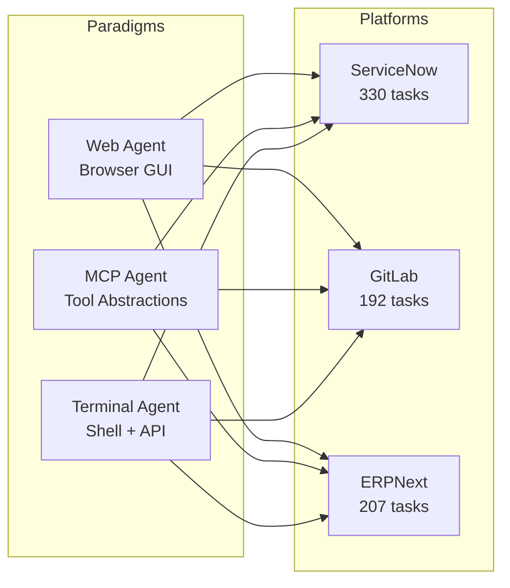
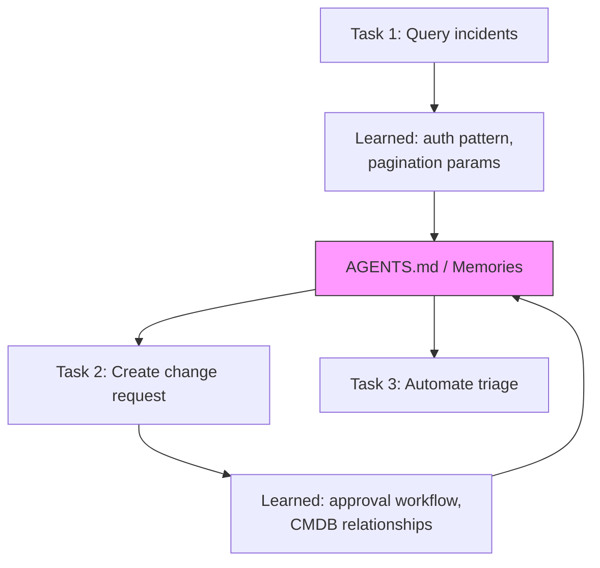
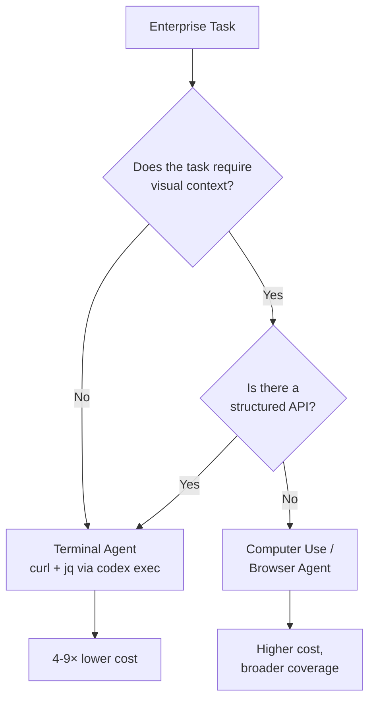

# Terminal Agents Suffice: What ServiceNow's Enterprise Automation Study Means for Codex CLI API-First Workflows


---

The prevailing assumption in agentic tooling is that enterprise automation demands ever more elaborate scaffolding — web agents with browser control, MCP servers exposing curated tool surfaces, or multi-agent orchestration layers. A March 2026 paper from ServiceNow Research challenges that assumption directly: a coding agent armed with nothing more than a terminal and a filesystem can match or outperform those complex architectures on real enterprise platforms, at a fraction of the cost [^1].

For Codex CLI practitioners, this is not merely academic validation. It is an empirical argument for the terminal-first, API-direct workflow that Codex CLI was built around — and it comes with concrete data on when that approach works, when it does not, and how to configure Codex CLI to exploit the advantage.

## The Study: Three Paradigms, Three Platforms, 729 Tasks

Bechard et al. evaluated three agent paradigms across ServiceNow, GitLab, and ERPNext — representing IT service management, software development lifecycle, and enterprise resource planning respectively [^1]. The three paradigms were:

1. **Web agents** — operating through graphical interfaces via browser automation
2. **MCP/tool-augmented agents** — using pre-built tool abstractions
3. **Terminal agents** — equipped only with a shell, a filesystem, and API documentation

Each paradigm was tested with multiple foundation models (Claude Sonnet 4, Claude Opus 4, Gemini 2.5 Pro) across 729 total task instances [^1].



## The Numbers: Terminal Agents Win on Cost, Compete on Accuracy

The headline results are striking. Terminal agents achieved the highest or tied success rates in seven of twelve platform–model combinations [^1]:

| Platform | Terminal Agent | Web Agent | MCP Agent |
|----------|:------------:|:---------:|:---------:|
| **ServiceNow** | 73.6–79.1% | 72.4–77.6% | 11.5–16.1% |
| **GitLab** | 71.3–80.2% | 81.4–84.6% | 45.2–48.9% |
| **ERPNext** | 67.6–76.8% | 61.8–81.6% | 55.6–68.9% |

MCP agents lagged significantly on ServiceNow because the available MCP servers lacked tools for service catalogue ordering, page navigation, and dashboard chart reading — task categories accounting for over half the benchmark [^1]. This is a structural limitation: MCP tool surfaces are only as comprehensive as someone has bothered to build them.

The cost differential is where the terminal approach truly dominates:

| Platform | Terminal Cost/Task | Web Cost/Task | Ratio |
|----------|:-----------------:|:-------------:|:-----:|
| **ServiceNow** | \$0.78–\$1.94 | \$4.21–\$4.49 | 4–6× cheaper |
| **GitLab** | \$0.28–\$0.50 | \$0.85–\$0.88 | 2–3× cheaper |
| **ERPNext** | \$0.46–\$0.72 | \$3.63–\$6.49 | 5–9× cheaper |

The Gemini 2.5 Pro terminal configuration reached 77.5% overall accuracy at \$0.09 per task [^1] — an order of magnitude below web-agent costs for comparable accuracy.

## Why Terminal Agents Win: The API Directness Advantage

The paper's analysis identifies three structural advantages of the terminal-first approach:

### 1. No Abstraction Tax

Web agents pay a rendering tax — parsing HTML, waiting for page loads, handling JavaScript-heavy SPAs. MCP agents pay a tool-surface tax — constrained to whatever operations someone has implemented as tools. Terminal agents bypass both by calling REST APIs directly with `curl`, `jq`, and standard Unix tooling [^1].

### 2. Composability

A terminal agent can chain arbitrary API calls, pipe outputs through text processing, and write scripts that encode multi-step workflows. This composability is native to the shell, requiring no framework support [^1]. When a web agent encounters a task requiring three sequential form submissions, it must navigate three pages. A terminal agent writes a three-line script.

### 3. Debuggability

Every terminal agent action produces a visible command and response. There is no hidden browser state, no invisible tool-server communication. When a task fails, the diagnostic trail is in the shell history [^1].

## Mapping to Codex CLI: Configuration for API-First Enterprise Work

These findings translate directly into Codex CLI configuration patterns for teams doing enterprise automation.

### Pattern 1: AGENTS.md as API Reference Index

The paper found that providing official API documentation had mixed effects — improving ERPNext accuracy by 4.7% but reducing ServiceNow accuracy by 6.3%, likely due to context dilution [^1]. The lesson: do not dump entire API docs into context. Instead, use AGENTS.md to index the most relevant endpoints:

```markdown
# AGENTS.md — ServiceNow Integration

## API Base
All ServiceNow API calls use: `https://instance.service-now.com/api/now`

## Key Endpoints
- **Incidents:** `GET/POST /table/incident` — CRUD on incident records
- **Catalogue:** `POST /sn_sc/servicecatalog/items/{id}/order_now` — order items
- **CMDB:** `GET /table/cmdb_ci` — query configuration items

## Authentication
Use bearer token from `$SNOW_TOKEN`. Never embed credentials in scripts.

## Preferred Tools
Use `curl -s | jq` for all API interactions. Avoid browser-based approaches.
```

This gives the agent a concise reference without flooding the context window [^2].

### Pattern 2: Named Profiles for Enterprise Platform Work

Codex CLI named profiles let you preconfigure approval policies, model selection, and system instructions per task type [^3]. For enterprise API work, create a dedicated profile:

```toml
# ~/.codex/config.toml

[profile.enterprise-api]
model = "o4-mini"
approval_policy = "unless-allow-listed"
system_instructions = """
You are automating enterprise platform tasks via REST APIs.
Always use curl with jq for API calls. Never attempt browser automation.
Write reusable shell functions for repeated operations.
Log every API response status code.
"""
```

Invoke with `codex --profile enterprise-api "Create an incident in ServiceNow for the disk-space alert"` [^3].

### Pattern 3: codex exec for Scripted Enterprise Automation

The paper's terminal agents essentially ran in non-interactive mode — receiving a task, executing shell commands, and returning results. This maps directly to `codex exec` [^4]:

```bash
#!/usr/bin/env bash
# enterprise-incident-triage.sh

codex exec \
  --model o4-mini \
  --approval-policy full-auto \
  --json \
  "Query ServiceNow for all P1 incidents opened today. \
   For each, check the CMDB for the affected CI's recent changes. \
   Output a triage summary as JSON." \
  2>/dev/null | jq '.message // empty'
```

The `--json` flag produces newline-delimited JSON events, making output parseable by downstream tooling [^4]. Combined with `--approval-policy full-auto`, this enables fully unattended enterprise automation — exactly the paradigm the paper validates.

### Pattern 4: Skills Accumulation via Persistent Context

One of the paper's most actionable findings: persistent memory across tasks reduced costs by 43.7% on ServiceNow and 16.8% on ERPNext, while improving success rates by 3.6–5.8 percentage points [^1]. The agent learns API patterns, authentication flows, and platform quirks from earlier tasks and reuses them.

In Codex CLI, this maps to two mechanisms:

1. **AGENTS.md accumulation** — after successful enterprise tasks, append discovered API patterns and workarounds to AGENTS.md so future sessions start with institutional knowledge [^2]
2. **Codex Memories** — when enabled, Codex carries preferences, workflows, and conventions across sessions automatically [^5]



## When Terminal Agents Do Not Suffice

The data is not uniformly favourable. Web agents outperformed terminal agents on GitLab (81.4–84.6% vs 71.3–80.2%) [^1]. The reason is instructive: GitLab's web interface exposes workflow states and visual context (merge request diffs, pipeline graphs) that are cumbersome to reconstruct from API responses alone.

This suggests a practical decision framework:



For teams using Codex CLI, this means defaulting to `codex exec` with API-direct instructions for the majority of enterprise tasks, and reserving Computer Use or browser MCP for the genuinely visual subset [^6].

## Terminal-Bench: Independent Validation

The paper's findings are independently corroborated by Terminal-Bench 2.0, the standard benchmark for terminal-environment agent evaluation [^7]. Codex CLI with GPT-5.5 scores 82.2% on Terminal-Bench's 89 hand-crafted tasks spanning scientific computing, system administration, security, and data science [^7]. This places it fourth on the leaderboard, behind specialised harnesses (NexAU-AHE at 84.7%, LemonHarness at 84.5%) but ahead of most multi-agent architectures [^7].

The convergence is clear: across both enterprise-specific benchmarks and general terminal benchmarks, a well-configured terminal agent with a strong foundation model is competitive with — and often cheaper than — more elaborate alternatives.

## The MCP Paradox

Perhaps the paper's most provocative finding is the poor performance of MCP agents on ServiceNow (11.5–16.1%) [^1]. MCP is designed to simplify tool access, yet the available tool surfaces covered barely half the required task categories. This is the MCP paradox: tool abstraction only helps when the abstraction is comprehensive. For enterprise platforms with hundreds of API endpoints, maintaining full MCP coverage is itself a significant engineering effort.

This does not mean MCP is without value. For well-covered platforms with stable, curated tool surfaces, MCP reduces boilerplate and enforces type safety [^8]. But the paper demonstrates that for enterprise automation at scale, the terminal agent's ability to call any API endpoint — without waiting for someone to wrap it in a tool definition — is a decisive advantage.

## Practical Recommendations

Based on the paper's evidence and Codex CLI's capabilities:

1. **Default to API-direct automation** — use `codex exec` with `curl`/`jq` for enterprise platform tasks before reaching for MCP servers or browser agents
2. **Index, do not dump, API documentation** — use AGENTS.md to list key endpoints and authentication patterns rather than including full API specs
3. **Create enterprise-specific profiles** — configure model, approval policy, and system instructions per platform in `config.toml`
4. **Accumulate institutional knowledge** — update AGENTS.md with discovered patterns after successful tasks; enable Memories for cross-session learning
5. **Reserve visual tools for visual tasks** — use Computer Use or browser MCP only when tasks genuinely require rendering context
6. **Monitor cost per task** — the 4–9× cost advantage of terminal agents compounds rapidly at enterprise scale

The ServiceNow study's conclusion is both simple and consequential: for the majority of enterprise automation, the terminal is not a limitation to be overcome. It is an advantage to be exploited [^1]. Codex CLI, as a terminal-native coding agent, is architecturally positioned to deliver exactly that advantage — provided practitioners configure it to work with APIs directly rather than defaulting to heavier abstractions.

## Citations

[^1]: Bechard, P., Marquez Ayala, O., Chen, E., Skelton, J., Davasam, S., Sunkara, S., Yadav, V., & Rajeswar, S. (2026). "Terminal Agents Suffice for Enterprise Automation." arXiv:2604.00073v2. ServiceNow Research, Mila – Quebec AI Institute, Université de Montréal. [https://arxiv.org/abs/2604.00073](https://arxiv.org/abs/2604.00073)

[^2]: OpenAI. (2026). "Features – Codex CLI." OpenAI Developers. [https://developers.openai.com/codex/cli/features](https://developers.openai.com/codex/cli/features)

[^3]: OpenAI. (2026). "Command line options – Codex CLI." OpenAI Developers. [https://developers.openai.com/codex/cli/reference](https://developers.openai.com/codex/cli/reference)

[^4]: OpenAI. (2026). "Non-interactive mode – Codex CLI." OpenAI Developers. [https://developers.openai.com/codex/noninteractive](https://developers.openai.com/codex/noninteractive)

[^5]: OpenAI. (2026). "Memories – Codex." OpenAI Developers. [https://developers.openai.com/codex/memories](https://developers.openai.com/codex/memories)

[^6]: OpenAI. (2026). "Features – Codex app." OpenAI Developers. Computer Use documentation. [https://developers.openai.com/codex/app/features](https://developers.openai.com/codex/app/features)

[^7]: Harbor Framework. (2026). "Terminal-Bench 2.0 Leaderboard." [https://www.tbench.ai/](https://www.tbench.ai/)

[^8]: OpenAI. (2026). "Changelog – Codex." OpenAI Developers. MCP integration documentation. [https://developers.openai.com/codex/changelog](https://developers.openai.com/codex/changelog)
