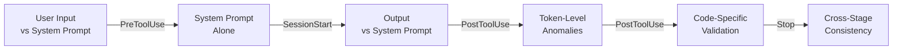
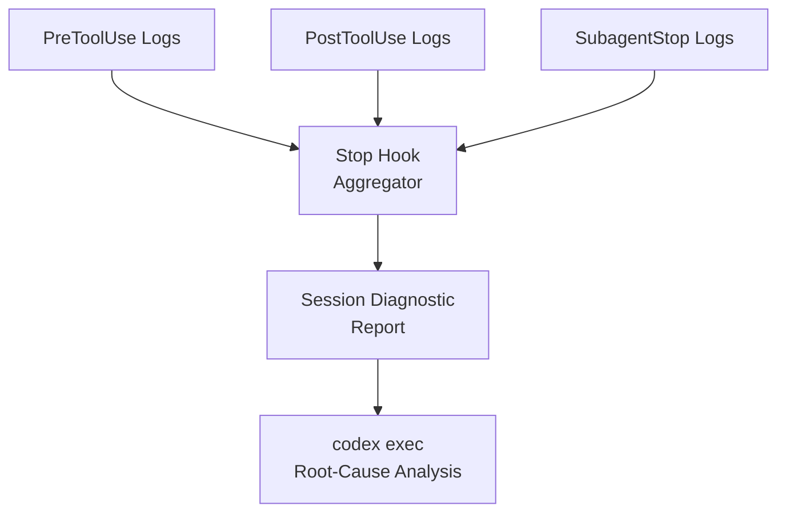
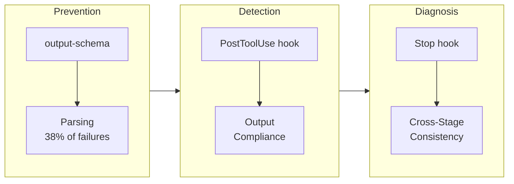

# AgentFixer: What IBM's Failure Taxonomy Means for Codex CLI Validation Pipelines


---

Parsing failures account for 38% of all task failures in production agentic systems [^1]. Not hallucinations, not reasoning errors — malformed output. That single statistic from IBM Research's AgentFixer paper, presented at ICSE 2026, reframes where teams should invest their Codex CLI validation effort. This article maps AgentFixer's fifteen failure-detection tools and six artifact categories onto Codex CLI's hook lifecycle, structured output enforcement, and diagnostic tooling to build a layered defence against the failure modes that actually kill agent tasks.

## The AgentFixer Framework in Brief

AgentFixer [^1] is a comprehensive validation framework for LLM-based agentic systems developed by IBM Research. It combines fifteen failure-detection tools with two root-cause analysis modules, mixing lightweight rule-based checks with LLM-as-a-judge assessments [^2]. Applied to IBM's CUGA agent on the AppWorld and WebArena benchmarks, it identified recurrent planner misalignments, schema violations, and brittle prompt dependencies.

The quantitative results are instructive. On WebArena's GitLab subset (204 samples), targeted fixes derived from AgentFixer's diagnostics improved Pass@3 from 35% to 42% for Mistral Medium and from 38% to 42% for LLaMA 4 Maverick — narrowing the gap with GPT-4o (47% → 50%) substantially [^1]. The fixes preserved existing passing tasks at a rate of 89–93% whilst improving 8–12 tasks per model with minimal regressions (1–4 tasks) [^1].

## The Six Artifact Categories

AgentFixer organises its fifteen tools across six artifact categories [^2]. Each maps to a distinct point in the Codex CLI validation lifecycle:



| AgentFixer Category | Tool Count | Codex CLI Hook Point |
|---|---|---|
| Input–Prompt Compliance | 3 | `UserPromptSubmit`, `PreToolUse` |
| System Prompt Analysis | 4 | `SessionStart`, AGENTS.md linting |
| Output–Prompt Compliance | 3 | `PostToolUse`, auto-review |
| Token-Level Anomalies | 2 | `PostToolUse` (rule-based) |
| Code-Specific Validation | 1 | `PostToolUse` (linter/syntax) |
| Cross-Stage Consistency | 2 | `Stop`, `SubagentStop` |

## Mapping the Fifteen Tools to Codex CLI Hooks

### Input–Prompt Compliance (3 tools)

AgentFixer's Input-Schema-Non-compliance-Detector, Input-Instructions-Non-compliance-Detector, and Input-Format-Violation-Detector all validate that user inputs conform to the system prompt's expectations [^2]. In Codex CLI, the `UserPromptSubmit` hook fires on every user input, giving you the first interception point:

```toml
[[hooks.UserPromptSubmit]]

[[hooks.UserPromptSubmit.hooks]]
type = "command"
command = '/usr/bin/python3 ".codex/hooks/validate-input-schema.py"'
timeout = 10
statusMessage = "Validating input format"
```

The hook script receives the session transcript on stdin and can inject a `systemMessage` to correct malformed input before the model processes it [^3]. This catches the class of failures where ambiguous or schema-violating user input cascades into downstream tool calls.

### System Prompt Analysis (4 tools)

AgentFixer's Prompt-Consistency-Validator (internal contradictions and example misalignment), Edge-Case-Instruction-Validator, and Few-Shot-Coverage-Validator analyse the system prompt in isolation [^2]. These are design-time checks rather than runtime hooks. In Codex CLI, the equivalent is linting your AGENTS.md and config.toml before sessions begin:

```bash
# Lint AGENTS.md for contradictions using codex exec
codex exec "Analyse this AGENTS.md for internal contradictions, \
  example misalignment, and missing edge-case coverage. \
  Report findings as JSON." \
  --output-schema ./schemas/prompt-lint.json \
  --file AGENTS.md
```

The `--output-schema` flag enforces structured JSON output [^4], ensuring the analysis returns machine-parseable results rather than prose. The `SessionStart` hook can then validate that AGENTS.md hasn't changed since the last lint pass:

```toml
[[hooks.SessionStart]]
matcher = "startup"

[[hooks.SessionStart.hooks]]
type = "command"
command = '/usr/bin/python3 ".codex/hooks/check-agentsmd-hash.py"'
statusMessage = "Verifying AGENTS.md integrity"
```

### Output–Prompt Compliance (3 tools)

The Output-Schema-Non-compliance-Detector, Output-Instructions-Non-compliance-Detector, and Output-Format-Violation-Detector form AgentFixer's post-execution validation layer [^2]. This is where Codex CLI's `PostToolUse` hooks and `--output-schema` converge.

For tool-level output validation:

```toml
[[hooks.PostToolUse]]
matcher = "^Bash$"

[[hooks.PostToolUse.hooks]]
type = "command"
command = '/usr/bin/python3 ".codex/hooks/validate-tool-output.py"'
timeout = 30
statusMessage = "Checking output compliance"
```

A `PostToolUse` hook can inspect stdout, stderr, and exit code [^3]. If the output violates expected patterns, the hook returns `{"continue": false, "stopReason": "Output schema violation detected"}` to halt the turn before the malformed output corrupts downstream reasoning.

For final response validation, `--output-schema` provides the strongest guarantee:

```bash
codex exec "Generate the migration plan for service X" \
  --output-schema ./schemas/migration-plan.json
```

This uses OpenAI's Structured Outputs with `strict: true` [^4], enforcing that every object includes `additionalProperties: false` — a requirement that catches the schema drift AgentFixer's tools detect [^5].

### Token-Level Anomalies (2 tools)

The Unusual-Token-Detector and Token-Repetition-Detector are rule-based checks for degenerate output [^2] — the kind of failure where a model enters a repetition loop or emits control characters. A `PostToolUse` hook handles this cleanly:

```python
#!/usr/bin/env python3
"""PostToolUse hook: detect token-level anomalies."""
import json, re, sys

data = json.load(sys.stdin)
output = data.get("tool_output", {}).get("stdout", "")

# Repetition detection: any 20+ char sequence repeated 5+ times
if re.search(r'(.{20,})\1{4,}', output):
    json.dump({
        "continue": False,
        "stopReason": "Token repetition loop detected",
        "systemMessage": "Output contained degenerate repetition. Retry with different approach."
    }, sys.stdout)
    sys.exit(0)

# Unusual token detection: high density of control characters
control_ratio = sum(1 for c in output if ord(c) < 32 and c not in '\n\r\t') / max(len(output), 1)
if control_ratio > 0.05:
    json.dump({
        "continue": False,
        "stopReason": "Unusual token density exceeded threshold"
    }, sys.stdout)
    sys.exit(0)
```

### Code-Specific Validation (1 tool)

AgentFixer's Python-Code-Syntax-Validator [^2] is the simplest to replicate. A `PostToolUse` hook on `apply_patch` can run syntax validation on every file the agent modifies:

```toml
[[hooks.PostToolUse]]
matcher = "^apply_patch$"

[[hooks.PostToolUse.hooks]]
type = "command"
command = '/usr/bin/python3 ".codex/hooks/syntax-check.py"'
timeout = 15
statusMessage = "Syntax validation"
```

Note the current limitation: `PreToolUse` hooks do not reliably fire for `apply_patch` edits [^6], so syntax validation must happen post-application. If the check fails, the hook can inject a `systemMessage` instructing the agent to revert and retry.

### Cross-Stage Consistency (2 tools)

The Information-Consistency-Validator and Reasoning-Action-Mismatch-Detector are AgentFixer's most sophisticated tools, checking whether information is preserved across pipeline stages and whether the agent's stated reasoning matches its actions [^2]. In Codex CLI, the `Stop` and `SubagentStop` hooks provide the interception points:

```toml
[[hooks.Stop]]

[[hooks.Stop.hooks]]
type = "command"
command = '/usr/bin/python3 ".codex/hooks/consistency-audit.py"'
timeout = 60
statusMessage = "Cross-stage consistency check"
```

The `Stop` hook receives the full session transcript [^3], enabling a final-pass audit that compares the agent's plan (if stated) against its actual tool invocations — the same reasoning-action mismatch detection AgentFixer performs.

## The Root-Cause Analysis Layer

AgentFixer's two root-cause modules — LLM-RC (direct LLM analysis of raw outputs) and T-RC (meta-analytical aggregation across nine validation components) [^1] — correspond to different Codex CLI diagnostic strategies.

**LLM-RC maps to `codex doctor` and session replay.** When a session fails, `codex doctor` provides a diagnostic report covering installation, configuration, authentication, runtime, Git, terminal, app-server, and thread inventory health [^7]. Combined with the session transcript (available via `transcript_path` in hook input), you can replay failures through a separate `codex exec` call for root-cause analysis:

```bash
codex exec "Analyse this failed session transcript. \
  Identify the root cause using AgentFixer's categories: \
  planner misalignment, schema violation, brittle prompt dependency, \
  or parsing failure. Output structured diagnosis." \
  --output-schema ./schemas/root-cause.json \
  --file "$TRANSCRIPT_PATH"
```

**T-RC maps to aggregated hook telemetry.** Each hook script can append structured JSON to a shared log file. A `Stop` hook then aggregates these per-turn diagnostics into a session-level report, mirroring T-RC's hierarchical prioritisation:



## The 38% Parsing Problem and Structured Output

AgentFixer's headline finding — that parsing-related incidents account for nearly 38% of all observed task failures [^1] — has a direct mitigation in Codex CLI. The `--output-schema` flag activates OpenAI's Structured Outputs with strict JSON Schema validation [^4]. Every object must declare `additionalProperties: false`, and the model's output is constrained at the token-generation level rather than validated after the fact [^5].

For `codex exec` pipelines, this eliminates the largest single failure category:

```bash
codex exec "Extract all API endpoints from this codebase" \
  --output-schema ./schemas/api-endpoints.json
```

Where the schema enforces:

```json
{
  "type": "object",
  "properties": {
    "endpoints": {
      "type": "array",
      "items": {
        "type": "object",
        "properties": {
          "method": { "type": "string", "enum": ["GET","POST","PUT","DELETE","PATCH"] },
          "path": { "type": "string" },
          "handler": { "type": "string" }
        },
        "required": ["method", "path", "handler"],
        "additionalProperties": false
      }
    }
  },
  "required": ["endpoints"],
  "additionalProperties": false
}
```

⚠️ A known issue as of v0.141.0: `--json` combined with `--output-schema` may be silently ignored when MCP servers are active [^8]. Test schema enforcement with MCP disabled first, then re-enable incrementally.

## Named Profiles for Validation Intensity

AgentFixer demonstrated that mid-tier models (Mistral Medium, LLaMA 4 Maverick) benefit disproportionately from validation — their improvement margins were 7–8 percentage points versus 3 for GPT-4o [^1]. This maps directly to Codex CLI's named profiles, where validation intensity scales with model capability:

```toml
[profile.frontier]
model = "o3"
# Minimal hooks — frontier model, lower parsing risk
[profile.frontier.hooks]

[profile.midtier]
model = "o4-mini"
# Full AgentFixer-style validation pipeline
[profile.midtier.hooks]
# ... all 6 hook categories enabled

[profile.budget]
model = "gpt-4.1-mini"
# Maximum validation — highest parsing risk
model_reasoning_effort = "high"
[profile.budget.hooks]
# ... all hooks + stricter thresholds
```

This mirrors AgentFixer's finding that "refining both prompting and coding strategies" enabled "mid-sized models to achieve notable accuracy gains, substantially narrowing the gap with frontier models" [^1].

## Practical Implementation: A Minimal AgentFixer Pipeline

For teams wanting to start with AgentFixer-informed validation without building fifteen custom tools, this minimal pipeline covers the three highest-impact categories:

1. **Parsing defence** — use `--output-schema` on all `codex exec` calls
2. **Output compliance** — one `PostToolUse` hook checking exit codes and output patterns
3. **Consistency audit** — one `Stop` hook comparing stated plan against actual tool calls



This three-layer approach targets the failure modes AgentFixer found most prevalent whilst keeping the hook overhead manageable. Expand to the full fifteen-tool equivalent as your validation maturity grows.

## Citations

[^1]: Mulian, H., Zeltyn, S., Levy, I., Galanti, L., Yaeli, A., and Shlomov, S. "AgentFixer: From Failure Detection to Fix Recommendations in LLM Agentic Systems." arXiv:2603.29848, February 2026. Presented at ICSE 2026. [https://arxiv.org/abs/2603.29848](https://arxiv.org/abs/2603.29848)

[^2]: Mulian, H. et al. "AgentFixer: From Failure Detection to Fix Recommendations in LLM Agentic Systems." Full paper, Section 3: Framework Design. [https://arxiv.org/html/2603.29848v1](https://arxiv.org/html/2603.29848v1)

[^3]: OpenAI. "Hooks – Codex." OpenAI Developers Documentation, 2026. [https://developers.openai.com/codex/hooks](https://developers.openai.com/codex/hooks)

[^4]: OpenAI. "Non-interactive mode – Codex." OpenAI Developers Documentation, 2026. [https://developers.openai.com/codex/noninteractive](https://developers.openai.com/codex/noninteractive)

[^5]: OpenAI. "Command line options – Codex CLI." OpenAI Developers Documentation, 2026. [https://developers.openai.com/codex/cli/reference](https://developers.openai.com/codex/cli/reference)

[^6]: Agentic Control Plane. "Codex CLI hook governance: what works today (and what doesn't)." 2026. [https://agenticcontrolplane.com/blog/codex-cli-hooks-reference](https://agenticcontrolplane.com/blog/codex-cli-hooks-reference)

[^7]: OpenAI. "Codex CLI Changelog – v0.131.0: codex doctor." OpenAI Developers Documentation, 2026. [https://developers.openai.com/codex/changelog](https://developers.openai.com/codex/changelog)

[^8]: GitHub Issue #15451. "--json and --output-schema are silently ignored when tools/MCP servers are active." openai/codex, 2026. [https://github.com/openai/codex/issues/15451](https://github.com/openai/codex/issues/15451)
