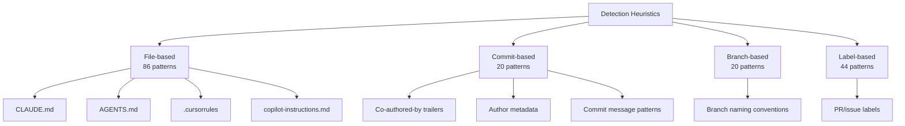
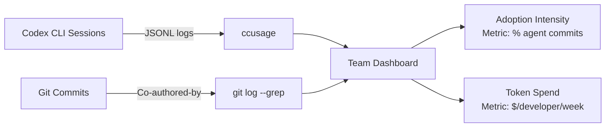

# Agentic Very Much: Coding Agent Adoption Has Doubled in New GitHub Projects — What It Means for Codex CLI Teams


---

A follow-up study from Robbes, Matricon, Degueule, Hora, and Zacchiroli — published on arXiv on 5 June 2026 — finds that coding agent adoption in newly created GitHub projects is **more than twice as high** as the already significant levels measured in their predecessor study six months earlier [^1]. The proportion of AI-assisted commits is also substantially higher, and the authors acknowledge strong signals that their detection heuristics still miss a significant fraction of agent activity [^1]. For teams running Codex CLI, this is not merely a curiosity statistic: it reshapes assumptions about commit provenance, review load, and the configuration posture every repository should adopt.

## The Numbers: From One-in-Five to Nearly One-in-Two

The predecessor study, "Agentic Much?" (arXiv:2601.18341, January 2026), analysed 129,134 GitHub projects with at least 10 stars, 5,000 lines of code, and 100 commits [^2]. It reported a conservative file-level adoption rate of **15.85%** and an upper estimate of **22.60%** [^2]. Among the 10,191 projects showing file-level adoption signals, commit-level adoption broke down as follows [^2]:

- **Experimental** (<1% of commits): 7.3%
- **Limited** (1–5%): 16.1%
- **Consistent** (5–20%): 17.6%
- **Pervasive** (>20%): 17.8%

The "Agentic Very Much!" follow-up analyses projects created **after** that dataset closed and finds adoption more than doubled [^1]. Crucially, the intensity is also higher: a larger share of commits carry agent attribution in the newer cohort [^1]. Given the predecessor's acknowledged undercount — 41.2% of file-level adopters showed zero commit-level traces despite having configuration files — the true adoption intensity is almost certainly higher still [^2].

Contextual industry data aligns: 84% of developers now use or plan to use AI coding tools, with 51% reporting daily usage, yet only 29% trust the output [^3]. GitHub Copilot alone serves 140,000 organisations [^4]. The broader coding agent category — which includes Codex CLI, Claude Code, Cursor, and dozens of others — grew commit volume by 1,400% in 2026 [^5].

## The Detection Problem: What You Cannot See

The studies used four heuristic categories to detect agent use [^2]:



The file-based category is the most reliable: if a repository contains `AGENTS.md`, `CLAUDE.md`, or `.cursorrules`, it is almost certainly using agents. But **commit-based detection depends entirely on the agent leaving a trail** — and several tools, including Codex CLI, allow attribution to be silenced.

The `commit_attribution` configuration key in Codex CLI's `config.toml` defaults to `"Co-authored-by: Codex <noreply@openai.com>"` [^6]. Setting it to an empty string removes the trailer entirely:

```toml
# config.toml — RECOMMENDED: keep attribution visible
[git]
commit_attribution = "Co-authored-by: Codex <noreply@openai.com>"

# ANTI-PATTERN: silencing attribution
# commit_attribution = ""
```

When attribution is silenced, the only remaining detection signal is behavioural analysis. MSR 2026 research by Ghaleb analysed 33,580 pull requests from five agents and achieved a 97.2% F1-score in multi-class identification using 41 features — the dominant discriminator being commit message style rather than code quality or diff size [^7]. But without explicit trailers, passive detection accuracy drops to roughly 60% [^7].

## Why Transparent Attribution Matters Now

The doubling of adoption means that in any team of reasonable size, agent-assisted commits are no longer exceptional — they are the emerging norm. Three consequences follow:

### 1. Audit Compliance

Regulated industries — finance, healthcare, government contracting — increasingly require logging where AI tooling was used in software delivery [^6]. A `Co-authored-by` trailer in every relevant commit provides a machine-readable audit trail with zero additional tooling. For Codex CLI, the default configuration already handles this; the risk lies in teams deliberately or accidentally disabling it.

### 2. Review Calibration

Agent-assisted commits tend to be larger than human-only commits and disproportionately contain features and bug fixes [^2]. Reviewers who do not know a commit is agent-generated may apply incorrect heuristics — either over-trusting (assuming a senior developer wrote it) or under-scrutinising (rubber-stamping large diffs). Visible attribution enables reviewers to switch to agent-appropriate review strategies.

### 3. Adoption Measurement

You cannot manage what you cannot measure. Teams adopting Codex CLI should be able to answer: "What percentage of our commits are agent-assisted this sprint?" Without attribution, this question requires expensive after-the-fact analysis.

## Configuring Codex CLI for the Post-Adoption-Doubling World

### Enforce Attribution at the Repository Level

Use an `AGENTS.md` at the repository root to mandate attribution and prevent silencing:

```markdown
<!-- AGENTS.md -->
## Git Commit Policy

- All agent-generated commits MUST include a Co-authored-by trailer
- Do NOT set commit_attribution to empty string
- Use the default trailer or the team-specific format below:
  Co-authored-by: Codex <noreply@openai.com>
```

Pair this with a git `commit-msg` hook that rejects commits matching agent behavioural patterns but lacking a `Co-authored-by` trailer:

```bash
#!/usr/bin/env bash
# .git/hooks/commit-msg — reject probable agent commits without attribution
MSG=$(cat "$1")
if echo "$MSG" | grep -qiE '(refactor|implement|add support for|fix issue)' && \
   ! echo "$MSG" | grep -qi 'Co-authored-by'; then
  echo "ERROR: Commit message matches agent patterns but has no Co-authored-by trailer."
  echo "If this is a human-authored commit, add --no-verify to override."
  exit 1
fi
```

### Track Adoption Intensity with /usage and ccusage

Codex CLI v0.140.0 shipped the `/usage` command for daily, weekly, and cumulative token activity [^8]. Combine this with external trackers like `ccusage`, which reads Codex session JSONL files under `~/.codex`, to build a team-level adoption dashboard [^9]:



### Use AGENTS.md as Both Configuration and Signal

AGENTS.md now serves dual purposes. It is a configuration file that Codex CLI reads before starting work, and it is a **detection signal** that researchers and internal auditors use to identify agent-enabled repositories [^2]. As of mid-2026, AGENTS.md has been adopted by over 60,000 open-source repositories and is stewarded by the Linux Foundation's Agentic AI Foundation alongside MCP [^10].

For teams, this means `AGENTS.md` should be treated with the same discipline as `.editorconfig` or `CODEOWNERS` — committed, reviewed, and enforced in CI:

```toml
# config.toml — named profile for CI verification
[profiles.ci-check]
model = "o4-mini"
approval_policy = "unless-allow-listed"
```

### Configure Named Profiles for Adoption Phases

The predecessor study's adoption intensity categories — experimental, limited, consistent, pervasive — map naturally to Codex CLI named profiles [^2]:

| Adoption Phase | Profile | `approval_policy` | Typical Use |
|---|---|---|---|
| Experimental | `cautious` | `suggest` | Test generation, documentation |
| Limited | `standard` | `auto-edit` | Bug fixes, small features |
| Consistent | `trusted` | `full-auto` | Established patterns, CI-gated |
| Pervasive | `autonomous` | `full-auto` + hooks | Full SDLC with PostToolUse gates |

```toml
# config.toml — progressive adoption profiles
[profiles.cautious]
model = "o4-mini"
approval_policy = "suggest"

[profiles.trusted]
model = "o3"
approval_policy = "full-auto"
```

## The Underdetection Imperative

The most striking finding in the "Agentic Very Much!" study is not the doubling itself but the authors' candid acknowledgement that their heuristics systematically undercount agent activity [^1]. If the conservative estimate in October 2025 was 15.85%, the true rate was likely 20–25%. If the new cohort shows double that, the actual adoption in newly created projects may exceed 50%.

This has a direct operational implication: **assume agent-assisted code is present in every repository you touch**. Configure your review workflows, CI gates, and compliance tooling accordingly — not as a response to confirmed agent use, but as a default posture.

The era where agent-assisted development was optional, experimental, or niche is over. The data says it doubled. The undercount says it is probably worse. Configure accordingly.

## Citations

[^1]: Robbes, R., Matricon, T., Degueule, T., Hora, A., & Zacchiroli, S. (2026). "Agentic Very Much! Adoption of Coding Agent in New GitHub Projects." arXiv:2606.07448. [https://arxiv.org/abs/2606.07448](https://arxiv.org/abs/2606.07448)

[^2]: Robbes, R., Matricon, T., Degueule, T., Hora, A., & Zacchiroli, S. (2026). "Agentic Much? Adoption of Coding Agents on GitHub." arXiv:2601.18341. [https://arxiv.org/abs/2601.18341](https://arxiv.org/abs/2601.18341)

[^3]: Uvik Software. (2026). "AI Coding Assistant Stats 2026: 84% Adoption, 29% Trust." [https://uvik.net/blog/ai-coding-assistant-statistics/](https://uvik.net/blog/ai-coding-assistant-statistics/)

[^4]: Panto AI. (2026). "GitHub Copilot Statistics 2026 — Users, Revenue & Adoption." [https://www.getpanto.ai/blog/github-copilot-statistics](https://www.getpanto.ai/blog/github-copilot-statistics)

[^5]: Digital Applied. (2026). "AI Coding Adoption 2026: 50 Statistics From 7 Surveys." [https://www.digitalapplied.com/blog/ai-coding-adoption-statistics-2026-50-data-points](https://www.digitalapplied.com/blog/ai-coding-adoption-statistics-2026-50-data-points)

[^6]: Codex Knowledge Base. (2026). "Codex CLI Commit Attribution: Tagging Agent Work with commit_attribution." [https://codex.danielvaughan.com/2026/03/28/codex-cli-commit-attribution/](https://codex.danielvaughan.com/2026/03/28/codex-cli-commit-attribution/)

[^7]: Codex Knowledge Base. (2026). "Agent Fingerprints in Pull Requests: What MSR 2026 Research Reveals and How to Configure Codex CLI for Professional Git Hygiene." [https://codex.danielvaughan.com/2026/04/30/agent-fingerprints-pull-requests-codex-cli-git-hygiene/](https://codex.danielvaughan.com/2026/04/30/agent-fingerprints-pull-requests-codex-cli-git-hygiene/)

[^8]: OpenAI. (2026). "Codex CLI Changelog — v0.140.0." [https://github.com/openai/codex/releases](https://github.com/openai/codex/releases)

[^9]: ccusage. (2026). "Coding (Agent) CLI Usage Analysis." [https://ccusage.com/guide/codex/](https://ccusage.com/guide/codex/)

[^10]: Linux Foundation. (2025). "Linux Foundation Announces the Formation of the Agentic AI Foundation (AAIF)." [https://www.linuxfoundation.org/press/linux-foundation-announces-the-formation-of-the-agentic-ai-foundation](https://www.linuxfoundation.org/press/linux-foundation-announces-the-formation-of-the-agentic-ai-foundation)
