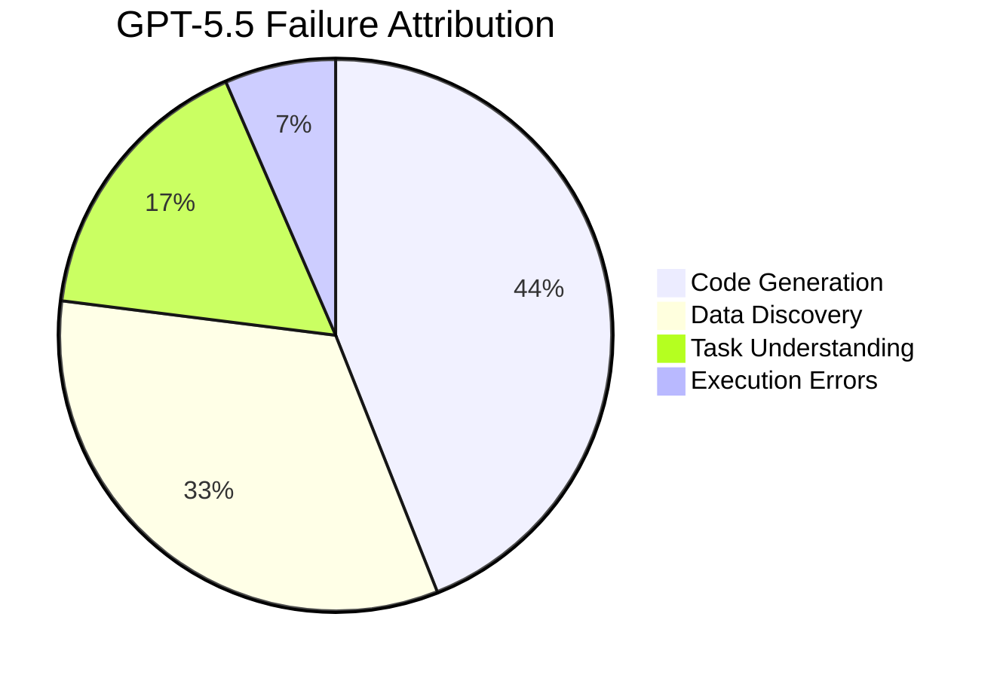
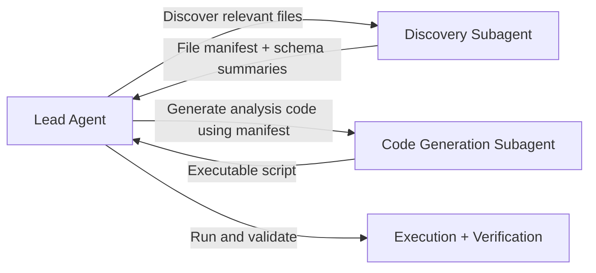

# CoDA-Bench: What the Data-Intensive Task Benchmark Means for Codex CLI File Discovery and Sandbox Strategy


---

Most coding agent benchmarks test whether an agent can fix a bug or pass a test suite. CoDA-Bench asks a harder question: can an agent find the right data files in a noisy filesystem *and then* write correct code against them? The answer, even for the best agents in mid-2026, is a qualified "sometimes" — and the failure modes map directly to configuration choices Codex CLI users make every day.

## The Benchmark

CoDA-Bench (Zhang et al., June 2026, accepted at ICML 2026) is the first benchmark to jointly evaluate code intelligence and data intelligence in a single environment [^1]. It constructs a Linux sandbox from the Kaggle ecosystem: 1,009 tasks spanning 31 data communities, each environment averaging 980.8 files in mixed formats — CSV, JSON, Parquet, images, PDFs [^1]. The signal-to-noise ratio is brutal: on average, only 1.3 files per task are relevant, giving a signal ratio of 0.0105 [^1].

A harder subset, CoDA-Hard, raises the bar further: 119 tasks across 15 communities requiring at least two target files and 30+ effective lines of reference code, with a signal ratio of 0.0142 [^1].

## How the Agents Performed

Seven agent configurations were tested. The results are sobering:

| Agent | Model | Discovery Accuracy | Execution Accuracy | Avg Tokens | Cost/Task |
|---|---|---|---|---|---|
| Mini-SWE-Agent | GPT-5.5 | 83.0% | 61.1% | — | — |
| OpenHands | GPT-5.5 | 82.1% | 59.7% | — | — |
| Codex CLI | GPT-5.5 | 74.9% | 60.3% | 380,558 | \$1.39 |
| Claude Code | Sonnet 4.6 | 77.9% | 53.8% | 81,714 | \$0.11 |
| Claude Code | Opus 4.7 | 77.3% | 51.9% | — | — |

On CoDA-Hard, Codex CLI scored 61.4% discovery accuracy and 47.9% execution accuracy [^1].

Two findings stand out. First, **Codex CLI consumed 4.7× more tokens than Claude Code** (380,558 vs 81,714) for a comparable execution accuracy, suggesting its file discovery strategy is substantially less token-efficient [^1]. Second, wrapper frameworks like Mini-SWE-Agent improved GPT-5.5 performance by only 0.8 percentage points over native CLI tools, indicating the bottleneck is not orchestration but discovery strategy [^1].

## The Oracle Experiment: Discovery Is the Bottleneck

The paper's most revealing experiment provides agents with oracle file paths — the exact files needed for each task. The results are dramatic:

- **Claude Code (Sonnet 4.6):** 45.4% → 73.1% execution accuracy (+27.7pp) [^1]
- **OpenHands (GPT-5.5):** 44.5% → 68.9% (+24.4pp) [^1]

On average, agents jumped to 71.0% accuracy with oracle data [^1]. This means roughly **a third of all failures are pure discovery failures** — the agent could have written the correct code if it had found the right files.

## Why Discovery Fails

The error attribution analysis on 200 sampled failures reveals the split:



For mid-tier models (Kimi-K2.6), data discovery errors dominate at 40.7%, with code generation at 34.7% [^1].

Crucially, agents struggle not with navigating large file counts but with **distinguishing relevant data from semantically similar distractors** [^1]. The correlation with signal-to-noise ratio (ρ=0.466, p<0.01) is stronger than with raw file count (ρ=-0.271, p=0.148) [^1]. Performance also collapses above 3GB of data volume, reaching near-zero above 8GB [^1].

## What This Means for Codex CLI Configuration

CoDA-Bench exposes four configuration gaps that Codex CLI users can address today.

### 1. Sandbox Scope: Widen the Readable Roots

Codex CLI's default sandbox restricts file access to the current working directory [^2]. Data-intensive projects typically store datasets outside the code tree — in `/data`, `~/datasets`, or mounted volumes. If the agent cannot read these paths, it cannot discover the files.

```toml
# ~/.codex/config.toml — expose data directories as readable roots
[permissions.data-project]
sandbox_mode = "read-only"

[permissions.data-project.filesystem]
readable_roots = [
    "~/projects/my-analysis",
    "~/datasets",
    "/mnt/shared-data"
]
```

Use `--add-dir` at launch to expose additional roots without changing the config file:

```bash
codex --add-dir ~/datasets --add-dir /mnt/shared-data \
  "Analyse the customer churn data and build a retention model"
```

### 2. AGENTS.md: Encode a Discovery-First Protocol

CoDA-Bench shows that agents which discover files first and code second perform better. Encode this as a constraint in your project's `AGENTS.md`:

```markdown
## Data Discovery Protocol

When working with data files:

1. **Inventory first.** Before writing any analysis code, list all files
   in the data directory tree using `find` or `ls -R`. Record file names,
   sizes, and formats.
2. **Inspect before assuming.** Read the first 20 lines of each candidate
   file. Check column names, delimiters, and encodings. Do not assume
   CSV structure from the file extension alone.
3. **Confirm relevance.** State which files you will use and why before
   proceeding to code generation.
4. **Prefer Parquet over CSV** when both formats are available for the
   same dataset — Parquet preserves types and is faster to parse.
```

This mirrors what the paper calls the "discovery-then-generate" pattern that oracle experiments show can recover up to 27.7pp of lost accuracy [^1].

### 3. Subagent Isolation: Separate Discovery from Generation

CoDA-Bench's token consumption data reveals that Codex CLI's 380,558-token average largely comes from interleaving discovery and generation in a single context [^1]. A subagent pattern isolates the two concerns:



The discovery subagent operates with broad read access and returns a compact manifest. The code generation subagent receives only the manifest and relevant file excerpts, keeping its context window clean. This mirrors the architectural insight behind Mini-SWE-Agent's marginal improvement — it adds a structured discovery phase before generation [^1].

In Codex CLI, trigger this with explicit subagent prompts:

```bash
codex "First: scan ~/datasets/kaggle-churn/ and produce a manifest of all
data files with their schemas (columns, types, row counts).
Then: using only the files in the manifest, write a churn prediction pipeline."
```

### 4. PostToolUse Hooks: Gate on Discovery Completeness

The 33% discovery failure rate suggests a PostToolUse hook that validates file references before execution:

```bash
#!/bin/bash
# .codex/hooks/post-tool-use-check-files.sh
# Reject code that references files not confirmed to exist

if [[ "$CODEX_TOOL_NAME" == "write" ]] && [[ "$CODEX_TOOL_OUTPUT" == *.py ]]; then
    # Extract file path references from the generated code
    referenced_files=$(grep -oP "(?:read_csv|read_parquet|open)\(['\"]([^'\"]+)" \
        "$CODEX_TOOL_OUTPUT" | sed "s/.*['\"]//")

    for f in $referenced_files; do
        if [[ ! -f "$f" ]] && [[ ! -f "$(dirname "$CODEX_TOOL_OUTPUT")/$f" ]]; then
            echo "REJECT: Generated code references non-existent file: $f"
            echo "Run file discovery before generating code."
            exit 1
        fi
    done
fi
```

### 5. Named Profiles: Route by Task Type

CoDA-Bench demonstrates that data-intensive tasks have fundamentally different resource profiles from code-centric tasks. A named profile encodes this:

```toml
# ~/.codex/config.toml
[profile.data-analysis]
model = "gpt-5.5"
sandbox_mode = "read-only"
approval_policy = "unless-allow-listed"
reasoning_effort = "high"

[profile.data-analysis.filesystem]
readable_roots = ["~/datasets", "/mnt/data"]

[profile.code-fix]
model = "gpt-5.4-mini"
sandbox_mode = "workspace"
approval_policy = "auto-edit"
reasoning_effort = "medium"
```

Launch with the appropriate profile:

```bash
codex --profile data-analysis "Analyse the Q2 revenue data"
codex --profile code-fix "Fix the failing unit tests in src/auth"
```

The cost difference is material. CoDA-Bench shows Codex CLI spending \$1.39 per data task versus Claude Code's \$0.11 [^1]. Profile-aware routing — using `gpt-5.4-mini` for code fixes and reserving `gpt-5.5` with high reasoning effort for data tasks — can reduce aggregate spend substantially.

## The Signal-to-Noise Problem

The paper's most actionable finding is that **semantic noise, not volume, drives discovery failure** [^1]. A directory with 980 files is manageable if the relevant ones have distinctive names. It becomes hostile when dozens of files share similar prefixes, column structures, or domain terminology.

This has a direct Codex CLI implication: **curate your data directories**. Move working datasets into a clearly named subdirectory (`/data/active/` vs `/data/archive/`). Use README files in data directories that describe what each file contains. The agent reads these — and CoDA-Bench shows it needs the help.

```markdown
<!-- /data/active/README.md -->
## Active Datasets

| File | Description | Updated |
|------|-------------|---------|
| customers_q2_2026.parquet | Q2 customer records with churn labels | 2026-06-15 |
| transactions_q2_2026.csv | Raw transaction log, pipe-delimited | 2026-06-14 |
| features_engineered.parquet | Pre-computed feature matrix | 2026-06-16 |
```

## Limitations and Open Questions

CoDA-Bench uses Kaggle datasets, which tend toward tabular data and standard formats. Real enterprise data environments include proprietary binary formats, databases behind authentication walls, and streaming data — none of which the benchmark captures. The 61.1% ceiling may be optimistic for production data engineering work.

The token consumption gap between Codex CLI and Claude Code (4.7×) warrants further investigation. It may reflect differences in default tool selection strategy, compaction behaviour, or model-level file navigation patterns rather than anything inherent to the CLI architecture [^1].

Finally, the benchmark does not test incremental discovery — the common pattern where an analyst knows roughly what data exists and needs to find a specific variant. Real-world data work is rarely zero-knowledge exploration.

## Key Takeaways

1. **Discovery is a third of the problem.** One in three data task failures comes from finding the wrong files, not writing the wrong code.
2. **Token efficiency matters.** Codex CLI's brute-force discovery strategy costs 4.7× more tokens than alternatives for comparable accuracy.
3. **Structure your data directories.** README files, clear naming, and separation of active from archived data directly reduce the semantic noise that CoDA-Bench identifies as the primary discovery obstacle.
4. **Separate discovery from generation.** Subagent patterns and AGENTS.md protocols that enforce a discover-then-code sequence can recover the 24–28pp accuracy gap the oracle experiments reveal.
5. **Profile your tasks.** Data-intensive work and code-centric work have different model, permission, and cost profiles — configure them separately.

## Citations

[^1]: Zhang, Y., Fan, J., Fan, M., Zhang, S., & Du, X. (2026). "CoDA-Bench: Can Code Agents Handle Data-Intensive Tasks?" *arXiv:2606.15300*. Accepted at ICML 2026. [https://arxiv.org/abs/2606.15300](https://arxiv.org/abs/2606.15300)

[^2]: OpenAI. (2026). "Sandbox — Codex CLI." OpenAI Developer Documentation. [https://developers.openai.com/codex/concepts/sandboxing](https://developers.openai.com/codex/concepts/sandboxing)
