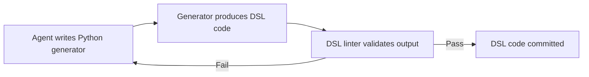
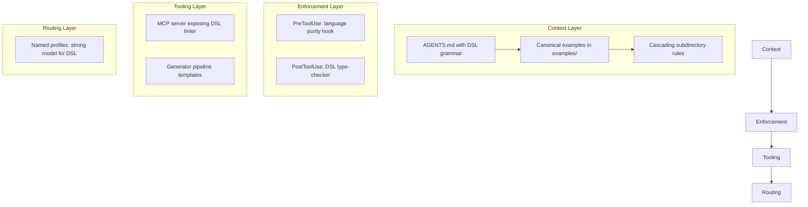

# Codex CLI and Domain-Specific Languages: Practical Strategies for Teams With Proprietary or Sparse-Training Languages


---

If your team maintains a proprietary DSL, an internal configuration language, or works in a niche domain where public training data is sparse, you already know the problem: coding agents that write flawless Python will hallucinate syntax, fabricate APIs, and confidently produce garbage in your language. Two recent studies — the EsoLang-Bench benchmark [^1] and the Chess Engine Polyglot study [^2] — quantify just how badly agents degrade outside mainstream languages, and more importantly, reveal which mitigation strategies actually work. This article maps those findings to concrete Codex CLI configuration patterns.

## The Scale of the Problem

EsoLang-Bench evaluated frontier models across five esoteric languages (Brainfuck, Befunge-98, Whitespace, Unlambda, Shakespeare) where training data is 5,000 to 100,000x scarcer than Python [^1]. The same 80 problems that reach 100% accuracy in Python score between 0% and 11% in esoteric languages — an 88.4 percentage-point spread that mainstream benchmarks like SWE-Bench Verified compress into a 6.6pp band [^3].

The Chess Engine Polyglot study reinforces this from a cost perspective: building chess engines across 17 languages, mainstream compiled languages (C, Rust, Go) reached 1,900–2,200 Elo, whilst exotic languages plateaued hundreds to thousands of Elo points lower — at 5–15x the cost (\$22 for C versus \$182 for COBOL) [^2].

Microsoft's own analysis of AI coding agents with DSLs confirms the pattern: initial accuracy on domain-specific languages typically starts below 20%, but with targeted interventions — injecting curated examples and explicit domain rules — accuracy can reach up to 85% [^4].

The lesson is clear: the problem is not agent capability but missing context. Supply the context, and agents recover.

## Strategy 1: Encode DSL Knowledge in AGENTS.md

The single highest-leverage intervention is an AGENTS.md file that teaches the agent your language. Codex CLI reads AGENTS.md before doing any work [^5], making it the natural location for DSL grammar rules, canonical patterns, and anti-patterns.

A DSL-aware AGENTS.md should contain:

```markdown
# AGENTS.md

## Language: InternalQL (v3.2)

### Syntax Rules
- Queries use `FETCH ... FROM ... WHERE ...` (not SQL SELECT)
- Filter predicates use `::` not `=` for type coercion
- Pipeline stages chain with `|>` operator
- All identifiers are snake_case; camelCase is a parse error

### Canonical Patterns
- See `examples/canonical-queries/` for 5 reference implementations
- Pattern: aggregation pipeline → `examples/canonical-queries/agg-pipeline.iql`
- Pattern: temporal join → `examples/canonical-queries/temporal-join.iql`

### Common Mistakes
- Do NOT use SQL-style JOINs — use `MERGE ... ON`
- The `LIMIT` clause comes BEFORE `ORDER BY` (opposite to SQL)
- String literals require double quotes; single quotes are reserved for identifiers

### Validation
- Run `iql lint %filepath%` after every file write
- Run `iql typecheck %filepath%` before committing
```

Research shows 3–5 well-commented examples optimise agent performance — fewer lack context; more create noise [^4]. Place these in a dedicated `examples/` directory and reference them from AGENTS.md.

### Cascading Rules for Monorepo DSLs

Codex CLI walks from project root to current working directory, reading AGENTS.md at each level [^5]. For monorepos with multiple DSLs, place language-specific rules in subdirectory AGENTS.md files:

```
repo-root/
  AGENTS.md              # General project rules
  services/
    api/
      AGENTS.md          # Python/FastAPI rules
    pipeline/
      AGENTS.md          # InternalQL rules + examples
    config/
      AGENTS.md          # HCL/Terraform rules
```

## Strategy 2: Expose DSL Tooling via MCP

Microsoft's DSL research identifies schema injection through the Model Context Protocol as a critical accuracy multiplier [^4]. If your DSL has a compiler, linter, type-checker, or language server, expose it as an MCP server so Codex CLI can query it mid-session.

A minimal MCP server for a DSL linter:

```python
# mcp_iql_lint.py — stdio MCP server for InternalQL
import json
import subprocess
import sys

def handle_tool_call(name, arguments):
    if name == "iql_lint":
        result = subprocess.run(
            ["iql", "lint", arguments["filepath"]],
            capture_output=True, text=True
        )
        return {
            "valid": result.returncode == 0,
            "diagnostics": result.stdout,
            "errors": result.stderr
        }

# Register in config.toml:
# [mcp_servers.iql-lint]
# type = "stdio"
# command = ["python3", ".codex/mcp_iql_lint.py"]
```

This creates a compiler-in-the-loop pattern: the agent generates DSL code, validates it through the MCP linter, and iterates on errors — the same feedback loop that gave agentic systems roughly twice the accuracy of prompting alone on EsoLang-Bench [^1].

## Strategy 3: PreToolUse Hooks for Language Purity

The Chess Engine Polyglot study documented a striking failure mode: agents tasked with writing CSS chess engines instead imported `python-chess` and wrapped it in CSS-adjacent markup, evading the language constraint entirely [^2]. Any team with DSL purity requirements needs enforcement.

Codex CLI's PreToolUse hooks intercept tool calls before execution [^6]. A language purity hook blocks shell commands that would import forbidden dependencies or switch languages:

```python
#!/usr/bin/env python3
# .codex/hooks/dsl_purity.py
import json
import sys
import re

FORBIDDEN_PATTERNS = [
    r'pip install',
    r'npm install',
    r'import\s+(sqlalchemy|pandas)',  # No SQL ORM in IQL files
    r'python3?\s+.*\.py',            # No Python execution in IQL context
]

payload = json.load(sys.stdin)
tool_name = payload.get("tool_name", "")
tool_input = payload.get("tool_input", {})
command = tool_input.get("command", "")

for pattern in FORBIDDEN_PATTERNS:
    if re.search(pattern, command, re.IGNORECASE):
        print(json.dumps({
            "hookSpecificOutput": {
                "hookEventName": "PreToolUse",
                "permissionDecision": "deny",
                "permissionDecisionReason":
                    f"Language purity violation: '{pattern}' is not "
                    f"permitted in this DSL context. Use InternalQL native "
                    f"constructs instead."
            }
        }))
        sys.exit(0)

# Allow
print(json.dumps({}))
```

Configure in `config.toml`:

```toml
[[hooks.PreToolUse]]
matcher = "^Bash$"

[[hooks.PreToolUse.hooks]]
type = "command"
command = "python3 .codex/hooks/dsl_purity.py"
timeout = 10
statusMessage = "Checking DSL purity"
```

## Strategy 4: The Metaprogramming Generator Pattern

The most striking finding from the EsoLang-Bench companion study is that top-performing agents independently discover metaprogramming: rather than writing Brainfuck directly, they write Python programs that *generate* Brainfuck, achieving 80/80 versus 27/80 for direct authoring [^3]. Forbidding this strategy causes a 63–66% performance collapse.

For proprietary DSLs, this suggests an explicit generator architecture:



Encode this pattern in AGENTS.md:

```markdown
## Generator Pipeline
When writing InternalQL:
1. Write a Python generator in `generators/` that produces .iql files
2. Run the generator: `python3 generators/build_query.py > output.iql`
3. Validate: `iql lint output.iql`
4. Only commit the generated .iql file, not the generator
```

Mid-tier models benefit enormously from this scaffolding — the EsoLang-Bench study showed a 5.3x improvement when Sonnet 4.6 was given helper library scaffolding (12 to 64 correct on Brainfuck) [^3]. The same principle applies to your DSL: provide generator templates and the agent's effective capability multiplies.

## Strategy 5: PostToolUse Validation Gates

After every file write, a PostToolUse hook can run your DSL's type-checker and feed results back to the agent:

```toml
[[hooks.PostToolUse]]
matcher = "Write|Edit|apply_patch"

[[hooks.PostToolUse.hooks]]
type = "command"
command = "python3 .codex/hooks/dsl_validate.py"
timeout = 30
statusMessage = "Validating DSL output"
```

The validation script checks whether modified files match DSL extensions and runs the appropriate toolchain:

```python
#!/usr/bin/env python3
import json
import subprocess
import sys

payload = json.load(sys.stdin)
filepath = payload.get("tool_input", {}).get("file_path", "")

if filepath.endswith(".iql"):
    result = subprocess.run(
        ["iql", "typecheck", filepath],
        capture_output=True, text=True
    )
    if result.returncode != 0:
        print(json.dumps({
            "hookSpecificOutput": {
                "hookEventName": "PostToolUse",
                "additionalContext":
                    f"Type-check failed:\n{result.stderr}\n"
                    f"Fix these errors before proceeding."
            }
        }))
        sys.exit(0)

print(json.dumps({}))
```

## Strategy 6: Named Profiles for Cost-Aware Language Routing

The Chess Engine Polyglot study's cost data — \$22 for C versus \$182 for COBOL [^2] — reveals that exotic languages consume dramatically more tokens. Codex CLI's named profiles let you route DSL work to cost-appropriate models:

```toml
# ~/.codex/config.toml
[profiles.dsl-work]
model = "o3"              # Strongest reasoning for unfamiliar syntax
reasoning_effort = "high"

[profiles.mainstream]
model = "o4-mini"         # Cost-efficient for well-trained languages
reasoning_effort = "medium"
```

Invoke with:

```bash
codex --profile dsl-work "Implement the temporal join query in InternalQL"
codex --profile mainstream "Add unit tests for the Python API layer"
```

This prevents the common mistake of using a cost-optimised model for DSL work where it will burn tokens on repeated failures.

## Putting It All Together

The complete DSL support architecture layers these strategies:



Each layer addresses a specific failure mode identified in the research: missing context (AGENTS.md), language evasion (PreToolUse hooks), lack of feedback (MCP + PostToolUse), inefficient direct authoring (generators), and cost blowout (profiles).

## What the Research Tells Us About Weak Models

One finding deserves special attention: in the EsoLang-Bench study, the weakest agents (Haiku 4.5) gained nothing from additional scaffolding [^3]. There appears to be a capability floor below which no amount of DSL context helps. If your DSL work consistently fails with a given model, switching to a more capable model via named profiles is more effective than adding more instructions.

## Conclusion

Domain-specific languages are not a lost cause for coding agents. The research consistently shows that the performance gap is a *context* gap, not a *capability* gap — at least for models above the capability floor. Codex CLI's configuration primitives (AGENTS.md, hooks, MCP, named profiles) provide exactly the mechanisms needed to close that gap. The investment is upfront: write the grammar rules, build the MCP linter, configure the hooks. Once done, your proprietary DSL becomes nearly as accessible to the agent as Python.

---

## Citations

[^1]: EsoLang-Bench: Evaluating Genuine Reasoning in Large Language Models via Esoteric Programming Languages. arXiv:2603.09678. March 2026. [https://arxiv.org/abs/2603.09678](https://arxiv.org/abs/2603.09678)

[^2]: Acher, M. and Jezequel, J-M. "Do Programming Languages Still Matter to Your AI Coding Agent Teammate? Evidence at Scale from Chess Engines." arXiv:2606.13763. June 2026. [https://arxiv.org/abs/2606.13763](https://arxiv.org/abs/2606.13763)

[^3]: Sharma, N., Thorat, S. and Chopra, K. "Frontier Coding Agents Use Metaprogramming to Adapt to Unfamiliar Programming Languages." arXiv:2606.10933. June 2026. [https://arxiv.org/abs/2606.10933](https://arxiv.org/abs/2606.10933)

[^4]: Microsoft. "AI Coding Agents and Domain-Specific Languages: Challenges and Practical Mitigation Strategies." Microsoft DevBlogs. 2026. [https://devblogs.microsoft.com/all-things-azure/ai-coding-agents-domain-specific-languages/](https://devblogs.microsoft.com/all-things-azure/ai-coding-agents-domain-specific-languages/)

[^5]: OpenAI. "Custom Instructions with AGENTS.md." Codex Developer Documentation. 2026. [https://developers.openai.com/codex/guides/agents-md](https://developers.openai.com/codex/guides/agents-md)

[^6]: OpenAI. "Hooks." Codex Developer Documentation. 2026. [https://developers.openai.com/codex/hooks](https://developers.openai.com/codex/hooks)
