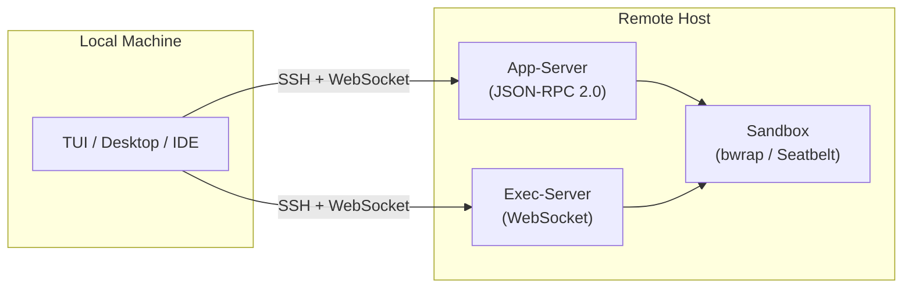
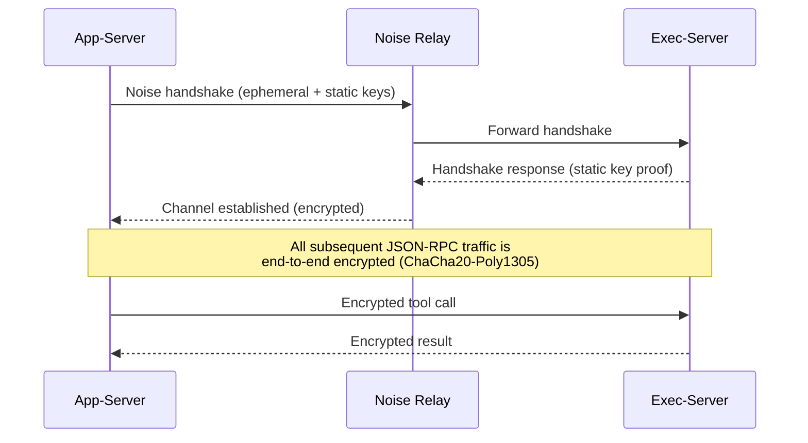

# Codex CLI v0.141.0: Noise-Encrypted Remote Executors, Cross-Platform Execution, and the Plugin Marketplace


---

Codex CLI v0.141.0 landed today — the same day this article ships — and the headline feature is a security upgrade that anyone running agents against remote machines should care about: remote executors now communicate over authenticated, end-to-end encrypted Noise relay channels [^1]. Alongside that, cross-platform remote execution finally preserves native working directories and shells across app-server and exec-server boundaries [^1], and plugin discovery gains a personal marketplace and auth-specific catalogues [^2].

This article unpacks what changed, why it matters, and how to configure it.

## The Remote Execution Architecture Before v0.141.0

Since v0.119.0, Codex CLI has split the agent into two logical halves [^3]:

1. **App-server** — a bidirectional JSON-RPC 2.0 process that handles model inference, sandbox execution, file I/O, and MCP tool calls on the machine where the code lives [^4].
2. **Exec-server** — a lighter-weight WebSocket endpoint introduced for non-interactive automation, such as CI pipelines firing a single prompt against a remote codebase [^3].

The TUI (or Codex Desktop, or VS Code extension) renders the conversation locally whilst the app-server does the work remotely. SSH transport handled the initial connectivity, with WebSocket upgrades layered on top from v0.122.0 [^3].



The problem: once past the SSH tunnel, the relay between app-server and exec-server used plaintext JSON-RPC internally. If you were running multiple executor backends across network boundaries — say, a macOS laptop driving a Linux build farm — the inter-executor traffic was only as secure as the underlying network [^5].

## What the Noise Protocol Brings

The Noise Protocol Framework, designed by Trevor Perrin and first specified in 2015, is the same cryptographic foundation that secures WireGuard, WhatsApp (via the Signal Protocol), and Signal [^6]. It defines a family of handshake patterns built on Diffie-Hellman key agreement, AEAD symmetric encryption (typically ChaCha20-Poly1305 or AES-GCM), and cryptographic hashes (BLAKE2 or SHA-256) [^7].

### Why Noise Rather Than TLS?

Noise channels offer three properties that suit Codex's relay topology:

| Property | Noise | TLS 1.3 |
|----------|-------|---------|
| Zero round-trip encryption (0-RTT) | Native with IK pattern | Optional, replay-vulnerable |
| Identity hiding | Both initiator and responder | Server only (by default) |
| Forward secrecy | Per-handshake ephemeral keys | Per-session |
| Certificate authority dependency | None — public-key pinning | Required |

For Codex, the absence of a CA dependency matters most. Remote executors authenticate via OpenAI account credentials (or CODEX_API_KEY for approved hosts) rather than X.509 certificates [^8]. Noise lets the relay pin the executor's static public key directly, removing an entire class of MITM vectors tied to certificate issuance [^7].

### v0.141.0 Implementation

In v0.141.0, the Noise relay wraps the existing WebSocket transport between app-server and exec-server [^1]. The handshake establishes mutual authentication using the executor's registered static key and the app-server's session ephemeral key. Once the channel is up, all JSON-RPC messages, tool call payloads, and file-system operations travel encrypted end-to-end [^2].



Idle relay connections are now maintained automatically to avoid reconnection overhead during long sessions [^2].

## Cross-Platform Execution Improvements

Before v0.141.0, driving a Linux exec-server from a macOS or Windows app-server could mangle working directories. Path separators, shell defaults, and filesystem permission semantics did not always translate cleanly across the boundary [^3].

v0.141.0 addresses this by preserving executor-native working directories and shells, including filesystem permission paths, across app-server and exec-server boundaries [^1]. In practice, this means:

- A Windows app-server driving a Linux executor uses the executor's native `/home/user/project` path rather than attempting to translate `C:\Users\...` semantics.
- Shell selection (`bash`, `zsh`, `powershell`) follows the executor, not the client.
- File permission bits reported by tool calls reflect the remote filesystem accurately.

### Configuration

Remote executor configuration lives in `config.toml`. For MCP servers that should run through a remote executor, set the experimental environment:

```toml
[mcp_servers.my-remote-tools]
command = "my-mcp-server"
args = ["--mode", "stdio"]
experimental_environment = "remote"  # route through remote executor
```

Environment variables can be scoped to the remote executor:

```toml
[mcp_servers.my-remote-tools.env]
DB_HOST = { value = "prod-db.internal", source = "remote" }
API_KEY = { value = "sk-...", source = "local" }  # stays on local machine
```

The `source = "remote"` directive ensures the variable is resolved on the executor host, not injected from the client [^9].

## Executor Plugin Activation Per Thread

A significant v0.141.0 addition: selected executor plugins can now activate their stdio MCP servers per thread [^2]. Previously, plugin-provided MCP servers were global — enabled for the entire session. Now, each thread can declare which executor plugins it needs, and only those plugins' MCP servers start.

This matters for cost and security:

- **Cost**: plugins that spawn heavyweight processes (database connectors, browser automation) only run when the thread actually needs them.
- **Security**: a thread handling untrusted input does not have access to plugins registered for privileged operations in a different thread.

## Plugin Discovery: The Created-by-Me Marketplace

v0.141.0 extends plugin discovery with two additions [^2]:

1. **Created-by-me marketplace** — a personal catalogue of plugins you have published, accessible directly from `/plugins` without searching the global marketplace.
2. **Auth-specific curated catalogues** — plugin recommendations now respect your authentication mode. Enterprise SSO users see plugins vetted for their organisation; API-key users see the public catalogue.

Plugin capabilities now route consistently by authentication mode and deduplicate conflicting declarations [^2], resolving a class of bugs where two plugins declared the same tool name and the resolution was non-deterministic.

## Performance: Tool-Search Caching

Large sessions with many MCP tools suffered from latency spikes as the tool registry was searched linearly on every turn. v0.141.0 introduces tool-search caching and eliminates repeated request and history copies [^2], reducing both latency and memory consumption in tool-heavy sessions.

⚠️ OpenAI has not published specific benchmark numbers for the performance improvements in v0.141.0. The changelog describes the changes qualitatively.

## Practical Recommendations

### Upgrading

```bash
# Update to v0.141.0
codex update

# Verify the installation
codex --version
# Expected: 0.141.0

# Run diagnostics to confirm remote executor health
codex doctor
```

### Verifying Noise Encryption

After connecting to a remote executor, `codex doctor` reports the relay channel type. Look for `noise` in the Remote Executors section rather than `plaintext` [^10].

### Migration Checklist

For teams already using remote executors:

1. **Update both ends** — the app-server and exec-server must both run v0.141.0 for Noise channels to activate. Mixed versions fall back to the previous transport with a warning.
2. **Check firewall rules** — the Noise relay uses the same WebSocket port, so no firewall changes are required.
3. **Re-register executors** — executor registration now uses standard Codex auth instead of a separate registry credential flow [^8]. If you previously configured a separate registry credential, you can remove it after re-registration.
4. **Test cross-platform paths** — if you drive Linux executors from Windows or macOS, verify that working directory resolution behaves correctly in your environment.

## What This Release Signals

v0.141.0 continues a pattern visible since the Rust rewrite (v0.120.0): each release hardens the remote execution layer. The trajectory is clear — OpenAI is building towards a world where `codex` on your laptop is a thin client that drives sandboxed execution on managed or self-hosted compute, with enterprise-grade encryption and authentication baked in rather than bolted on.

For teams running Codex against production infrastructure, the Noise upgrade removes the need to wrap every executor connection in a separate VPN or SSH tunnel for encryption. The relay handles it natively.

---

## Citations

[^1]: OpenAI, "Codex CLI v0.141.0 Release Notes", Codex Changelog, 18 June 2026. [https://developers.openai.com/codex/changelog](https://developers.openai.com/codex/changelog)

[^2]: @CodexReleases, "Codex CLI 0.141.0 is out", X (formerly Twitter), 18 June 2026. [https://x.com/CodexReleases/status/2067470159489716580](https://x.com/CodexReleases/status/2067470159489716580)

[^3]: D. Vaughan, "Codex CLI Remote Connections: Running Agents on Remote Hosts with SSH, WebSocket, and Secure Tunnels", Codex Knowledge Base, 21 April 2026. [https://codex.danielvaughan.com/2026/04/21/codex-cli-remote-connections-ssh-websocket-secure-tunnels/](https://codex.danielvaughan.com/2026/04/21/codex-cli-remote-connections-ssh-websocket-secure-tunnels/)

[^4]: D. Vaughan, "The Codex App Server: A Complete Guide to the Protocol That Powers Every Surface", Codex Knowledge Base, 15 April 2026. [https://codex.danielvaughan.com/2026/04/15/codex-app-server-complete-guide/](https://codex.danielvaughan.com/2026/04/15/codex-app-server-complete-guide/)

[^5]: D. Vaughan, "Remote SSH and the App-Server Architecture: Running Codex Against Distant Machines", Codex Knowledge Base, 17 April 2026. [https://codex.danielvaughan.com/2026/04/17/codex-remote-ssh-app-server-architecture/](https://codex.danielvaughan.com/2026/04/17/codex-remote-ssh-app-server-architecture/)

[^6]: Wikipedia, "Noise Protocol Framework". [https://en.wikipedia.org/wiki/Noise_Protocol_Framework](https://en.wikipedia.org/wiki/Noise_Protocol_Framework)

[^7]: T. Perrin, "The Noise Protocol Framework", noiseprotocol.org. [https://noiseprotocol.org/noise.html](https://noiseprotocol.org/noise.html)

[^8]: OpenAI, "Remote connections — Codex", OpenAI Developers. [https://developers.openai.com/codex/remote-connections](https://developers.openai.com/codex/remote-connections)

[^9]: OpenAI, "Configuration Reference — Codex", OpenAI Developers. [https://developers.openai.com/codex/config-reference](https://developers.openai.com/codex/config-reference)

[^10]: OpenAI, "Command line options — Codex CLI", OpenAI Developers. [https://developers.openai.com/codex/cli/reference](https://developers.openai.com/codex/cli/reference)
