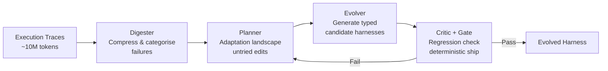
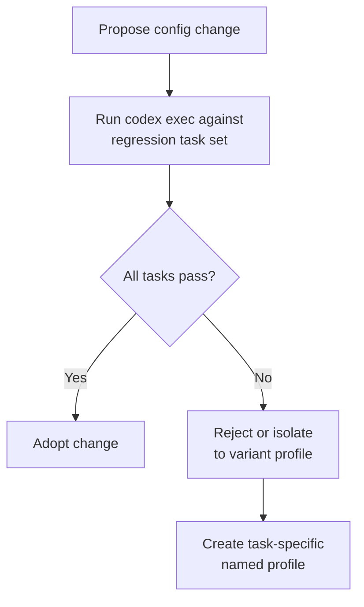

# HarnessX: What the Composable Agent Harness Foundry Means for Codex CLI Configuration Evolution


---

The argument that agent harness design matters at least as much as model selection is no longer speculative. HarnessX (arXiv:2606.14249, Chen et al., 12 June 2026) moves it from observation to engineering discipline: a composable, trace-driven foundry that evolves harnesses automatically and delivers a +14.5% average absolute gain across five benchmarks — up to +44.0% for weaker models [^1]. For Codex CLI practitioners, HarnessX provides the clearest evidence yet that your `config.toml`, `AGENTS.md`, hooks, and named profiles are not mere preferences but the primary performance lever you control.

## The Research: From Static Scaffolding to Evolvable Harness

### What HarnessX Is

HarnessX treats the agent harness — the prompts, tools, memory management, control flow, and safety gates that wrap a language model — as a **first-class, evolvable object** [^1]. Rather than hand-crafting a fixed scaffold, HarnessX decomposes the harness into typed, substitutable *processors* that attach to lifecycle hooks and evolve through execution trace analysis [^2].

The framework defines nine behavioural dimensions: model selection, context assembly, memory management, tool ecosystem, execution environment, evaluation/reward, control/safety, observability, and training bridge [^1]. Each dimension contains composable processors that can be independently serialised, compared, and substituted.

### The AEGIS Evolution Engine

The core innovation is AEGIS (Adaptive Evolution of Generative Intelligence Scaffolding), a four-stage pipeline that maps harness adaptation onto reinforcement learning concepts [^1]:



| RL Concept | HarnessX Dual |
|-----------|--------------|
| Policy π | Harness-update procedure |
| State | Harness config + trace store |
| Action | Typed code-level edit |
| Feedback | Execution traces + verifier scores |

The Critic defends against reward hacking; regression checking prevents catastrophic forgetting; the Planner's landscape construction combats under-exploration [^1]. Crucially, **language-model subagents explore and hypothesise, but only typed structure and deterministic gates determine what ships** [^2].

### The Numbers

Across ALFWorld, GAIA, WebShop, tau³-Bench, and SWE-bench Verified [^1]:

| Benchmark | Best Gain | Model |
|-----------|-----------|-------|
| ALFWorld | +44.0% | Qwen3.5-9B |
| GAIA | +13.6% | With variant isolation |
| SWE-bench Verified | +10.9% to +18.2% | Multiple |
| tau³-Bench | +1.1% | Near-ceiling baseline |

The inverse-scaling pattern is striking: **weaker models benefit most** from evolved harnesses. Sonnet 4.6 gained +11.2% on ALFWorld versus Qwen3.5-9B's +44.0% [^1]. Evolved scaffolding addresses behavioural gaps that smaller models cannot self-correct — exactly the scenario Codex CLI teams face when routing cheaper models to routine tasks via named profiles.

### Variant Isolation and Ensemble Routing

For heterogeneous benchmarks like GAIA, a single evolving harness stagnates because different task types require conflicting configurations [^1]. HarnessX solves this with **ensemble routing**: maintaining up to K harness variants and routing each task to its best-performing variant. This prevents rejection of locally beneficial edits and enables sustained improvement without regression.

The parallel to Codex CLI named profiles is direct: different task categories benefit from different configurations, and a single monolithic configuration leaves performance on the table.

## Mapping HarnessX to Codex CLI Configuration

HarnessX's nine dimensions map surprisingly cleanly onto Codex CLI's existing configuration primitives. The lesson is not that you should build an AEGIS engine (though you could); it is that your Codex CLI configuration already contains the composable harness HarnessX formalises — you just need to treat it as evolvable.

### Dimension 1: Model Selection → Named Profiles

HarnessX shows model selection is a harness-level decision, not a global constant [^1]. Codex CLI's named profiles implement this directly:

```toml
# ~/.codex/fast.config.toml — routine tasks
model = "o4-mini"

# ~/.codex/deep.config.toml — complex refactoring
model = "o3"
reasoning_effort = "high"
```

The inverse-scaling finding means your cheap-model profile benefits *more* from a well-tuned harness than your frontier-model profile does. Invest configuration effort where the model is weakest.

### Dimension 2: Context Assembly → AGENTS.md Layering

HarnessX's context assembly processors decide what information reaches the model at each turn [^1]. In Codex CLI, this maps to the AGENTS.md inheritance chain:

```
~/.codex/AGENTS.md          # Global context: team conventions
repo-root/AGENTS.md          # Project context: architecture, test patterns
packages/api/AGENTS.md       # Package context: API-specific constraints
```

The chain composes — that is the whole point [^3]. HarnessX's variant isolation finding suggests you should not flatten this hierarchy; different directory contexts serve as natural task-routing boundaries.

### Dimension 3: Control/Safety → Hook Pipeline

HarnessX processors attach to lifecycle hooks (`before_tool`, `after_tool`, `step_end`) with typed contracts and ordering metadata [^2]. Codex CLI's `PreToolUse` and `PostToolUse` hooks serve the same function:

```toml
# .codex/config.toml
[[hooks.PreToolUse]]
matcher = "shell"
command = ["./scripts/validate-command.sh"]
timeout_ms = 5000

[[hooks.PostToolUse]]
matcher = "write_file"
command = ["./scripts/lint-check.sh"]
timeout_ms = 10000
```

The AEGIS finding that **deterministic gates, not model judgement, should govern what ships** [^2] reinforces a principle Codex CLI practitioners already apply: hooks should execute concrete checks (AST validation, test execution, linting) rather than asking the model to self-evaluate.

### Dimension 4: Memory Management → Session Lifecycle

HarnessX's memory dimension manages what persists between turns and between sessions [^1]. Codex CLI implements this through:

- **`/compact`**: Summarises context within a session (analogous to HarnessX's intra-episode memory compression)
- **`codex resume` / `codex fork`**: Carries or branches context across sessions
- **`~/.codex/memory/`**: Persistent cross-session memories extracted from completed sessions [^4]

The co-evolution finding (+4.7% additional gain from jointly evolving harness and model behaviour) [^1] suggests that tuning compaction thresholds and memory extraction alongside model selection yields compounding improvements.

### Dimension 5: Tool Ecosystem → MCP Servers and Plugins

HarnessX's tool ecosystem dimension governs which tools are available and how they're presented to the model [^1]. In Codex CLI, this is the MCP server configuration in `config.toml`:

```toml
[mcp_servers.linter]
command = "npx"
args = ["-y", "@project/lint-mcp"]
enabled = true

[mcp_servers.test-runner]
command = "npx"
args = ["-y", "@project/test-mcp"]
enabled = true
```

HarnessX's variant isolation finding is directly actionable here: **different task profiles should expose different tool sets** [^1]. A refactoring profile might enable AST analysis tools while disabling deployment tools. A CI debugging profile exposes log-fetching tools but restricts write operations.

## The Seesaw Constraint: Codex CLI Anti-Regression Patterns

HarnessX's seesaw constraint — candidate harness edits must not regress previously solved tasks [^1] — is the most operationally important finding for Codex CLI configuration management.

In practice, this means configuration changes should be validated against a regression suite before adoption. The pattern:



This is the Codex CLI equivalent of HarnessX's ensemble routing: when a configuration change helps one task class but hurts another, **create a named profile rather than compromising the base configuration**.

## The Scaffolding Ceiling and What It Means

HarnessX acknowledges two ceilings [^1]:

1. **Scaffolding ceiling**: harness alone cannot exceed the model's reasoning capacity
2. **Training-signal ceiling**: model improvement under a fixed harness cannot exercise newly acquired capabilities

The practical implication for Codex CLI: there is a point beyond which more hooks, more AGENTS.md detail, and more elaborate profiles yield diminishing returns. The inverse-scaling data tells you where that point is — if your frontier model profile already scores well, further harness tuning helps less than switching focus to your mid-tier model profiles where the gap is largest.

## A Practical Configuration Evolution Workflow

Drawing from HarnessX's four-stage pipeline, here is a lightweight configuration evolution workflow for Codex CLI teams:

### 1. Digest: Collect Execution Traces

Enable OpenTelemetry export to capture session traces [^5]:

```toml
[otel]
exporter = "otlp"
```

Review traces periodically for failure patterns: which tool calls fail, which tasks stall, where does the model lose context.

### 2. Plan: Identify Adaptation Targets

Map failures to HarnessX dimensions:

- Model repeatedly makes wrong tool choice → **tool ecosystem** (restrict or add MCP tools)
- Context window exhaustion mid-task → **memory management** (adjust compaction threshold)
- Model ignores project conventions → **context assembly** (strengthen AGENTS.md)
- Unsafe operations attempted → **control/safety** (add hook gates)

### 3. Evolve: Apply Typed Edits

Make one change at a time. Each change maps to a specific HarnessX dimension. Version your `.codex/` directory in Git so changes are auditable and revertable.

### 4. Gate: Regression Check

Run `codex exec` against a set of representative tasks before and after the change:

```bash
# Baseline
codex exec "Fix the auth bug in src/auth.ts" \
  --output-schema ./schemas/fix-result.json \
  -o ./results/baseline.json

# After config change
codex exec "Fix the auth bug in src/auth.ts" \
  --output-schema ./schemas/fix-result.json \
  -o ./results/evolved.json
```

Compare structured outputs. If the change helps the target task without regressing others, adopt it. If it helps some tasks but hurts others, isolate it to a named profile.

## Conclusion

HarnessX formalises what experienced Codex CLI practitioners already intuit: the harness is the primary performance variable you control, and it should evolve systematically rather than accumulate ad hoc tweaks. The +14.5% average gain from harness evolution alone — without changing the model — is the strongest quantitative argument yet for treating `config.toml`, `AGENTS.md`, hooks, and named profiles as engineering artefacts worthy of the same rigour you apply to application code.

The inverse-scaling pattern provides clear allocation guidance: invest your heaviest configuration effort in the profiles powering your cheapest models. The seesaw constraint provides the safety discipline: never ship a configuration change without regression evidence. And ensemble routing provides the escape hatch: when tasks conflict, route them to specialised profiles rather than compromising a universal configuration.

Your Codex CLI configuration is already a composable agent harness. HarnessX shows you how to evolve it.

## Citations

[^1]: Chen, T., Lu, S., Zhao, K., et al. "HarnessX: A Composable, Adaptive, and Evolvable Agent Harness Foundry." arXiv:2606.14249, 12 June 2026. [https://arxiv.org/abs/2606.14249](https://arxiv.org/abs/2606.14249)

[^2]: Chen, T., Lu, S., Zhao, K., et al. "HarnessX: A Composable, Adaptive, and Evolvable Agent Harness Foundry" — Section 3: AEGIS Architecture. arXiv:2606.14249. [https://arxiv.org/html/2606.14249](https://arxiv.org/html/2606.14249)

[^3]: OpenAI. "Advanced Configuration — Codex." OpenAI Developers, June 2026. [https://developers.openai.com/codex/config-advanced](https://developers.openai.com/codex/config-advanced)

[^4]: OpenAI. "Features — Codex CLI." OpenAI Developers, June 2026. [https://developers.openai.com/codex/cli/features](https://developers.openai.com/codex/cli/features)

[^5]: OpenAI. "Configuration Reference — Codex." OpenAI Developers, June 2026. [https://developers.openai.com/codex/config-reference](https://developers.openai.com/codex/config-reference)

[^6]: Chen, T., Lu, S., Zhao, K., et al. "HarnessX" — Section 4: Benchmark Results and Inverse-Scaling Analysis. arXiv:2606.14249. [https://arxiv.org/abs/2606.14249](https://arxiv.org/abs/2606.14249)

[^7]: Macedo, S. O. "What makes a harness a harness: necessary and sufficient conditions for an agent harness." arXiv:2606.10106, 8 June 2026. [https://arxiv.org/abs/2606.10106](https://arxiv.org/abs/2606.10106)
