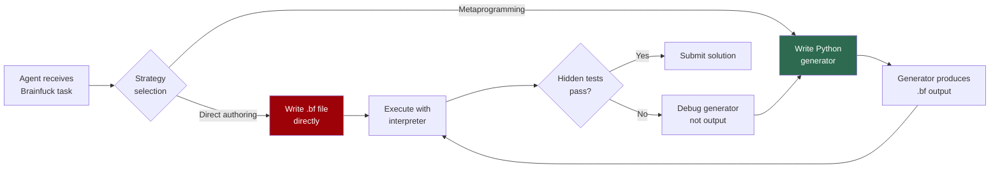

# Metaprogramming as Survival Strategy: What the EsoLang-Bench Study Means for Codex CLI Generator Pipelines and Sandbox Configuration


---

## The Problem with Comfortable Benchmarks

SWE-Bench Verified has become the industry's default yardstick for coding agents, yet it separates the best agent from the worst by just 6.6 percentage points [^1]. When every frontier model scores within a narrow band, the benchmark tells us almost nothing about how agents behave under genuine stress. A new study forces agents out of their comfort zone entirely — and the strategies they adopt under pressure have direct implications for how we configure Codex CLI.

Sharma, Thorat, and Chopra's "Frontier Coding Agents Use Metaprogramming to Adapt to Unfamiliar Programming Languages" (arXiv:2606.10933, June 2026) [^1] evaluated six contemporary coding agents across four esoteric programming languages: **Brainfuck**, **Befunge-98**, **Whitespace**, and **Shakespeare**. Each language presents a fundamentally alien programming model — Brainfuck's eight-command pointer machine, Befunge-98's two-dimensional stack-based control flow, Whitespace's invisible-character instruction set, and Shakespeare's theatrical-dialogue syntax. Eighty problems per language, six hidden tests per problem, three submission attempts maximum.

The spread tells the story: **88.4 percentage points** separate the strongest agent from the weakest on EsoLang-Bench, compared to 6.6 on SWE-Bench Verified [^1]. This is a benchmark that actually differentiates.

## The Scoreboard

| Agent | Whitespace | Shakespeare | Befunge-98 | Brainfuck | Mean |
|-------|-----------|-------------|------------|-----------|------|
| GPT-5.4 xhigh | 100.0% | 100.0% | 100.0% | 98.8% | **99.7%** |
| Claude Opus 4.6 | 100.0% | 87.5% | 80.0% | 80.0% | **86.9%** |
| Claude Sonnet 4.6 | 100.0% | 70.0% | 80.0% | 15.0% | **66.3%** |
| GPT-5.4 mini | 88.8% | 21.3% | 13.8% | 6.3% | **32.5%** |
| Claude Haiku 4.5 | 81.3% | 7.5% | 5.0% | 5.0% | **24.7%** |
| Kimi K2.5 | 31.3% | 2.5% | 6.3% | 5.0% | **11.3%** |

*Data from Table 1, Sharma et al. [^1]. 95% Wilson confidence intervals omitted for brevity.*

The top two agents — GPT-5.4 xhigh and Opus 4.6 — dominate not because they somehow "know" Brainfuck, but because they **refuse to write it directly**.

## The Metaprogramming Pivot

The study's central finding is that frontier agents independently discover metaprogramming as an adaptation strategy. Rather than authoring Brainfuck or Befunge-98 source code character by character, top agents write a **Python generator** — a program that produces the target-language program as output [^1].

When forced into direct authoring (metaprogramming forbidden), performance collapses:

- **Opus 4.6 on Brainfuck:** 80/80 → 27/80 (66% drop) [^1]
- **GPT-5.4 xhigh on Brainfuck:** ~79/80 → 29/80 (63% drop) [^1]

The generator strategy is not Python-specific. When Opus 4.6 was constrained to different host languages for Brainfuck generation, results remained strong across the board: Python 64/80, JavaScript 63/80, Rust 55/80 — all vastly outperforming the 27/80 from direct authoring [^1].



The crucial insight: agents debug the **generator**, not the generated output. This creates a feedback loop in a language the agent understands (Python), using the esoteric interpreter purely as a validation oracle [^1].

## Strategy Transfer: Lifting Weaker Agents

Mid-tier agents cannot independently discover metaprogramming but can exploit it when scaffolded. The study tested three conditions: base (no help), +Text (language reference provided), and +Lib (Python helper library provided without solutions) [^1]:

| Agent | Brainfuck Base → +Lib | Befunge-98 Base → +Lib |
|-------|----------------------|----------------------|
| Claude Sonnet 4.6 | 12 → **64** | 64 → **78** |
| GPT-5.4 mini | 5 → **53** | 11 → **64** |
| Claude Haiku 4.5 | 4 → **7** | 4 → **4** |

Sonnet 4.6 jumped from 12/80 to 64/80 on Brainfuck simply by receiving a Python helper library for Brainfuck byte manipulation — a **5.3× improvement** with zero additional training [^1]. Haiku, however, gained almost nothing, suggesting a capability threshold below which scaffolding cannot compensate.

## Resource Scaling: Calls and Tokens

The study's interpreter-call budget ablation revealed that additional execution attempts benefit strong agents substantially but do almost nothing for weak ones [^1]. Opus 4.6 improved progressively from 3 to unlimited interpreter calls on both Brainfuck and Befunge-98, whilst Haiku 4.5 remained at near-floor performance regardless of budget.

This has a direct cost implication: **throwing more compute at a weak model is waste**; upgrading the model or providing structural scaffolding yields far better returns.

## What This Means for Codex CLI

The metaprogramming findings map directly onto three Codex CLI configuration patterns for teams working with unfamiliar or constrained target languages — whether those are genuinely esoteric (hardware description languages, domain-specific grammars, legacy COBOL) or simply outside the agent's training distribution.

### 1. Generator Pipeline via AGENTS.md

Encode the metaprogramming strategy explicitly in your project's `AGENTS.md` so Codex CLI adopts it from the first turn rather than discovering it through trial and error:

```markdown
## Code Generation Strategy

When working with [TARGET_LANGUAGE] files:
1. Write a Python generator script in `generators/` that produces the target output
2. Run the generator to produce the target file
3. Validate with the target interpreter/compiler
4. Debug the generator, never the generated output directly
5. Only commit the generator AND the generated output

Do NOT attempt to write [TARGET_LANGUAGE] directly.
```

This mirrors how Opus 4.6 naturally behaves — but makes it deterministic and available to weaker models that would otherwise attempt (and fail at) direct authoring [^2].

### 2. Sandbox Environment for Custom Interpreters

Codex CLI's `shell_environment_policy` configuration controls what the agent's subprocess can access [^3]. For generator pipelines targeting unusual languages, configure the environment to include the target interpreter:

```toml
# config.toml — profile for HDL/esoteric language work
[permissions.generator-pipeline]
extends = ":workspace"

[permissions.generator-pipeline.shell_environment_policy]
inherit = "core"

[permissions.generator-pipeline.shell_environment_policy.set]
# Make target interpreter available
PATH = "/usr/local/bin:/usr/bin:/opt/target-lang/bin"
TARGET_INTERPRETER = "/opt/target-lang/bin/interpret"
```

The key insight from the study is that the **interpreter is a validation oracle**, not a development environment. The agent writes Python, generates output, and calls the interpreter purely to check correctness. Your sandbox needs to expose the interpreter binary but nothing else from the target ecosystem [^3].

### 3. PreToolUse Hook for Strategy Enforcement

Codex CLI's `PreToolUse` hook intercepts shell tool calls and can deny commands that violate the generator-pipeline discipline [^4]. For teams that have established a metaprogramming workflow, enforce it:

```toml
# Deny direct editing of target-language source files
[[hooks.PreToolUse]]
name = "enforce-generator-pipeline"

[[hooks.PreToolUse.hooks]]
type = "command"
command = "python3 scripts/check-no-direct-edit.py"
```

Where the enforcement script inspects the proposed command and denies any direct file writes to target-language extensions (`.bf`, `.ws`, `.hdl`, etc.), forcing the agent back through the generator path. This addresses the study's finding that even strong agents occasionally fall back to direct authoring mid-session when debugging becomes frustrating [^1].

### 4. Named Profiles for Capability-Matched Model Selection

The study's most practical finding is the **capability threshold**: scaffolding transforms mid-tier agents but cannot rescue weak ones. Map this to Codex CLI named profiles [^5]:

```toml
# For generator-pipeline tasks requiring strategy discovery
[profiles.generator-hard]
model = "o4-pro"
approval_policy = "unless-allow-listed"

# For generator-pipeline tasks with scaffolding provided
[profiles.generator-scaffolded]
model = "o3"
approval_policy = "auto-edit"

# Never use for unfamiliar-language generation
# [profiles.generator-budget]
# model = "o4-mini"  # Below capability threshold
```

The 5.3× improvement Sonnet achieved with library scaffolding suggests that a mid-tier model plus good `AGENTS.md` instructions and helper libraries can match a frontier model's unscaffolded performance — at substantially lower cost [^1].

## The Broader Pattern

Metaprogramming on esoteric languages is an extreme case of a universal pattern: **agents perform better when they can reframe unfamiliar problems in terms of familiar tools**. The generator pipeline — write code that writes code, validate with an external oracle — applies equally to:

- **Infrastructure-as-code:** Generate Terraform HCL from Python/TypeScript definitions
- **Hardware description:** Generate Verilog from a Python model (Amaranth/MyHDL pattern)
- **Legacy maintenance:** Generate COBOL patches from Python transformation scripts
- **Configuration languages:** Generate complex Kubernetes YAML from typed builders

In each case, the Codex CLI configuration pattern is identical: encode the generator strategy in `AGENTS.md`, expose the validator in the sandbox, enforce the pipeline with hooks, and select the model tier that matches the task's strategic complexity.

The EsoLang-Bench data makes the cost argument concrete: a scaffolded mid-tier model at the generator task outperforms an unscaffolded frontier model at the direct-authoring task. Configuration is cheaper than capability — and the returns compound.

## Citations

[^1]: Sharma, A., Thorat, S., & Chopra, P. (2026). "Frontier Coding Agents Use Metaprogramming to Adapt to Unfamiliar Programming Languages." arXiv:2606.10933. [https://arxiv.org/abs/2606.10933](https://arxiv.org/abs/2606.10933)

[^2]: OpenAI. "Custom instructions with AGENTS.md — Codex." OpenAI Developers. [https://developers.openai.com/codex/guides/agents-md](https://developers.openai.com/codex/guides/agents-md)

[^3]: OpenAI. "Configuration Reference — Codex." OpenAI Developers. [https://developers.openai.com/codex/config-reference](https://developers.openai.com/codex/config-reference)

[^4]: OpenAI. "Hooks — Codex." OpenAI Developers. [https://developers.openai.com/codex/hooks](https://developers.openai.com/codex/hooks)

[^5]: OpenAI. "Command line options — Codex CLI." OpenAI Developers. [https://developers.openai.com/codex/cli/reference](https://developers.openai.com/codex/cli/reference)
