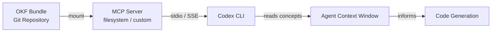
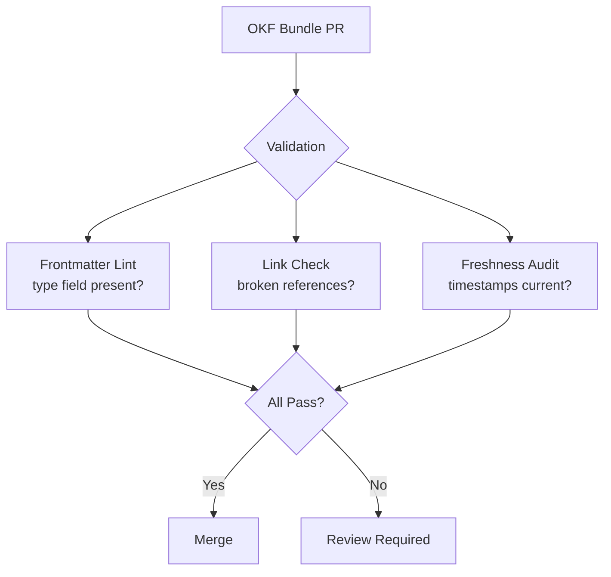

# OKF Implementation Guide: Building Agent-Ready Knowledge Bundles for Codex CLI via MCP


---

Google Cloud published the Open Knowledge Format (OKF) v0.1 specification on 12 June 2026, formalising the "LLM wiki" pattern into a vendor-neutral, agent-readable standard [^1]. The spec is deliberately minimal — one required field, a handful of optional ones, and a directory of Markdown files with YAML frontmatter — yet it unlocks a surprisingly powerful knowledge layer for coding agents.

This article walks through building your first OKF bundle, connecting it to Codex CLI via an MCP server, running Google's reference enrichment agent, and measuring knowledge quality. If you have already read the conceptual coverage in the premium article on OKF and context engineering, this is the hands-on companion.

## Why OKF Matters for Codex CLI Users

Most organisations store knowledge across wikis, Confluence pages, docstrings, Notion databases, and shared drives. Codex CLI can read files in its sandbox, but it cannot reach into those silos without explicit plumbing. OKF solves this by reducing knowledge to something Codex already understands perfectly: Markdown files in a directory [^2].

An OKF bundle is:

- **Just Markdown** — readable in any editor, renderable on GitHub, indexable by any search tool
- **Just files** — shippable as a tarball, hostable in any git repo, mountable on any filesystem
- **Just YAML frontmatter** — for the small set of structured fields that need to be queryable [^1]

Concepts link to each other through standard Markdown links, forming a navigable knowledge graph. Agents traverse links to discover related context without needing a graph database or proprietary API [^3].

## The OKF v0.1 Specification in Brief

The full spec fits on a single page [^4]. Here are the essentials.

### Frontmatter Fields

| Field | Required | Purpose |
|-------|----------|---------|
| `type` | Yes | Descriptive string identifying the concept kind |
| `title` | Recommended | Human-readable display name |
| `description` | Recommended | Single-sentence summary for previews |
| `resource` | Recommended | URI uniquely identifying the underlying asset |
| `tags` | Recommended | List for cross-cutting categorisation |
| `timestamp` | Recommended | ISO 8601 last-modified datetime |

Producers may add arbitrary extension fields; consumers must preserve unknown keys and tolerate unknown types [^4].

### Directory Layout

```
bundle/
├── index.md          # Optional — progressive disclosure listing
├── log.md            # Optional — chronological change history
├── tables/
│   ├── index.md
│   ├── customers.md
│   └── orders.md
├── apis/
│   ├── index.md
│   └── payments.md
└── playbooks/
    ├── index.md
    └── incident-response.md
```

Two filenames are reserved: `index.md` (directory listing, no frontmatter permitted) and `log.md` (newest-first date-grouped entries) [^4].

### Conformance Criteria

A bundle conforms to OKF v0.1 if every non-reserved `.md` file contains parseable YAML frontmatter with a non-empty `type` field, and any reserved files follow their designated structure [^4].

## Step-by-Step: Building Your First OKF Bundle

### 1. Initialise the Structure

```bash
mkdir -p okf-knowledge/{services,runbooks,schemas}
```

### 2. Create the Root Index

```markdown
# Knowledge Bundle

* [Services](services/) - Microservice documentation
* [Runbooks](runbooks/) - Incident response procedures
* [Schemas](schemas/) - Data contract definitions
```

Save as `okf-knowledge/index.md`. Note: index files have no frontmatter [^4].

### 3. Write Your First Concept

Create `okf-knowledge/services/auth-service.md`:

```markdown
---
type: "Microservice"
title: "Auth Service"
description: "OAuth 2.1 authentication gateway handling token issuance and validation"
resource: "https://github.com/acme/auth-service"
tags:
  - authentication
  - oauth
  - gateway
timestamp: "2026-06-18T09:00:00Z"
team: "platform-security"
sla_tier: "p0"
---

# Auth Service

Handles all OAuth 2.1 token issuance, refresh, and validation for the platform.

## Dependencies

- [User Store](/schemas/user-store.md) — canonical user identity
- [Rate Limiter](/services/rate-limiter.md) — token endpoint throttling

## Schema

| Field | Type | Description |
|-------|------|-------------|
| client_id | string | Registered OAuth client identifier |
| scope | string[] | Requested permission scopes |
| grant_type | enum | authorization_code, client_credentials, refresh_token |

## Examples

```bash
curl -X POST https://auth.acme.io/token \
  -d "grant_type=client_credentials&client_id=svc-codex&scope=read:repos"
```

## Citations

[1] [OAuth 2.1 Specification](https://datatracker.ietf.org/doc/html/draft-ietf-oauth-v2-1-12)
```

The `team` and `sla_tier` fields are extension fields — OKF explicitly permits them, and consumers must preserve them [^4].

### 4. Add Cross-Links

OKF supports two linking styles [^4]:

- **Bundle-relative (recommended):** `[User Store](/schemas/user-store.md)`
- **Relative:** `[Rate Limiter](./rate-limiter.md)`

Links express relationships; surrounding prose conveys the relationship type. Consumers treat all links as untyped directed edges, and broken links are tolerated [^4].

### 5. Add a Change Log

Create `okf-knowledge/log.md`:

```markdown
## 2026-06-18

* **Creation**: Initial bundle with auth-service, user-store, and rate-limiter concepts
* **Update**: Added OAuth 2.1 schema to [Auth Service](/services/auth-service.md)
```

## Connecting OKF to Codex CLI via MCP

OKF is the content; MCP is the transport layer [^5]. An MCP server exposes an OKF bundle so that Codex CLI can pull exactly the context it needs for a given task.

### Architecture



### Option 1: Filesystem MCP Server

The simplest approach uses the standard filesystem MCP server to expose the bundle directory:

```toml
# ~/.codex/config.toml

[mcp_servers.knowledge]
command = "npx"
args = [
  "-y",
  "@anthropic-ai/mcp-filesystem",
  "/path/to/okf-knowledge"
]
```

Codex CLI can then browse, search, and read concept files directly. This works well for single-developer setups or when the bundle lives alongside the codebase [^6].

### Option 2: Project-Scoped Configuration

For team use, commit the MCP configuration to the repository so that every developer gets the knowledge bundle automatically [^6]:

```toml
# .codex/config.toml (project root, trusted project)

[mcp_servers.team-knowledge]
command = "npx"
args = [
  "-y",
  "@anthropic-ai/mcp-filesystem",
  "./okf-knowledge"
]
```

### Option 3: Custom OKF MCP Server

For larger bundles, a custom MCP server can provide search, type filtering, and graph traversal:

```typescript
// okf-server.ts — skeleton
import { Server } from "@modelcontextprotocol/sdk/server";

server.tool("search_concepts", { query: "string", type: "string?" }, async (args) => {
  // Search bundle by title, tags, or type
  // Return matching concept frontmatter + truncated body
});

server.tool("get_concept", { path: "string" }, async (args) => {
  // Return full concept document
});

server.tool("list_links", { path: "string" }, async (args) => {
  // Parse markdown links from concept, return linked paths
});
```

### AGENTS.md Integration

Tell Codex CLI how to use the knowledge bundle by adding context hints to your `AGENTS.md` [^7]:

```markdown
## Knowledge Context

This project has an OKF knowledge bundle available via the `team-knowledge` MCP server.

Before making architectural decisions, search the knowledge bundle for relevant
service documentation and runbooks. Use `search_concepts` with the relevant
service name or domain.

When modifying API contracts, check the schemas/ directory for data contract
definitions before changing field names or types.
```

## Using Google's Enrichment Agent

Google's reference implementation includes an enrichment agent built on the Agent Development Kit (ADK) with Gemini as the model backend [^8]. It runs in two passes:

1. **Metadata pass** — writes one OKF document per concept from a structured source (currently BigQuery; the `Source` interface is designed to grow) [^8]
2. **Web pass** — the LLM acts as its own crawler, following seed URLs to fetch authoritative documentation and either enrich existing concepts, mint standalone reference documents, or skip [^8]

```bash
# Clone the reference implementation
git clone https://github.com/GoogleCloudPlatform/knowledge-catalog.git
cd knowledge-catalog/okf/src/enrichment_agent

# Run enrichment against a BigQuery dataset
python -m enrichment_agent \
  --source bq \
  --project my-gcp-project \
  --dataset my_dataset \
  --output ./okf-bundle \
  --web-seed "https://docs.mycompany.io"
```

For non-BigQuery sources, you can write concept files by hand or build a custom source adapter following the `Source` interface pattern [^8].

## Measuring Knowledge Quality

OKF bundles are version-controlled, which means standard software engineering quality signals apply:



A practical CI pipeline for OKF bundles checks three things:

1. **Structural conformance** — every `.md` file has valid YAML frontmatter with a non-empty `type`
2. **Link integrity** — all bundle-relative links resolve to existing files
3. **Freshness** — concepts with `timestamp` fields are not stale beyond a configurable threshold

```bash
#!/usr/bin/env bash
# validate-okf.sh — minimal bundle validator

BUNDLE_DIR="${1:-.}"
EXIT_CODE=0

for f in $(find "$BUNDLE_DIR" -name '*.md' ! -name 'index.md' ! -name 'log.md'); do
  # Check frontmatter exists and has type field
  if ! head -50 "$f" | grep -q '^type:'; then
    echo "FAIL: Missing type field in $f"
    EXIT_CODE=1
  fi
done

exit $EXIT_CODE
```

## Context Engineering Integration

OKF bundles slot naturally into the broader context engineering discipline. Combined with Codex CLI's existing context management primitives, they form a layered knowledge architecture [^9]:

| Layer | Mechanism | Scope |
|-------|-----------|-------|
| **Session** | `/compact`, auto-compaction | Current conversation |
| **Project** | `AGENTS.md`, `.codex/` | Repository-level |
| **Organisation** | OKF bundle via MCP | Cross-repository knowledge |
| **External** | Web search, Context7 | Public documentation |

The OKF layer fills the gap between project-specific instructions (which Codex CLI handles well via `AGENTS.md`) and external documentation search (which is noisy and unstructured). It provides curated, version-controlled organisational knowledge that agents can navigate with the same confidence they navigate code [^2].

## Practical Patterns

**Progressive disclosure via index files.** For large bundles (100+ concepts), index files prevent agents from scanning every document. The agent reads the root `index.md`, navigates to the relevant subdirectory, reads that index, and only then loads the specific concept it needs [^4].

**One concept per file.** Resist the temptation to create monolithic documents. OKF's power comes from granular, linkable concepts that agents can load selectively without consuming unnecessary context tokens [^1].

**Git-native curation.** Knowledge changes flow through pull requests. Diffs show exactly what changed, blame traces who last updated a concept, and review workflows ensure accuracy — knowledge curation becomes a normal software engineering activity [^8].

**Enrichment as a recurring job.** Run the enrichment agent periodically (weekly or on schema change) to keep the bundle synchronised with upstream sources. The `log.md` file provides an audit trail [^8].

## What OKF Does Not Do

OKF is intentionally minimal. It does not prescribe storage or serving infrastructure, define a fixed type taxonomy, subsume domain-specific schemas (it references them instead), or require any SDK or runtime to read or write [^4]. This is a feature, not a limitation — it keeps the format portable across agent frameworks, cloud providers, and organisational contexts.

## Citations

[^1]: [Google Cloud Introduces Open Knowledge Format (OKF) — MarkTechPost, 16 June 2026](https://www.marktechpost.com/2026/06/16/google-cloud-introduces-open-knowledge-format-okf-a-vendor-neutral-markdown-spec-for-giving-ai-agents-curated-context/)
[^2]: [Open Knowledge Format (OKF): Google AI Agent Standard — explainx.ai, June 2026](https://explainx.ai/blog/google-open-knowledge-format-okf-ai-agents-2026)
[^3]: [Google Open-Sources OKF, a Markdown Format for AI Agents — Implicator, June 2026](https://www.implicator.ai/google-open-sources-a-knowledge-format-and-wires-it-into-its-catalog/)
[^4]: [OKF v0.1 Specification — GoogleCloudPlatform/knowledge-catalog](https://github.com/GoogleCloudPlatform/knowledge-catalog/blob/main/okf/SPEC.md)
[^5]: [OKF: The Open Standard That Frees Your AI Knowledge From Silos — innFactory AI Consulting, June 2026](https://innfactory.ai/en/blog/open-knowledge-format-okf-standard-for-ai-knowledge/)
[^6]: [Model Context Protocol — Codex CLI Official Documentation](https://developers.openai.com/codex/mcp)
[^7]: [Configuration Reference — Codex CLI Official Documentation](https://developers.openai.com/codex/config-reference)
[^8]: [OKF Enrichment Agent Reference Implementation — GoogleCloudPlatform/knowledge-catalog](https://github.com/GoogleCloudPlatform/knowledge-catalog/tree/main/okf/src/enrichment_agent)
[^9]: [Context Pruning for Coding Agents — Codex Knowledge Base, 17 June 2026](https://codex.danielvaughan.com/2026/06/17/context-pruning-research-swe-pruner-pichay-contextbudget-codex-cli-token-management-compaction/)
