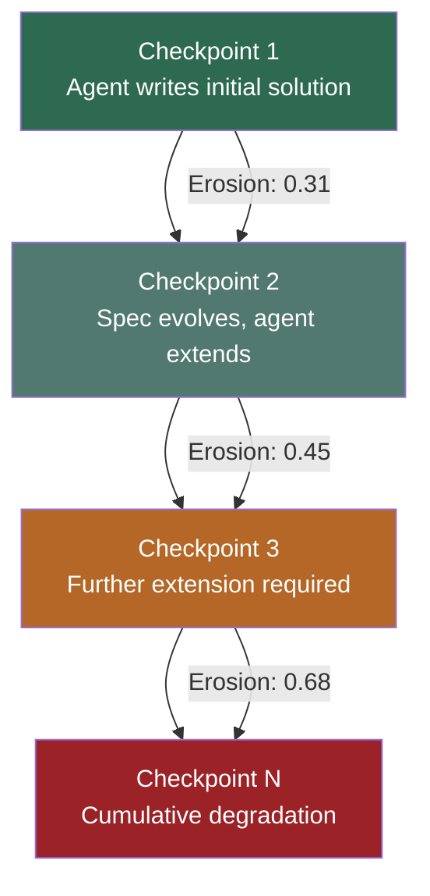
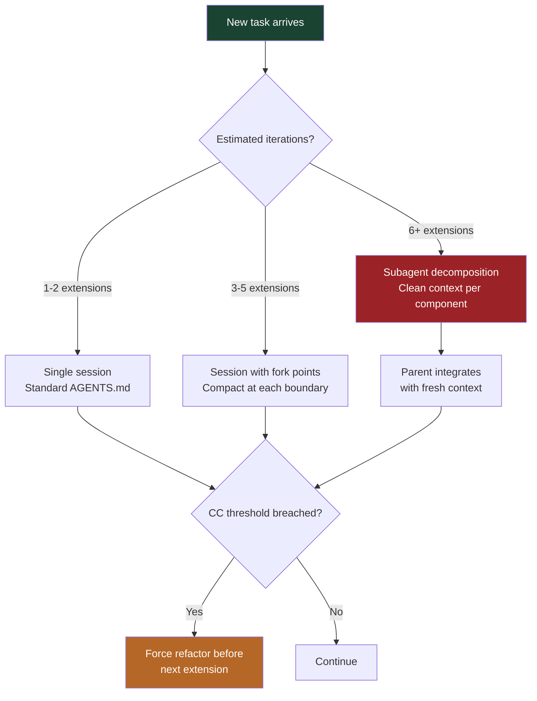

# SlopCodeBench: What the Long-Horizon Code Degradation Benchmark Means for Codex CLI Session Strategy


---

## The Problem SWE-Bench Hides

Most coding agent benchmarks are single-shot: hand the agent an issue, measure whether the patch passes tests, move on. SlopCodeBench (arXiv:2603.24755, Orlanski et al., March 2026, revised May 2026) argues this design systematically hides the quality decay that emerges when agents extend their own code across multiple iterations [^1]. The benchmark comprises 36 problems and 196 checkpoints, each requiring the agent to build on its previous output under evolving specifications — much closer to how real software actually grows [^1].

The results are sobering. No agent fully solves any problem end-to-end. The best performer achieves a 14.8% strict checkpoint solve rate [^1]. Structural erosion — the concentration of complexity into bloated, high-cyclomatic-complexity functions — rises in 77% of trajectories. Verbosity, measured as redundant code flagged by 137 AST-Grep rules plus structural duplication, increases in 75.5% [^1].

If you are running Codex CLI on anything longer than a single-shot task, these numbers apply to you.

## Understanding the Two Decay Metrics

SlopCodeBench tracks two trajectory-level quality signals that together capture what practitioners informally call "slop" [^1]:

**Structural erosion** measures how complexity concentrates in high-complexity functions. Each function's mass is computed as `CC(f) × √SLOC(f)`, where CC is cyclomatic complexity. Erosion is the share of total mass held by functions exceeding CC > 10 [^1]. In one documented trajectory, a `main()` function expanded from CC=29 to CC=285 — a tenfold increase across iterative extensions [^1].

**Verbosity** captures wasteful code: unnecessary defensive checks, duplicated logic, overly broad exception handlers, and dead branches. The benchmark normalises flagged patterns by lines of code to produce a 0–1 score [^1].

Against 48 maintained open-source Python repositories, agent-generated code is 2.3× more verbose (0.33 vs 0.14) and 2.0× more eroded (0.68 vs 0.31) [^1]. Critically, human-maintained code metrics plateau over time whilst agent metrics climb monotonically [^1].



## Why Prompt-Based Defences Fail

The SlopCodeBench authors tested two prompt interventions on GPT models [^1]:

- **anti_slop**: explicitly instructs the agent to avoid god functions, unnecessary defensive checks, and verbose patterns
- **plan_first**: requires the agent to outline its approach before writing code

The anti_slop prompt reduced initial verbosity by up to 34.5%, a meaningful improvement at the first checkpoint [^1]. However, the degradation slope remained statistically identical across all strategies. The intercept drops; the gradient does not [^1]. Worse, the anti_slop prompt increased costs by 47.9% on GPT 5.4 (\$304 to \$450 per full trajectory) without improving pass rates (p > 0.05) [^1].

This finding has a direct implication for Codex CLI users: adding quality instructions to your prompt or AGENTS.md will improve the starting quality of agent output but will not prevent cumulative decay across a long session. You need structural interventions, not just better words.

## Mapping SlopCodeBench to Codex CLI Defence Patterns

The benchmark reveals that degradation is fundamentally a context problem: as the session grows, the agent loses sight of architectural intent and defaults to local patches that inflate complexity. Codex CLI provides several mechanisms to break this cycle.

### 1. Session Segmentation with Fork and Compact

Codex CLI's session lifecycle — create, work, compact, archive, restore — exists precisely to manage context growth [^2]. The key anti-degradation pattern is aggressive session forking:

```bash
# After completing a logical unit of work, fork to a clean context
codex --resume last --fork "Feature: payment validation complete, starting API integration"
```

Rather than letting one session span an entire feature, fork at each architectural boundary. Each fork carries forward a compacted summary of prior work without the accumulated reasoning debris that drives degradation [^2]. The SlopCodeBench data suggests that degradation accelerates after roughly 3–5 iterative extensions [^1] — use that as your forking cadence.

### 2. AGENTS.md Complexity Constraints

AGENTS.md constraints are read before every operation and persist throughout the session [^3]. Whilst the SlopCodeBench data shows that prompt-level quality instructions cannot halt degradation slopes, AGENTS.md constraints combined with hook enforcement create a harder boundary:

```markdown
## Code Quality Constraints

- Maximum cyclomatic complexity per function: 10
- Maximum function length: 50 lines
- No function may accumulate more than 3 responsibilities
- When extending existing code, refactor before extending if CC > 8
- Run `radon cc -s -n C` after every file modification to verify
```

The critical difference from prompt-only approaches is the hook-backed enforcement described below.

### 3. PostToolUse Hooks for Complexity Gates

Codex CLI's hook system fires deterministic scripts at lifecycle points [^4]. A PostToolUse hook that runs after every file write can enforce the complexity constraints declared in AGENTS.md:

```toml
# ~/.codex/config.toml
[hooks.post_tool_use]
command = "bash -c 'radon cc -s -n C $(git diff --name-only --diff-filter=AM HEAD -- \"*.py\") 2>/dev/null | grep -q \"^\" && echo \"COMPLEXITY VIOLATION: functions exceed CC threshold\" && exit 1 || exit 0'"
```

This pattern addresses the core SlopCodeBench finding: prompt interventions lower the intercept but not the slope. A hard gate that blocks further progress when complexity exceeds thresholds forces the agent to refactor rather than accrete [^4].

### 4. Subagent Delegation for Isolation

For genuinely long-horizon work — the exact scenario SlopCodeBench targets — Codex CLI's subagent architecture provides isolation boundaries [^5]. Rather than one agent extending its own code across dozens of checkpoints, decompose the work:

```markdown
## Subagent Architecture (AGENTS.md)

When implementing features that span more than 3 files or require
architectural changes:
1. Plan the decomposition in the parent session
2. Delegate each component to a subagent with explicit interface contracts
3. Integrate in the parent session with fresh context

Each subagent starts with a clean context window and cannot accumulate
the degradation patterns that emerge in long-running sessions.
```

Subagents start with clean context windows, sidestepping the monotonic degradation the benchmark measures [^5]. The parent agent handles integration, where the scope is narrow enough to resist erosion.

### 5. Checkpoint Verification with Structured Output

SlopCodeBench's checkpoint structure maps naturally to Codex CLI's `codex exec` with `--output-schema` [^6]. After each logical milestone, run a verification pass:

```bash
codex exec "Analyse the codebase for structural erosion. \
  Report cyclomatic complexity distribution, function length outliers, \
  and duplicated logic blocks." \
  --output-schema ./quality-report-schema.json \
  -o ./quality-checkpoint-$(date +%s).json
```

This produces structured, diffable quality reports at each checkpoint — the same cadence SlopCodeBench uses to measure decay, now applied as a defensive practice [^6].

## The Session Strategy Decision Framework

The SlopCodeBench data suggests a practical decision framework for Codex CLI session management:



| Session Length | Strategy | Degradation Risk |
|---|---|---|
| 1–2 iterations | Single session, standard constraints | Low |
| 3–5 iterations | Fork at each boundary, compact aggressively | Medium — monitored |
| 6+ iterations | Subagent decomposition with integration parent | High — structurally mitigated |

## What the Numbers Mean in Practice

The mean high-complexity function count in SlopCodeBench trajectories grows from 4.1 at the first checkpoint to 37.0 by the final one [^1]. Maximum cyclomatic complexity rises from 27.1 to 68.2 [^1]. These are not edge cases; they are the central tendency across 11 models and 196 checkpoints.

For Codex CLI users, this means:

1. **Single-shot benchmarks lie about extension quality.** A model that scores well on SWE-bench Verified may still produce decaying code when asked to iterate. Do not assume benchmark scores predict long-session behaviour.

2. **Prompt engineering has diminishing returns.** The 34.5% initial improvement from anti_slop prompts is real but temporary. Structural defences — hooks, forks, subagents — are the only interventions that change the degradation trajectory.

3. **Cost-per-quality is non-linear.** The 47.9% cost increase from quality-aware prompting bought zero pass-rate improvement [^1]. Investing that budget in session architecture (shorter sessions, more forks, subagent isolation) is likely to produce better outcomes.

4. **Monitor erosion, not just test passage.** Tests pass whilst code rots. Add complexity metrics to your PostToolUse hooks and treat CC violations as blocking failures, not warnings.

## Conclusion

SlopCodeBench reveals a fundamental limitation of current coding agents: they optimise locally, and local optimisation across iterative extensions produces global decay. Codex CLI cannot fix the underlying model behaviour, but its session management primitives — fork, compact, subagent delegation, and hook-based enforcement — provide the structural scaffolding to contain it. The key insight is that degradation is a context management problem, and Codex CLI already has the tools to manage context. You just need to use them before the erosion sets in, not after.

---

## Citations

[^1]: Orlanski, G., Roy, D., Yun, A., Shin, C., Gu, A., Ge, A., Adila, D., Roberts, N., Sala, F., & Albarghouthi, A. (2026). "SlopCodeBench: Benchmarking How Coding Agents Degrade Over Long-Horizon Iterative Tasks." arXiv:2603.24755v1. [https://arxiv.org/abs/2603.24755](https://arxiv.org/abs/2603.24755)

[^2]: Codex CLI Session Lifecycle documentation. [https://developers.openai.com/codex/cli](https://developers.openai.com/codex/cli)

[^3]: AGENTS.md specification and lookup order. [https://developers.openai.com/codex/cli](https://developers.openai.com/codex/cli)

[^4]: Codex CLI Hooks documentation — PreToolUse and PostToolUse lifecycle hooks. [https://developers.openai.com/codex/cli/reference](https://developers.openai.com/codex/cli/reference)

[^5]: Codex CLI Subagents documentation. [https://developers.openai.com/codex/subagents](https://developers.openai.com/codex/subagents)

[^6]: Codex CLI Non-interactive mode — `codex exec` and `--output-schema`. [https://developers.openai.com/codex/noninteractive](https://developers.openai.com/codex/noninteractive)
