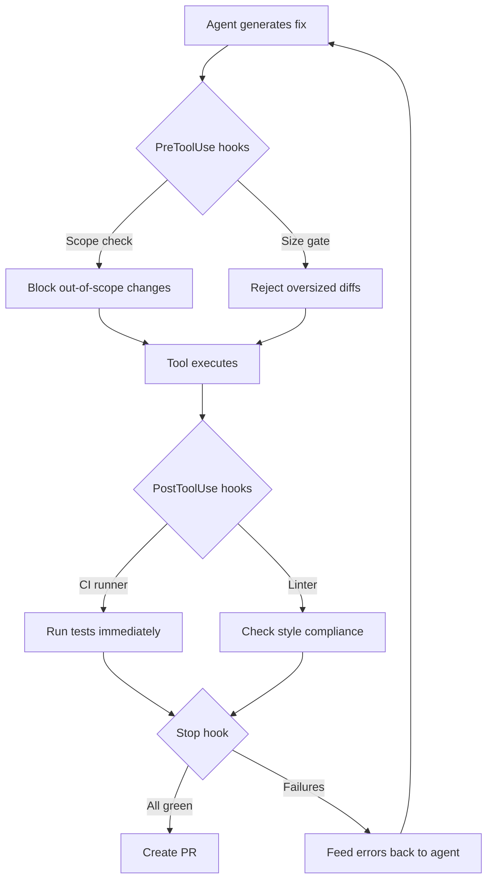
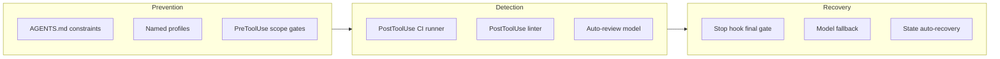

# Why Nearly Half of Agentic Pull Requests Get Rejected — and How Codex CLI Can Cut the Waste


---

Coding agents can now open pull requests autonomously — but nearly half of those PRs never merge. Three independent studies published between January and June 2026 converge on a sobering finding: agentic PRs fail at rates that would be career-limiting for a human developer, and the failure modes are preventable with the right harness configuration. This article synthesises the research, maps every major rejection category to a Codex CLI defence, and provides concrete hook and configuration patterns you can deploy today.

## The Evidence: Three Studies, One Conclusion

### Study 1 — Understanding the Rejection of Fixes (MSR 2026)

Abujadallah, Arabat, and Sayagh analysed the AIDev dataset and found that **46.41%** of fixes proposed by Copilot, Devin, Cursor, and Claude were rejected [^1]. Their qualitative coding of 306 non-merged PRs identified **14 rejection reasons** grouped into four high-level categories:

| Category | Cases | Share |
|---|---|---|
| Relevance of the Fix | 74 | 24.2% |
| Implementation Issues | 31 | 10.1% |
| Provider-Related Issues | 26 | 8.5% |
| Technical Issues (CI failures, breaking changes) | 22 | 7.2% |
| Others (no documented reason) | 151 | 49.3% |

The single largest specific reason was **inactivity** (17.3%) — PRs left open until a bot auto-closed them. The second was **agent failure** (7.5%) — the agent crashed, hit rate limits, or produced no usable output [^1].

### Study 2 — Why Agentic-PRs Get Rejected (February 2026)

Nakashima et al. inspected 654 rejected PRs from five coding agents and found **seven rejection modes unique to agent-authored PRs**, including outright *distrust of AI-generated code* [^2]. Critically, **67.9%** of rejected PRs lacked any explicit reviewer feedback — the PR was simply closed without comment [^2].

### Study 3 — Where Do AI Coding Agents Fail? (MSR 2026 Mining Challenge)

Ehsani et al. studied 33,000 agent-authored PRs and found that rejected PRs consistently involved **larger code changes, touched more files, and failed CI more frequently** than merged ones [^3]. Documentation and CI-configuration PRs merged at the highest rates; bug-fix and performance PRs at the lowest [^3].

## Mapping Rejection Categories to Codex CLI Defences

The research gives us a taxonomy of failure. Codex CLI's hook system, AGENTS.md, and named profiles give us the toolbox to address every category.



### 1. Technical Issues: CI Failures and Breaking Changes (7.2%)

CI failure was the most mechanically preventable rejection reason. The fix: run your test suite *before* the agent considers the task complete.

**PostToolUse hook — auto-test after file writes:**

```toml
[[hooks.PostToolUse]]
matcher = "apply_patch|Edit|Write"

[[hooks.PostToolUse.hooks]]
type = "command"
command = "/bin/sh -c 'npm test --silent 2>&1 || exit 2'"
timeout = 120
statusMessage = "Running test suite"
```

When a PostToolUse hook exits with code 2, Codex CLI replaces the tool result the agent sees with the hook's stderr output [^4]. The agent receives the test failure trace directly and can self-correct before proceeding — no human reviewer needs to discover the breakage.

**Stop hook — enforce green CI before turn completion:**

```toml
[[hooks.Stop]]
matcher = "*"

[[hooks.Stop.hooks]]
type = "command"
command = "/bin/sh -c 'npm test --silent && npm run lint --silent || exit 1'"
timeout = 180
statusMessage = "Final CI gate"
```

The Stop hook fires at turn completion [^4]. Exit code 1 prevents the agent from declaring the task done, forcing another iteration.

### 2. Implementation Issues: Incorrect Fixes and Wrong Approaches (10.1%)

The AIDev study found 5.6% of rejections were functionally flawed fixes and 2.6% used the wrong approach entirely [^1]. The defence is a two-layer review: agent self-review plus an independent review model.

**Auto-review with a separate model:**

```toml
[review]
review_model = "o3"
auto_review = true
```

Codex CLI's `review_model` configuration dispatches a separate model to review the agent's changes before they leave the session [^5]. Setting `auto_review = true` triggers this automatically at the end of every task, catching incorrect implementations before a human reviewer sees them.

**AGENTS.md — encoding approach constraints:**

```markdown
# PR Guidelines

## Approach Constraints
- Bug fixes MUST include a regression test that fails before the fix and passes after
- Do NOT refactor unrelated code in the same PR
- Maximum 300 lines changed per PR — split larger changes into stacked PRs
- Always run `make check` before considering any task complete
```

AGENTS.md instructions reduce completion time by 28.64% when present and correctly scoped [^6]. More importantly for PR acceptance, they constrain the agent's solution space to approaches the team actually wants.

### 3. Relevance Issues: Inactivity, Superseded Fixes, Low Priority (24.2%)

Inactivity alone accounted for 17.3% of rejections — the agent opened a PR and nobody engaged with it [^1]. This is a workflow problem, not a code problem. The defence is scoping and prioritisation.

**Named profiles for priority-aware task routing:**

```toml
[profile.quick-fix]
model = "o4-mini"
approval_mode = "auto-edit"

[profile.complex-fix]
model = "o3"
approval_mode = "suggest"
```

Route low-risk, high-merge-probability tasks (documentation, dependency bumps, lint fixes) through an aggressive profile. Reserve the interactive `suggest` mode for complex bug fixes where the research shows agents struggle most [^3].

**PreToolUse hook — scope enforcement:**

```toml
[[hooks.PreToolUse]]
matcher = "^Bash$"

[[hooks.PreToolUse.hooks]]
type = "command"
command = "/usr/bin/python3 .codex/hooks/scope-check.py"
timeout = 10
statusMessage = "Checking scope"
```

A scope-check script can parse the proposed command, verify it only touches files related to the assigned issue, and exit with code 2 to block out-of-scope changes before they happen [^4].

### 4. Provider-Related Issues: Agent Failures and Rate Limits (8.5%)

Agent crashes and rate-limit errors accounted for 8.5% of rejections [^1]. Codex CLI v0.140.0 introduced automatic SQLite state recovery — corrupted databases are backed up and rebuilt from rollout data [^7]. For rate limits, the defence is retry configuration and model fallback.

**Resilient model fallback in config.toml:**

```toml
model = "o3"
model_fallback = "o4-mini"
```

When the primary model hits rate limits, the fallback model keeps the session alive rather than producing the empty or broken output that leads to provider-related rejections.

### 5. The Silent Majority: Undocumented Rejections (49.3%)

The most troubling finding is that 49.3% of rejected PRs had no documented rejection reason [^1], and 67.9% lacked any reviewer feedback at all [^2]. The agent never learns why its work was rejected.

**Structured output for PR descriptions:**

```markdown
<!-- In AGENTS.md -->
## PR Description Requirements
Every PR description MUST include:
1. Issue reference (closes #NNN)
2. What changed and why (max 3 bullet points)
3. How to verify (test command or manual steps)
4. Risk assessment (none / low / medium / high)
```

PRs with clear context are more likely to receive engagement rather than silent closure. The MSR mining challenge data confirms that reviewer interaction correlates with merge probability [^3].

## The Complete Defence Stack

Assembling these patterns into a single configuration creates a layered defence against every documented rejection category:



## What the Research Does Not Cover

These studies examined agents operating with default or minimal configuration. None tested agents with:

- PostToolUse CI gates that feed failures back into the agent loop
- Independent review models validating output before PR creation
- AGENTS.md constraints scoping acceptable approaches

The 46.41% rejection rate is a *baseline* for unconfigured agents. The gap between that baseline and a well-harnessed Codex CLI session is where the engineering value lies.

## Practical Recommendations

1. **Start with the Stop hook.** A single CI-gate Stop hook addresses the 7.2% technical rejection category with zero ongoing maintenance.
2. **Add PostToolUse test feedback.** Exit code 2 injects test failures into the agent's context, enabling self-correction before the PR exists.
3. **Scope aggressively via AGENTS.md.** The 24.2% relevance category is largely a scoping failure — constrain what the agent is allowed to touch.
4. **Enable auto-review for bug fixes.** The 10.1% implementation category hits bug fixes hardest [^3]. A second model reviewing the fix catches the 5.6% incorrect-fix rate.
5. **Write PR templates into AGENTS.md.** Combat the 49.3% undocumented rejection rate by ensuring every PR ships with verifiable context.

The research is clear: agents that open PRs without CI validation, scope constraints, or self-review are wasting roughly half of everyone's time. The tooling to fix this already exists in Codex CLI's hook system — it just needs configuring.

## Citations

[^1]: Abujadallah, M., Arabat, A., and Sayagh, M. "Understanding the Rejection of Fixes Generated by Agentic Pull Requests — Insights from the AIDev Dataset." MSR 2026. arXiv:2606.13468v1, 11 June 2026. [https://arxiv.org/abs/2606.13468v1](https://arxiv.org/abs/2606.13468v1)

[^2]: Nakashima, S., Ishimoto, Y., Kondo, M., McIntosh, S., and Kamei, Y. "Why Agentic-PRs Get Rejected: A Comparative Study of Coding Agents." arXiv:2602.04226, February 2026. [https://arxiv.org/abs/2602.04226](https://arxiv.org/abs/2602.04226)

[^3]: Ehsani, R., Pathak, S., Rawal, S., Al Mujahid, A., Imran, M.M., and Chatterjee, P. "Where Do AI Coding Agents Fail? An Empirical Study of Failed Agentic Pull Requests in GitHub." MSR 2026 Mining Challenge. arXiv:2601.15195, January 2026. [https://arxiv.org/abs/2601.15195](https://arxiv.org/abs/2601.15195)

[^4]: OpenAI. "Hooks — Codex." OpenAI Developers Documentation, 2026. [https://developers.openai.com/codex/hooks](https://developers.openai.com/codex/hooks)

[^5]: OpenAI. "Features — Codex CLI." OpenAI Developers Documentation, 2026. [https://developers.openai.com/codex/cli/features](https://developers.openai.com/codex/cli/features)

[^6]: Lulla, V. et al. "The Impact of AGENTS.md on Coding Agent Performance." arXiv:2601.20404, January 2026. [https://arxiv.org/abs/2601.20404](https://arxiv.org/abs/2601.20404)

[^7]: OpenAI. "Changelog — Codex." OpenAI Developers Documentation, June 2026. [https://developers.openai.com/codex/changelog](https://developers.openai.com/codex/changelog)
