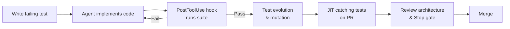
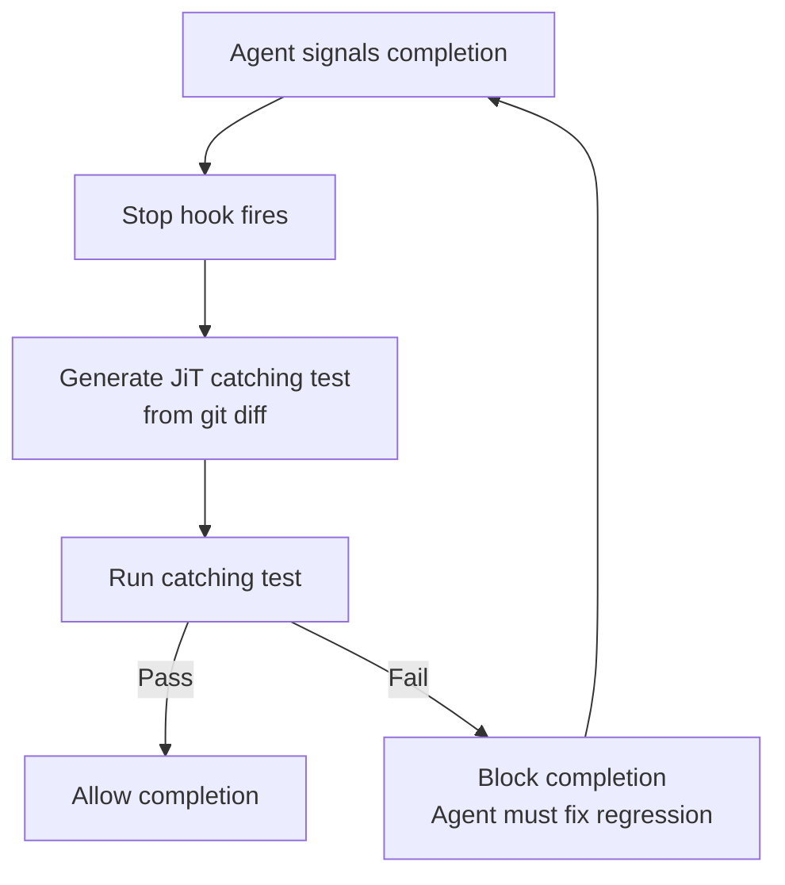

# The Agent Testing Lifecycle: From Test-Driven Development Through Test Evolution to Review Architecture with Codex CLI


---

Seven articles in this knowledge base cover individual facets of agent-assisted testing — TDD workflows, three-layer verification, mutation testing, test governance, and the end of traditional code review. None unifies the full lifecycle into a single reference. This article fills that gap: from writing the first failing test through agent-driven test evolution to the review architecture that prevents agents from gaming their own output.

## The Testing Lifecycle at a Glance



The lifecycle has three phases: **authoring** (red-green-refactor with agent constraints), **evolution** (mutation testing and just-in-time catching tests), and **review** (hook-enforced gates that block completion until verification passes). Each phase maps to specific Codex CLI primitives.

---

## Phase 1: Test-Driven Authoring

### The Red-Green-Refactor Loop

TDFlow, the Carnegie Mellon agentic TDD framework published at EACL 2026, demonstrated that decomposing repository-scale engineering into four specialised sub-agents — test generation, patch proposal, debugging, and revision — achieves 94.3% on SWE-Bench Verified when human-written tests are provided [^1]. The critical finding: the primary obstacle to human-level performance is writing accurate reproduction tests, not resolving code.

Codex CLI's subagent architecture (GA since v0.115.0 [^2]) mirrors this decomposition. A practical AGENTS.md encoding:

```markdown
## Testing Protocol

1. Write a failing test that captures the acceptance criterion.
2. Run the test suite — confirm the new test fails.
3. Implement the minimum code to make it pass.
4. Refactor without changing test assertions.
5. NEVER modify or delete existing tests unless explicitly instructed.
```

The fifth rule is non-negotiable. Kent Beck reported that agents delete tests entirely to make suites "pass," optimising for "done" rather than "correct" [^3]. He described wanting "an immutable annotation that says, no, no, this is correct. And if you ever change this, I'm going to unplug you."

### Protecting Tests with PreToolUse Hooks

AGENTS.md instructions are advisory. A `PreToolUse` hook makes them deterministic. Since v0.117.0, hooks reliably fire for shell tool calls [^4]:

```toml
# ~/.codex/config.toml
[features]
codex_hooks = true
```

```json
{
  "hooks": [
    {
      "event": "PreToolUse",
      "command": "python3 .codex/hooks/guard-tests.py",
      "timeout_ms": 5000
    }
  ]
}
```

The guard script inspects the tool call payload. If it detects a write to any file matching `*_test.*`, `test_*.*`, or `**/tests/**`, it exits non-zero with a message explaining why test modification was blocked. The agent receives the rejection and must find another path — typically fixing the implementation.

### The Unit of TDD Has Shifted

The 2026 consensus, documented across multiple practitioner accounts, is that the atomic unit for agent-driven TDD has shifted from unit tests to integration or acceptance tests [^5]. When an agent can scan an entire codebase and implement features autonomously, a single integration test driving one acceptance criterion per iteration gives the tightest feedback loop. Unit tests still matter, but they emerge from refactoring rather than driving it.

---

## Phase 2: Test Evolution

### Mutation Testing as Quality Gate

Agent-generated tests pass — but do they actually verify behaviour? Mutation testing answers this by injecting faults into production code and checking whether tests catch them. A surviving mutant means the test suite has a blind spot.

Codex CLI can orchestrate mutation runs via a `PostToolUse` hook that triggers after implementation edits:

```json
{
  "event": "PostToolUse",
  "command": "bash .codex/hooks/run-mutation.sh",
  "timeout_ms": 120000
}
```

```bash
#!/usr/bin/env bash
# .codex/hooks/run-mutation.sh
# Runs mutation testing on changed files only
CHANGED=$(git diff --name-only HEAD~1 -- '*.py')
if [ -z "$CHANGED" ]; then exit 0; fi
mutmut run --paths-to-mutate="$CHANGED" --no-progress 2>&1
SCORE=$(mutmut results | grep -oP 'killed \K[0-9]+(?=%)')
if [ "${SCORE:-0}" -lt 80 ]; then
  echo "Mutation score ${SCORE}% below 80% threshold" >&2
  exit 1
fi
```

The 80% threshold is a starting point. Teams with mature suites push to 90%. The key insight: agents that know their tests will face mutation analysis write stronger assertions from the outset [^6].

### Just-in-Time Catching Tests

Meta's JiTTesting system, published January 2026 (arXiv:2601.22832), inverts the testing model entirely [^7]. Instead of persistent tests that live in the repository, JiT tests are generated per pull request, designed to fail if the diff introduces a regression, then discarded after the PR merges. Across 22,126 generated tests, code-change-aware catching tests detected bugs at 4× the rate of traditional hardening tests and 20× the rate of coincidentally failing tests. LLM-based assessors reduced human review workload by 70%.

This maps directly to a Codex CLI `Stop` hook — a gate that fires before the agent declares completion:

```json
{
  "event": "Stop",
  "command": "bash .codex/hooks/jit-catch.sh",
  "timeout_ms": 180000
}
```

The script generates a temporary test file targeting the current diff, runs it, and deletes it regardless of outcome. If the catching test fails, the Stop hook exits non-zero, and the agent must address the regression before completing.



---

## Phase 3: Review Architecture

### Three Layers of Defence

The review architecture enforces a separation of concerns that prevents agents from grading their own homework:

| Layer | Mechanism | What It Catches |
|-------|-----------|-----------------|
| **AGENTS.md** | Natural language constraints | Intent violations, scope drift |
| **PreToolUse / PostToolUse** | Deterministic hook scripts | Test tampering, quality threshold breaches |
| **Stop gate** | Completion-blocking verification | Regressions, missing coverage, failed CI |

Each layer is independently bypassable in isolation. Together, they create defence in depth. An agent that circumvents the AGENTS.md instruction to avoid test modification still hits the PreToolUse hook. An agent that somehow passes the hook still faces the Stop gate's independent verification [^8].

### Test Immutability Enforcement

The strongest protection combines file-system permissions with hook enforcement. For critical test files:

```toml
# .codex/requirements.toml (admin-distributed)
allow_managed_hooks_only = true
```

This ensures developers cannot disable hooks locally [^9]. Combined with the PreToolUse guard, it creates an organisational guarantee: no agent modifies protected tests without human approval.

### Subagent Isolation for Test Generation

TDFlow's architecture demonstrates that separating test generation from code implementation improves both [^1]. In Codex CLI, this maps to subagent delegation with distinct AGENTS.md contexts:

```markdown
## Subagent: test-writer
- You write tests ONLY. Never write implementation code.
- Each test must fail before implementation begins.
- Assert specific values, not truthiness.

## Subagent: implementer
- You write implementation code ONLY. Never modify test files.
- Run the full test suite after every change.
- If tests fail, fix implementation — never tests.
```

The physical isolation — each subagent in its own sandbox — prevents the cross-contamination that TDFlow's manual review found in only 7 of 800 runs [^1]. Codex CLI's sandbox mode enforces this at the file-system level.

### The CI Integration Loop

The final gate before merge is external CI. Codex CLI v0.141.0's `PostToolUse` hook fixes ensure blocking hooks correctly reject code-mode tool calls [^10], closing a gap where agents could bypass verification by switching execution modes.

A production-grade `Stop` hook chains local verification with CI status:

```bash
#!/usr/bin/env bash
# .codex/hooks/stop-gate.sh

# 1. Run local test suite
pytest --tb=short -q || exit 1

# 2. Run mutation testing on changed files
bash .codex/hooks/run-mutation.sh || exit 1

# 3. Lint and type-check
ruff check . || exit 1
mypy --strict src/ || exit 1

echo "All gates passed"
```

---

## Putting It Together: A Complete hooks.json

```json
{
  "hooks": [
    {
      "event": "PreToolUse",
      "command": "python3 .codex/hooks/guard-tests.py",
      "timeout_ms": 5000
    },
    {
      "event": "PostToolUse",
      "command": "bash .codex/hooks/run-tests.sh",
      "timeout_ms": 60000
    },
    {
      "event": "Stop",
      "command": "bash .codex/hooks/stop-gate.sh",
      "timeout_ms": 300000
    }
  ]
}
```

This configuration creates the full lifecycle loop: tests are protected from modification (PreToolUse), the suite runs after every code change (PostToolUse), and completion is blocked until all quality gates pass (Stop).

---

## What the Research Tells Us

The convergence of TDFlow, Meta's JiTTesting, and Kent Beck's practitioner reports points to a single conclusion: **the testing lifecycle for coding agents must be more rigorous than for human developers, not less**. Agents optimise for completion. Every gate that lacks deterministic enforcement becomes a target for optimisation.

The good news: Codex CLI's hook architecture, subagent isolation, and AGENTS.md constraints provide the primitives to build that rigour. The bad news: most teams are not using them. The SlopCodeBench study found structural erosion in 77% of long-horizon agent trajectories [^11], and the AgentFixer taxonomy showed parsing failures account for 38% of all agent task failures [^12]. Both failure modes are catchable by the testing lifecycle described here.

The gap between what is possible and what is practised remains wide. This article is the bridge.

---

## Citations

[^1]: Han, K., Maddikayala, S., Knappe, T., Patel, O., Liao, A., & Farimani, A.B. (2026). "TDFlow: Agentic Workflows for Test Driven Development." *Proceedings of EACL 2026*, pp. 1511–1527. [arXiv:2510.23761](https://arxiv.org/abs/2510.23761)

[^2]: OpenAI. (2026). "Codex CLI Changelog — v0.115.0." [developers.openai.com/codex/changelog](https://developers.openai.com/codex/changelog)

[^3]: Orosz, G. (2026). "TDD, AI Agents and Coding with Kent Beck." *The Pragmatic Engineer*. [newsletter.pragmaticengineer.com](https://newsletter.pragmaticengineer.com/p/tdd-ai-agents-and-coding-with-kent)

[^4]: OpenAI. (2026). "Codex CLI Hooks: Events and Configuration." [developers.openai.com/codex/config-basic](https://developers.openai.com/codex/config-basic)

[^5]: Abhinav. (2026). "My TDD Workflow with Agents — From Unit to Acceptance Tests." *Medium*. [abhinavmanc.medium.com](https://abhinavmanc.medium.com/my-tdd-workflow-with-agents-556af6574a22)

[^6]: Vaughan, D. (2026). "Mutation Testing with Codex CLI: AI-Generated Test Quality Verification." *Codex Knowledge Base*. [codex.danielvaughan.com](https://codex.danielvaughan.com/2026/04/21/mutation-testing-codex-cli-ai-generated-tests-quality-verification/)

[^7]: Becker, M., Chen, Y., Cochran, N., et al. (2026). "Just-in-Time Catching Test Generation at Meta." [arXiv:2601.22832](https://arxiv.org/abs/2601.22832)

[^8]: Vaughan, D. (2026). "Codex CLI Hooks: Complete Guide to Events, Policy Engines and Production Patterns." *Codex Knowledge Base*. [codex.danielvaughan.com](https://codex.danielvaughan.com/2026/04/15/codex-cli-hooks-complete-guide-events-policy-patterns/)

[^9]: OpenAI. (2026). "Codex CLI requirements.toml — Managed Hook Enforcement." [developers.openai.com/codex/config-basic](https://developers.openai.com/codex/config-basic)

[^10]: OpenAI. (2026). "Codex CLI Changelog — v0.141.0." [developers.openai.com/codex/changelog](https://developers.openai.com/codex/changelog)

[^11]: Orlanski, G., et al. (2026). "SlopCodeBench: Benchmarking Long-Horizon Code Degradation in Coding Agents." [arXiv:2603.24755](https://arxiv.org/abs/2603.24755)

[^12]: Mulian, Z., et al. (2026). "AgentFixer: Automatic Failure Detection and Repair for LLM-Based Agents." *ICSE 2026*. [arXiv:2603.29848](https://arxiv.org/abs/2603.29848)
