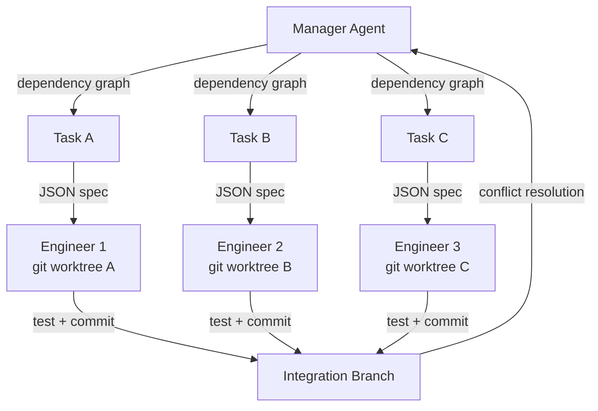
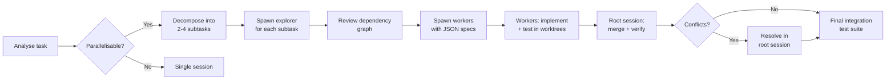

# CAID: What Optimal Parallelism Research Means for Codex CLI Subagent Delegation


---

Codex CLI ships with native subagent support: up to six concurrent threads, git worktree isolation, and structured JSON delegation [^1]. But how many subagents should you actually spawn? New research from Carnegie Mellon provides the first empirical answer — and it is lower than most teams assume.

The paper *Effective Strategies for Asynchronous Software Engineering Agents* (Geng & Neubig, arXiv:2603.21489, March 2026) introduces **CAID** — Centralized Asynchronous Isolated Delegation — a multi-agent framework that coordinates parallel coding work through git primitives rather than free-form chat [^2]. Its findings map directly onto Codex CLI's subagent architecture, and the practical takeaway is clear: four is likely your ceiling.

## The CAID Architecture

CAID decomposes long-horizon software engineering tasks using four primitives that any developer will recognise [^2]:

1. **Centralised manager** — constructs a dependency graph, decomposes the task, delegates structured JSON work items, and integrates results
2. **Isolated worktrees** — each engineer agent operates in a separate `git worktree`, preventing concurrent file interference
3. **Asynchronous execution** — multiple engineers work in parallel up to a configurable limit
4. **Self-verification** — engineers run relevant tests before committing; changes merge into main only after executable verification passes



The key design choice is that all coordination flows through **structured JSON and git commits**, not free-form dialogue [^3]. This eliminates an entire class of coordination failures — agents misinterpreting natural-language task boundaries, duplicating work, or silently overwriting each other's changes.

## The Parallelism Cliff

CAID's most consequential finding is the **parallelism cliff**: increasing engineer count beyond an optimal threshold actively degrades performance [^2].

| Benchmark | Single Agent | 2 Engineers | 4 Engineers | 8 Engineers |
|-----------|-------------|-------------|-------------|-------------|
| Commit0-Lite (Claude Sonnet 4.5) | 53.1% | — | **59.1%** | ↓ decline |
| PaperBench (Claude Sonnet 4.5) | 57.2% | **63.3%** | — | ↓ decline |

On Commit0-Lite (building Python libraries from specifications), performance peaked at four engineers — a +6.0 percentage point gain over single-agent baselines [^2]. On PaperBench (reproducing research papers), the optimum was just two engineers, yielding +6.1pp [^2]. In both cases, adding more agents past the peak **reduced** accuracy.

The paper identifies two bottlenecks:

1. **Integration overhead** — every additional worktree produces a merge that may conflict with concurrent changes, and conflict resolution itself consumes manager tokens
2. **Delegation capacity** — the manager agent's ability to decompose tasks into genuinely independent subtasks saturates; overly fine-grained delegation forces artificial boundaries that harm coherence [^2]

### Weaker Models Benefit Most

A striking inverse-scaling pattern emerged. MiniMax 2.5 gained +26.3pp on PaperBench and +14.7pp on Commit0-Lite from CAID coordination — far exceeding Claude Sonnet 4.5's gains [^2]. The interpretation is that structured coordination compensates for weaker individual reasoning. This has direct implications for cost-optimised Codex CLI workflows that use cheaper models for routine subtasks.

## Isolation Is Not Optional

An ablation study compared physical git worktree isolation against "soft isolation" — instruction-level constraints telling agents to stay in designated directories [^2].

| Benchmark | Soft Isolation | Worktree Isolation |
|-----------|---------------|-------------------|
| Commit0-Lite | 56.1% | **59.1%** |
| PaperBench | 55.5% (below single-agent) | **63.3%** |

On PaperBench, soft isolation actually performed **worse** than the single-agent baseline (55.5% vs 57.2%) [^2]. Physical workspace separation is necessary for open-ended tasks where agents cannot predict which files their peers will touch.

## Mapping CAID to Codex CLI Subagents

Codex CLI's subagent system already implements CAID's core primitives. The mapping is almost one-to-one:

| CAID Concept | Codex CLI Equivalent |
|-------------|---------------------|
| Centralised manager | Root session (the parent thread) |
| Engineer agents | Subagents spawned via `spawn_agent` [^1] |
| Git worktree isolation | Automatic worktree creation per subagent [^4] |
| Structured JSON delegation | JSON task specs via `spawn_agent` and `send_input` [^1] |
| Concurrency limit | `max_threads` in `config.toml` `[agents]` section [^1] |
| Self-verification | Per-agent test execution before commit [^1] |
| Dependency ordering | Manual via AGENTS.md or prompt-level dependency graphs |

### Tuning `max_threads` to Match the Research

Codex CLI defaults to `max_threads = 6` [^1]. CAID's results suggest this is too high for most tasks. A more evidence-based configuration:

```toml
# ~/.codex/config.toml

[agents]
max_threads = 4          # CAID optimal for library-building tasks
max_depth = 1            # single delegation layer avoids recursive overhead
job_max_runtime_seconds = 900  # tighter timeout forces focused subtasks
```

For tasks resembling PaperBench (research reproduction, documentation generation, multi-file analysis), consider dropping to `max_threads = 2`.

### Using Named Agent Roles for Delegation Quality

CAID's delegation failures often stemmed from the manager producing vague task boundaries. Codex CLI's custom agent definitions can encode explicit constraints [^1]:

```toml
# .codex/agents/focused-worker.toml

name = "focused-worker"
description = "Implementation agent for a single, well-defined subtask"
developer_instructions = """
You receive a JSON task specification with:
- target_files: list of files you may modify
- acceptance_criteria: tests that must pass
- prohibited_files: files you must not touch

Before committing:
1. Run the specified test suite
2. Confirm all acceptance criteria pass
3. Report results via report_agent_job_result
"""
sandbox_mode = "standard"
model = "o4-mini"
```

Using `o4-mini` for worker agents aligns with CAID's inverse-scaling finding: structured delegation compensates for weaker models, and the cost savings compound across parallel workers [^5].

### Enforcing Isolation with Sandbox Modes

CAID's ablation study showed that instruction-level isolation fails. Codex CLI enforces physical isolation at two levels [^1]:

1. **Git worktree isolation** — each subagent operates in a separate worktree automatically
2. **Sandbox mode overrides** — the `explorer` role uses `sandbox_mode = "read-only"`, preventing accidental writes during investigation phases

```toml
# .codex/agents/explorer.toml

name = "explorer"
description = "Read-only codebase analysis agent"
sandbox_mode = "read-only"
model_reasoning_effort = "low"
```

This mirrors CAID's division between investigation (read-only) and implementation (read-write) phases, with the sandbox enforcing the boundary mechanically rather than through prompts alone.

## The Sequential Fallback Anti-Pattern

CAID tested a common workflow: attempt the task with a single agent first, then escalate to multi-agent only on failure. The results were sobering [^2]:

- The sequential fallback reached 66.8% on PaperBench — marginally higher than CAID's 63.3%
- But it consumed **three times** the cost, running the full single-agent budget before spawning the multi-agent system

The paper's conclusion is direct: **multi-agent coordination should be the default, not a fallback** [^3]. For Codex CLI, this means that for tasks you know are parallelisable — feature implementation across multiple files, test suite expansion, documentation generation — spawn subagents from the start rather than waiting for the root session to struggle.

## Practical Delegation Workflow

Combining CAID's findings with Codex CLI's tooling, an effective parallel workflow looks like this:



The critical step is the decomposition: each subtask must target a **distinct set of files** with **explicit acceptance criteria**. CAID's failures overwhelmingly occurred when task boundaries were ambiguous, causing merge conflicts that consumed more tokens than the parallel execution saved [^2].

## When Not to Parallelise

CAID's results also identify conditions where single-agent execution remains superior:

- **Tightly coupled changes** — modifications where every file depends on decisions made in other files
- **Sequential logic chains** — tasks with strict ordering dependencies that cannot be parallelised without artificial decomposition
- **Small tasks** — the coordination overhead exceeds the parallelisation benefit for tasks under ~30 minutes of single-agent work

Codex CLI's `max_depth = 0` setting disables subagent spawning entirely, which is appropriate for these cases [^1].

## Key Takeaways

1. **Four subagents is the practical ceiling** for implementation tasks; two for analytical tasks. CAID shows performance degrades beyond these thresholds [^2].
2. **Physical isolation is mandatory**. Instruction-level constraints ("stay in your directory") fail on open-ended tasks. Codex CLI's automatic worktree isolation already handles this [^2] [^4].
3. **Weaker models benefit disproportionately** from structured delegation — use `o4-mini` workers with structured JSON specs to cut costs without sacrificing coordination gains [^2] [^5].
4. **Start parallel, don't escalate to it**. The sequential-then-parallel fallback wastes budget. If the task is parallelisable, spawn subagents immediately [^2].
5. **Encode task boundaries mechanically**, not in prose. Use `target_files`, `prohibited_files`, and `acceptance_criteria` in agent definitions to prevent the ambiguous delegation that causes merge conflicts [^1].

CAID provides the first rigorous evidence for what many Codex CLI users have discovered through trial and error: more agents is not better. The discipline is in the decomposition.

---

## Citations

[^1]: OpenAI, "Subagents — Codex," OpenAI Developers Documentation, 2026. [https://developers.openai.com/codex/subagents](https://developers.openai.com/codex/subagents)

[^2]: J. Geng and G. Neubig, "Effective Strategies for Asynchronous Software Engineering Agents," arXiv:2603.21489, March 2026. [https://arxiv.org/abs/2603.21489](https://arxiv.org/abs/2603.21489)

[^3]: OpenHands Blog, "Effective Strategies for Asynchronous Software Engineering Agents," April 2026. [https://www.openhands.dev/blog/asynchronous-software-engineering-agents](https://www.openhands.dev/blog/asynchronous-software-engineering-agents)

[^4]: Codex Knowledge Base, "Worktree-Based Parallel Development with Codex CLI," March 2026. [https://codex.danielvaughan.com/2026/03/26/codex-cli-worktree-parallel-development/](https://codex.danielvaughan.com/2026/03/26/codex-cli-worktree-parallel-development/)

[^5]: OpenAI, "Codex CLI Changelog — v0.139.0: GPT-5.5 default, code-mode web search," June 2026. [https://developers.openai.com/codex/changelog](https://developers.openai.com/codex/changelog)
