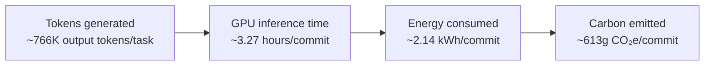
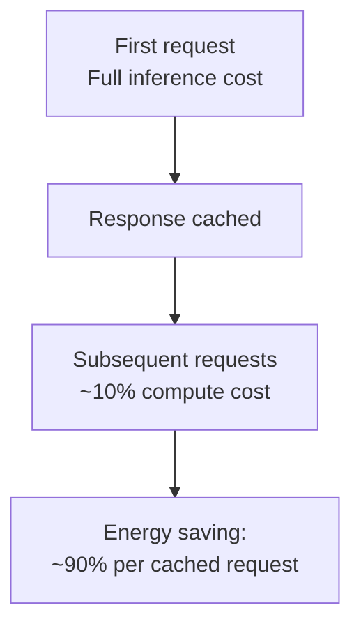

# The Carbon Footprint of Coding Agents: What 250,000 Tonnes of CO₂ Means for Codex CLI Token Strategy


---

AI coding agents are no longer a novelty — they are infrastructure. With adoption doubling in new GitHub projects over six months [^1], the aggregate environmental cost has become measurable and, frankly, uncomfortable. A March 2026 analysis estimates that AI coding agents now emit approximately **250,000 tonnes of CO₂ per year** [^2], a figure that grew 5.4× in the six months from September 2025 [^2]. That places coding agents in the same carbon bracket as a small airline.

This article breaks down where those emissions come from, examines the emerging measurement standards, and maps the concrete Codex CLI configuration levers that reduce token waste — and therefore energy consumption — without sacrificing output quality.

## Where the Carbon Comes From

The emissions chain for a single AI-assisted code commit follows four stages:



Each commit through an agentic coding workflow produces roughly **613 grams of CO₂e** [^2]. The calculation chains output token count → GPU hours → kilowatt-hours (including data centre Power Usage Effectiveness) → carbon intensity of the regional electricity grid [^3].

The numbers diverge dramatically depending on model choice. Research from early 2026 found that GPT-4-class models emit between **5× and 19× more CO₂e than a human programmer** completing the same task [^4]. Smaller models can approach human-equivalent emissions when they succeed, but their higher failure rate often forces retry loops that erode the saving [^4].

### Agentic workloads are not typical queries

A median Claude Code session consumes approximately **41 Wh** — 138× more than a typical single LLM query of ~0.3 Wh [^5]. The gap exists because coding agents operate with system prompts and tool descriptions consuming ~20,000 tokens before the first user message, make 5–10 tool calls per user message, and chain dozens of requests per session [^5]. The Green Software Foundation notes that agentic tasks can consume **up to 1,000× more tokens** than equivalent code-reasoning interactions [^6].

Token consumption also exhibits alarming variance: runs on identical tasks can differ by up to **30×**, yet higher consumption does not correlate with improved accuracy [^6]. This is the clearest signal that waste — not capability — drives a significant share of emissions.

## Measuring What Matters: SCI for AI

The Green Software Foundation ratified the **Software Carbon Intensity for AI (SCI for AI)** specification in December 2025, extending the ISO/IEC 21031:2024 standard to AI workloads [^7]. The methodology converts energy to carbon using location-specific grid intensity factors, includes embodied hardware emissions, and defines standardised functional units for meaningful comparison [^7].

For coding agents, the natural functional unit is **per commit** or **per resolved task**. The SCI formula decomposes into:

```
SCI = ((E × I) + M) / R
```

Where `E` is energy consumed, `I` is the location-based carbon intensity, `M` is embodied emissions, and `R` is the functional unit [^8].

Critically, measurement tools remain immature. The Carbonlog methodology, which estimates energy from first principles using real-time latency and tokens-per-second benchmarks, found that comparable tools produce estimates differing by **up to 19×** for identical queries [^3]. Batch size assumptions alone can shift estimates by 80% [^3]. Treat any per-token carbon figure as an order-of-magnitude indicator, not a precise measurement.

### Regulatory pressure is arriving

The European Commission's Corporate Sustainability Reporting Directive (CSRD) amended standards are expected to be formally adopted by mid-to-late 2026, applicable from Financial Year 2027, with early adoption permitted from FY2026 [^9]. Organisations running agentic coding workflows at scale will increasingly need to account for these Scope 3, Category 1 (purchased goods and services) emissions [^3].

## Codex CLI Levers for Carbon Reduction

Codex CLI's configuration primitives map directly to the efficiency strategies the Green Software Foundation recommends: routing to appropriate models, minimising context, bounding retries, and caching aggressively [^6]. None of these require sacrificing developer experience.

### 1. Named profiles for model-appropriate routing

The single highest-impact lever is routing routine tasks to smaller, cheaper, faster models. A frontier model burning through 766,000 output tokens on a simple file rename is environmental waste.

```toml
# ~/.codex/config.toml

[profile.lightweight]
model = "o4-mini"
reasoning_effort = "medium"

[profile.deep]
model = "o3"
reasoning_effort = "high"
```

Activating with `codex --profile lightweight` for routine file operations, linting fixes, and boilerplate generation reserves the frontier model for architectural decisions [^10]. The `o4-mini` model consumes a fraction of the tokens and GPU time of `o3` for tasks within its capability envelope [^10].

### 2. Context compaction thresholds

The Microsoft context engineering study from June 2026 demonstrated that full conversation history is actively harmful — recency pruning plus summarisation achieves **91.6% task completion at 63.9% fewer tokens** compared to full history at 71% completion [^11]. Fewer tokens means proportionally less GPU time and less energy.

```toml
# Trigger compaction before the context window fills
model_auto_compact_token_limit = 80000

# Limit tool output to prevent context bloat
tool_output_token_limit = 4096
```

### 3. Prompt caching

Cached input tokens are billed at roughly **10% of the uncached rate** [^10], reflecting the dramatically lower compute required. For repeated operations — CI pipeline runs, batch refactors, multi-file migrations — the energy saving compounds:



### 4. Bounded retry budgets via hooks

Unbounded tool-call loops are a primary source of token waste. PostToolUse hooks can enforce exit conditions that prevent runaway retries:

```bash
#!/bin/bash
# .codex/hooks/post-tool-use.sh
# Exit if test suite has been run more than 3 times
if [ "$CODEX_TOOL_NAME" = "shell" ]; then
  count=$(grep -c "pytest\|npm test\|go test" "$CODEX_SESSION_LOG" 2>/dev/null || echo 0)
  if [ "$count" -gt 3 ]; then
    echo "STOP: Test retry limit reached — escalate to human review"
    exit 1
  fi
fi
```

### 5. `codex exec` for batch operations

The non-interactive `codex exec` mode skips the TUI entirely, eliminating overhead tokens from interactive session management [^10]. For CI/CD pipelines and scripted workflows, this is the most token-efficient execution path:

```bash
codex exec --model o4-mini --quiet "Fix all lint warnings in src/"
```

### 6. `/usage` for visibility

The `/usage` command, added in v0.140.0, provides daily, weekly, and cumulative token activity views [^12]. You cannot optimise what you cannot measure. Establishing a baseline of per-task token consumption is the prerequisite for any meaningful efficiency strategy.

## A Practical Carbon Budget

Combining the available data, we can sketch a rough per-developer carbon budget for agentic coding:

| Scenario | Commits/day | Tokens/commit | Est. CO₂e/day | Est. CO₂e/year |
|---|---|---|---|---|
| Heavy agentic (frontier model, no optimisation) | 8 | 766,000 | 4.9 kg | 1,274 kg |
| Moderate agentic (mixed models, compaction) | 8 | 250,000 | 1.6 kg | 416 kg |
| Optimised (small model routing, caching, hooks) | 8 | 100,000 | 0.6 kg | 156 kg |

The optimised scenario represents an **88% reduction** from the unoptimised baseline — achievable entirely through Codex CLI configuration, not behaviour change.

## The Uncomfortable Arithmetic

The 250,000-tonne annual figure is a snapshot of a curve that was growing at **25× per year** as of March 2026 [^2]. If coding agent adoption continues its doubling trajectory [^1], and per-agent efficiency remains static, we are looking at millions of tonnes within two years.

The counterargument — that agents increase developer productivity, reducing the need for additional developers and their associated commuting, office energy, and hardware emissions — has merit but remains unquantified. No peer-reviewed study has yet performed a full lifecycle comparison.

What is quantified is the token-to-carbon chain, and the levers to compress it. Codex CLI already ships with every configuration primitive needed to cut per-task emissions by an order of magnitude. The question is whether teams choose to use them.

## Citations

[^1]: Robbes, R. et al. (2026). "Agentic Very Much: Coding Agent Adoption Has Doubled in New GitHub Projects." [arXiv:2606.07448](https://arxiv.org/abs/2606.07448)

[^2]: CNaught (2026). "AI Coding Agents Are Emitting 250,000 Tonnes of Carbon Emissions Each Year." [https://www.cnaught.com/blog/ai-coding-agents-are-emitting-250-000-tonnes-of-carbon-emissions-each-year-heres-how-we-got-there](https://www.cnaught.com/blog/ai-coding-agents-are-emitting-250-000-tonnes-of-carbon-emissions-each-year-heres-how-we-got-there)

[^3]: CNaught (2026). "How to Actually Measure the Carbon Footprint of AI Code." [https://www.cnaught.com/blog/how-to-actually-measure-the-carbon-footprint-of-ai-code](https://www.cnaught.com/blog/how-to-actually-measure-the-carbon-footprint-of-ai-code)

[^4]: Castano, J. et al. (2025). "A Comparative Study of AI and Human Programming on Environmental Sustainability." *Scientific Reports*. [https://www.nature.com/articles/s41598-025-24658-5](https://www.nature.com/articles/s41598-025-24658-5)

[^5]: Couch, S.P. (2026). "Electricity Use of AI Coding Agents." [https://simonpcouch.com/blog/2026-01-20-cc-impact/](https://simonpcouch.com/blog/2026-01-20-cc-impact/)

[^6]: Green Software Foundation (2026). "Tokens and Greens: Measuring the Impacts of Agentic AI." [https://greensoftware.foundation/articles/tokens-and-greens-measuring-the-impacts-of-agentic-ai/](https://greensoftware.foundation/articles/tokens-and-greens-measuring-the-impacts-of-agentic-ai/)

[^7]: Green Software Foundation (2025). "SCI for AI — Software Carbon Intensity for Artificial Intelligence." [https://greensoftware.foundation/standards/sci-ai/](https://greensoftware.foundation/standards/sci-ai/)

[^8]: Green Software Foundation. "SCI — Software Carbon Intensity." ISO/IEC 21031:2024. [https://greensoftware.foundation/standards/sci/](https://greensoftware.foundation/standards/sci/)

[^9]: Green Software Foundation (2026). "Software Carbon Intensity for AI and EU AI Act Environmental Compliance." [https://greensoftware.foundation/policy/research/sci-ai-eu-ai-act/](https://greensoftware.foundation/policy/research/sci-ai-eu-ai-act/)

[^10]: Codex Knowledge Base (2026). "Codex CLI After the Pro Boost: Rate Limit Reality, Token Economics, and Cost Optimisation for June 2026." [https://codex.danielvaughan.com/2026/06/02/codex-cli-post-promotion-rate-limits-token-economics-cost-optimisation-june-2026/](https://codex.danielvaughan.com/2026/06/02/codex-cli-post-promotion-rate-limits-token-economics-cost-optimisation-june-2026/)

[^11]: Lodha, A. et al. (2026). "Efficient Context Engineering for Agentic Software Development." [arXiv:2606.10209](https://arxiv.org/abs/2606.10209)

[^12]: OpenAI (2026). "Codex CLI Changelog — v0.140.0." [https://developers.openai.com/codex/changelog](https://developers.openai.com/codex/changelog)
