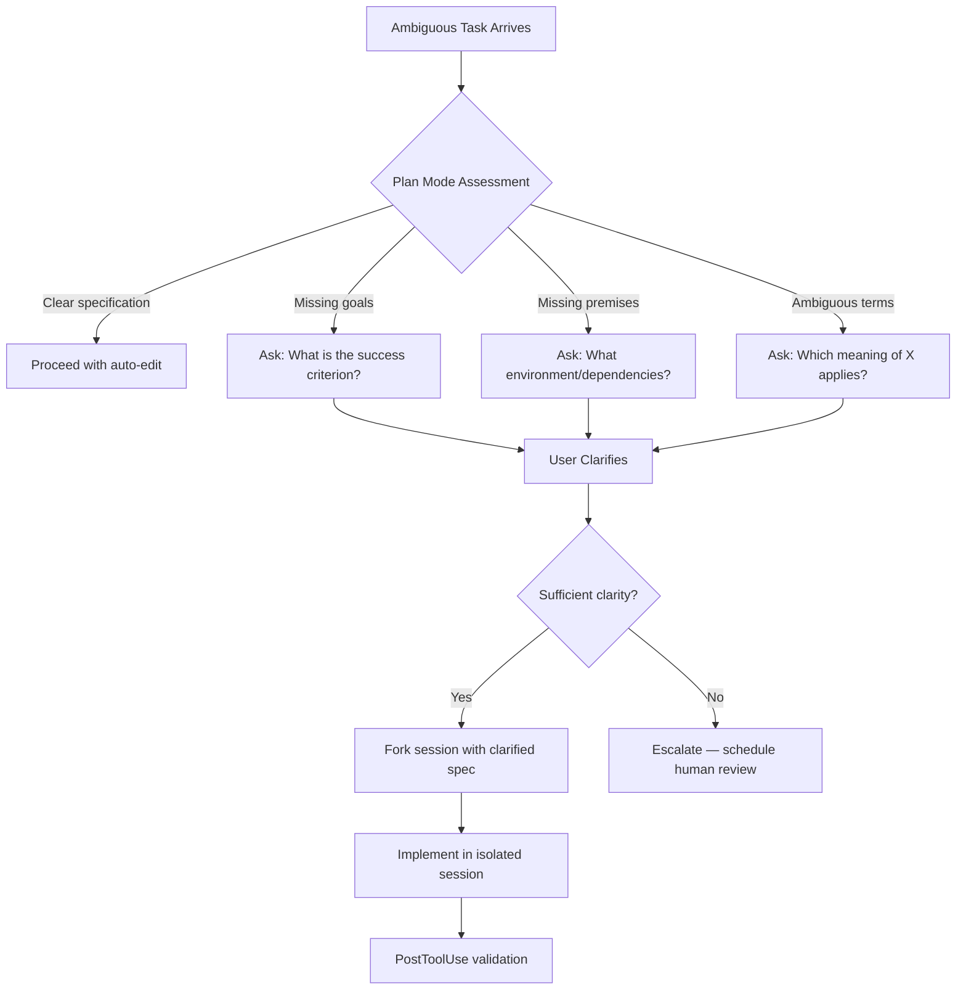

# When Coding Agents Should Ask Instead of Guess: What ClarEval and the Uncertainty-Aware Multi-Agent Study Mean for Codex CLI


---

Every senior developer has watched an agent confidently produce the wrong solution because it guessed instead of asking. Two converging 2026 papers — ClarEval (Li, Wu & Chang, arXiv:2603.00187)[^1] and "Ask or Assume?" (Edwards & Schuster, arXiv:2603.26233, revised June 2026)[^2] — quantify just how costly that silence is and, more importantly, show that agents _can_ be turned into proactive collaborators. This article synthesises their findings and maps them directly to Codex CLI's plan mode, AGENTS.md directives, approval modes, and session workflows.

## The Scale of the Guessing Problem

ClarEval introduces three categories of realistic ambiguity — **missing goals**, **missing premises**, and **ambiguous terminology** — and injects them into 750 curated programming problems (150 HumanEval + 600 LiveCodeBench), producing 2,250 evaluation instances[^1].

The headline number is devastating: under ambiguous instructions, the **baseline Pass@1 drops to 8.94%**, compared with **89.02%** when the same tasks are fully clarified[^1]. That is an 80-percentage-point gap — not a rounding error, but a fundamental capability cliff.

Ambiguous terminology is the worst offender at 6.71% Pass@1, followed by missing goals (9.76%) and missing premises (10.37%)[^1]. When agents guess at terminology, they fail over 93% of the time.

## Not All Agents Clarify Equally

ClarEval introduces two metrics that matter for practitioners:

- **Key Question Coverage (KQC)**: how many of the necessary clarifying questions the agent actually asks
- **Average Turns to Clarify (ATC)**: how efficiently it reaches understanding

In multi-turn evaluation, Claude Opus 4.1 achieves the highest KQC at 0.754, whilst GPT-5-Coder leads on efficiency with an ATC of just 1.493 turns[^1]. Crucially, Qwen2.5-Coder requires 2.396 turns — 60% more interaction for similar coverage[^1]. Aider-GPT5 collapses to a KQC of 0.376, effectively halving its question coverage compared with the leader[^1].

A weak correlation (r = 0.32) between single-turn and multi-turn performance reveals that **coding skill and clarification skill are distinct capabilities**[^1]. A model that excels at generating code from clear specifications may be poor at recognising when a specification is unclear.

## The Multi-Agent Clarification Architecture

"Ask or Assume?" takes the next step by demonstrating a **multi-agent scaffold** where a dedicated Intent Agent monitors execution history to detect underspecification, whilst a Main Agent handles repository navigation and code editing[^2].

The results on underspecified SWE-bench Verified tasks:

| Configuration | Claude Sonnet 4.5 | Kimi K2.6 |
|---|---|---|
| Hidden (no interaction) | 54.80% | — |
| Single-agent (UA-Single) | 61.20% | 61.60% |
| Multi-agent (UA-Multi) | **69.40%** | **69.40%** |
| Full baseline (fully specified) | 70.40% | 72.80% |

The multi-agent approach recovers nearly the entire specification gap for Claude Sonnet 4.5 (69.40% vs 70.40% ceiling)[^2]. That is a 14.6-percentage-point lift over the silent baseline — achieved entirely through asking the right questions at the right time.

### Calibration Matters More Than Volume

Claude Sonnet 4.5's UA-Multi queried on 68.8% of tasks, averaging 3.06 questions per queried task[^2]. On the 31.2% of tasks where it _chose not to ask_, it achieved 76.92% resolution — nearly matching the hidden baseline's 77.56%[^2]. The agent correctly identified when clarification was unnecessary.

Kimi K2.6, by contrast, over-queried: 87% ask rate, averaging 8.71 questions per task[^2]. More questions did not produce better results — it resolved 68.51% of queried tasks versus Claude's 65.99%[^2].

### Temporal Distribution of Questions

The most revealing finding concerns _when_ agents ask:

- **Interactive baseline**: 97.6% of queries in early stages[^2]
- **UA-Multi (Claude)**: distributed across early (41.8%) and middle (43.4%) phases[^2]
- **UA-Single (Claude)**: 43.9% concentrated in late stages[^2]

Late-stage questioning is a symptom of delayed uncertainty recognition — the agent has already committed to an approach before realising it lacks information. Early-to-middle questioning, as UA-Multi achieves, enables iterative refinement before code is written.

## Mapping to Codex CLI Configuration

These findings map directly to five Codex CLI configuration primitives.

### 1. Plan Mode as the First Clarification Gate

Codex CLI's plan mode (`/plan` or `Shift+Tab`) is the closest equivalent to ClarEval's multi-turn clarification protocol[^3]. In plan mode, Codex gathers context, identifies ambiguities, and proposes a structured plan before writing code[^4].

```toml
# config.toml — default to plan-first for complex tasks
[defaults]
approval_mode = "suggest"
```

Suggest mode forces approval at every step, creating natural clarification checkpoints[^5]. For teams where ambiguity is common (greenfield projects, underspecified tickets), this is the correct default. Reserve `auto-edit` or `full-auto` for well-specified, repetitive tasks where the 80-point ambiguity penalty does not apply.

### 2. AGENTS.md Clarification Directives

AGENTS.md is the mechanism for encoding clarification behaviour as a project-level constraint[^6]. The ClarEval taxonomy maps directly to actionable directives:

```markdown
# AGENTS.md

## Clarification Protocol

Before implementing any task, verify the following:

### Missing Goals
- If the task description does not specify success criteria, ASK before coding.
- If multiple valid interpretations exist, present them as numbered options.

### Missing Premises
- If environmental assumptions (OS, runtime, dependencies) are unstated, ASK.
- If the task references APIs or services not present in the repository, ASK.

### Ambiguous Terminology
- If domain-specific terms appear without definition, ASK.
- If a term has different meanings across the codebase, clarify which usage applies.

## Escalation Rule
Do NOT guess. If you cannot resolve ambiguity from the codebase or
documentation, ask the user. Guessing has a 91% failure rate on ambiguous tasks.
```

This encoding transforms passive intent-following into the proactive clarification behaviour that ClarEval measures with KQC and ATC.

### 3. Named Profiles for Ambiguity Intensity

Different project contexts carry different ambiguity loads. Named profiles allow teams to scale clarification discipline per context:

```toml
# Greenfield project — high ambiguity expected
[profile.greenfield]
approval_mode = "suggest"
# Plan mode default, strict clarification directives apply

# Maintenance project — well-specified codebase
[profile.maintenance]
approval_mode = "auto-edit"
# Codebase provides most context; lighter clarification needed

# CI pipeline — fully specified, no interaction
[profile.ci]
approval_mode = "full-auto"
# Only for deterministic, previously-clarified tasks
```

The "Ask or Assume?" paper validates this approach: Claude's UA-Multi correctly refrained from asking on 31.2% of tasks where the specification was already clear[^2]. Forcing clarification everywhere wastes developer time; the goal is calibrated questioning.

### 4. Session Forking for Exploratory Clarification



The temporal distribution finding from "Ask or Assume?" — that effective agents distribute questions across early and middle phases[^2] — maps to Codex CLI's `/fork` and `/side` commands[^7]. Starting a forked session after initial clarification preserves the clarified context whilst isolating implementation. If mid-implementation questions arise (the 43.4% middle-phase pattern), the agent can pause, clarify, and continue within the same session context.

### 5. PreToolUse Hooks for Specification Validation

The ClarEval finding that ambiguous terminology causes the worst performance (6.71% Pass@1)[^1] suggests a PreToolUse hook that validates terminology before code generation:

```bash
#!/bin/bash
# .codex/hooks/pre-tool-use-clarify.sh
# Flag potential terminology ambiguity in task descriptions

TASK_DESC="$1"

# Check for known ambiguous terms in this codebase
AMBIGUOUS_TERMS=("service" "handler" "manager" "controller" "client")

for term in "${AMBIGUOUS_TERMS[@]}"; do
    count=$(grep -r "class.*${term}" src/ | wc -l)
    if [ "$count" -gt 3 ]; then
        echo "WARNING: '${term}' has ${count} distinct usages in this codebase."
        echo "Clarify which '${term}' this task refers to before proceeding."
        exit 1
    fi
done
```

This enforces the "ask before guessing" discipline that ClarEval demonstrates is worth 80 percentage points of accuracy.

## The Collaborative Quotient Argument

ClarEval introduces the concept of a **Collaborative Quotient** — the idea that an agent's value is not just its coding ability but its ability to collaborate through dialogue[^1]. The ecological validity scores support this: ClarEval's ambiguous samples scored 4.12 ± 0.6 for naturalness versus 4.25 ± 0.8 for real StackOverflow queries (p > 0.05)[^1]. Real developer instructions _are_ ambiguous.

For Codex CLI teams, this reframes configuration as a collaboration design problem:

1. **Suggest mode** is not a safety crutch — it is a collaboration enabler
2. **AGENTS.md** is not just about coding constraints — it encodes clarification protocols
3. **Plan mode** is not slower — it recovers 80 percentage points of accuracy on ambiguous tasks
4. **Named profiles** calibrate the collaboration intensity to the ambiguity level of the work

## Practical Recommendations

| Finding | Codex CLI Action |
|---|---|
| 80pp gap between ambiguous and clarified tasks[^1] | Default to suggest mode + plan mode for all non-trivial tasks |
| Clarification skill ≠ coding skill (r = 0.32)[^1] | Test model clarification behaviour separately; do not assume coding benchmarks predict collaboration quality |
| Multi-agent clarification recovers 14.6pp[^2] | Use `/fork` to separate clarification phase from implementation phase |
| Over-querying wastes time without improving results[^2] | Encode specific ambiguity categories in AGENTS.md rather than generic "ask questions" directives |
| Late-stage questioning indicates delayed uncertainty recognition[^2] | Configure plan mode as the default entry point; clarify before coding, not during |
| Ambiguous terminology is the worst failure mode (6.71% Pass@1)[^1] | Add PreToolUse hooks that flag polysemous terms in the codebase |

## Conclusion

The combined evidence from ClarEval and "Ask or Assume?" is clear: coding agents that guess instead of asking fail on ambiguous tasks over 90% of the time, and the right clarification architecture can recover nearly all of that lost accuracy. Codex CLI already provides the primitives — plan mode, suggest mode, AGENTS.md, named profiles, session forking — but most teams configure them for speed rather than collaboration. The research says that is backwards: the 80-percentage-point accuracy penalty for guessing dwarfs any time saved by skipping clarification.

---

## Citations

[^1]: Li, J., Wu, Y. & Chang, Y. (2026). "ClarEval: A Benchmark for Evaluating Clarification Skills of Code Agents under Ambiguous Instructions." arXiv:2603.00187. [https://arxiv.org/abs/2603.00187](https://arxiv.org/abs/2603.00187)

[^2]: Edwards, N. & Schuster, S. (2026). "Ask or Assume? Uncertainty-Aware Clarification-Seeking in Coding Agents." arXiv:2603.26233, revised June 2026. [https://arxiv.org/abs/2603.26233](https://arxiv.org/abs/2603.26233)

[^3]: OpenAI. (2026). "Codex CLI Conversation Branching: /side, /fork, and Plan Mode Workflows." Codex Knowledge Base. [https://codex.danielvaughan.com/2026/04/21/codex-cli-conversation-branching-side-fork-plan-mode-workflows/](https://codex.danielvaughan.com/2026/04/21/codex-cli-conversation-branching-side-fork-plan-mode-workflows/)

[^4]: OpenAI. (2026). "Best practices — Codex." OpenAI Developers. [https://developers.openai.com/codex/learn/best-practices](https://developers.openai.com/codex/learn/best-practices)

[^5]: OpenAI. (2026). "Approval Modes: Suggest, Auto Edit, and Full Auto." OpenAI Codex Documentation. [https://freeacademy.ai/lessons/codex-approval-modes](https://freeacademy.ai/lessons/codex-approval-modes)

[^6]: OpenAI. (2026). "Custom instructions with AGENTS.md." OpenAI Developers. [https://developers.openai.com/codex/guides/agents-md](https://developers.openai.com/codex/guides/agents-md)

[^7]: OpenAI. (2026). "Codex CLI Conversation Branching." Codex Knowledge Base. [https://codex.danielvaughan.com/2026/04/21/codex-cli-conversation-branching-side-fork-plan-mode-workflows/](https://codex.danielvaughan.com/2026/04/21/codex-cli-conversation-branching-side-fork-plan-mode-workflows/)
