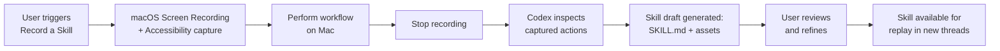
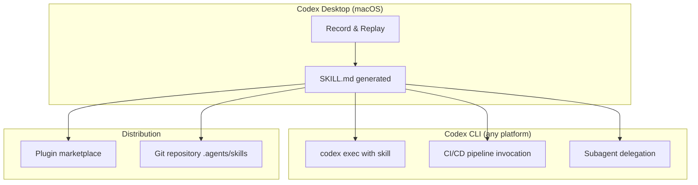

# Record and Replay: Turning macOS Demonstrations into Reusable Codex Agent Skills


---

Codex app 26.616, released on 18 June 2026, shipped **Record & Replay** — a feature that lets you perform a workflow on your Mac while Codex watches, then packages the demonstration into an inspectable, editable, reusable skill[^1]. If you have spent any time manually writing `SKILL.md` files to codify recurring procedures, Record & Replay replaces the laborious parts: observation replaces documentation, and the generated skill follows the same open Agent Skills standard that Codex CLI, Claude Code, Gemini CLI, and Cursor all understand[^2].

This article covers the technical mechanics, the skill format it produces, practical patterns for CLI-centric developers, and the constraints worth knowing before you commit workflows to demonstrated skills.

## How Record & Replay Works

The pipeline has three stages: **capture**, **generation**, and **execution**.



### Capture

From the Codex desktop app, navigate to **Plugins → "+" → Record a skill**[^1]. Provide brief context describing the workflow, then approve the permission request. Codex activates macOS Screen Recording and Accessibility APIs to observe window content and user actions[^3]. You perform the task exactly as you normally would — clicking through UIs, typing commands, navigating between applications.

Recording stops via the menu bar icon, the overlay button, or a voice command. OpenAI's guidance is to keep demonstrations "short and complete" and to stop when the workflow finishes, avoiding cleanup steps that would pollute the skill's scope[^1].

### Generation

After recording, Codex analyses the captured sequence and drafts a skill containing:

- **Usage guidelines** — when the skill should and should not trigger
- **Required inputs** — variable parameters (file paths, dates, form values)
- **Step-by-step instructions** — the procedural core
- **Result verification methods** — how to confirm success[^1]

The output is a standard `SKILL.md` file with YAML frontmatter, ready for manual refinement. You can ask Codex to iterate on the draft before saving.

### Execution (Replay)

In any new thread, invoke the skill explicitly via `$skill-name` or let Codex match it implicitly from the task description. Codex executes using whatever tools are available in the current environment — Computer Use, browser actions, and installed plugins[^1]. Variable values (the file to upload, the date to enter, the project to select) are supplied at invocation time.

## The Skill Format: SKILL.md and the Open Standard

Record & Replay produces skills in the **Open Agent Skills Standard** format — originally developed by Anthropic and now adopted across OpenAI, Google, Microsoft, and Cursor[^2][^4]. The minimum viable skill is a folder containing a single `SKILL.md`:

```markdown
---
name: expense-report-filing
description: >
  Use when the user asks to file an expense report in Concur.
  Do NOT use for purchase orders or invoice approvals.
---

## Steps

1. Open Concur at https://concur.example.com
2. Click **Create New Report**
3. Enter the report title using the format: `{month}-{team}-expenses`
4. Upload receipt images from the provided directory
5. Submit for manager approval

## Verification

- Confirm the report status shows "Submitted"
- Verify the total matches the sum of uploaded receipts
```

### Directory Structure

Generated skills can grow beyond a single file[^5]:

```
expense-report-filing/
├── SKILL.md              # Required: instructions + metadata
├── scripts/              # Optional: executable automation
├── references/           # Optional: documentation, screenshots
├── assets/               # Optional: templates, sample data
└── agents/
    └── openai.yaml       # Optional: UI metadata, dependencies
```

### Storage and Discovery

Codex discovers skills from multiple scopes, searched in priority order[^5]:

| Scope | Path | Use Case |
|-------|------|----------|
| Repo (CWD) | `$CWD/.agents/skills` | Folder-specific workflows |
| Repo (root) | `$REPO_ROOT/.agents/skills` | Organisation-wide workflows |
| User | `$HOME/.agents/skills` | Personal skill library |
| Admin | `/etc/codex/skills` | System-level defaults |
| System | Bundled with Codex | Built-in skills |

For CLI-centric developers, the `$HOME/.agents/skills` directory is the natural home for Record & Replay outputs that you want available across all projects.

## CLI Integration Patterns

Record & Replay is a Codex *desktop app* feature — the recording itself requires macOS Screen Recording and Accessibility permissions[^3]. However, the generated skills are plain files that work identically in Codex CLI sessions. This creates a useful workflow split:



### Invoking Generated Skills from the CLI

Once a skill exists on disk, Codex CLI picks it up automatically:

```bash
# Explicit invocation
codex "Use $expense-report-filing for the June receipts in ./receipts/"

# Non-interactive execution
codex exec "File the June expense report from ./receipts/" \
  --approval-mode full-auto
```

### Configuring Skill Behaviour

Override skill availability in `~/.codex/config.toml`[^5]:

```toml
[[skills.config]]
path = "~/.agents/skills/expense-report-filing/SKILL.md"
enabled = true

[[skills.config]]
path = "~/.agents/skills/legacy-deploy/SKILL.md"
enabled = false
```

For skills that should never fire automatically, set `allow_implicit_invocation: false` in the optional `agents/openai.yaml` metadata file[^5]:

```yaml
policy:
  allow_implicit_invocation: false

dependencies:
  tools:
    - type: "mcp"
      value: "browser"
```

## When to Record vs When to Write

Record & Replay excels at capturing GUI-dependent workflows — the tasks where writing a `SKILL.md` from scratch would require painstaking screenshot references and pixel-level navigation instructions. OpenAI's own guidance draws a clear boundary[^1]:

| Approach | Best For |
|----------|----------|
| **Record & Replay** | Repetitive GUI tasks, preference-dependent workflows, tasks easier shown than described |
| **Manual SKILL.md** | Deterministic CLI pipelines, API-driven automation, tasks requiring precise error handling |
| **Standalone Plugin** | Team distribution, bundled multi-skill packages, MCP server integration |

For senior developers working primarily in the terminal, the practical pattern is: **record GUI-bound workflows** (expense tools, internal dashboards, ticket systems), then **write CLI-centric skills by hand** (deployment pipelines, code review checklists, test orchestration).

## Constraints and Limitations

### Platform and Regional Restrictions

Record & Replay requires macOS with Screen Recording and Accessibility permissions granted to the Codex app[^3]. It is currently unavailable in the European Economic Area, the United Kingdom, and Switzerland — the same regions excluded from Computer Use at launch[^1][^6].

If an organisation's `requirements.toml` sets `computer_use = false`, both Record & Replay and Computer Use are disabled entirely[^1].

### Context Budget

Codex limits the initial skills list to approximately 2% of the context window — roughly 8,000 characters — to preserve prompt space[^5]. Organisations with large skill libraries should keep descriptions concise and use `allow_implicit_invocation: false` on niche skills to avoid context pressure.

### Privacy Considerations

Recording captures screen content and user actions. OpenAI's Screen Recording permission on macOS means Codex can observe any visible window during capture[^3]. Use realistic but **non-sensitive test data** during recording. Avoid workflows that expose credentials, personal data, or proprietary information on screen. The generated skill contains instructions, not raw screen captures, but the recording session itself passes through OpenAI's infrastructure[^1].

### Skill Portability

Because Record & Replay outputs follow the Open Agent Skills Standard[^2][^4], generated skills are portable to any compliant agent. A skill recorded in Codex can be placed in `.claude/skills/` for Claude Code or checked into a shared repository for cross-tool consumption. The instructions are plain Markdown — no vendor lock-in beyond the optional `agents/openai.yaml` metadata.

## Practical Recommendations

1. **Record short, atomic workflows.** One skill per task. A skill that files an expense report should not also book a meeting room.

2. **Name skills for discoverability.** The `description` field drives implicit matching — write it as a trigger specification, not a summary[^5].

3. **Commit skills to version control.** Place generated skills in `$REPO_ROOT/.agents/skills/` so the whole team benefits. Use `.gitignore` to exclude any skills containing environment-specific paths.

4. **Refine before sharing.** Record & Replay drafts are starting points. Edit the `SKILL.md` to add edge-case handling, input validation, and explicit failure modes that a demonstration cannot capture.

5. **Pair with `codex exec` for automation.** Once refined, skills become first-class automation targets in CI/CD pipelines via `codex exec`[^5].

6. **Monitor context budget.** If Codex stops matching skills implicitly, check whether your skill library has grown beyond the 8,000-character context ceiling and prune or disable low-frequency skills[^5].

## What This Means for the Skills Ecosystem

Record & Replay lowers the barrier to skill creation from "write precise Markdown instructions from memory" to "do the thing once while Codex watches." For teams adopting Codex CLI, this accelerates the flywheel: GUI workflows get recorded on macOS, skills get committed to the repo, and CLI sessions on any platform replay them automatically.

The constraint to watch is regional availability. European teams — precisely the ones with the strictest compliance requirements around workflow documentation — cannot currently use Record & Replay or Computer Use. Until OpenAI resolves the regulatory blockers that keep these features out of the EEA[^6], European developers must continue writing skills manually.

For everyone else, the combination of demonstrated skill capture and the open `SKILL.md` format makes Record & Replay the fastest path from "I do this every week" to "Codex does this every week."

## Citations

[^1]: OpenAI, "Record & Replay – Codex," OpenAI Developers Documentation, June 2026. [https://developers.openai.com/codex/record-and-replay](https://developers.openai.com/codex/record-and-replay)

[^2]: Agent Skills Standard, "Specification and documentation for Agent Skills," GitHub repository, 2026. [https://github.com/agentskills/agentskills](https://github.com/agentskills/agentskills)

[^3]: OpenAI, "Computer Use – Codex app," OpenAI Developers Documentation, 2026. [https://developers.openai.com/codex/app/computer-use](https://developers.openai.com/codex/app/computer-use)

[^4]: The SKILL.md Open Standard specification, Agensi, 2026. [https://www.agensi.io/learn/skill-md-specification-open-standard](https://www.agensi.io/learn/skill-md-specification-open-standard)

[^5]: OpenAI, "Agent Skills – Codex," OpenAI Developers Documentation, 2026. [https://developers.openai.com/codex/skills](https://developers.openai.com/codex/skills)

[^6]: OpenAI, "Changelog – Codex," OpenAI Developers Documentation, June 2026. [https://developers.openai.com/codex/changelog](https://developers.openai.com/codex/changelog)
