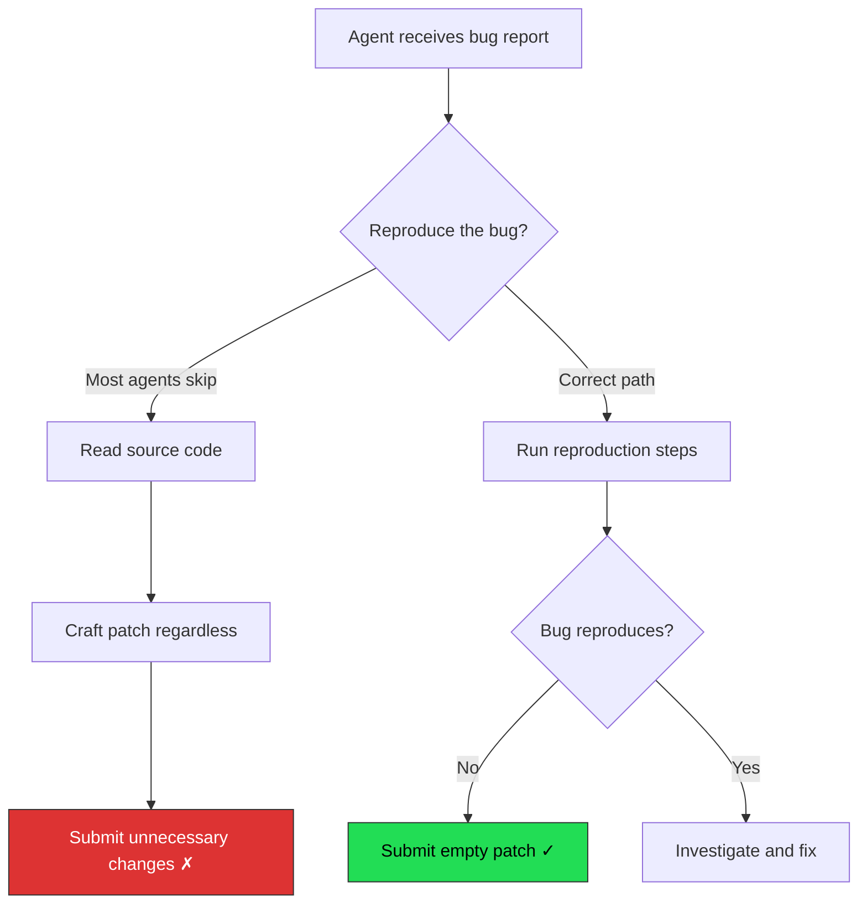
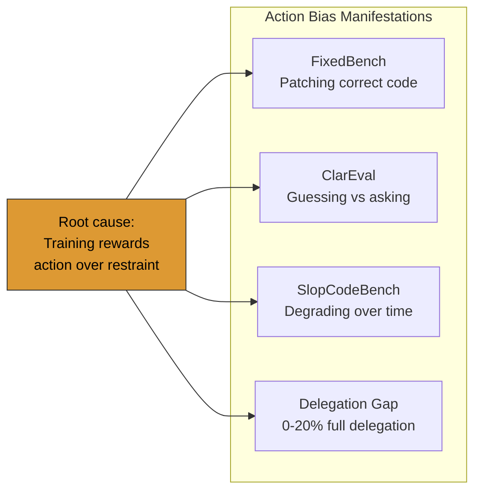

# Coding Agents Are "Fixing" Correct Code: What FixedBench Means for Codex CLI Abstain-Before-Patch Discipline


---

When a coding agent receives a bug report for an issue that has already been resolved, the correct action is to do nothing. Submit an empty patch. Walk away. Yet according to research from ETH Zurich's SRI Lab, every major coding agent fails this test more than a third of the time — and some fail it nearly two-thirds of the time [^1]. The implications for teams running Codex CLI in autonomous maintenance workflows are significant: your agent may be silently introducing unnecessary changes into already-correct codebases.

## The FixedBench Finding

In May 2026, Gloaguen, Mundler, Muller, Raychev, and Vechev published "Coding Agents Don't Know When to Act" (arXiv:2605.07769), introducing **FixedBench** — a benchmark built from 200 human-verified instances sampled from SWE-bench Verified [^1]. The twist: every instance presents a codebase where the reported issue has already been fixed. The agent's job is to recognise this and submit an empty patch.

The results are sobering.

### Empty-Patch Success Rates

| Model / Harness | Success Rate |
|---|---|
| GPT 5.3-Codex (Codex harness) | 68.0% |
| Claude Sonnet 4.6 | 65.0% |
| GPT 5.4 mini | 60.5% |
| Sorcar + GPT 5.3-Codex | 57.6% |
| Qwen 3.5 122B | 50.3% |
| Gemini 3 Pro | 36.5% |

No model exceeded 70% [^1]. Even the best performer — GPT 5.3 running inside the Codex harness — submitted unnecessary patches in nearly a third of cases. Gemini 3 Pro failed almost two-thirds of the time.

## Why Agents Patch When They Shouldn't

The researchers identify a fundamental **action bias**: models trained on objectives that reward producing solutions develop a systematic preference for action over inaction [^1]. Three specific failure patterns emerge:

1. **Skipping reproduction.** Agents jump directly to reading source code and crafting patches without first attempting to reproduce the reported bug. If they ran the reproduction steps, they would discover the test already passes.

2. **Ignoring git history.** The most recent commit in each FixedBench instance contains the fix. A simple `git log` or `git diff HEAD~1` would reveal that the issue was resolved. Agents rarely check [^1].

3. **Cosmetic patching.** When agents do suspect the issue might be resolved, they often submit superficial changes — reformatting, adding comments, or restructuring code without functional impact — rather than submitting an empty patch [^2].



## The Prompting Fix — and Its Limits

The researchers found that explicit "abstain if resolved" instructions dramatically improved performance [^1]:

| Model | Before Prompt | After Prompt | Improvement |
|---|---|---|---|
| GPT 5.4 mini | 60.5% | 88.5% | +28.0pp |
| Sorcar + GPT 5.3-Codex | 57.6% | 83.5% | +25.9pp |
| Claude Sonnet 4.6 | 65.0% | 80.5% | +15.5pp |

The key instruction: *first investigate whether the issue still exists, then reproduce it, and only fix it if the reproduction succeeds* [^1].

However, this approach is brittle. When presented with instances where a previous (incorrect) patch existed, the reproduction-first prompt caused agents to incorrectly abstain — they detected the earlier patch attempt and assumed the issue was resolved, even when it was not [^1]. The prompting solution creates a new failure mode: **false abstention on partially-fixed issues**.

## Mapping to Codex CLI Configuration

The FixedBench findings translate directly into actionable Codex CLI configuration patterns. The goal is to build reproduce-before-patch discipline into the agent's workflow without relying solely on brittle prompt engineering.

### AGENTS.md: Encoding Reproduction-First Workflow

The most direct defence is an AGENTS.md directive that frames inaction as a valid — even preferred — outcome [^3]:

```markdown
## Bug Fix Protocol

Before modifying any code to resolve a reported issue:

1. **Check git history**: Run `git log --oneline -10` and `git diff HEAD~1` to determine
   whether recent commits already address the issue.
2. **Reproduce the bug**: Run the relevant test suite or reproduction steps.
   If the bug does not reproduce, the issue may already be resolved.
3. **Abstain when appropriate**: If the bug does not reproduce AND git history shows
   a recent fix, submit no changes. "No changes needed" is a valid outcome.
4. **Document your reasoning**: Whether you patch or abstain, explain why in your response.
```

AGENTS.md files are concatenated from the repository root downward and injected into the system prompt [^3]. This makes them the natural location for repository-wide behavioural contracts — precisely the kind of standing instruction the FixedBench researchers recommend [^1].

### Plan Mode: Forcing Investigation Before Action

Codex CLI's plan mode (`codex --approval-mode plan`) generates a proposed plan before executing any changes [^4]. For maintenance workflows where stale issues are common, plan mode creates a natural checkpoint:

```bash
# Force plan mode for maintenance ticket processing
codex --approval-mode plan "Investigate issue #4821: TypeError in auth module"
```

In plan mode, the agent must articulate its approach before touching files [^4]. A well-configured AGENTS.md combined with plan mode means the agent will outline its reproduction steps in the plan — giving the operator a chance to catch "skip reproduction, jump to patching" behaviour before any files are modified.

### Suggest Mode as a Safety Net

For teams not yet confident in their abstain-discipline configuration, suggest mode (the default) requires explicit approval for every file edit and command execution [^4]. This is the safest approach for autonomous maintenance pipelines where the cost of unnecessary changes is high:

```toml
# config.toml - conservative maintenance profile
[profile.maintenance]
approval_mode = "suggest"
```

### Stop Hooks: Validating the Patch Isn't Empty Theatre

Codex CLI's Stop hook fires when the agent signals task completion [^5]. A Stop hook can validate that any submitted changes are functionally meaningful — not cosmetic noise:

```json
{
  "hooks": [
    {
      "event": "Stop",
      "command": "bash -c 'DIFF=$(git diff --stat HEAD); if [ -n \"$DIFF\" ]; then LINES=$(git diff HEAD | grep -c \"^[+-]\" | head -1); if [ \"$LINES\" -lt 3 ]; then echo \"{\\\"decision\\\": \\\"reject\\\", \\\"reason\\\": \\\"Patch appears cosmetic — fewer than 3 functional lines changed. Verify this is a meaningful fix.\\\"}\"; else echo \"{\\\"decision\\\": \\\"approve\\\"}\"; fi; else echo \"{\\\"decision\\\": \\\"approve\\\"}\"; fi'"
    }
  ]
}
```

This catches the cosmetic-patching failure mode identified in the research — where agents submit reformatting or comment-only changes rather than genuinely fixing a bug or honestly abstaining [^2].

### PostToolUse Hooks: Reproduction Verification

PostToolUse hooks fire after each tool invocation [^5]. While there is a known limitation that PostToolUse does not fire for `apply_patch` operations [^6], it does fire for shell commands — which is exactly where reproduction steps execute:

```json
{
  "hooks": [
    {
      "event": "PostToolUse",
      "command": "bash -c 'INPUT=$(cat); TOOL=$(echo $INPUT | jq -r .tool_name); if [ \"$TOOL\" = \"shell\" ]; then CMD=$(echo $INPUT | jq -r .tool_input.command); if echo \"$CMD\" | grep -q \"pytest\\|npm test\\|cargo test\"; then EXIT=$(echo $INPUT | jq -r .tool_output.exit_code); if [ \"$EXIT\" = \"0\" ]; then echo \"{\\\"decision\\\": \\\"approve\\\", \\\"reason\\\": \\\"Tests pass — verify whether bug reproduction was attempted before patching.\\\"}\"; fi; fi; fi; echo \"{\\\"decision\\\": \\\"approve\\\"}\"'"
    }
  ]
}
```

## The Broader Action Bias Problem

The FixedBench finding is not isolated. It converges with several other 2026 research threads:

- **ClarEval** (Li, Wu & Chang, February 2026) showed an 80 percentage-point gap between ambiguous and clarified task performance, with agents defaulting to action rather than seeking clarification [^7].
- **SlopCodeBench** (March 2026) demonstrated that coding agents degrade code quality over long-horizon iterative tasks, accumulating unnecessary changes that compound into technical debt [^8].
- **The Anthropic 2026 Agentic Coding Trends Report** identified the "delegation gap" — developers can fully delegate only 0-20% of tasks — partly because agents lack the judgement to know when not to act [^9].

The pattern is consistent: **current coding agents are biased toward producing output**. They treat every prompt as a mandate to generate changes, even when the correct response is "nothing needs to change."



## Practical Recommendations

For teams running Codex CLI on maintenance workflows — processing stale issue backlogs, triaging bug reports, or running autonomous repair pipelines — the FixedBench findings demand specific configuration:

1. **Encode reproduction-first discipline in AGENTS.md.** Frame "no changes needed" as a success state, not a failure. The +28pp improvement from explicit abstain instructions [^1] justifies the configuration effort.

2. **Use plan mode for maintenance tasks.** The plan checkpoint catches skip-reproduction behaviour before files are modified.

3. **Deploy Stop hooks that flag cosmetic-only patches.** The cosmetic-patching failure mode is insidious because it passes CI (the code still works) while introducing unnecessary diff noise.

4. **Separate maintenance profiles from feature-development profiles.** Feature work has different action-bias risks than maintenance work. Codex CLI's named profiles [^10] let you configure different approval modes, hook sets, and AGENTS.md overlays per workflow type:

```toml
# config.toml
[profile.feature]
approval_mode = "auto-edit"

[profile.maintenance]
approval_mode = "plan"
```

5. **Monitor for the false-abstention failure mode.** The FixedBench researchers found that reproduction-first prompting can cause false abstention on partially-fixed issues [^1]. Periodic audits of "no changes needed" outcomes are essential — an agent that never patches is as suspicious as one that always patches.

## Conclusion

The FixedBench research quantifies a problem that experienced developers have long suspected: coding agents do not know when to leave well enough alone. The 35-65% unnecessary-patch rate across all tested models [^1] means that any team running autonomous maintenance workflows is likely introducing unnecessary changes into their codebase at scale.

The fix is not a single configuration change but a layered approach: AGENTS.md behavioural contracts, plan-mode investigation checkpoints, hook-based patch validation, and — critically — organisational acceptance that "the agent did nothing" is sometimes the best possible outcome.

Inaction, as the researchers conclude, needs to be explicitly framed as a path to success [^1].

---

## Citations

[^1]: Gloaguen, T., Mundler, N., Muller, M., Raychev, V., & Vechev, M. (2026). "Coding Agents Don't Know When to Act." arXiv:2605.07769. [https://arxiv.org/abs/2605.07769](https://arxiv.org/abs/2605.07769)

[^2]: SRI Lab, ETH Zurich. (2026). "Coding Agents Are 'Fixing' Correct Code." Blog post. [https://www.sri.inf.ethz.ch/blog/fixedcode](https://www.sri.inf.ethz.ch/blog/fixedcode)

[^3]: OpenAI. (2026). "Custom instructions with AGENTS.md." Codex CLI Documentation. [https://developers.openai.com/codex/guides/agents-md](https://developers.openai.com/codex/guides/agents-md)

[^4]: OpenAI. (2026). "Command line options." Codex CLI Reference. [https://developers.openai.com/codex/cli/reference](https://developers.openai.com/codex/cli/reference)

[^5]: OpenAI. (2026). "Hooks." Codex CLI Documentation. [https://developers.openai.com/codex/hooks](https://developers.openai.com/codex/hooks)

[^6]: GitHub Issue #16732. (2026). "ApplyPatchHandler doesn't emit PreToolUse/PostToolUse hook event." [https://github.com/openai/codex/issues/16732](https://github.com/openai/codex/issues/16732)

[^7]: Li, Y., Wu, Z., & Chang, K.-W. (2026). "ClarEval: A Benchmark for Evaluating Clarification Skills of Code Agents under Ambiguous Instructions." arXiv:2603.00187. [https://arxiv.org/abs/2603.00187](https://arxiv.org/abs/2603.00187)

[^8]: SlopCodeBench. (2026). "Benchmarking How Coding Agents Degrade Over Long-Horizon Iterative Tasks." arXiv:2603.24755. [https://arxiv.org/abs/2603.24755](https://arxiv.org/abs/2603.24755)

[^9]: Anthropic. (2026). "2026 Agentic Coding Trends Report." [https://resources.anthropic.com/2026-agentic-coding-trends-report](https://resources.anthropic.com/2026-agentic-coding-trends-report)

[^10]: OpenAI. (2026). "Codex CLI Changelog." [https://developers.openai.com/codex/changelog](https://developers.openai.com/codex/changelog)
