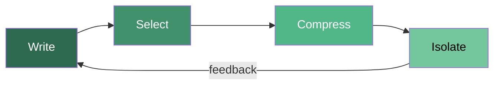
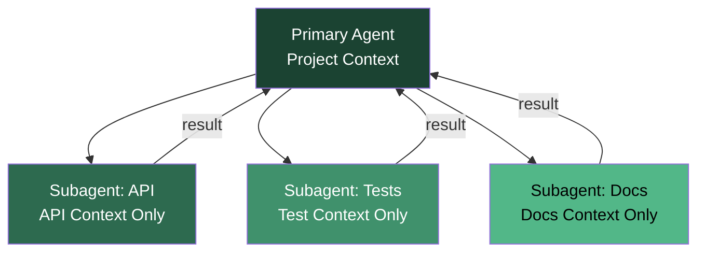
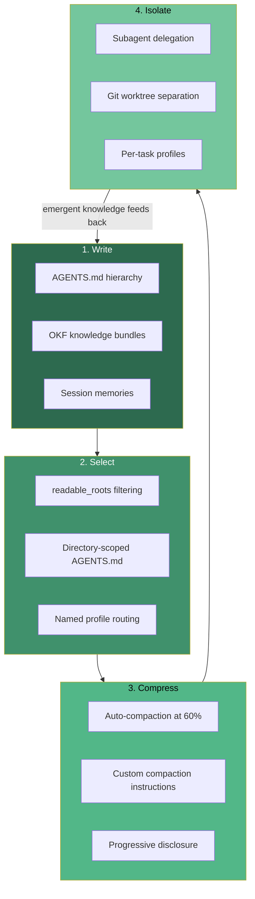

# Context Engineering Masterclass: The Write-Select-Compress-Isolate Playbook for Codex CLI


---

Gartner declared 2026 the year of context engineering, identifying it as the breakout AI capability that separates production-grade agent deployments from expensive prompt experiments [^1]. The core thesis is simple: an agent is only as good as the context it receives. Yet most teams treat context as an afterthought — stuffing everything into the system prompt and hoping the model figures it out.

This article synthesises seven existing knowledge-base articles — spanning context compaction, context pruning, ContextCov executable constraints, SWE-Explore repository navigation, the Git Context Controller, SkillReducer token efficiency, and the Open Knowledge Format — into a single actionable playbook built around the four context engineering primitives: **Write**, **Select**, **Compress**, and **Isolate** [^2]. Every pattern maps directly to Codex CLI configuration.

## The Four Primitives

Before diving into implementation, understand the framework. Context engineering for coding agents decomposes into four operations that form a pipeline [^2]:



| Primitive | Purpose | Codex CLI Surface |
|-----------|---------|-------------------|
| **Write** | Persist knowledge outside the context window | AGENTS.md, OKF bundles, memories, scratchpad files |
| **Select** | Surface only relevant context at decision time | `readable_roots`, directory-scoped AGENTS.md, MCP knowledge servers |
| **Compress** | Reduce tokens whilst preserving signal | Compaction config, SkillReducer patterns, diff-only hooks |
| **Isolate** | Split work across focused context windows | Subagents, named profiles, git worktrees |

## Write: Persisting Knowledge Outside the Window

The Write primitive ensures that institutional knowledge, project conventions, and task-specific rules survive beyond any single session. In Codex CLI, the Write surface has three layers.

### Layer 1: AGENTS.md Hierarchy

Codex CLI loads AGENTS.md files from three locations, each overriding the previous [^3]:

1. **Global** — `~/.codex/AGENTS.md` (personal coding standards, preferred patterns)
2. **Project root** — `./AGENTS.md` (repository conventions, architecture decisions)
3. **Subdirectory** — `./src/api/AGENTS.md` (module-specific constraints)

ContextCov demonstrated that 81% of 723 repositories with agent instruction files contained constraints the agent silently violated [^4]. The fix is making constraints *executable* — a principle that maps directly to Codex CLI hooks:

```toml
# config.toml — enforce AGENTS.md constraints via hooks
[hooks.pre_tool_use.no_wildcard_imports]
command = "python3 .codex/hooks/check_imports.py"
on_failure = "reject"
```

### Layer 2: Open Knowledge Format Bundles

Google's Open Knowledge Format (OKF), published June 2026, standardises how organisations package knowledge for agent consumption [^5]. Each OKF "concept" is a markdown file with YAML frontmatter containing structured metadata — author, last-verified date, confidence score, related concepts.

For Codex CLI, OKF bundles serve as the Write layer for domain knowledge that does not belong in AGENTS.md:

```bash
# Serve OKF bundles via MCP for Codex CLI consumption
npx @anthropic-ai/knowledge-server --bundle ./okf-bundles/ --port 3847
```

```toml
# config.toml — connect OKF knowledge server
[[mcp_servers]]
name = "domain-knowledge"
command = "npx"
args = ["@anthropic-ai/knowledge-server", "--bundle", "./okf-bundles/", "--port", "3847"]
```

### Layer 3: Session Memories

Codex CLI memories persist cross-session context when enabled [^6]:

```toml
# config.toml — enable persistent memories
[memory]
enabled = true
```

Memories are the Write primitive for *emergent* knowledge — patterns the agent discovers during work that should survive session boundaries. They complement AGENTS.md (authored knowledge) and OKF (curated knowledge).

## Select: Surfacing Relevant Context at Decision Time

Writing knowledge is pointless if the agent loads everything into every session. The Select primitive filters context dynamically.

### Scoped readable_roots

The `readable_roots` sandbox configuration controls which directories the agent can read [^7]. This is context selection at the filesystem level:

```toml
# config.toml — restrict context to relevant source trees
[sandbox]
readable_roots = [
    "./src",
    "./tests",
    "./docs/api",
]
```

SWE-Explore demonstrated that repository exploration is the bottleneck for coding agents — across 848 issues in 203 repositories, agents that explored irrelevant code regions consumed tokens without improving patch quality [^8]. Tight `readable_roots` is the first-order defence.

### Directory-Scoped AGENTS.md as Context Routing

Place AGENTS.md files in subdirectories to provide context *only* when the agent operates in that area:

```
repo/
├── AGENTS.md                    # Project-wide conventions
├── src/
│   ├── api/
│   │   └── AGENTS.md            # API design rules, OpenAPI conventions
│   ├── workers/
│   │   └── AGENTS.md            # Queue patterns, retry semantics
│   └── ml/
│       └── AGENTS.md            # Model serving constraints, GPU memory
└── infrastructure/
    └── AGENTS.md                # Terraform conventions, blast radius rules
```

This structure implements hierarchical context selection — the agent receives only the constraints relevant to its current working directory.

### Named Profiles for Task-Type Routing

Named profiles select different context configurations per task type [^9]:

```toml
[profile.refactor]
model = "o3"
sandbox_mode = "workspace-write"
readable_roots = ["./src", "./tests"]

[profile.review]
model = "o4-mini"
sandbox_mode = "read-only"
readable_roots = ["./src", "./tests", "./docs"]

[profile.infrastructure]
model = "o3"
sandbox_mode = "danger-full-access"
readable_roots = ["./infrastructure", "./scripts"]
```

```bash
# Select the right context envelope for the task
codex --profile refactor "Extract the payment module into a separate package"
codex --profile review "Review the changes in the last 3 commits"
```

## Compress: Reducing Tokens Whilst Preserving Signal

Even with good selection, long sessions accumulate context. The Compress primitive manages the token budget.

### Compaction Configuration

Codex CLI's compaction system fires before sending a new user message when accumulated tokens exceed the threshold [^10]. The recommended configuration:

```toml
# config.toml — compaction tuning
model_context_window = 258400
model_auto_compact_token_limit = 150000
```

Setting `model_auto_compact_token_limit` to roughly 60% of the effective window gives the compaction summariser room to produce a compressed context that fits comfortably [^10].

⚠️ **Known issue (June 2026):** Setting `model_context_window` to a custom value in `config.toml` can break auto-compaction after the first context overflow when `fill_to_context_window` resets the token counter [^11]. Monitor compaction behaviour if overriding defaults.

### Custom Compaction Instructions

Add compaction guidance to AGENTS.md to steer what the compressor preserves:

```markdown
<!-- AGENTS.md compaction section -->
## Compaction Priority

When compacting context, preserve:
1. File paths and line numbers of all modified files
2. Test names and their pass/fail status
3. Architectural decisions and their rationale
4. Error messages verbatim

Discard:
- Full file contents already written to disk
- Exploratory code that was abandoned
- Verbose tool output from successful operations
```

### SkillReducer Patterns for AGENTS.md

SkillReducer's analysis of 55,315 agent skills found that over 60% of body content is non-actionable, and reference-heavy skills inject tens of thousands of tokens per invocation [^12]. Apply the same progressive disclosure pattern to AGENTS.md:

**Anti-pattern** — monolithic AGENTS.md:
```markdown
# AGENTS.md (2,400 tokens — loaded every session)
## Database Rules
[800 tokens of PostgreSQL conventions]
## API Rules
[600 tokens of REST conventions]
## ML Pipeline Rules
[1,000 tokens of training conventions]
```

**Pattern** — progressive disclosure via file references:
```markdown
# AGENTS.md (200 tokens — loaded every session)
## Core Rules
- British English in all user-facing text
- Run tests before committing

## Specialist Rules
- Database work: read `docs/agents/database.md`
- API work: read `docs/agents/api.md`
- ML pipeline: read `docs/agents/ml-pipeline.md`
```

The agent loads specialist context only when the task demands it, saving 90%+ tokens on tasks that touch a single domain.

## Isolate: Splitting Work Across Focused Windows

The Isolate primitive is the most powerful and least used. Rather than cramming everything into one context window, split work across multiple agents with focused contexts.

### Subagent Delegation

Codex CLI exposes subagent delegation via `spawn_agent`, `send_input`, `resume_agent`, `wait`, and `close_agent` tools [^13]. Each subagent operates in its own context window:



CAID research from Carnegie Mellon demonstrated that optimal parallelism peaks at 2–4 subagents — performance degrades beyond this threshold due to coordination overhead [^14]. Use isolation for *context separation*, not just parallelism.

### Git Worktree Isolation

Physical worktree isolation prevents subagents from interfering with each other's file state [^14]:

```bash
# Create isolated worktrees for parallel agents
git worktree add ../api-refactor feature/api-refactor
git worktree add ../test-migration feature/test-migration

# Run agents in isolated worktrees
codex --profile refactor -C ../api-refactor "Refactor the payment API"
codex --profile refactor -C ../test-migration "Migrate tests to pytest"
```

CAID showed that soft isolation (shared filesystem) fails compared to physical worktree isolation — agents in shared environments corrupt each other's intermediate state [^14].

## The Complete Pipeline

Combining all four primitives produces a context engineering pipeline that scales from solo development to team-wide agent deployment:



## Practical Checklist

Apply these in order. Each step builds on the previous:

| Step | Action | Time | Impact |
|------|--------|------|--------|
| 1 | Create root AGENTS.md with core conventions | 15 min | High — every session gets baseline context |
| 2 | Add directory-scoped AGENTS.md for specialist modules | 30 min | Medium — reduces irrelevant context loading |
| 3 | Configure `readable_roots` to exclude non-essential directories | 5 min | High — eliminates exploration waste |
| 4 | Set compaction threshold to 60% of context window | 2 min | High — prevents session crashes |
| 5 | Apply progressive disclosure to AGENTS.md references | 20 min | Medium — reduces per-session token cost |
| 6 | Create named profiles for distinct task types | 15 min | Medium — right model and context per task |
| 7 | Use subagent delegation for multi-domain tasks | As needed | High — prevents context pollution |
| 8 | Package team knowledge as OKF bundles via MCP | 2–4 hrs | High — scales knowledge across agents and teams |

## What This Means for Teams

Context engineering is not prompt engineering. Prompt engineering optimises a single interaction; context engineering architects the information environment across sessions, agents, and teams [^1]. The Write-Select-Compress-Isolate framework gives Codex CLI teams a systematic approach:

- **Write** ensures knowledge survives beyond sessions
- **Select** ensures agents receive only relevant context
- **Compress** ensures long sessions stay within token budgets
- **Isolate** ensures complex tasks get focused, uncontaminated context windows

Teams that invest in context engineering infrastructure — AGENTS.md hierarchies, OKF bundles, named profiles, compaction tuning — will see compounding returns as agent capabilities improve. The context layer is the one part of the stack you fully control.

## Citations

[^1]: Gartner Data & Analytics Summit 2026 — Context as Critical Infrastructure for Enterprise AI. [Atlan Summary](https://atlan.com/know/gartner/key-takeaways-from-gartner-da-summit-2026/); [Gartner Hype Cycle for Agentic AI](https://www.gartner.com/en/articles/hype-cycle-for-agentic-ai)
[^2]: Context Engineering Strategies: Write, Select, Compress, Isolate. [Atlan](https://atlan.com/know/four-context-engineering-strategies/); [LangChain Blog](https://www.langchain.com/blog/context-engineering-for-agents)
[^3]: Codex CLI AGENTS.md Configuration Guide. [Augment Code](https://www.augmentcode.com/guides/how-to-build-agents-md); [Shipyard Cheatsheet](https://shipyard.build/blog/codex-cli-cheat-sheet/)
[^4]: ContextCov: Deriving and Enforcing Executable Constraints from Agent Instruction Files. Sharma, February 2026 revised May 2026. [arXiv:2603.00822](https://arxiv.org/abs/2603.00822)
[^5]: Google Cloud Open Knowledge Format (OKF) v0.1, published 12 June 2026. [MarkTechPost](https://www.marktechpost.com/2026/06/16/google-cloud-introduces-open-knowledge-format-okf-a-vendor-neutral-markdown-spec-for-giving-ai-agents-curated-context/); [TechTimes](https://www.techtimes.com/articles/318416/20260615/google-cloud-open-knowledge-format-turns-scattered-org-knowledge-agent-ready-bundles.htm)
[^6]: Codex CLI Memories: Native Session Persistence and Cross-Session Context Strategies. [Codex Knowledge Base](https://codex.danielvaughan.com/2026/05/01/codex-cli-memories-persistent-context-session-memory-ecosystem/)
[^7]: Codex CLI Deep Dive: Config, Profiles, Sandbox. [Digital Applied](https://www.digitalapplied.com/blog/codex-cli-deep-dive-config-profiles-sandbox-2026)
[^8]: SWE-Explore: Benchmarking How Coding Agents Explore Repositories. Zhang et al., June 2026. [arXiv:2606.07297](https://arxiv.org/abs/2606.07297)
[^9]: Codex CLI Named Profiles and Configuration. [Digital Applied](https://www.digitalapplied.com/blog/codex-cli-deep-dive-config-profiles-sandbox-2026); [Blake Crosley](https://blakecrosley.com/guides/codex)
[^10]: Codex CLI Context Compaction Architecture. [Codex Knowledge Base](https://codex.danielvaughan.com/2026/03/31/codex-cli-context-compaction-architecture/)
[^11]: GitHub Issue #16068 — model_context_window breaks auto-compaction. [GitHub](https://github.com/openai/codex/issues/16068)
[^12]: SkillReducer: Optimizing LLM Agent Skills for Token Efficiency. Gao et al., March 2026. [arXiv:2603.29919](https://arxiv.org/abs/2603.29919)
[^13]: Codex CLI Subagent Delegation and Multi-Agent Orchestration. [Firecrawl](https://www.firecrawl.dev/blog/codex-multi-agent-orchestration); [VoltAgent Awesome Subagents](https://github.com/VoltAgent/awesome-codex-subagents)
[^14]: CAID: Centralized Asynchronous Isolated Delegation. Geng & Neubig, Carnegie Mellon, March 2026. [arXiv:2603.21489](https://arxiv.org/abs/2603.21489)
