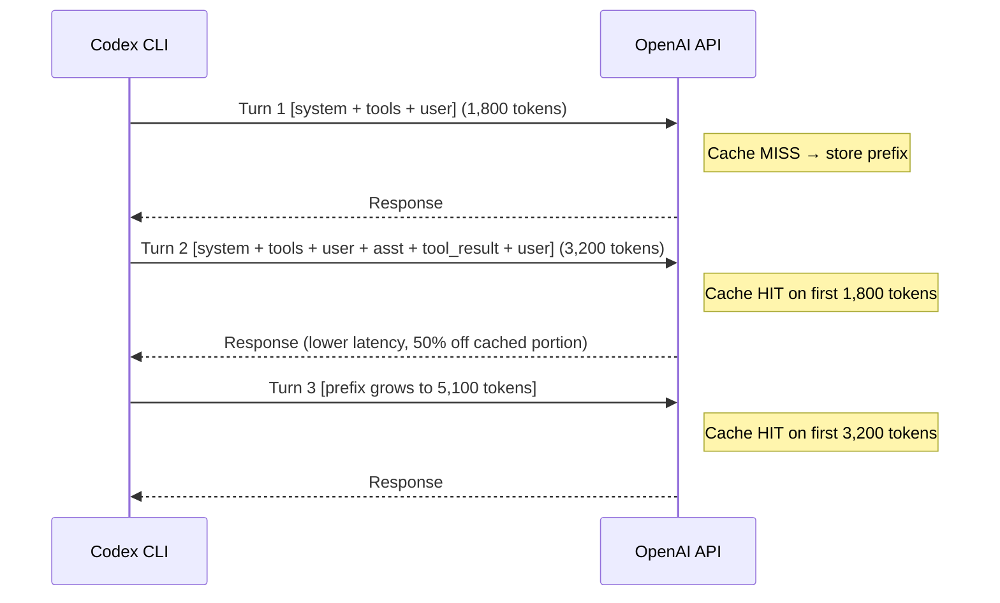
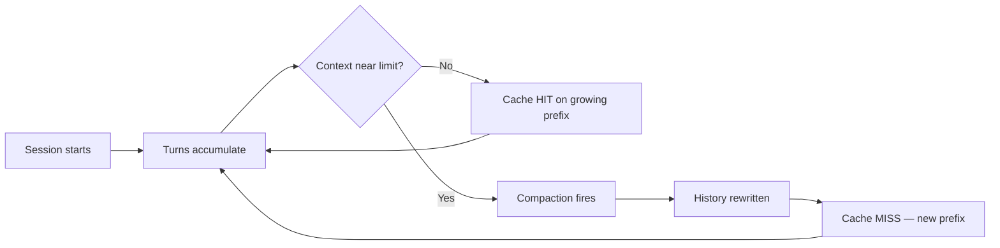

# Don't Break the Cache: What the Prompt Caching Research Means for Codex CLI Cost and Latency Optimisation


---

Every turn of a Codex CLI session resends the full conversation history to the API. Without mitigation, cost and latency grow quadratically with session length — a pattern that makes long-horizon agentic work financially and operationally painful. Prompt caching is the primary engineering lever that keeps the agent loop closer to linear. A January 2026 research paper, *Don't Break the Cache* (Lumer et al., arXiv:2601.06007), systematically evaluated caching strategies across OpenAI, Anthropic, and Google, producing the first provider-comparative dataset for multi-turn agentic workflows [^1]. This article maps its findings to Codex CLI configuration and practice.

## How Prompt Caching Works in the Agent Loop

OpenAI's prompt caching stores the computed key-value tensors behind a repeated prompt prefix so that the static portion of every API request — system prompt, tool definitions, AGENTS.md instructions, and reference documents — bills at a fraction of the normal input rate [^2]. Caching is automatic for any prompt containing 1,024 tokens or more; there is no opt-in flag and no additional fee for cache writes [^3].

The core constraint is **exact prefix matching**: the cached portion of a previous request must be an identical prefix of the new request [^3]. In practice, this means Codex CLI's agent loop naturally benefits because each turn appends new messages (tool results, assistant responses) to the end of an ever-growing conversation array, preserving the prefix.



Cached input tokens appear in the API response under `prompt_tokens_details.cached_tokens` [^3]. Codex CLI v0.140.0 introduced `/usage` views that surface daily and weekly token activity, making it easier to spot whether your sessions are actually hitting the cache [^4].

## What the Research Found

Lumer et al. evaluated three caching strategies across over 500 agent sessions on DeepResearchBench, a multi-turn benchmark where agents autonomously execute web-search tool calls to answer complex research questions [^1]:

| Strategy | Cost Reduction | TTFT Improvement |
|---|---|---|
| Full context caching | 41–80% | 13–31% |
| System-prompt-only caching | 41–80% (most consistent) | 13–31% |
| Caching excluding dynamic tool results | 41–80% | 13–31% |

The headline numbers — **41–80% cost reduction** and **13–31% time-to-first-token improvement** — held across all three providers [^1]. But the paper's most useful finding was a warning: **naively caching everything, including tool-call results, paradoxically increased latency in some conditions** [^1]. The reason is that dynamic content injected into the middle of the cached prefix invalidates the cache from that point forward, forcing re-computation of all subsequent tokens.

The recommended strategy: **cache only the static prefix (system prompt, tool definitions, reference documents) and append dynamic content (tool results, user messages) strictly at the end** [^1].

## Mapping to Codex CLI Configuration

Codex CLI's architecture already follows this pattern by default — the system prompt and tool schema form a stable prefix, and conversation turns append to the end. But several configuration levers can either preserve or destroy cache efficiency.

### 1. Keep AGENTS.md Stable Within a Session

The contents of your project's `AGENTS.md` file are injected into the system prompt [^5]. If you edit `AGENTS.md` mid-session, the system prompt changes, invalidating the cached prefix for every subsequent turn. For long-horizon work, treat `AGENTS.md` as immutable during a session.

### 2. Tune `model_auto_compact_token_limit` Carefully

When the conversation history exceeds this threshold, Codex CLI triggers automatic compaction — summarising older turns to free context space [^6]. Compaction rewrites the conversation history, which **destroys the cached prefix**. Setting this value too low forces frequent compactions and frequent cache invalidations. Setting it too high risks hitting the model's context window limit.

```toml
# config.toml — balance cache preservation against context pressure
[model]
model_auto_compact_token_limit = 100000  # default varies by model
```

A practical heuristic: set the threshold at roughly 70–80% of the model's context window. This gives enough headroom for several turns before compaction triggers, maximising the number of cache-hit turns between compaction events.

### 3. Control `tool_output_token_limit`

Large tool outputs (e.g., a 50,000-token file read) inflate the conversation history rapidly, accelerating the path to compaction [^6]. Bounding individual tool outputs keeps the history growth linear and delays cache-breaking compaction events.

```toml
[model]
tool_output_token_limit = 16000  # cap individual tool outputs
```

### 4. Use `compact_prompt` to Preserve Key Context

When compaction does fire, the default summarisation prompt may discard information you need. A custom `compact_prompt` can instruct the summariser to preserve critical architectural context while still reducing token count [^6]:

```toml
[model]
compact_prompt = "Summarise the conversation history, preserving: (1) all file paths modified, (2) test results, (3) architectural decisions. Discard verbose tool outputs."
```

### 5. Stabilise Tool Definitions Across Turns

The *Don't Break the Cache* paper found that varying tool definitions between requests breaks the cache [^1]. In Codex CLI, MCP server configurations define additional tools. If an MCP server's tool schema changes mid-session (e.g., a server restart with updated capabilities), the tool-definition portion of the prefix changes, invalidating the cache. Pin MCP server versions and avoid hot-reloading tool schemas during long sessions.

## The Compaction–Cache Trade-off



Every compaction event resets the cache. The research implies that the optimal strategy is to **delay compaction as long as possible** while keeping individual turn sizes small [^1]. This is where `tool_output_token_limit` and bounded tool calls pay dividends — they slow context growth without rewriting the prefix.

Codex CLI v0.141.0 reinforced this pattern by "caching tool search and eliminating repeated request and history copies," reducing both latency and memory consumption in tool-heavy sessions [^7].

## Named Profiles for Cache-Aware Routing

Different task types have different cache profiles. A quick code review might complete in 3–5 turns, barely warming the cache. A multi-hour refactoring session might run 50+ turns, where cache efficiency dominates cost.

```toml
# Named profile for long-horizon work — maximise cache hits
[profiles.marathon]
model = "o3"
model_auto_compact_token_limit = 120000
tool_output_token_limit = 12000

# Named profile for quick tasks — cache less important
[profiles.sprint]
model = "gpt-5.5"
model_auto_compact_token_limit = 60000
tool_output_token_limit = 24000
```

The marathon profile delays compaction aggressively on a high-context model, preserving the cache across many turns. The sprint profile prioritises richer tool outputs for short, intensive sessions where cache hit rates will be low regardless.

## Quantifying the Impact

The paper's 41–80% cost reduction aligns with real-world Codex CLI observations. ProjectDiscovery's Neo agent documented a 59% cumulative cost drop from prompt caching alone, reaching over 90% on fully optimised paths [^8]. OpenAI's pricing structure amplifies the effect: cached input tokens cost 50% less than standard input tokens, and for extended caching (available on gpt-5.5, gpt-5.4, and later models), cached tokens persist for up to 24 hours in GPU-local storage [^3].

For a concrete example: a 40-turn Codex CLI session with a 3,000-token system prompt and average 2,000-token tool outputs generates roughly 1.6 million input tokens without caching. With effective prefix caching hitting on 70% of cumulative input tokens, the billable input cost drops by approximately 35% — and latency drops measurably on every cache-hit turn.

## Cache Lifetime and Session Pacing

OpenAI's cache evicts prefixes after 5–10 minutes of inactivity, with a maximum lifetime of roughly one hour during off-peak periods [^3]. Extended caching on newer models stretches this to 24 hours [^3]. The practical implication: if you pause a Codex CLI session for lunch, expect a cache miss on the first turn back. The `/usage` command can confirm whether cached tokens are appearing in your session's billing breakdown [^4].

The paper also noted a rate-limit concern: keeping request frequency below approximately 15 requests per minute per unique prefix-key combination avoids cache overflow onto additional inference engines [^1] [^3]. Codex CLI's natural pacing — with human think-time between turns — rarely hits this threshold in interactive mode, but automated `codex exec` pipelines running tight loops should be aware.

## Practical Checklist

1. **Do not edit `AGENTS.md` mid-session** — it changes the system prompt prefix
2. **Set `model_auto_compact_token_limit` to 70–80% of context window** — delays cache-breaking compaction
3. **Bound `tool_output_token_limit`** — slows context growth, extends cache lifetime
4. **Pin MCP server versions** — prevents tool-schema changes that break the prefix
5. **Use `/usage` to monitor cached_tokens** — verify cache hits are occurring
6. **Avoid `codex exec` loops faster than 15 req/min on the same prefix** — prevents cache overflow
7. **Accept the post-compaction cache miss** — it is the cost of staying within context limits; structure work to minimise compaction frequency

## Citations

[^1]: Lumer, E., Nizar, F., Jangiti, A., Frank, K., Gulati, A., Phadate, M., & Subbiah, V. K. (2026). "Don't Break the Cache: An Evaluation of Prompt Caching for Long-Horizon Agentic Tasks." arXiv:2601.06007. [https://arxiv.org/abs/2601.06007](https://arxiv.org/abs/2601.06007)

[^2]: OpenAI. "Prompt Caching." OpenAI Blog. [https://openai.com/index/api-prompt-caching/](https://openai.com/index/api-prompt-caching/)

[^3]: OpenAI. "Prompt Caching — API Guide." OpenAI Developers. [https://developers.openai.com/api/docs/guides/prompt-caching](https://developers.openai.com/api/docs/guides/prompt-caching)

[^4]: OpenAI. "Codex CLI Changelog — v0.140.0." OpenAI Developers. [https://developers.openai.com/codex/changelog?type=codex-cli](https://developers.openai.com/codex/changelog?type=codex-cli)

[^5]: OpenAI. "Best Practices — Codex." OpenAI Developers. [https://developers.openai.com/codex/learn/best-practices](https://developers.openai.com/codex/learn/best-practices)

[^6]: OpenAI. "Configuration Reference — Codex." OpenAI Developers. [https://developers.openai.com/codex/config-reference](https://developers.openai.com/codex/config-reference)

[^7]: OpenAI. "Codex CLI Changelog — v0.141.0." OpenAI Developers. [https://developers.openai.com/codex/changelog?type=codex-cli](https://developers.openai.com/codex/changelog?type=codex-cli)

[^8]: "Prompt Caching in 2026: Cut LLM Costs, Keep Quality." Digital Applied. [https://www.digitalapplied.com/blog/prompt-caching-2026-cut-llm-costs-engineering-guide](https://www.digitalapplied.com/blog/prompt-caching-2026-cut-llm-costs-engineering-guide)
