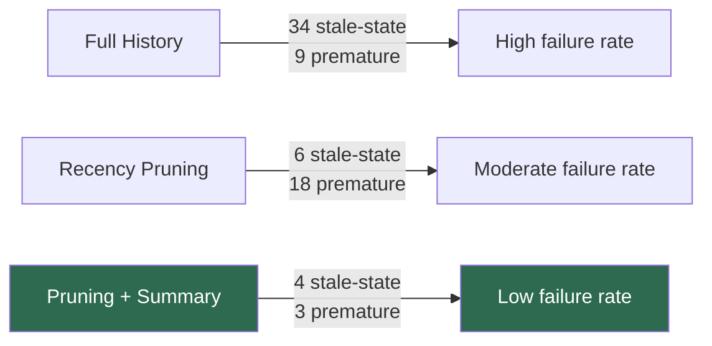
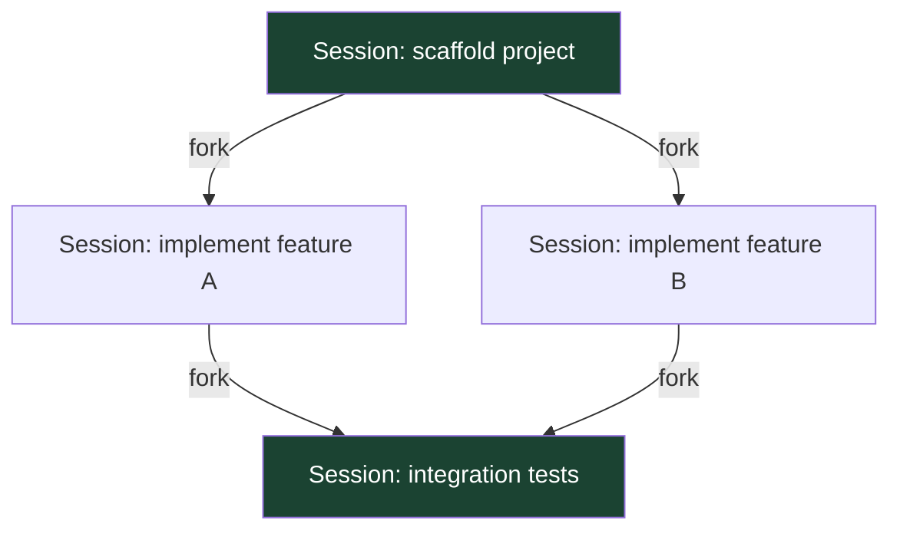

# Less Context, Better Agents: What the Microsoft Context Engineering Study Means for Codex CLI Session Strategy


---

The instinct is always to keep everything. Every tool output, every file read, every shell result — surely the model needs the full picture to stay on track. A June 2026 study from Microsoft Research proves that instinct wrong, and the implications for Codex CLI configuration are immediate.

## The Study: Pruning Beats Hoarding

Lodha et al.'s *Less Context, Better Agents* (arXiv:2606.10209) [^1] evaluated four context-management strategies across a 50-task enterprise automation benchmark in Microsoft Dynamics 365, averaged over five independent runs per configuration:

| Strategy | Completion Rate | Tokens Used | Runtime |
|---|---|---|---|
| C1: No user model | 8.0% | 532,600 | 3.08 hrs |
| C2: Full history | 71.0% | 1,480,996 | 14.56 hrs |
| C3: Last-5 pruning | 79.0% | 535,274 | 5.39 hrs |
| C4: Pruning + summary | 91.6% | 553,374 | 5.79 hrs |

The headline: **retaining full conversation history is actively harmful**, not merely wasteful. C3 outperformed C2 by 8 percentage points whilst consuming 63.9% fewer tokens [^1]. Adding a lightweight summarisation layer (C4) recovered the awareness lost by pruning, lifting completion a further 12.6 points for just 3.4% additional token overhead [^1].

## Why Full History Hurts

The paper's failure-mode taxonomy across 147 non-completions explains the mechanism:

- **Stale-state references** — the model acts on form fields or tool states that no longer exist. Full history (C2) produced 34 stale-state failures; pruning (C3) cut this to 6; summarisation (C4) reduced it to 4 [^1].
- **Premature termination** — the model loses track of what remains and declares victory early. Pruning alone increased this from 9 (C2) to 18 (C3), but summarisation collapsed it to 3 (C4) [^1].



The pattern is clear: stale context poisons reasoning more than missing context does — and a concise running summary is enough to prevent the awareness gaps that pure pruning introduces.

## Cross-Model Validation

The study cross-validated with Claude Sonnet 4.5, which achieved 88.0% completion without any context engineering, rising to 94.5% with pruning plus summarisation [^1]. The delta is smaller because Sonnet does not exhibit GPT-5's stalling behaviour under empty contexts, but the direction is identical: **less context, better results**, regardless of model family.

This matters because Codex CLI supports multiple model providers via Amazon Bedrock and named profiles [^2]. The finding generalises across providers.

## Converging Evidence

The Microsoft study does not stand alone. Three complementary 2026 papers form a converging evidence base:

1. **AdaCoM** (arXiv:2605.30785) [^3] trains an external context manager via reinforcement learning and demonstrates a Fidelity–Reliability trade-off: stronger agents benefit from high-fidelity context preservation, weaker agents need aggressive compression. This maps directly to Codex CLI's named-profile architecture, where different models should receive different compaction thresholds.

2. **SWE-Pruner** (arXiv:2601.16746) [^4] applies attention-guided context pruning to coding agents on SWE-bench, showing that selective pruning of repository context improves resolve rates whilst cutting token consumption.

3. **SlopCodeBench** (arXiv:2603.24755) [^5] demonstrates that structural erosion rises in 77% of long-horizon coding trajectories, with agent code 2.3× more verbose than human-written equivalents — symptoms consistent with stale-context accumulation.

## Mapping to Codex CLI Configuration

Codex CLI already implements the core primitives that the study validates. The gap is not tooling — it is tuning.

### 1. Recency-Based Pruning via `tool_output_token_limit`

The `tool_output_token_limit` key in `config.toml` caps tokens stored per individual tool output [^6]. The default is 16,000 tokens. For long-horizon sessions with verbose tool responses (test suites, large file reads, API responses), lowering this to 8,000–12,000 forces earlier summarisation of tool results:

```toml
# ~/.codex/config.toml — aggressive tool output pruning
tool_output_token_limit = 10000
```

This is the Codex CLI equivalent of the study's "last-5 pruning" strategy: limiting how much raw tool state persists in the context window [^6].

### 2. Compaction Threshold Tuning

The `model_auto_compact_token_limit` key controls when Codex CLI fires automatic history compaction [^6]. The default triggers at approximately 200,000 tokens. The study's finding — that earlier, more aggressive context reduction improves outcomes — suggests lowering this:

```toml
# Trigger compaction earlier to prevent stale-state accumulation
model_auto_compact_token_limit = 120000
```

Codex CLI's compaction fires at two points in the agent loop: a pre-turn trigger before sending a new user message, and a post-turn trigger after receiving the model response [^7]. Both checkpoints align with the study's recommendation to prevent stale state from reaching the model.

### 3. Custom Compaction Prompts as Running Summaries

The study's C4 strategy uses "a single free-form LLM pass" that condenses prior interactions into a running summary capturing forms opened, controls interacted with, and data entered [^1]. Codex CLI's `compact_prompt` and `experimental_compact_prompt_file` keys [^6] let you replicate this exactly:

```toml
# Point compaction at a custom summary-preserving prompt
experimental_compact_prompt_file = ".codex/compact-summary.md"
```

A well-crafted compaction prompt should instruct the model to preserve:
- **Cumulative progress** — what has been completed, what remains
- **Active state** — current file paths, branch names, test status
- **Design commitments** — architectural decisions made during the session

This mirrors the study's summary agent output format: structured, factual, and free of raw tool dumps.

### 4. Named Profiles for Model-Specific Context Policies

The cross-model validation shows that context engineering gains vary by model: GPT-5 benefits enormously (8% → 91.6%), whilst Claude Sonnet 4.5 gains modestly (88% → 94.5%) [^1]. AdaCoM's Fidelity–Reliability trade-off [^3] reinforces this: weaker models need more aggressive compression.

Codex CLI named profiles let you encode model-specific context policies:

```toml
[profile.frontier]
model = "gpt-5.5"
model_auto_compact_token_limit = 150000
tool_output_token_limit = 16000

[profile.efficient]
model = "gpt-5-codex-mini"
model_auto_compact_token_limit = 80000
tool_output_token_limit = 8000
```

The efficient profile applies the study's aggressive pruning strategy to the model that benefits most from it.

### 5. Session Forking as Architectural Pruning

The study's most aggressive finding — that full history is actively detrimental — validates a session strategy already available in Codex CLI: forking. The `codex --resume <id>` and `/fork` commands create new sessions that inherit summary context without dragging stale tool output forward [^8].



Each fork is a natural pruning boundary. The forked session starts with a compacted summary of the parent — precisely the "pruning + summarisation" approach that achieved 91.6% completion in the study.

## The Anti-Pattern: Maximising Context Window

The study directly challenges a common Codex CLI configuration pattern: setting `model_context_window` to the maximum supported value and `model_auto_compact_token_limit` as high as possible to "give the model more to work with." The data shows this produces more stale-state failures, higher token costs, and longer runtimes — the worst of all worlds [^1].

The correct default is the opposite: compact early, summarise aggressively, and fork sessions at natural task boundaries.

## Practical Configuration Recipe

For teams adopting these findings immediately:

```toml
# ~/.codex/config.toml — evidence-based context engineering

# Compact before the window fills with stale state
model_auto_compact_token_limit = 120000

# Cap verbose tool outputs
tool_output_token_limit = 10000

# Use a summary-preserving compaction prompt
experimental_compact_prompt_file = ".codex/compact-summary.md"

# Track what this costs
# Use /usage in-session for daily/weekly/cumulative token views
```

Complement this with AGENTS.md guidance that instructs the agent to fork sessions at natural task boundaries rather than accumulating unbounded history:

```markdown
## Session Hygiene

- Fork a new session after completing each discrete task
- Do not accumulate more than 3-4 tool-heavy operations in a single session
- When resuming work, fork from the last clean checkpoint rather than continuing
```

## What Remains Open

The study benchmarked enterprise form automation, not software engineering. The failure modes (stale form states, duplicate field entries) are analogous to but not identical with coding failures (stale file contents, duplicate edits). The directional finding — pruning plus summarisation beats full history — aligns with SlopCodeBench and SWE-Pruner results in coding-specific contexts [^4] [^5], but precise threshold values (last-5, window-3) will differ for code-generation workflows.

The 8.4% residual failure rate in C4 also signals that context engineering alone cannot reach 100% autonomy. Codex CLI's approval modes and human-in-the-loop checkpoints remain necessary for production-critical workflows [^9].

## Citations

[^1]: Lodha, A., Pahlavikhah Varnosfaderani, M., Chakraborty, A., & Mithal, A. (2026). Less Context, Better Agents: Efficient Context Engineering for Long-Horizon Tool-Using LLM Agents. *arXiv:2606.10209*. [https://arxiv.org/abs/2606.10209](https://arxiv.org/abs/2606.10209)

[^2]: OpenAI. (2026). Configuration Reference — Codex. *OpenAI Developers*. [https://developers.openai.com/codex/config-reference](https://developers.openai.com/codex/config-reference)

[^3]: Learning Agent-Compatible Context Management for Long-Horizon Tasks. (2026). *arXiv:2605.30785*. [https://arxiv.org/abs/2605.30785](https://arxiv.org/abs/2605.30785)

[^4]: SWE-Pruner: Self-Adaptive Context Pruning for Coding Agents. (2026). *arXiv:2601.16746*. [https://arxiv.org/abs/2601.16746](https://arxiv.org/abs/2601.16746)

[^5]: Orlanski, G. et al. (2026). SlopCodeBench: Benchmarking How Coding Agents Degrade Over Long-Horizon Iterative Tasks. *arXiv:2603.24755*. [https://arxiv.org/abs/2603.24755](https://arxiv.org/abs/2603.24755)

[^6]: OpenAI. (2026). Configuration Reference — Codex CLI. *OpenAI Developers*. [https://developers.openai.com/codex/config-reference](https://developers.openai.com/codex/config-reference)

[^7]: OpenAI. (2026). Codex CLI Context Compaction: Architecture, Configuration, and Managing Long Sessions. *Codex Knowledge Base*. [https://codex.danielvaughan.com/2026/03/31/codex-cli-context-compaction-architecture/](https://codex.danielvaughan.com/2026/03/31/codex-cli-context-compaction-architecture/)

[^8]: OpenAI. (2026). Session Persistence, Resume, Fork, and Analytics — Codex CLI. *Codex Knowledge Base*. [https://codex.danielvaughan.com/2026/04/13/codex-cli-session-persistence-resume-fork-analytics/](https://codex.danielvaughan.com/2026/04/13/codex-cli-session-persistence-resume-fork-analytics/)

[^9]: OpenAI. (2026). Features — Codex CLI. *OpenAI Developers*. [https://developers.openai.com/codex/cli/features](https://developers.openai.com/codex/cli/features)
