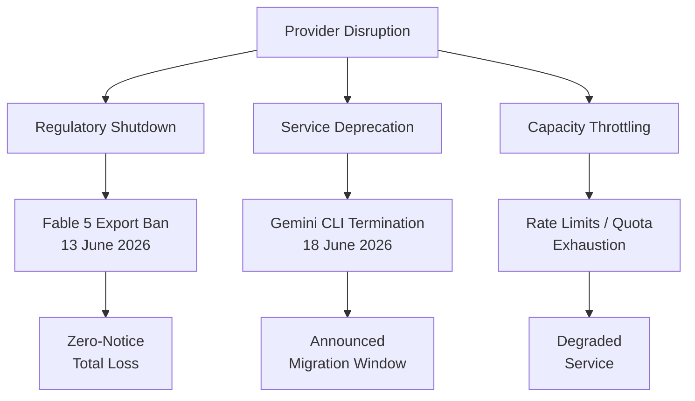
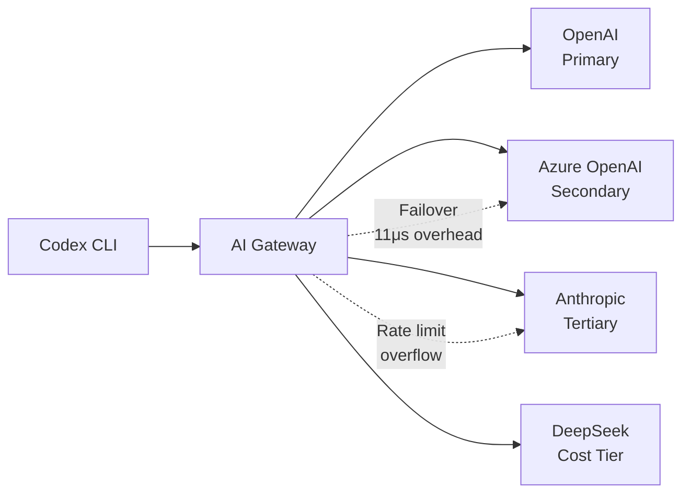
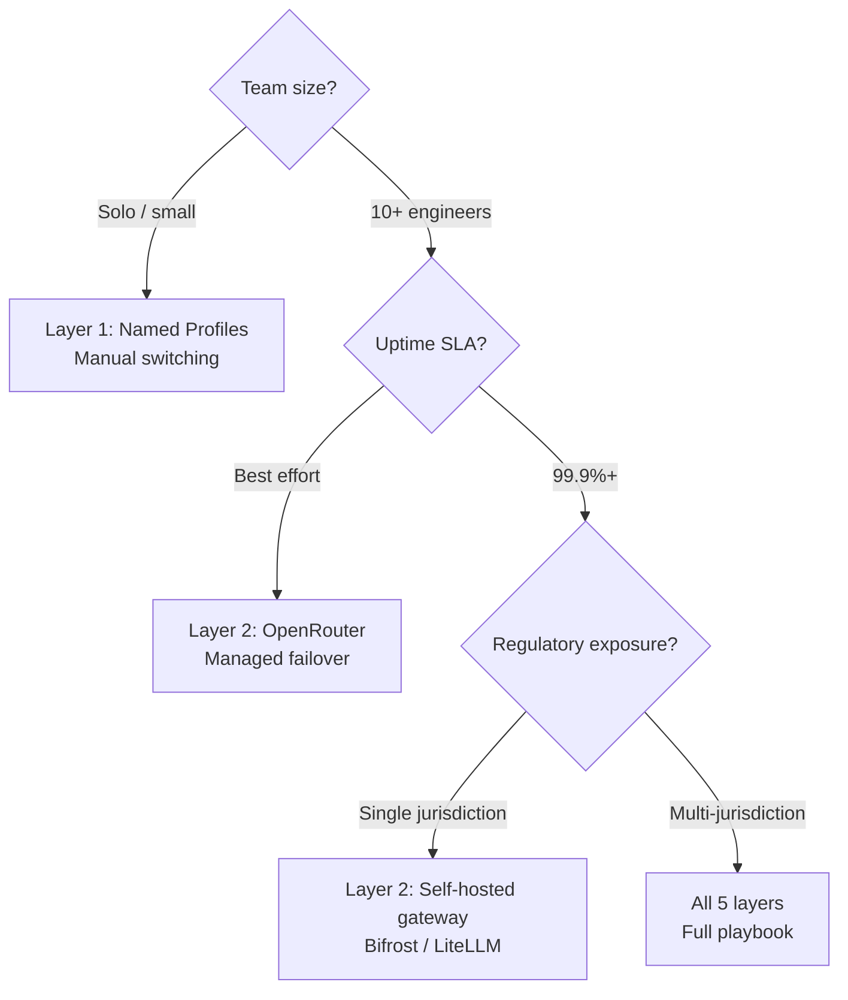

# Multi-Provider Resilience Playbook: Failover, Routing, and Regulatory Risk Management for Codex CLI


---

## The Week That Proved Single-Provider Is Over

Within six days in June 2026, two provider-level disruptions reshaped how engineering teams think about coding agent infrastructure. On 13 June, the US Department of Commerce issued an export-control directive forcing Anthropic to disable Claude Fable 5 and Mythos 5 globally — affecting every foreign national, including Anthropic's own employees[^1][^2]. On 18 June, Google terminated Gemini CLI for all free, AI Pro, and Ultra subscribers, breaking CI/CD pipelines mid-flight[^3][^4].

These were not hypothetical risks. Teams running single-provider configurations lost their primary coding agent with zero notice. The lesson is architectural: **provider diversification is no longer optional — it is an operational requirement**.

This playbook synthesises the provider disruption patterns, Codex CLI's native multi-provider capabilities, gateway-layer failover architectures, credential management strategies, and regulatory risk assessment into a single actionable framework.

---

## The Three Disruption Classes



Each class demands a different response pattern:

1. **Regulatory shutdown** — no warning, total access loss, potentially permanent. Requires pre-configured alternative providers ready to activate immediately.
2. **Service deprecation** — announced migration window (Gemini CLI gave roughly one month[^4]). Requires tested migration paths and CI compatibility checks.
3. **Capacity throttling** — gradual degradation via rate limits or quota exhaustion. Requires dynamic routing to spread load across providers.

---

## Layer 1: Codex CLI Native Provider Configuration

Codex CLI supports multiple providers through its `config.toml` provider system[^5][^6]. The critical architectural point: **provider definitions must live in the user-level `~/.codex/config.toml`**, not in project-local configuration. Codex ignores `model_provider` and `model_providers` keys in project-local files and prints a startup warning[^7].

### Defining Multiple Providers

```toml
# ~/.codex/config.toml

# Primary provider
model = "gpt-5.5"
model_provider = "openai"

# Azure OpenAI as alternative
[model_providers.azure]
name = "Azure OpenAI"
base_url = "https://myorg.openai.azure.com/openai"
env_key = "AZURE_OPENAI_API_KEY"
wire_api = "responses"

# OpenRouter as failover aggregator
[model_providers.openrouter]
name = "OpenRouter"
base_url = "https://openrouter.ai/api/v1"
env_key = "OPENROUTER_API_KEY"
wire_api = "responses"

# Amazon Bedrock for regulated workloads
[model_providers.amazon-bedrock]
name = "Amazon Bedrock"
base_url = "https://bedrock-runtime.eu-west-1.amazonaws.com"
wire_api = "responses"

[model_providers.amazon-bedrock.aws]
profile = "codex-prod"
region = "eu-west-1"
```

### Named Profiles for Instant Switching

Named profiles allow switching entire provider configurations with a single flag[^8]:

```toml
[profile.failover]
model = "deepseek-v4"
model_provider = "openrouter"

[profile.regulated]
model = "gpt-5.4"
model_provider = "azure"

[profile.fast]
model = "gpt-5.4-mini"
model_provider = "openai"
```

Activate with:

```bash
# Normal operation
codex "implement the auth middleware"

# Primary provider down — switch instantly
codex --profile failover "implement the auth middleware"

# Regulated workload requiring data residency
codex --profile regulated "review the PCI compliance module"
```

### Built-in Retry Configuration

Codex CLI provides per-provider retry settings for transient failures[^5]:

```toml
[model_providers.openai]
request_max_retries = 4      # HTTP request retries
stream_max_retries = 5       # SSE stream reconnection attempts
stream_idle_timeout_ms = 300000  # 5-minute idle timeout
```

These handle transient network issues but **do not provide cross-provider failover**. For that, you need a gateway layer.

---

## Layer 2: Gateway-Layer Failover

Codex CLI's native configuration selects a single provider per invocation. True automatic failover — where a failed request transparently routes to an alternative provider — requires an intermediary gateway[^9][^10].



### Gateway Options

| Gateway | Type | Failover | Codex Integration |
|---------|------|----------|-------------------|
| Bifrost (Maxim AI) | Open-source, Go | Hierarchical chain | Native OpenAI-compatible endpoint[^9] |
| OpenRouter | Managed SaaS | Automatic per-model | Single API key, 300+ models[^11] |
| LiteLLM | Open-source, Python | Config-based | OpenAI-compatible proxy[^10] |
| Cloudflare AI Gateway | Managed | Per-route failover | URL-based routing[^10] |

### Bifrost Configuration Example

Bifrost adds 11 microseconds of gateway overhead at 5,000 requests per second[^9]:

```toml
# ~/.codex/config.toml — point at local Bifrost instance
model = "gpt-5.5"
model_provider = "bifrost"

[model_providers.bifrost]
name = "Bifrost Gateway"
base_url = "http://localhost:8080/v1"
env_key = "BIFROST_API_KEY"
wire_api = "responses"
```

Bifrost's routing configuration then handles the failover chain:

```yaml
# bifrost-config.yaml
routes:
  - id: codex-primary
    models: ["gpt-5.5", "gpt-5.4"]
    providers:
      - name: openai
        priority: 1
        weight: 100
      - name: azure
        priority: 2
        weight: 100
        conditions:
          on_error: [429, 500, 502, 503]
      - name: openrouter
        priority: 3
        weight: 100
        conditions:
          on_error: [429, 500, 502, 503]
          on_timeout: 30s
```

### OpenRouter as Simplified Failover

For teams wanting failover without self-hosting infrastructure, OpenRouter provides a managed routing layer with built-in provider failover[^11]:

```toml
# ~/.codex/config.toml
model = "openai/gpt-5.5"
model_provider = "openrouter"

[model_providers.openrouter]
name = "OpenRouter"
base_url = "https://openrouter.ai/api/v1"
env_key = "OPENROUTER_API_KEY"
wire_api = "responses"
```

---

## Layer 3: Credential Management

Multi-provider configurations multiply the credential surface. Each provider needs its own API key, and those keys must be rotated, scoped, and isolated.

### Environment Variable Isolation

Each provider requires its own environment variable containing the corresponding API key. Set these in your shell profile or inject them via a secrets manager:

- `OPENAI_API_KEY` — primary provider
- `AZURE_OPENAI_API_KEY` — secondary provider
- `OPENROUTER_API_KEY` — aggregator/failover
- `BIFROST_API_KEY` — gateway authentication

### Command-Backed Authentication

For enterprise environments with rotating credentials, Codex CLI supports command-backed bearer tokens[^5]:

```toml
[model_providers.azure.auth]
command = "az"
args = ["account", "get-access-token", "--resource", "https://cognitiveservices.azure.com", "--query", "accessToken", "-o", "tsv"]
timeout_ms = 5000
refresh_interval_ms = 3300000  # Refresh every 55 minutes
```

This pattern integrates with:
- AWS SSO via `aws sso get-role-credentials`
- GCP via `gcloud auth print-access-token`
- Vault via `vault read -field=token secret/codex`

### Key Rotation Script

```bash
#!/usr/bin/env bash
# rotate-codex-keys.sh — run weekly via cron
set -euo pipefail

# Rotate OpenRouter key
NEW_KEY=$(curl -s -X POST https://openrouter.ai/api/v1/keys/rotate \
  -H "Authorization: Bearer ${OPENROUTER_ADMIN_KEY}" | jq -r '.key')

# Update secrets manager
aws secretsmanager put-secret-value \
  --secret-id codex/openrouter \
  --secret-string "${NEW_KEY}"

echo "OpenRouter key rotated: ${NEW_KEY:0:8}..."
```

---

## Layer 4: Regulatory Risk Assessment

The Fable 5 ban introduced a new failure mode: **regulatory shutdown with zero notice**[^1]. Teams must now assess geopolitical risk per provider.

### Risk Matrix

| Provider | Jurisdiction | Export Control Risk | Data Residency Options |
|----------|-------------|--------------------|-----------------------|
| OpenAI | US | Medium — subject to Commerce Dept directives | Azure sovereign regions |
| Anthropic | US | **High** — demonstrated June 2026[^1] | AWS Bedrock (regional) |
| Google | US | Medium — Gemini CLI terminated for commercial reasons[^3] | GCP regional endpoints |
| DeepSeek | China | High — subject to both US and Chinese regulation | Self-hosted only |
| Mistral | France/EU | Low — EU AI Act applies, no export controls | EU-only deployment |

### Mitigation Strategies

1. **Jurisdiction diversification** — maintain at least one provider outside your primary regulatory jurisdiction
2. **Open-weights fallback** — DeepSeek V4, Qwen 3.5 Coder, and MiniMax M3 all support the tool-calling protocol Codex requires[^12]
3. **Self-hosted escape hatch** — maintain tested Ollama or vLLM deployments for emergency continuity
4. **Contract review** — audit provider terms for termination notice periods and data deletion timelines

### Emergency Activation Runbook

```bash
#!/usr/bin/env bash
# activate-failover.sh — when primary provider goes down
set -euo pipefail

PROVIDER="${1:-openrouter}"
echo "Activating failover to ${PROVIDER}..."

# Verify provider is accessible
codex --profile "${PROVIDER}" -q "echo hello" 2>/dev/null \
  || { echo "FATAL: ${PROVIDER} also unreachable"; exit 1; }

# Update team-wide default
echo "model_provider = \"${PROVIDER}\"" > /tmp/codex-failover.toml
echo "Failover active. Use: codex --profile ${PROVIDER}"
echo "Or set CODEX_PROFILE=${PROVIDER} in CI environment"
```

---

## Layer 5: CI/CD Pipeline Resilience

The Gemini CLI shutdown broke CI/CD pipelines mid-flight[^3]. Codex CLI pipelines need the same resilience patterns:


```yaml
# .github/workflows/codex-resilient.yml
name: Resilient Codex Pipeline
on: [push]

env:
  CODEX_PRIMARY_PROVIDER: openai
  CODEX_FALLBACK_PROVIDER: openrouter

jobs:
  agent-task:
    runs-on: ubuntu-latest
    steps:
      - uses: actions/checkout@v4

      - name: Run with failover
        env:
          OPENAI_API_KEY: ${{ secrets.OPENAI_API_KEY }}
          OPENROUTER_API_KEY: ${{ secrets.OPENROUTER_API_KEY }}
        run: |
          # Try primary
          if ! codex exec --profile primary "run tests" 2>/dev/null; then
            echo "::warning::Primary provider failed, activating fallback"
            codex exec --profile failover "run tests"
          fi
```


---

## Decision Framework: Which Layer Do You Need?



---

## Summary

| Layer | Addresses | Complexity | Time to Implement |
|-------|-----------|------------|-------------------|
| Native profiles | Manual switching | Low | 10 minutes |
| Gateway failover | Automatic rerouting | Medium | 1–2 hours |
| Credential management | Key rotation, scoping | Medium | Half day |
| Regulatory assessment | Jurisdiction risk | Low (process) | Ongoing |
| CI/CD resilience | Pipeline continuity | Medium | 1–2 hours |

The Fable 5 export ban and Gemini CLI shutdown proved that provider disruption is not a theoretical risk — it is an operational reality that occurred twice in one week. Teams running Codex CLI in production need at minimum Layer 1 (named profiles with pre-tested alternatives) and should strongly consider Layer 2 (gateway failover) for any workflow where downtime carries business cost.

---

## Citations

[^1]: Anthropic, "Statement on the US government directive to suspend access to Fable 5 and Mythos 5," 13 June 2026. [https://www.anthropic.com/news/fable-mythos-access](https://www.anthropic.com/news/fable-mythos-access)

[^2]: CNBC, "Anthropic disables access to Fable 5 and Mythos 5 to comply with government directive," 12 June 2026. [https://www.cnbc.com/2026/06/12/anthropic-disables-access-to-fable-5-and-mythos-5-to-comply-with-government-directive.html](https://www.cnbc.com/2026/06/12/anthropic-disables-access-to-fable-5-and-mythos-5-to-comply-with-government-directive.html)

[^3]: TechTimes, "Gemini CLI Shutdown Takes Effect: CI/CD Pipelines Break as Go-Based Antigravity CLI Arrives," 18 June 2026. [https://www.techtimes.com/articles/318660/20260618/gemini-cli-shutdown-takes-effect-ci-cd-pipelines-break-go-based-antigravity-cli-arrives.htm](https://www.techtimes.com/articles/318660/20260618/gemini-cli-shutdown-takes-effect-ci-cd-pipelines-break-go-based-antigravity-cli-arrives.htm)

[^4]: ChatForest, "Google Is Killing Gemini CLI on June 18 — Your Migration Checklist to Antigravity CLI," May 2026. [https://chatforest.com/builders-log/gemini-cli-dead-june-18-antigravity-cli-agy-migration/](https://chatforest.com/builders-log/gemini-cli-dead-june-18-antigravity-cli-agy-migration/)

[^5]: OpenAI, "Configuration Reference — Codex," 2026. [https://developers.openai.com/codex/config-reference](https://developers.openai.com/codex/config-reference)

[^6]: OpenAI, "Advanced Configuration — Codex," 2026. [https://developers.openai.com/codex/config-advanced](https://developers.openai.com/codex/config-advanced)

[^7]: MorphLLM, "Codex config.toml (2026): Add Any Custom Provider in 6 Lines," 2026. [https://www.morphllm.com/codex-provider-configuration](https://www.morphllm.com/codex-provider-configuration)

[^8]: Daniel Vaughan, "Codex CLI Named Profiles: A Cookbook of Ready-to-Use Configuration Templates," 30 April 2026. [https://codex.danielvaughan.com/2026/04/30/codex-cli-named-profiles-cookbook-configuration-templates/](https://codex.danielvaughan.com/2026/04/30/codex-cli-named-profiles-cookbook-configuration-templates/)

[^9]: Maxim AI, "Best AI Gateway to Route Codex CLI to Any Model," 2026. [https://www.getmaxim.ai/articles/best-ai-gateway-to-route-codex-cli-to-any-model/](https://www.getmaxim.ai/articles/best-ai-gateway-to-route-codex-cli-to-any-model/)

[^10]: Maxim AI, "Top 5 LLM Failover Routing Gateways in 2026," 2026. [https://www.getmaxim.ai/articles/top-5-llm-failover-routing-gateways-in-2026/](https://www.getmaxim.ai/articles/top-5-llm-failover-routing-gateways-in-2026/)

[^11]: OpenRouter, "Integration with Codex CLI," 2026. [https://openrouter.ai/docs/guides/coding-agents/codex-cli](https://openrouter.ai/docs/guides/coding-agents/codex-cli)

[^12]: FutureAGI, "Using OpenAI Codex CLI with Multiple Model Providers in 2026: A Gateway Setup Guide," 2026. [https://futureagi.com/blog/openai-codex-cli-multiple-model-providers-gateway-setup-2026/](https://futureagi.com/blog/openai-codex-cli-multiple-model-providers-gateway-setup-2026/)
