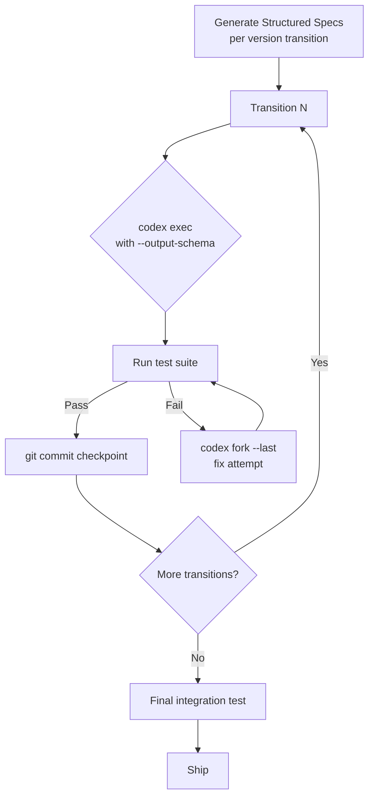

# SWE-Chain: What the Chained Release Upgrade Benchmark Means for Codex CLI Migration Pipelines


---

Single-issue benchmarks have dominated the coding agent evaluation landscape since SWE-bench landed in 2024. They ask a simple question: can the agent fix this bug? But real maintenance work rarely involves a single fix. A team upgrading Flask from 2.x through 3.0 to 3.1 faces a chain of cumulative changes — each release inheriting the agent's prior modifications, not the upstream baseline. SWE-Chain, published by Lam et al. in May 2026, is the first benchmark to evaluate coding agents on precisely this sequential, compounding workflow [^1].

The results are sobering. Across nine frontier agent configurations, the average resolving rate sits at 44.8% under the Build+Fix regime — and error propagation across chain links means that early mistakes cascade into later failures [^1]. For Codex CLI practitioners running real-world upgrade campaigns, these findings offer concrete guidance on session architecture, specification quality, and cost control.

## What SWE-Chain Measures

SWE-Chain comprises 12 upgrade chains across 9 Python packages — attrs, Conan, Flask, Jinja2, Poetry, PyJWT, pytest, urllib3, and xarray — totalling 155 version transitions and 1,660 grounded upgrade requirements [^1]. Each transition starts from the agent's own prior output, not a clean upstream snapshot. This design captures the central challenge of maintenance: carrying your own changes forward without breaking existing functionality.

The benchmark uses a divide-and-conquer synthesis pipeline (DecompSynth) that aligns release notes with actual code diffs to produce specifications at three granularity levels [^1]:

- **L1**: Problem statement only
- **L2**: Problem statement plus conceptual expectations
- **L3** (default): Problem statement, expectations, and concrete API/behavioural constraints

The difference between raw GitHub artifacts and structured specifications is stark: Claude-Opus-4.7 achieves just 8.9% precision with raw artifacts versus 80.6% with L3 specifications [^1].

## The Leaderboard

Nine frontier configurations were evaluated under the Build+Fix regime, which permits one error-correction attempt after execution failures [^1]:

| Agent + Model | Resolving | Precision | F1 |
|---|---|---|---|
| Claude Code + Opus 4.7 | 60.8% | 80.6% | 68.5% |
| Codex CLI + GPT-5.5 | 57.5% | 80.1% | 64.8% |
| Codex CLI + GPT-5.3-Codex | 51.8% | 76.3% | 59.2% |
| Codex CLI + GPT-5.4 | 47.5% | 72.2% | 54.9% |
| Claude Code + Opus 4.6 | 44.3% | 64.9% | 50.8% |
| OpenCode + GPT-5.4 | 43.4% | 63.8% | 46.5% |
| Claude Code + Sonnet 4.6 | 39.8% | 66.5% | 45.9% |
| OpenCode + GLM-5.1 | 38.1% | 49.9% | 40.1% |
| OpenCode + MiniMax-M2.7-HS | 20.2% | 34.2% | 21.2% |

Two patterns stand out. First, the harness matters: Codex CLI with GPT-5.4 outperforms OpenCode with the same model by 4.1pp resolving and 8.4pp precision [^1]. Second, package-specific variation is substantial — no single agent dominates across all chains, with Claude-Opus-4.7 excelling on xarray and pytest while GPT-based models lead on Flask and Jinja2 [^1].

## Three Findings That Change How You Configure Codex CLI

### 1. Cascading Failures Demand Session Isolation Per Transition

Chain difficulty varies dramatically, from 23.3% to 68.5% average resolving rates [^1]. The driver is not package size alone but the interaction between codebase scale, per-upgrade diff magnitude, and change density. Smaller packages like PyJWT show 68.5% average resolving, whilst larger systems like xarray drop below 30% [^1].

The implication for Codex CLI is clear: running an entire upgrade chain in a single session is a recipe for compounding errors. Context accumulates, earlier mistakes become invisible, and the agent loses the ability to distinguish its own drift from intentional upstream changes.

The remedy is **one session per version transition**, using `codex fork` to branch from a verified checkpoint [^4] [^5]:

```bash
# Transition 1: upgrade from v2.0 to v2.1
codex --model o4-mini \
  "Upgrade flask from 2.0.3 to 2.1.0 following the migration spec in docs/upgrade-2.1.md"

# Verify before proceeding
pytest && git add -A && git commit -m "chore: upgrade flask 2.0.3 → 2.1.0"

# Transition 2: fork a clean session for the next link
codex fork --last \
  "Upgrade flask from 2.1.0 to 2.2.0 following the migration spec in docs/upgrade-2.2.md"
```

Each session starts with full context from the prior transition's verified state but without the accumulated reasoning debris. This maps directly to SWE-Chain's finding that the Build+Fix protocol (one correction attempt per transition) improves precision substantially over Build-only [^1].

### 2. Specification Quality Is the Dominant Variable

The 10× precision gap between raw artifacts and structured specifications is the single most actionable finding in the paper [^1]. Raw GitHub issue and PR text contains noise — discussion threads, tangential comments, unresolved debates — that actively misleads agents.

For Codex CLI upgrade pipelines, this means investing time in structured migration specifications before invoking the agent. An AGENTS.md directive can encode the specification template:

```markdown
## Upgrade Specification Format

When performing a version upgrade, the migration spec MUST include:

1. **Problem statement**: Which package, from which version, to which version
2. **Expectations**: What behavioural changes the upgrade introduces
3. **Constraints**: Specific API changes, deprecated parameters, new required
   configuration keys, and breaking changes with their remediation patterns
4. **Verification criteria**: Commands or test patterns that confirm success
```

For automated pipelines using `codex exec`, pass the specification via `--output-schema` to enforce structured verification output:

```bash
codex exec \
  --model gpt-5.5 \
  --output-schema '{"type":"object","properties":{"upgraded":{"type":"boolean"},"breaking_changes_resolved":{"type":"array","items":{"type":"string"}},"tests_passing":{"type":"boolean"},"notes":{"type":"string"}},"required":["upgraded","tests_passing"]}' \
  "Upgrade pytest from 8.2.2 to 8.3.0 per the spec in docs/upgrade-spec.md"
```

The structured output forces the agent to self-report on breaking changes resolved and test status, creating an auditable record for each chain link.

### 3. Cost Does Not Guarantee Performance

SWE-Chain's cost data reveals a counterintuitive pattern: Claude-Opus-4.7 consumes \$150.39 per chain (350.7M tokens, 3.13 hours), whilst GPT-5.5 achieves comparable results at \$131.34 (184.7M tokens, 3.23 hours) [^1]. The token-to-performance ratio favours GPT-5.5 — nearly half the tokens for a 3.7pp resolving gap.

More striking is that GPT-5.3-Codex, a smaller model, outperforms GPT-5.4 by 4.3pp resolving at lower cost [^1]. This aligns with the broader pattern observed in HarnessX research: model-specific harness tuning matters more than raw model capability for structured tasks [^2].

Codex CLI named profiles make model selection per upgrade chain practical:

```toml
# ~/.codex/config.toml

[profile.upgrade-simple]
model = "o4-mini"
# Small packages, well-documented upgrades

[profile.upgrade-complex]
model = "gpt-5.5"
# Large codebases, complex breaking changes

[profile.upgrade-verify]
model = "o3"
# Verification-only: review the agent's upgrade output
```

```bash
codex --profile upgrade-simple "Upgrade pyjwt from 2.8 to 2.9"
codex --profile upgrade-complex "Upgrade xarray from 2024.09 to 2024.10"
```

## The Sequential Pipeline Pattern

Combining these findings into a complete workflow for chained upgrades:



A shell script orchestrating this pattern:

```bash
#!/usr/bin/env bash
set -euo pipefail

SPECS_DIR="docs/upgrade-specs"
PACKAGE="flask"

for spec in "$SPECS_DIR"/${PACKAGE}-*.md; do
  version=$(basename "$spec" .md | sed "s/${PACKAGE}-//")
  echo "=== Upgrading to $version ==="

  codex exec \
    --model gpt-5.5 \
    --output-schema '{"type":"object","properties":{"upgraded":{"type":"boolean"},"tests_passing":{"type":"boolean"},"breaking_changes":{"type":"array","items":{"type":"string"}}},"required":["upgraded","tests_passing"]}' \
    "Upgrade $PACKAGE to $version following the spec in $spec. Run tests after."

  if ! pytest --tb=short; then
    echo "Tests failed for $version — attempting fix"
    codex exec --model gpt-5.5 \
      "The upgrade to $PACKAGE $version has failing tests. Fix them without reverting the upgrade."
    pytest --tb=short || { echo "FATAL: $version upgrade failed"; exit 1; }
  fi

  git add -A
  git commit -m "chore($PACKAGE): upgrade to $version"
  echo "=== $version complete ==="
done

echo "All transitions complete. Running integration suite."
pytest --tb=long
```

## How SWE-Chain Complements RoadmapBench

RoadmapBench, published the same week by Xu et al., evaluates a related but distinct challenge: implementing an entire version's worth of features from a roadmap specification, with a median modification of 3,700 lines across 51 files [^3]. Where SWE-Chain measures sequential chain fidelity (can you carry forward without breaking?), RoadmapBench measures planning and implementation scope (can you build all of this from scratch?). Claude-Opus-4.7 resolves only 39.1% of RoadmapBench tasks [^3] — substantially lower than its 60.8% on SWE-Chain — confirming that long-horizon greenfield implementation remains harder than sequential maintenance.

For Codex CLI users, the two benchmarks together validate a practical rule: **prefer incremental, chained transitions over ambitious single-shot upgrades**. A 10-step chain of minor version bumps will outperform a single leap across major versions, both in agent success rate and in reviewability.

## Practical Recommendations

1. **One session per transition.** Use `codex fork` or fresh `codex exec` invocations per version step. Never chain multiple upgrades in a single session.

2. **Invest in structured specifications.** The 10× precision gap from raw-to-structured specs justifies spending 30 minutes writing a proper migration document per transition. Encode the template in AGENTS.md so agents self-enforce the format.

3. **Use `--output-schema` for every transition.** Structured output creates an auditable trail of what the agent believes it changed, which breaking changes it addressed, and whether tests pass.

4. **Match model to chain complexity.** Simple upgrades (PyJWT, attrs) work well with `o4-mini`. Complex packages (xarray, pytest) justify `gpt-5.5`. The cost data shows diminishing returns from simply using the most expensive model.

5. **Commit between transitions.** Each git commit is a checkpoint. If transition N+1 fails catastrophically, `git revert` returns you to a known-good state without re-running the entire chain.

6. **Run the full test suite at every checkpoint.** SWE-Chain's Build+Fix regime shows that one correction attempt materially improves outcomes. But the correction only works if you detect the failure immediately, not three transitions later.

## Citations

[^1]: Lam, M.H., Wang, C., Liu, H., Xiao, J., Li, H., Huang, J., Zhuo, T.Y., Lyu, M.R. (2026). "SWE-Chain: Benchmarking Coding Agents on Chained Release-Level Package Upgrades." arXiv:2605.14415. [https://arxiv.org/abs/2605.14415](https://arxiv.org/abs/2605.14415)

[^2]: Chen, X. et al. (2026). "HarnessX: A Composable, Evolvable Agent Harness Foundry." arXiv:2606.14249. [https://arxiv.org/abs/2606.14249](https://arxiv.org/abs/2606.14249)

[^3]: Xu, X. et al. (2026). "RoadmapBench: Evaluating Long-Horizon Agentic Software Development Across Version Upgrades." arXiv:2605.15846. [https://arxiv.org/abs/2605.15846](https://arxiv.org/abs/2605.15846)

[^4]: OpenAI. (2026). "Codex CLI v0.141.0 Release Notes." GitHub. [https://github.com/openai/codex/releases](https://github.com/openai/codex/releases)

[^5]: OpenAI. (2026). "Codex CLI Documentation: Session Management." [https://developers.openai.com/codex](https://developers.openai.com/codex)
