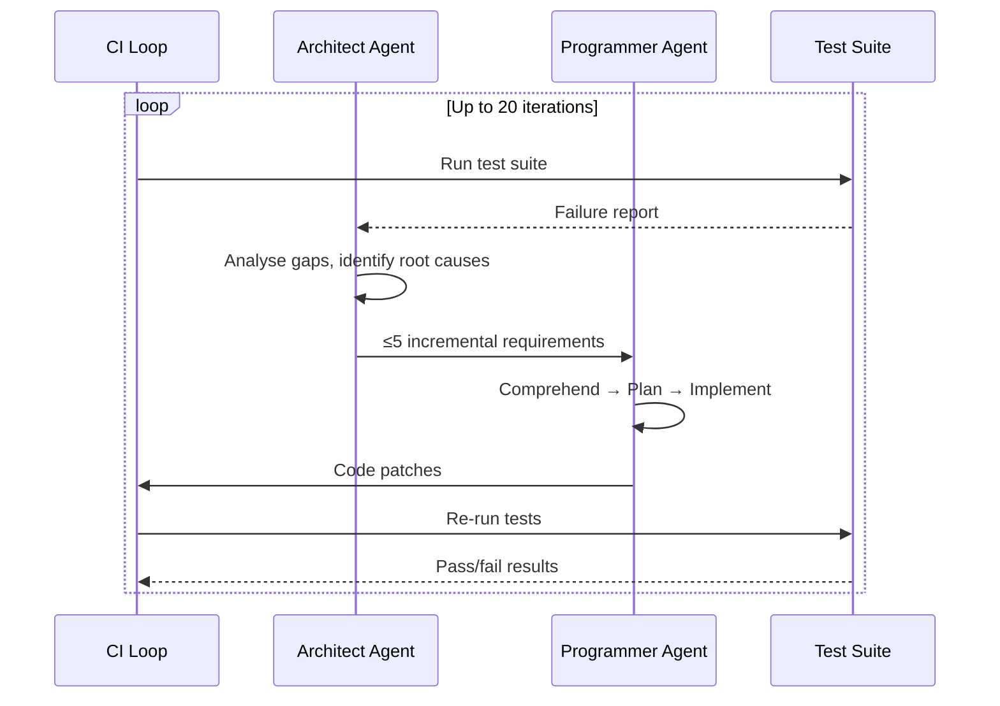

# SWE-CI: What the Continuous Integration Maintenance Benchmark Means for Codex CLI Regression Defence


---

Most coding agent benchmarks ask a single question: *can the agent fix this bug?* SWE-CI asks a far harder one: *can the agent keep fixing bugs without breaking what already works?* The answer, for every model tested, is sobering — and directly relevant to how you configure Codex CLI for sustained codebase maintenance.

## The Problem with Snapshot Benchmarks

SWE-bench Verified, Terminal-Bench, and their successors measure functional correctness at a single point in time [^1]. An agent patches a failing test, the benchmark records a pass, and nobody checks whether the next twenty patches introduce regressions. In production, though, maintenance is iterative: you ship a fix on Monday, discover it broke an edge case on Tuesday, and refactor both on Wednesday. Snapshot benchmarks capture none of this.

Chen et al. introduced SWE-CI (arXiv:2603.03823, March 2026) to close that gap [^2]. The benchmark models the continuous integration loop itself — not as a one-shot evaluation, but as a sustained sequence of analyse-code-test iterations across real repository histories.

## How SWE-CI Works

SWE-CI comprises 100 tasks drawn from 68 distinct Python repositories, each spanning an average of 233 days and 71 consecutive commits between base and target codebases [^2]. Every task requires a minimum of 1,000 lines of change. The evaluation consumed over 10 billion tokens across all models tested [^2].

The benchmark uses a dual-agent protocol that mirrors real development workflows:



The **Architect Agent** analyses test failures, locates deficiencies, and produces up to five natural-language requirements per iteration. The **Programmer Agent** then comprehends, plans, and implements those requirements [^2]. This separation prevents the common failure mode where a single agent oscillates between analysis and implementation without converging.

### EvoScore: Measuring Maintainability Over Time

SWE-CI introduces **EvoScore**, a future-weighted aggregate metric that rewards stability in later iterations [^2]:

```
EvoScore = Σ(γ^i × a(c_i)) / Σ(γ^i)
```

Where `γ ≥ 1` weights later iterations more heavily, and `a(c_i)` is the normalised change at iteration `i`, ranging from −1 (total regression) to +1 (complete resolution). This penalises agents that make early gains but accumulate technical debt — precisely the failure mode that snapshot benchmarks miss.

## Key Findings

### 1. Zero-Regression Rates Are Alarmingly Low

Most models achieve zero-regression rates below 0.25; only Claude Opus variants exceed 0.5 [^2]. This means that in more than 75% of iterations, the typical agent introduces at least one regression while attempting repairs.

### 2. Regression Frequency Increases Over Time

Twelve of the twenty models tested show increasing regression frequency as iterations progress, while eleven show decreasing regression magnitude [^2]. The interpretation: as tasks become harder, models resort to trial-and-error — each attempt is less destructive individually, but the cumulative effect compounds.

### 3. The Code Style Paradox

Fifteen of twenty models outperform human oracle code on Pylint scores (surface formatting), yet all twenty underperform on Maintainability Index [^2]. Agents produce code that *looks* clean but *is* structurally complex — a trap for teams that rely on linting as a proxy for quality.

### 4. Concise but Not Maintainable

All twenty models generate more concise patches than humans, yet with lower maintainability [^2]. Human developers intentionally invest in abstraction and modularity; agents optimise for the shortest path to a passing test.

### 5. Performance Plateaus Early

The majority of gains occur in iterations 1–4, with diminishing returns thereafter [^2]. Most models resolve fewer than 50% of requirements, and weaker models exhaust the 20-turn budget without completion.

## Mapping SWE-CI Findings to Codex CLI Configuration

SWE-CI's findings map directly to five Codex CLI configuration primitives. Here's how to apply them.

### PostToolUse Hooks for Regression Gates

The most impactful defence against the regression accumulation SWE-CI documents is a PostToolUse hook that runs your test suite after every file write [^3]:

```toml
# .codex/config.toml
[features]
hooks = true

[[hooks.PostToolUse]]
matchers = [{ tool_name = "write|patch|apply" }]

[[hooks.PostToolUse.hooks]]
command = "python -m pytest tests/ --tb=short -q 2>&1 | tail -20"
timeout_ms = 60000
```

When the hook detects regressions, it injects failure context back into the agent's conversation, forcing immediate correction before the next iteration compounds the damage [^3]. This directly addresses SWE-CI's observation that regression frequency increases across iterations — by catching regressions at iteration boundaries rather than letting them accumulate.

### Stop Hooks for Turn-Boundary Quality Gates

SWE-CI's EvoScore rewards stability in later iterations. You can enforce this with a Stop hook that blocks the agent from declaring completion until quality thresholds are met [^3]:

```toml
[[hooks.Stop]]

[[hooks.Stop.hooks]]
command = "bash -c 'FAILURES=$(python -m pytest tests/ -q 2>&1 | grep -c FAILED); if [ \"$FAILURES\" -gt 0 ]; then echo \"{\\\"decision\\\": \\\"block\\\", \\\"reason\\\": \\\"$FAILURES test failures remain\\\"}\"; else echo \"{\\\"decision\\\": \\\"allow\\\"}\"; fi'"
timeout_ms = 120000
```

When the Stop hook returns `decision: "block"`, Codex CLI creates an automatic follow-up prompt rather than terminating the session [^3]. This mirrors SWE-CI's iterative loop without requiring manual intervention.

### Named Profiles for Task Complexity Routing

SWE-CI reveals that different models exhibit divergent maintenance strategies — some favour short-term gains whilst others optimise for long-term maintainability [^2]. Named profiles let you route tasks accordingly [^4]:

```toml
# ~/.codex/maintenance-conservative.config.toml
model = "o3"
model_auto_compact_token_limit = 120000
tool_output_token_limit = 8000
approval_policy = "on-request"

[features]
hooks = true
```

```toml
# ~/.codex/maintenance-aggressive.config.toml
model = "o4-mini"
model_auto_compact_token_limit = 80000
tool_output_token_limit = 16000
approval_policy = "never"
```

Use `--profile maintenance-conservative` for long-lived maintenance branches where regression risk is high, and `--profile maintenance-aggressive` for greenfield features where velocity matters more [^4].

### AGENTS.md Architect/Programmer Separation

SWE-CI's dual-agent protocol outperforms single-agent approaches because it separates analysis from implementation. Encode this in your project's AGENTS.md [^5]:

```markdown
# Maintenance Protocol

When resolving test failures across multiple files:

1. **Analyse first**: List all failing tests, identify root causes, and produce
   a numbered requirements list (maximum 5 per iteration) BEFORE writing any code.
2. **Implement incrementally**: Address one requirement at a time. Run the test
   suite after each change.
3. **Never suppress tests**: If a test fails, fix the code — do not modify the
   test unless the test itself contains a verified bug.
4. **Regression check**: After each requirement is resolved, confirm that no
   previously passing tests have regressed.
```

This instruction pattern forces the agent into the Architect → Programmer separation that SWE-CI validates, even within a single-agent session [^5].

### Context Compaction Strategy

SWE-CI tasks average 71 commits of history. In long Codex CLI maintenance sessions, context bloat from accumulated test output triggers compaction, which can erase failure context the agent needs for later iterations [^6]. Tune compaction thresholds to preserve recent test results:

```toml
# Preserve more context for maintenance sessions
model_auto_compact_token_limit = 150000
tool_output_token_limit = 12000
```

The `tool_output_token_limit` caps individual test outputs but preserves them in the conversation; setting it too low loses diagnostic detail, whilst setting it too high triggers premature compaction of older, still-relevant context [^6].

## A CI Pipeline Pattern Using codex exec

SWE-CI's iterative loop maps naturally to a `codex exec` pipeline that runs maintenance passes as CI steps [^7]:

```bash
#!/usr/bin/env bash
# maintenance-pass.sh — run as a CI step
set -euo pipefail

FAILURES=$(python -m pytest tests/ -q 2>&1 | grep -c "FAILED" || true)

if [ "$FAILURES" -eq 0 ]; then
  echo "All tests passing — no maintenance needed"
  exit 0
fi

codex exec \
  --profile maintenance-conservative \
  --sandbox workspace-write \
  "There are $FAILURES failing tests in this repository. \
   Analyse each failure, produce a requirements list, then fix them \
   one at a time. Run pytest after each fix to confirm no regressions. \
   Do not modify test files unless you can prove the test itself is wrong."
```

This pattern gives you SWE-CI's iterative maintenance loop in production, with the regression gate hooks enforcing quality at every step.

## The Maintainability Gap Is the Next Frontier

SWE-CI's most uncomfortable finding is the code style paradox: agents produce code that passes linting but fails structural maintainability measures. This gap will not close by improving model capability alone — it requires explicit configuration that penalises short-term fixes at the expense of long-term quality.

For Codex CLI users, the practical implication is clear: snapshot-passing is not enough. Your harness must enforce regression stability across iterations, separate analysis from implementation, and gate completion on quality metrics that go beyond test pass rates. The tools are already in `config.toml` — SWE-CI provides the evidence for why you should use them.

## Citations

[^1]: SWE-bench Team, "SWE-bench: Can Language Models Resolve Real-World GitHub Issues?", Princeton NLP, 2024. [https://www.swebench.com/](https://www.swebench.com/)

[^2]: Chen, J., Xu, X., Wei, H., Chen, C., & Zhao, B., "SWE-CI: Evaluating Agent Capabilities in Maintaining Codebases via Continuous Integration", arXiv:2603.03823v4, March–April 2026. [https://arxiv.org/abs/2603.03823](https://arxiv.org/abs/2603.03823)

[^3]: OpenAI, "Hooks — Codex CLI", OpenAI Developers Documentation, 2026. [https://developers.openai.com/codex/hooks](https://developers.openai.com/codex/hooks)

[^4]: OpenAI, "Configuration Reference — Codex CLI", OpenAI Developers Documentation, 2026. [https://developers.openai.com/codex/config-reference](https://developers.openai.com/codex/config-reference)

[^5]: OpenAI, "AGENTS.md — Codex CLI", OpenAI Developers Documentation, 2026. [https://developers.openai.com/codex/agents-md](https://developers.openai.com/codex/agents-md)

[^6]: OpenAI, "Advanced Configuration — Codex CLI", OpenAI Developers Documentation, 2026. [https://developers.openai.com/codex/config-advanced](https://developers.openai.com/codex/config-advanced)

[^7]: OpenAI, "Command Line Options — Codex CLI", OpenAI Developers Documentation, 2026. [https://developers.openai.com/codex/cli/reference](https://developers.openai.com/codex/cli/reference)
