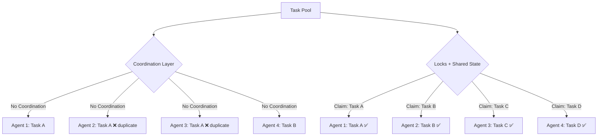

# Before the Pull Request: What the Multi-Agent Coordination Research Means for Codex CLI Parallel Workflows


Running multiple coding agents in parallel — agentmaxxing, as the community calls it — has become standard practice for senior developers in 2026[^1]. The pattern is simple: decompose work into independent tasks, launch agents in isolated worktrees, review, merge. What is less simple is stopping those agents from silently duplicating each other's work.

Dipankar Sarkar's "Before the Pull Request: Mining Multi-Agent Coordination" (arXiv:2606.19616, June 2026) provides the first controlled measurement of exactly how much effort parallel agents waste — and the answer is startling[^2].

## The 78% Waste Problem

Sarkar's experiment ran 32 concurrent agents across three coordination regimes: no coordination, advisory locks only, and locks combined with shared completion state[^2]. The results expose a coordination tax that no amount of hardware scaling can fix:

| Metric | No Coordination | Locks Only | Locks + Shared State |
|--------|-----------------|-----------|----------------------|
| Duplicate-work rate | 78% | 64% | 0% |
| Conflicting edits | 410 | 138 | 48 |
| Goodput (tasks/round) | 2.33 | 3.84 | 8.00 |

The headline number — 78% of agent effort wasted on duplicate work — aligns with practitioner reports that without task-claim mechanisms, "eight agents do the same work eight times"[^1]. Advisory leases alone reduced duplicate work only to 64%, because agents could not see what their peers had already completed[^2]. Goodput — the number of genuinely unique tasks completed per round — more than tripled only when mutual exclusion was combined with shared completion state[^2].



The critical design lesson is that **mutual exclusion and conflict-free shared state are jointly necessary**[^2]. Neither alone suffices. This finding converges with broader research showing that independent multi-agent architectures incur 58% additional token overhead, rising to 263% in decentralised systems[^3].

## Grite: Git-Native Coordination Without a Server

Sarkar's solution is **grite**, a Rust-based coordination substrate that stores its entire state as an append-only event log in `refs/grite/wal` inside the git repository itself[^4]. No server, no database, no external dependencies — just git push and fetch.

Grite tracks typed, content-addressed, cryptographically signed events: task creation, assignment, completion, lock acquisition, renewal, expiry, and denial[^2]. Because events are content-addressed, replicas receiving identical events in any order converge to byte-identical state — a property verified through property-based testing with zero data loss, unlike file-based tracking systems that silently lost concurrent writes[^2].

The core library (`libgrite-core`) implements a CRDT (Conflict-free Replicated Data Type) engine in pure Rust with no async runtime dependency, making it embeddable in CLI tools and resource-constrained environments[^4].

```bash
# Install grite and register it as a Claude Code skill
cargo install grite
grite install-skill

# Create a coordination workspace
grite init
grite issue create --title "Refactor auth middleware" --label backend
grite issue create --title "Add rate-limit headers" --label backend
grite issue create --title "Update API docs" --label docs

# Agent claims a task before starting work
grite issue assign AUTH-1 --agent codex-agent-01
```

## Four Hidden Coordination Failures

The research identified four failure modes that are invisible in conventional PR histories[^2]:

1. **Conflicting edits** — cross-actor overwrites where two agents modify the same file without awareness, reduced from 104 to 12 events with full coordination
2. **Redundant rediscovery** — agents re-completing already-finished tasks, eliminated entirely (36 to 0) only with shared completion state
3. **Lock starvation** — agents unable to acquire work because peers hold broad leases, appearing as 12 events across all coordination arms
4. **Race-to-close** — agents rushing to claim credit for the same resolution, completely invisible in PR-level analysis

These failure modes map directly to the practical ceiling that developers report: 5–7 concurrent agents on a laptop before rate limits, merge conflicts, and review bottleneck consume the gains[^1].

## Mapping to Codex CLI Parallel Patterns

Codex CLI offers several mechanisms for parallel execution, but none currently provide the coordination layer that Sarkar's research shows is necessary. Here is how to build it.

### Worktree Isolation: Necessary but Not Sufficient

Codex CLI's worktree model gives each task its own working directory, branch, and file state whilst sharing commit history[^5]. This prevents file-level conflicts but does nothing to prevent duplicate work — precisely the distinction Sarkar's experiment quantifies.

```bash
# Create isolated worktrees for parallel agents
git worktree add ../auth-refactor feature/auth-refactor
git worktree add ../rate-limits feature/rate-limits
git worktree add ../api-docs feature/api-docs

# Launch agents in separate worktrees
cd ../auth-refactor && codex exec "Refactor auth middleware to use JWT validation"
cd ../rate-limits && codex exec "Add X-RateLimit headers to all API responses"
cd ../api-docs && codex exec "Update OpenAPI spec for new rate-limit headers"
```

### Subagent Isolation with Task Claims

When using Codex CLI's built-in subagent system via `/fork`, each fork operates in its own context[^5]. To prevent duplicate work, encode task claims in a shared coordination file:

```toml
# .codex/task-claims.toml — checked into the repo
[tasks]
auth-refactor = { claimed_by = "fork-1", status = "in-progress" }
rate-limits = { claimed_by = "fork-2", status = "in-progress" }
api-docs = { claimed_by = "", status = "unclaimed" }
```

### AGENTS.md Coordination Directives

The simplest coordination mechanism is explicit instruction in `AGENTS.md`:

```markdown
## Parallel Work Coordination

Before starting any task:
1. Check `.codex/task-claims.toml` for already-claimed work
2. Claim your task by updating the file with your agent ID
3. Never work on a task already claimed by another agent
4. Mark tasks as `completed` when finished, not just `in-progress`

If you discover your task overlaps with completed work:
1. Stop immediately
2. Report the overlap rather than producing a duplicate solution
```

### PostToolUse Hooks for Conflict Detection

Codex CLI hooks can detect coordination failures in real time. A `PostToolUse` hook that fires after file writes can check whether the modified files overlap with another agent's claimed task:

```toml
# .codex/config.toml
[[hooks]]
event = "PostToolUse"
command = ".codex/scripts/check-conflicts.sh"
timeout_ms = 5000
```

```bash
#!/bin/bash
# .codex/scripts/check-conflicts.sh
# Check if modified files belong to another agent's claimed task

MODIFIED_FILES=$(git diff --name-only HEAD)
CLAIMS_FILE=".codex/task-claims.toml"
MY_AGENT_ID="${CODEX_AGENT_ID:-unknown}"

for file in $MODIFIED_FILES; do
    CLAIMED_BY=$(grep -A2 "$file" "$CLAIMS_FILE" 2>/dev/null | grep "claimed_by" | cut -d'"' -f2)
    if [ -n "$CLAIMED_BY" ] && [ "$CLAIMED_BY" != "$MY_AGENT_ID" ] && [ "$CLAIMED_BY" != "" ]; then
        echo "CONFLICT: $file is claimed by $CLAIMED_BY"
        exit 1
    fi
done
exit 0
```

### Named Profiles for Coordination-Aware Agents

Codex CLI named profiles can encode coordination behaviour as a switchable preset:

```toml
# ~/.codex/parallel.config.toml
model = "o3"
approval_mode = "auto-edit"

[instructions]
extra = """
You are operating as part of a parallel agent team.
Before modifying any file, check the coordination log.
If another agent has already completed or claimed overlapping work, stop and report.
Never duplicate work that appears in the shared completion state.
"""
```

Launch with `codex -p parallel exec "Your task here"`.

## The Coordination Maturity Ladder

The research suggests a clear progression for teams adopting multi-agent workflows:

```mermaid
graph LR
    L1[Level 1: Worktree Isolation] -->|"Prevents file conflicts<br/>Does NOT prevent duplicate work"| L2[Level 2: Advisory Locks]
    L2 -->|"Reduces duplicates to 64%<br/>Agents still re-complete finished tasks"| L3[Level 3: Locks + Shared State]
    L3 -->|"Eliminates duplicate work<br/>3.4× goodput improvement"| L4[Level 4: Mineable Coordination Logs]
    L4 -->|"Reveals hidden failure modes<br/>Enables continuous improvement"| L5[Level 5: Adaptive Coordination]
```



Most Codex CLI users today operate at Level 1 — worktree isolation without coordination[^1]. The research demonstrates that advancing to Level 3 delivers a 3.4× improvement in productive output, and Level 4 reveals failure modes that would otherwise remain invisible until code review[^2].

## Limitations and Caveats

Sarkar's experiment used synthetic deterministic agents, not real LLMs[^2]. Real coding agents exhibit higher variance in task interpretation, file selection, and solution approach, which may increase or decrease duplicate-work rates depending on the task. A planned tier-T2 study with real LLM agents on actual repositories will provide more definitive numbers[^2].

The advisory leases in grite are also unenforceable — an uncooperative agent could ignore them entirely[^2]. This is analogous to the broader trust problem in multi-agent systems: coordination protocols work only when all participants observe them, which means AGENTS.md directives are only as strong as the model's instruction-following fidelity.

## Practical Takeaways

1. **Worktree isolation prevents file conflicts but not duplicate work** — these are separate problems requiring separate solutions[^2]
2. **Locks alone are insufficient** — without shared completion state, agents re-complete finished tasks at a 64% rate[^2]
3. **The coordination overhead is real** — independent multi-agent architectures incur 58% additional token overhead[^3], so only parallelise work that genuinely benefits from it
4. **Start with AGENTS.md coordination directives** — the lowest-friction approach for Codex CLI users today
5. **Consider grite for teams running 4+ concurrent agents** — the git-native approach requires no infrastructure beyond the repository itself[^4]
6. **Instrument your coordination layer** — without mineable logs, you cannot measure whether your coordination is working or merely adding overhead

The broader lesson from this research is that the multi-agent scaling problem is not about generating more code faster. It is about ensuring that each agent's contribution is genuinely additive. Until coordination is solved, adding more agents is as likely to multiply waste as it is to multiply throughput.

## Citations

[^1]: Augment Code (2026) "How to Run a Multi-Agent Coding Workspace." Available at: [https://www.augmentcode.com/guides/how-to-run-a-multi-agent-coding-workspace](https://www.augmentcode.com/guides/how-to-run-a-multi-agent-coding-workspace)

[^2]: Sarkar, D. (2026) "Before the Pull Request: Mining Multi-Agent Coordination." arXiv:2606.19616, submitted 17 June 2026. Available at: [https://arxiv.org/abs/2606.19616](https://arxiv.org/abs/2606.19616)

[^3]: Mario, M. (2026) "Single-Agent vs Multi-Agent Systems: When Coordination Helps, Hurts, and Pays Off." Medium, April 2026. Available at: [https://medium.com/@mjgmario/single-agent-vs-multi-agent-systems-when-coordination-helps-hurts-and-pays-off-57735ee7916d](https://medium.com/@mjgmario/single-agent-vs-multi-agent-systems-when-coordination-helps-hurts-and-pays-off-57735ee7916d)

[^4]: Sarkar, D. (2026) "libgrite-core — Rust dev tool." Available at: [https://lib.rs/crates/libgrite-core](https://lib.rs/crates/libgrite-core)

[^5]: OpenAI (2026) "Codex CLI Documentation: Worktree-Based Parallel Development." Available at: [https://developers.openai.com/codex/cli/reference](https://developers.openai.com/codex/cli/reference)
