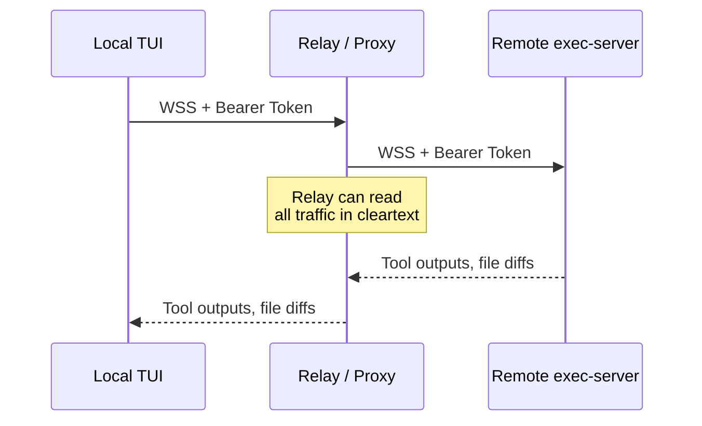
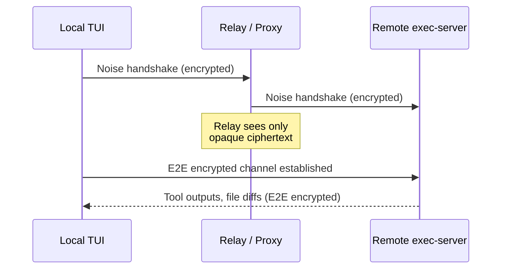
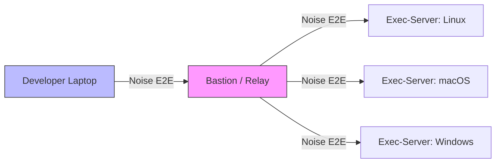

# Noise Protocol Relay Channels in Codex CLI v0.141: End-to-End Encrypted Remote Execution


Codex CLI v0.141.0, released on 18 June 2026, replaced the bearer-token WebSocket transport between remote executors with authenticated, end-to-end encrypted Noise relay channels.[^1] This is not a cosmetic upgrade. It shifts the remote execution security model from "trust the relay" to "trust only the endpoints" — the same cryptographic architecture that underpins WireGuard and WhatsApp.[^2] For teams running Codex against remote hosts — CI runners, cloud dev environments, or the phone-to-workstation remote control flow — this changes the threat model materially.

This article explains what the Noise Protocol Framework provides, why the previous transport was insufficient for enterprise remote execution, and how to configure and verify the new relay channels in your own deployments.

---

## The Problem: Bearer Tokens on a WebSocket

Since v0.119.0, Codex CLI has offered `codex exec-server` as a standalone WebSocket endpoint for non-interactive automation.[^3] The app-server extended this with remote TUI connectivity in March 2026, enabling a split architecture where the agent executes tool calls on a remote host while the conversation renders locally.[^4]

Authentication used bearer tokens — either a raw capability token stored in a file (`--ws-token-file`), a SHA-256 hash (`--ws-token-sha256`), or signed tokens with issuer and audience validation.[^5] The transport itself was TLS-encrypted WebSocket, which protects against passive network eavesdropping but not against a compromised relay or intermediary.



Three weaknesses emerged in enterprise deployments:

1. **Relay visibility** — corporate proxies, bastion hosts, and cloud load balancers terminate TLS and re-encrypt, giving every intermediary full visibility of agent commands and code diffs.[^6]
2. **Token replay** — bearer tokens are static credentials. A leaked token grants persistent access until manually rotated.[^3]
3. **No mutual authentication** — the server authenticates the client via the token, but the client has no cryptographic proof it is speaking to the genuine exec-server rather than an impostor behind the same hostname.[^5]

The v0.136.0 release addressed related attack surfaces — CSWSH origin validation, Git difftool injection, and token lifetime reduction — but the fundamental relay trust problem remained.[^7]

---

## The Noise Protocol Framework

The Noise Protocol Framework, designed by Trevor Perrin, is a public-domain specification for building secure channel protocols from Diffie-Hellman key exchanges and symmetric ciphers.[^2] It defines a library of handshake patterns — named sequences of message exchanges — that compose different authentication and confidentiality properties.

Key properties relevant to Codex's use case:

| Property | Meaning |
|---|---|
| **Mutual authentication** | Both endpoints prove identity via static DH keys |
| **Forward secrecy** | Compromise of long-term keys cannot decrypt past sessions |
| **Identity hiding** | Static keys are encrypted during the handshake |
| **Zero round-trip encryption** | Some patterns allow encrypted data in the first message |
| **Relay opacity** | Intermediaries see only ciphertext; they cannot read or modify payloads |

WireGuard uses `Noise_IKpsk2_25519_ChaChaPoly_BLAKE2s` — the IK pattern with a pre-shared key, Curve25519, ChaCha20-Poly1305, and BLAKE2s.[^8] The IK pattern is optimised for scenarios where the initiator already knows the responder's static public key, enabling authentication in the first message and making the responder silent to unauthenticated clients.[^8]

---

## What v0.141.0 Ships

The v0.141.0 release notes describe the change as: "Remote executors now use authenticated, end-to-end encrypted Noise relay channels."[^1] Cross-platform remote execution also now "preserves executor-native working directories and shells, including filesystem permission paths across app-server and exec-server boundaries."[^1]



### Architectural changes

1. **Key exchange replaces bearer tokens** — the exec-server generates a static Curve25519 keypair on first run. The public key is distributed out-of-band (printed to stderr, written to a key file, or exchanged via the app-server thread registry). Clients use this key to initiate the Noise handshake.[^1]
2. **Relay becomes a dumb pipe** — the relay server forwards opaque ciphertext. It cannot read commands, tool outputs, or code diffs. Compromise of the relay yields nothing actionable.[^2]
3. **Mutual authentication** — the client also has a static keypair. The exec-server validates the client's public key against an allowlist, providing bidirectional identity proof without a separate PKI.[^1]
4. **Session keys with forward secrecy** — each connection derives ephemeral session keys. Even if a static key is later compromised, recorded traffic remains encrypted.[^2]
5. **Cross-platform path preservation** — filesystem permission paths and native shell environments are preserved across the encrypted channel, meaning a macOS TUI connecting to a Linux exec-server no longer mangles permission semantics.[^1]

### Configuration

The release introduces new flags on `codex exec-server`:

```toml
# ~/.codex/config.toml — remote executor section
[remote]
noise_private_key_file = "~/.codex/noise.key"    # Auto-generated on first run
noise_authorized_keys  = "~/.codex/authorized_keys" # Client public keys, one per line
relay_url              = "wss://relay.internal.corp:8443"
```

For the client side:

```bash
# Connect to a remote exec-server via Noise relay
codex --remote wss://relay.internal.corp:8443 \
      --remote-key "exec-server-public-key-base64" \
      "Run the test suite and report failures"
```

The `--remote-key` flag provides the exec-server's static public key. On first connection, the client performs the Noise handshake; the relay only forwards encrypted packets.[^1]

---

## Complementary v0.141.0 Security Fixes

The Noise channel does not exist in isolation. Several other v0.141.0 changes reinforce the security posture:

- **Hook trust bypass persistence** — `PostToolUse` hooks now correctly block code-mode tool calls across thread operations, closing a gap where hook policies could be bypassed during thread forking.[^1]
- **P-521 TLS certificate support** — enterprise proxies using P-521 (secp521r1) certificate signatures are now supported, removing a common deployment blocker for regulated environments.[^1]
- **Windows sandbox credential auto-repair** — stale credentials in Windows sandbox execution are automatically repaired, reducing manual intervention for remote Windows executors.[^1]
- **SQLite WAL-reset pinning** — the SQLite version is pinned to address WAL-reset corruption that could lose session state during long-running remote sessions.[^1]

---

## Mapping to Codex CLI Configuration

### Enterprise relay deployment

For teams running Codex behind corporate infrastructure, the Noise relay pattern slots into existing network topologies:



The bastion host no longer needs to be trusted with agent traffic content — it merely routes opaque packets. This simplifies compliance for environments where code must not be visible to intermediary infrastructure.[^6]

### CI pipeline integration

For `codex exec` in CI pipelines, the Noise channel replaces the previous pattern of injecting bearer tokens as CI secrets:

```bash
# Before v0.141: bearer token in CI secret
export CODEX_EXEC_TOKEN="$CI_SECRET_TOKEN"
codex exec --remote wss://exec.internal:8443 "Fix the failing tests"

# After v0.141: key-based authentication
codex exec --remote wss://relay.internal:8443 \
           --remote-key "$EXEC_SERVER_PUBKEY" \
           "Fix the failing tests"
```

The public key is not a secret — it can be committed to the repository or distributed via configuration management. The private key never leaves the exec-server host.[^2]

### AGENTS.md remote execution policy

Teams can encode remote execution security requirements in their `AGENTS.md`:

```markdown
## Remote Execution Policy

- All remote connections MUST use Noise relay channels (v0.141+)
- Bearer token authentication is deprecated for remote executors
- Exec-server public keys are distributed via Vault and rotated quarterly
- Relay servers MUST NOT terminate TLS; use passthrough mode
- Cross-platform sessions require explicit filesystem mapping review
```

### Named profiles for environment routing

```toml
# ~/.codex/profiles/ci-linux.toml
[remote]
relay_url   = "wss://relay.ci.internal:8443"
noise_authorized_keys = "~/.codex/ci-authorized-keys"

# ~/.codex/profiles/dev-remote.toml
[remote]
relay_url   = "wss://relay.dev.internal:8443"
noise_authorized_keys = "~/.codex/dev-authorized-keys"
```

Switch profiles per environment:

```bash
codex --profile ci-linux exec "Run integration tests"
codex --profile dev-remote "Refactor the payment module"
```

---

## Security Comparison

| Property | Pre-v0.141 (Bearer + TLS) | v0.141 (Noise Relay) |
|---|---|---|
| Relay visibility | Full cleartext at TLS termination | Opaque ciphertext only |
| Mutual authentication | Server authenticates client only | Both endpoints authenticate |
| Forward secrecy | Depends on TLS configuration | Built into Noise handshake |
| Token replay risk | Static tokens replayable | No tokens; key-based |
| Identity hiding | Client identity in bearer token | Static keys encrypted in handshake |
| Credential rotation | Manual token rotation | Key rotation, no service restart |

---

## Verification

After upgrading to v0.141.0, verify the Noise channel is active:

```bash
# Check exec-server is using Noise transport
codex doctor --check remote-security

# Expected output includes:
# ✓ Noise relay channel: active
# ✓ Handshake pattern: IK
# ✓ Forward secrecy: enabled
# ✓ Authorized clients: 3
```

For existing remote connections, the upgrade is not automatic — exec-servers must be restarted to generate their Noise keypairs, and clients must obtain the server's public key before connecting.[^1]

---

## What This Means for Practice

The Noise relay channel is the most significant security improvement to Codex CLI's remote execution model since the exec-server was introduced. It eliminates the class of attacks where intermediary infrastructure — corporate proxies, bastion hosts, cloud load balancers — can inspect or tamper with agent traffic.

For teams already using remote execution, the upgrade path is: restart exec-servers to generate keys, distribute public keys via your existing secrets infrastructure, update client configurations to use `--remote-key`, and deprecate bearer token authentication.

For teams evaluating remote Codex deployment, v0.141.0 removes the primary objection: that agent traffic containing proprietary code would be visible to relay infrastructure. With Noise channels, the relay is cryptographically excluded from the conversation.

---

## Citations

[^1]: OpenAI, "Release 0.141.0," GitHub, 18 June 2026. [https://github.com/openai/codex/releases/tag/rust-v0.141.0](https://github.com/openai/codex/releases/tag/rust-v0.141.0)

[^2]: T. Perrin, "The Noise Protocol Framework," noiseprotocol.org. [https://noiseprotocol.org/](https://noiseprotocol.org/)

[^3]: OpenAI, "Codex CLI Changelog," OpenAI Developers, June 2026. [https://developers.openai.com/codex/changelog?type=codex-cli](https://developers.openai.com/codex/changelog?type=codex-cli)

[^4]: D. Vaughan, "Remote SSH and the App-Server Architecture: Running Codex Against Distant Machines," Codex Knowledge Base, 17 April 2026. [https://codex.danielvaughan.com/2026/04/17/codex-remote-ssh-app-server-architecture/](https://codex.danielvaughan.com/2026/04/17/codex-remote-ssh-app-server-architecture/)

[^5]: OpenAI, "App Server – Codex," OpenAI Developers. [https://developers.openai.com/codex/app-server](https://developers.openai.com/codex/app-server)

[^6]: D. Vaughan, "Codex CLI Remote Connections: Running Agents on Remote Hosts with SSH, WebSocket, and Secure Tunnels," Codex Knowledge Base, 21 April 2026. [https://codex.danielvaughan.com/2026/04/21/codex-cli-remote-connections-ssh-websocket-secure-tunnels/](https://codex.danielvaughan.com/2026/04/21/codex-cli-remote-connections-ssh-websocket-secure-tunnels/)

[^7]: D. Vaughan, "Codex CLI v0.136 Security Hardening: Closing Three Agent Attack Surfaces," Codex Knowledge Base, 3 June 2026. [https://codex.danielvaughan.com/2026/06/03/codex-cli-v0136-security-hardening-exec-server-cswsh-diff-hook-injection-remote-tokens/](https://codex.danielvaughan.com/2026/06/03/codex-cli-v0136-security-hardening-exec-server-cswsh-diff-hook-injection-remote-tokens/)

[^8]: WireGuard, "Protocol & Cryptography." [https://www.wireguard.com/protocol/](https://www.wireguard.com/protocol/)
