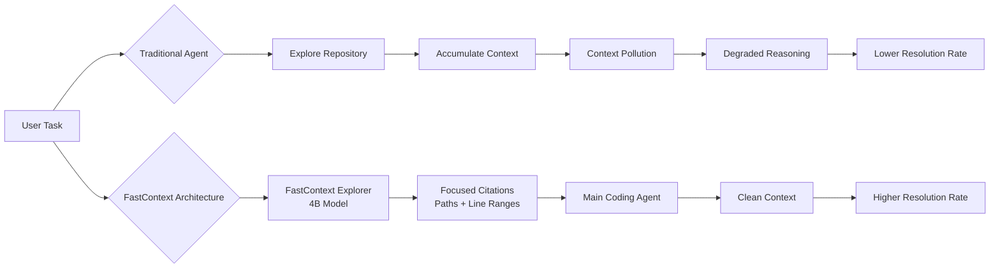
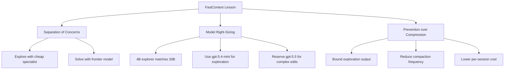

# FastContext: What Microsoft's Repository Explorer Means for Codex CLI Exploration Strategy


---

Repository exploration is the silent tax on every coding agent session. Before a single line of code is written, the agent must locate the relevant files, understand their relationships, and gather enough context to make an informed edit. Microsoft Research's FastContext paper (arXiv:2606.14066, revised 18 June 2026) quantifies this tax and proposes a radical solution: delegate exploration to a purpose-trained 4B-parameter subagent that returns only file paths and line ranges, cutting main-agent token consumption by up to 60% whilst lifting resolution rates by up to 5.5 percentage points[^1].

The implications for Codex CLI practitioners are immediate. FastContext's architecture validates design patterns already available in Codex CLI — subagent delegation, `tool_output_token_limit` capping, and context compaction tuning — whilst revealing how far a dedicated exploration layer can push the efficiency frontier.

## The Exploration Bottleneck

Every SWE-bench task begins the same way: the agent issues a flurry of `grep`, `find`, and `cat` commands to orient itself in an unfamiliar repository. This exploration phase consumes a disproportionate share of the token budget. FastContext's baseline measurements show that GPT-5.4 without an explorer spends 457,000 tokens on SWE-bench Multilingual tasks, with a substantial fraction devoted to reading files that prove irrelevant[^1].

The damage extends beyond cost. Irrelevant context pollutes the working memory, degrading downstream reasoning quality. This converges with findings from the Microsoft context engineering study (arXiv:2606.10209) showing that full conversation history is actively harmful — completion rates dropped to 71% versus 91.6% for pruned contexts[^2].



## How FastContext Works

FastContext separates exploration from solving through a dedicated subagent with three read-only tools: **Read**, **Glob**, and **Grep**[^3]. The explorer issues parallel tool calls — up to six per turn — and returns structured `<final_answer>` blocks containing file paths and line ranges. It cannot modify files; its sole purpose is to produce concise, targeted citations[^1].

### Training Pipeline

The training follows a two-stage approach[^1]:

1. **Supervised fine-tuning (SFT):** 2,954 trajectories bootstrapped from Claude Sonnet 4.6 across three capability categories — parallel tool calls (990 examples), multi-turn evidence gathering (983), and line-range citation precision (981).

2. **Reinforcement learning (RL):** A 400-prompt corpus with patch-derived ground-truth targets, optimised via GRPO with 16 sampled trajectories per prompt and an 8-turn exploration limit.

The RL reward function combines three signals:

```
Reward = F1(predicted_files, ground_truth_files)
       + F1(predicted_lines, ground_truth_lines)
       + parallel_bonus(3..6 calls)
       - format_penalty(empty | >20 citations | malformed)
```

This reward design penalises both under-exploration (empty results) and over-exploration (excessive citations that flood downstream context), directly addressing the signal-to-noise ratio problem identified by CoDA-Bench[^4].

### Model Variants

Microsoft released models at two scales on Hugging Face[^3]:

| Model | Parameters | Training | File-Level F1 |
|-------|-----------|----------|---------------|
| FastContext-1.0-4B-SFT | 4B | Supervised | 70.6 |
| FastContext-1.0-4B-RL | 4B | SFT + RL | 71.5 |
| FastContext-1.0-30B-SFT | 30B | Supervised | 73.7 |

The 4B-RL model is the standout: it matches or exceeds the 30B-SFT model on several benchmarks whilst requiring a fraction of the compute[^1]. On GLM-5.1 SWE-bench Pro, the 4B-RL explorer reaches 22.5% resolution versus 20.0% for 30B-SFT[^1].

## Benchmark Results

### End-to-End Resolution Rates

Integrating FastContext into Mini-SWE-Agent with GPT-5.4 as the main solver[^1]:

| Benchmark | Without Explorer | With FC-4B-RL | Delta | Token Reduction |
|-----------|-----------------|---------------|-------|-----------------|
| SWE-bench Multilingual (300) | 71.7% | 74.7% | +3.0pp | -26.0% |
| SWE-bench Pro (200) | 46.0% | 48.5% | +2.5pp | -14.3% |
| SWE-QA | 81.3% | 82.0% | +0.7pp | -49.8% |

The SWE-QA result is particularly striking: near-halving of token consumption with a marginal accuracy improvement. For question-answering tasks — which map closely to the investigation phase of a Codex CLI `suggest` or `plan` mode session — the efficiency gain is dramatic.

### Comparison with Existing Approaches

FastContext outperforms CodeScout-14B (68.57 file-level F1) with a model less than a third its size[^1]. Same-model exploration (using GPT-5.4 itself as explorer) achieves 73.3% on Multilingual with 379,000 tokens; FastContext-4B-RL reaches 74.7% with 338,000 tokens — better accuracy at lower cost[^1].

## Mapping FastContext to Codex CLI

Codex CLI does not natively integrate FastContext, but its architecture already supports the same separation-of-concerns pattern through several mechanisms.

### 1. Subagent Delegation via `codex exec`

The most direct mapping is running FastContext as a pre-exploration step before the main Codex session:

```bash
# Run FastContext exploration
fastcontext \
  --query "Find authentication middleware and session handling" \
  --max-turns 6 \
  --citation \
  > /tmp/context-citations.md

# Feed focused context into Codex CLI
codex exec "Fix the session timeout bug. Relevant files: $(cat /tmp/context-citations.md)"
```

This mirrors FastContext's delegated architecture: a cheap, focused exploration pass followed by an informed solving pass[^3].

### 2. `tool_output_token_limit` as Soft Exploration Capping

FastContext's format penalty rejects outputs exceeding 20 citations. Codex CLI's `tool_output_token_limit` achieves similar discipline at the harness level[^5]:

```toml
# ~/.codex/config.toml
[model]
tool_output_token_limit = 12000
```

Capping tool output at 12,000 tokens forces the agent to work with summaries rather than entire file contents — the same principle FastContext applies through its trained citation format. Without this cap, a verbose `git diff` or test suite output can flood the context window, triggering premature compaction[^5].

### 3. Context Compaction Thresholds

FastContext reduces the need for compaction by limiting what enters the context in the first place. For Codex CLI sessions without a dedicated explorer, tuning `model_auto_compact_token_limit` achieves a complementary effect[^6]:

```toml
[model]
model_auto_compact_token_limit = 160000  # Fire compaction at 80% of 200k window
```

The key insight from FastContext is that **prevention beats compression**. Keeping irrelevant exploration artifacts out of context is more effective than compacting them after the fact.

### 4. AGENTS.md Exploration Directives

FastContext's three-tool constraint (Read, Glob, Grep) maps directly to AGENTS.md guidance that bounds the exploration phase:

```markdown
# AGENTS.md — Exploration Protocol

## Repository Navigation
- Begin each task with targeted file discovery using grep and glob patterns
- Read only the files and line ranges relevant to the current task
- Do NOT read entire files when specific functions or classes are needed
- Limit exploration to 3 search passes before beginning implementation
- Summarise discovered context before proceeding to edits
```

This instruction set replicates FastContext's architectural constraint — bounded exploration with structured output — using Codex CLI's native directive system[^7].

### 5. MCP Integration for Dedicated Exploration

For teams wanting a tighter integration, FastContext's OpenAI-compatible API endpoint can be exposed as an MCP server:

```json
{
  "mcpServers": {
    "fastcontext": {
      "command": "fastcontext",
      "args": ["serve", "--port", "8741"],
      "env": {
        "MODEL": "FastContext-1.0-4B-RL",
        "BASE_URL": "http://localhost:11434/v1"
      }
    }
  }
}
```

⚠️ FastContext does not ship a built-in MCP server mode at the time of writing. This pattern requires a thin wrapper translating MCP tool calls to FastContext's CLI interface.

## The Architectural Lesson

FastContext's core contribution is not the model itself — it is the proof that **a 4B-parameter specialist outperforms a frontier model at repository exploration** whilst consuming a fraction of the tokens. This has three implications for Codex CLI strategy:



**First**, exploration and solving are separable concerns. The agent that finds the code need not be the agent that edits it. Codex CLI's named profiles already support this — route investigation tasks to `gpt-5.4-mini` and editing tasks to `gpt-5.5`[^8].

**Second**, small models trained on specific skills can match or exceed frontier models on narrow tasks. The 4B-RL model's performance against 30B-SFT validates the case for specialised subagents over monolithic frontier sessions.

**Third**, the compaction-versus-prevention trade-off favours prevention. Every token that never enters the context is a token that never needs compacting. FastContext's 60% token reduction translates directly to fewer compaction cycles, more stable context, and lower latency.

## Practical Recommendations

For Codex CLI teams looking to apply FastContext's findings today:

1. **Cap tool output aggressively.** Set `tool_output_token_limit = 12000` to prevent exploration artifacts from dominating the context window[^5].

2. **Write exploration-bounding AGENTS.md directives.** Limit search passes, require structured file references, and instruct the agent to summarise discoveries before editing.

3. **Use `codex exec` for pre-exploration.** Run a cheap exploration pass with `gpt-5.4-mini` to identify relevant files, then feed the results into a full session with the primary model.

4. **Monitor exploration-to-editing token ratios.** Use `/usage` to track how much of each session is spent on exploration versus productive edits. If exploration exceeds 40% of token spend, the session needs tighter bounding[^9].

5. **Watch for FastContext MCP integration.** When a community MCP wrapper emerges, it will provide the cleanest integration path — a dedicated exploration tool callable from within any Codex CLI session.

## Citations

[^1]: Zhang, S. et al. (2026). "FastContext: Training Efficient Repository Explorer for Coding Agents." arXiv:2606.14066. [https://arxiv.org/abs/2606.14066](https://arxiv.org/abs/2606.14066)

[^2]: Lodha, A. et al. (2026). "Efficient Context Engineering for Agentic AI Systems." arXiv:2606.10209. [https://arxiv.org/abs/2606.10209](https://arxiv.org/abs/2606.10209)

[^3]: Microsoft. (2026). "FastContext GitHub Repository." [https://github.com/microsoft/fastcontext](https://github.com/microsoft/fastcontext)

[^4]: Zhang, Y. et al. (2026). "CoDA-Bench: Benchmarking Data-Intensive Tasks for Coding Agents." arXiv:2606.15300. [https://arxiv.org/abs/2606.15300](https://arxiv.org/abs/2606.15300)

[^5]: Codex CLI Documentation. (2026). "Configuration Reference — tool_output_token_limit." [https://codex.danielvaughan.com/2026/04/08/codex-cli-performance-optimization/](https://codex.danielvaughan.com/2026/04/08/codex-cli-performance-optimization/)

[^6]: Codex CLI Documentation. (2026). "Context Compaction Architecture." [https://codex.danielvaughan.com/2026/03/31/codex-cli-context-compaction-architecture/](https://codex.danielvaughan.com/2026/03/31/codex-cli-context-compaction-architecture/)

[^7]: OpenAI. (2026). "Codex CLI AGENTS.md Specification." [https://github.com/openai/codex](https://github.com/openai/codex)

[^8]: OpenAI. (2026). "Codex CLI Named Profiles Documentation." [https://developers.openai.com/codex/cli](https://developers.openai.com/codex/cli)

[^9]: OpenAI. (2026). "Codex CLI /usage Command — v0.140.0 Release Notes." [https://developers.openai.com/codex/changelog](https://developers.openai.com/codex/changelog)
