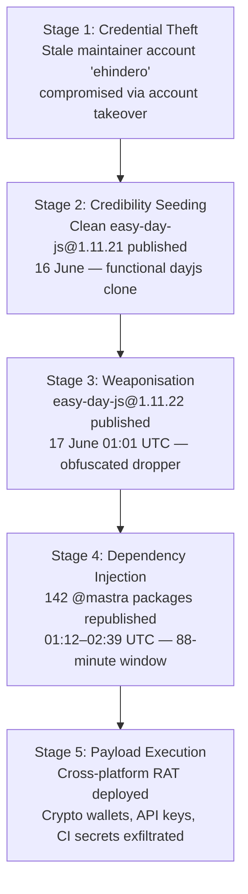
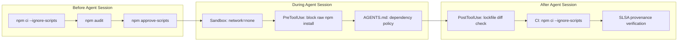

# The Mastra Attack: What a North Korean Supply Chain Compromise of an AI Agent Framework Means for Codex CLI Defence


---

On 17 June 2026, Microsoft Threat Intelligence attributed the compromise of 142 packages under the `@mastra` npm scope to Sapphire Sleet — a North Korean state actor that primarily targets financial-sector infrastructure [^1]. The attack weaponised `easy-day-js`, a typosquat of the popular `dayjs` library, and injected it as a dependency across the entire Mastra AI agent framework in an 88-minute automated campaign [^2]. Combined weekly downloads exceeded 1.1 million [^3].

This was not a generic supply chain attack. It specifically targeted environments where AI agent frameworks run — environments that hold LLM API keys, cloud provider credentials, CI/CD tokens, and database connection strings [^3]. If you use Codex CLI to manage JavaScript projects, particularly those that depend on AI agent frameworks, the Mastra incident provides a concrete threat model worth understanding.

## Anatomy of the Attack

### The Kill Chain

The attack followed a five-stage progression designed to evade both automated scanning and human review.



**Stage 1 — Credential theft.** The attacker compromised `ehindero`, a former Mastra contributor whose account retained publishing permissions to the entire `@mastra` scope despite being dormant since early 2025. npm does not expire scope publish permissions on inactivity [^3].

**Stage 2 — Credibility seeding.** On 16 June, a clean `easy-day-js@1.11.21` was published — a fully functional copy of `dayjs` with identical author metadata, homepage, repository URL, and license [^2]. Static analysis tools would find nothing suspicious.

**Stage 3 — Weaponisation.** At 01:01 UTC on 17 June, version `1.11.22` landed with a 4,572-byte `setup.cjs` file triggered by a `postinstall` hook. The dropper used three obfuscation layers: custom-alphabet Base64 encoding, 34-position array rotation with arithmetic integrity checks, and XOR-encoded beacon markers written as binary to disk [^2].

**Stage 4 — Dependency injection.** A single line was injected into each published tarball's `package.json`: `"easy-day-js": "^1.11.21"`. The caret range ensured fresh installs resolved to the armed `1.11.22` without requiring republication of the dependent packages themselves [^3].

**Stage 5 — Payload execution.** The dropper disabled TLS validation, downloaded a second-stage payload from `23.254.164.92:8000`, spawned a detached background process, then self-deleted to reduce forensic traces [^2]. The payload was a cross-platform RAT with cryptocurrency wallet extraction (MetaMask, Phantom, Solflare, Coinbase, OKX, Keplr), system reconnaissance, and persistent C2 beaconing every ten minutes [^3].

### Persistence Mechanisms

The RAT installed platform-specific persistence:

| Platform | Persistence Path |
|----------|-----------------|
| macOS | `~/Library/LaunchAgents/com.nvm.protocal.plist` |
| Linux | `~/.config/systemd/user/nvmconf.service` |
| Windows | `C:\ProgramData\NodePackages` (PowerShell staging) |

Note the deliberate typo in `protocal` — a fingerprint consistent with prior Sapphire Sleet campaigns [^3].

## Why AI Agent Environments Are High-Value Targets

The Mastra compromise is not coincidental. AI agent frameworks sit at the intersection of every credential category an attacker wants:

- **LLM API keys** — direct access to billing accounts, often with no per-request spending caps
- **Cloud provider credentials** — AWS, GCP, Azure access keys stored as environment variables
- **CI/CD tokens** — GitHub, GitLab, or Jenkins tokens enabling lateral movement into production
- **Database connection strings** — direct data exfiltration without additional exploitation
- **npm/PyPI tokens** — enabling wormable propagation through the supply chain itself

`@mastra/core` alone receives over 4 million monthly downloads [^3]. A single compromised developer machine running `npm install` in a Codex CLI session could expose every credential accessible to that session.

## Codex CLI's Defence Stack

Codex CLI's security architecture provides layered defence against postinstall attacks, but each layer requires explicit configuration.

### Layer 1: Sandbox Network Isolation

Codex CLI's sandbox blocks network access during command execution by default [^4]. This is the single most effective defence against the Mastra attack pattern — the Stage 3 dropper requires an outbound HTTPS connection to download its second-stage payload.

```toml
# .codex/config.toml — project-level configuration
[sandbox]
# Network isolation is enabled by default in sandbox mode.
# Explicitly confirm it is not overridden:
network = "none"
```

However, `npm install` itself requires network access to resolve packages from the registry. The practical pattern is to run dependency installation *outside* the Codex sandbox, then let the agent work within the sandboxed environment:

```bash
# Install dependencies in a trusted context FIRST
npm ci --ignore-scripts
npm approve-scripts --allow-scripts-pending

# Then run Codex CLI within the sandbox
codex --approval-mode full-auto \
  "Fix the failing tests in src/auth/"
```

### Layer 2: PreToolUse Hook — Blocking npm install

A `PreToolUse` hook can intercept and block any agent attempt to run `npm install` without `--ignore-scripts`:

```toml
# .codex/config.toml
[[hooks]]
type = "PreToolUse"
command = "bash /path/to/guard-npm-install.sh"
```

```bash
#!/usr/bin/env bash
# guard-npm-install.sh
# Block npm install unless --ignore-scripts is present

TOOL_INPUT="$CODEX_TOOL_INPUT"

if echo "$TOOL_INPUT" | grep -qE 'npm\s+install' && \
   ! echo "$TOOL_INPUT" | grep -q '\-\-ignore-scripts'; then
  echo '{"decision": "reject", "reason": "npm install must use --ignore-scripts. Run npm ci --ignore-scripts outside the agent session."}'
  exit 0
fi

echo '{"decision": "approve"}'
```

### Layer 3: AGENTS.md Dependency Policy

Encode the policy in your project's `AGENTS.md` so every agent session inherits the constraint:

```markdown
## Dependency Management

- NEVER run `npm install` or `npm i` without `--ignore-scripts`
- ALWAYS use `npm ci` with a committed lockfile for reproducible installs
- NEVER add new dependencies without explicit user approval
- If a dependency change is required, propose it in plan mode first
- Flag any `postinstall`, `preinstall`, or `install` scripts in new dependencies
```

### Layer 4: Lockfile Discipline

The caret range `^1.11.21` resolving to the malicious `1.11.22` is the core exploitation mechanism. `npm ci` respects the lockfile exactly and will not resolve newer versions [^5]:

```bash
# Enforce lockfile-only installs in CI
npm ci --ignore-scripts

# Audit after install
npm audit --audit-level=critical
```

A `PostToolUse` hook can verify the lockfile has not been modified unexpectedly:

```bash
#!/usr/bin/env bash
# verify-lockfile.sh — PostToolUse hook
if git diff --name-only | grep -q 'package-lock.json'; then
  echo "WARNING: package-lock.json was modified during this operation"
  echo "Review changes before committing"
fi
```

## npm v12: The Ecosystem Response

npm v12, scheduled for July 2026, will block `preinstall`, `install`, and `postinstall` scripts from dependencies by default [^6]. This is a direct response to the wave of postinstall-based attacks including Mastra, the Axios compromise (March 2026), and the Miasma worm campaign [^7].

### What Changes

| Behaviour | npm 11 | npm 12 |
|-----------|--------|--------|
| Dependency install scripts | Run automatically | Blocked unless allowlisted |
| `binding.gyp` implicit builds | Run automatically | Treated as declared scripts |
| Git dependencies | Resolved normally | Require `--allow-git` flag |
| Remote URL dependencies | Resolved normally | Require `--allow-remote` flag |

### Preparing Today

npm 11.16.0 already surfaces v12 warnings [^6]. Teams can prepare now:

```bash
# See what scripts would be blocked under v12
npm approve-scripts --allow-scripts-pending

# Approve trusted packages and commit the allowlist
npm approve-scripts
git add package.json
git commit -m "chore: approve npm install scripts for v12 migration"
```

For Codex CLI workflows, this means encoding the allowlist in your project configuration so agent sessions inherit it:

```toml
# .codex/config.toml — npm v12 preparation
[environment]
# Ensure npm v12 behaviour is active even before the default ships
NPM_CONFIG_IGNORE_SCRIPTS = "true"
```

## Detection: Have You Been Compromised?

If your project has any `@mastra` dependency, check immediately:

```bash
# Check for the malicious package
npm ls easy-day-js
grep -r "easy-day-js" package-lock.json yarn.lock pnpm-lock.yaml

# Check for host-level persistence artifacts
ls -la ~/.pkg_history ~/.pkg_logs 2>/dev/null
ls -la ~/Library/LaunchAgents/com.nvm.protocal.plist 2>/dev/null
ls -la ~/.config/systemd/user/nvmconf.service 2>/dev/null
```

### Indicators of Compromise

| Category | Indicator |
|----------|-----------|
| Package | `easy-day-js@1.11.22` |
| C2 servers | `23.254.164.92:8000`, `23.254.164.123:443` |
| Dropper artifact | `setup.cjs` in tarball |
| Host markers | `~/.pkg_history`, `~/.pkg_logs` |
| Persistence (macOS) | `com.nvm.protocal.plist` |
| Persistence (Linux) | `nvmconf.service` |

If any indicator is present, treat the machine as compromised: rotate all credentials, transfer cryptocurrency to fresh wallets on clean devices, and consider reimaging [^3].

## The Hardening Checklist



1. **Disable install scripts by default** — `npm config set ignore-scripts true` globally, or set `NPM_CONFIG_IGNORE_SCRIPTS=true` in your environment
2. **Enforce lockfiles** — always use `npm ci`, never `npm install`, in CI and agent sessions
3. **Audit stale maintainers** — review npm scope permissions quarterly; remove dormant accounts [^3]
4. **Block agent dependency changes** — use PreToolUse hooks to intercept `npm install` without `--ignore-scripts`
5. **Prepare for npm v12** — run `npm approve-scripts --allow-scripts-pending` now; commit the allowlist
6. **Network-isolate agent sessions** — Codex CLI's sandbox should block outbound connections during code execution
7. **Monitor for phantom dependencies** — unused dependencies appearing in mature packages signal injection [^3]
8. **Require SLSA provenance** — verify package provenance on consumption, not just publication [^3]

## The Bigger Picture

The Mastra attack confirms what the Axios compromise (March 2026) and the Miasma worm (June 2026) already suggested: AI agent frameworks and their supply chains are now a primary target for state-level threat actors [^1]. The credentials accessible in a typical agent development session — LLM API keys, cloud access tokens, CI/CD secrets — make these environments disproportionately valuable compared to traditional development workstations.

npm v12's decision to block install scripts by default [^6] is the correct ecosystem-level response, but it arrives in July — six weeks after the Mastra compromise. For Codex CLI users, the defence-in-depth approach described above provides immediate protection: sandbox network isolation prevents payload download, PreToolUse hooks prevent unguarded `npm install`, lockfile discipline prevents version resolution attacks, and AGENTS.md policies ensure every agent session inherits the constraints.

The stale maintainer credential that enabled the entire attack [^3] is a reminder that supply chain security is fundamentally an access control problem. No amount of runtime defence compensates for an npm scope where dormant accounts retain full publishing rights.

## Citations

[^1]: Microsoft Security Blog, "From package to postinstall payload: Inside the Mastra npm supply chain compromise by Sapphire Sleet," 17 June 2026. [https://www.microsoft.com/en-us/security/blog/2026/06/17/postinstall-payload-inside-mastra-npm-supply-chain-compromise/](https://www.microsoft.com/en-us/security/blog/2026/06/17/postinstall-payload-inside-mastra-npm-supply-chain-compromise/)

[^2]: StepSecurity, "Mastra npm Supply Chain Attack: 140+ Packages Backdoored via easy-day-js Typosquat," 17 June 2026. [https://www.stepsecurity.io/blog/mastra-npm-packages-compromised-using-easy-day-js](https://www.stepsecurity.io/blog/mastra-npm-packages-compromised-using-easy-day-js)

[^3]: Snyk, "Mastra npm Scope Takeover: A Forgotten Contributor Account Compromised the Entire Mastra npm Package Scope," June 2026. [https://snyk.io/blog/a-forgotten-contributor-account-compromised-the-entire-mastra-npm-package-scope/](https://snyk.io/blog/a-forgotten-contributor-account-compromised-the-entire-mastra-npm-package-scope/)

[^4]: OpenAI Developers, "Codex CLI Features — Sandbox," 2026. [https://developers.openai.com/codex/cli/features](https://developers.openai.com/codex/cli/features)

[^5]: npm Documentation, "npm ci," 2026. [https://docs.npmjs.com/cli/v11/commands/npm-ci](https://docs.npmjs.com/cli/v11/commands/npm-ci)

[^6]: Aikido Security, "npm v12 delivers one of the biggest security improvements in years," June 2026. [https://www.aikido.dev/blog/npm-v12-block-postinstall](https://www.aikido.dev/blog/npm-v12-block-postinstall)

[^7]: The Hacker News, "GitHub to Disable npm Install Scripts by Default to Stop Supply Chain Attacks," June 2026. [https://thehackernews.com/2026/06/github-to-disable-npm-install-scripts.html](https://thehackernews.com/2026/06/github-to-disable-npm-install-scripts.html)
