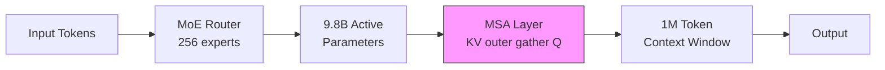
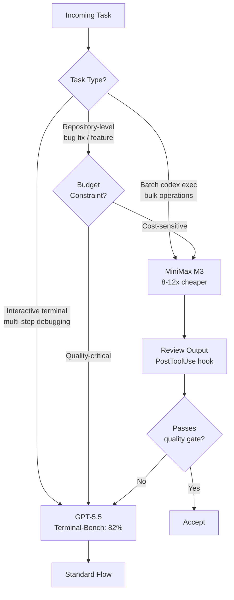

# MiniMax M3: What the First Open-Weight Model to Beat GPT-5.5 on SWE-Bench Pro Means for Codex CLI Model Routing


---

On 1 June 2026, Shanghai-based MiniMax released M3 — a 229.9-billion-parameter Mixture-of-Experts model with 9.8 billion parameters active per token, a one-million-token context window, and native multimodal support for text, image, and video input [^1]. Its headline claim: 59.0% on SWE-Bench Pro, edging past both GPT-5.5 (58.6%) and Gemini 3.1 Pro on the benchmark that has become the de facto measure of agentic coding capability [^2]. At \$0.30 per million input tokens and \$1.20 per million output tokens on OpenRouter — roughly 8-12x cheaper than GPT-5.5 — M3 forces a recalculation of every Codex CLI model routing decision [^3].

This article examines the benchmark results in context, unpacks the architectural innovations that make M3's long-context performance practical, and provides concrete Codex CLI configuration recipes for integrating M3 into a multi-model routing strategy.

## The Benchmark Picture: Competitive but Complicated

M3's SWE-Bench Pro score of 59.0% places it in genuinely frontier territory for an open-weight model [^2]. But the number deserves scrutiny.

| Benchmark | MiniMax M3 | GPT-5.5 | Claude Opus 4.7 | Kimi K2.7 Code |
|-----------|-----------|---------|-----------------|----------------|
| SWE-Bench Pro | 59.0% | 58.6% | — | — |
| Terminal-Bench 2.1 | 66.0% | 82.0% | — | — |
| MCP Atlas | 74.2% | — | — | — |
| KernelBench Hard | 28.8% | — | — | — |
| PostTrainBench | 0.37 | 0.39 | 0.42 | — |

Three caveats matter for practitioners:

1. **Vendor-reported scores.** M3's SWE-Bench Pro result is self-reported by MiniMax and has not yet appeared on the independently verified leaderboard [^4]. GPT-5.5's scores are third-party verified.

2. **The noise floor.** The 0.4-point gap between M3 (59.0%) and GPT-5.5 (58.6%) on SWE-Bench Pro falls within the benchmark's measurement uncertainty. An ICSE 2026 patch correctness study found SWE-bench systematically overestimates scores by 3.8-5.2 percentage points [^5].

3. **Terminal-Bench tells a different story.** GPT-5.5 scores 82% on Terminal-Bench 2.1 versus M3's 66.0% — a 16-point gap that reflects GPT-5.5's native advantage when operating inside the Codex CLI harness [^2].

The practical reading: M3 is a genuine peer on repository-level bug-fixing tasks but remains behind on the interactive terminal workflows where Codex CLI spends most of its time.

## Architecture: Why MSA Matters for Long Sessions

M3 introduces MiniMax Sparse Attention (MSA), a mechanism that makes one-million-token contexts economically viable [^1]. Traditional dense attention scales quadratically with sequence length. MSA uses a "KV outer gather Q" approach — each key-value block is read once, memory access is contiguous, and arithmetic intensity improves substantially over earlier sparse methods such as DSA and MoBA [^1].

The numbers are striking: per-token compute at one million tokens drops to one-twentieth of M3's predecessor, with more than 9x faster prefilling and more than 15x faster decoding [^1]. MiniMax reports MSA is 4x faster than open-source Flash-Sparse-Attention and flash-moba implementations [^1].



For Codex CLI users, this matters in two scenarios:

- **Large-repository exploration.** When `tool_output_token_limit` is set high and the agent reads multiple files in sequence, M3 can maintain coherence across a broader context without the compaction events that interrupt GPT-5.5 sessions.
- **Long-horizon agentic tasks.** MiniMax demonstrated M3 autonomously reproducing an ICLR 2025 Outstanding Paper across 18 commits over twelve hours, and improving a CUDA kernel's hardware utilisation from 7.6% to 71.3% over 24 hours with 1,959 tool calls [^1].

## The Cost Equation

The pricing gap between M3 and GPT-5.5 is the most immediately actionable finding for teams managing Codex CLI budgets.

| | MiniMax M3 (OpenRouter) | GPT-5.5 (OpenAI) | Ratio |
|-|------------------------|-------------------|-------|
| Input (per 1M tokens) | \$0.30 | \$5.00 | 16.7x cheaper |
| Output (per 1M tokens) | \$1.20 | \$30.00 | 25.0x cheaper |

MiniMax also offers subscription tiers through its own platform: Plus (\$20/month, ~1.7B tokens), Max (\$50/month, ~5.1B tokens), and Ultra (\$120/month, ~9.8B tokens) [^1]. For teams running batch operations via `codex exec`, the per-token API pricing through OpenRouter is typically more economical.

The cost arithmetic is simple. A typical Codex CLI session consuming 100,000 input tokens and 20,000 output tokens costs approximately \$0.17 with GPT-5.5 versus \$0.05 with M3. Over 50 sessions per day, that is \$8.50 versus \$2.50 — a saving of \$180 per developer per month.

## Configuring M3 as a Codex CLI Provider

### Direct API Access

Add MiniMax as a custom provider in `~/.codex/config.toml`:

```toml
[model_providers.minimax]
name = "MiniMax"
base_url = "https://api.minimax.io/v1"
env_key = "MINIMAX_KEY"
```

Set your API key:

```bash
export MINIMAX_KEY="<your-key-here>"
```

### Via OpenRouter

If you already use OpenRouter for multi-provider routing:

```toml
[model_providers.openrouter]
name = "OpenRouter"
base_url = "https://openrouter.ai/api/v1"
env_key = "OPENROUTER_KEY"
```

Then reference the model as `minimax/minimax-m3` when using the OpenRouter provider [^3].

### Named Profile for M3

Create a dedicated profile at `~/.codex/minimax.config.toml`:

```toml
model = "minimax-m3"
model_provider = "minimax"

[model_providers.minimax]
name = "MiniMax"
base_url = "https://api.minimax.io/v1"
env_key = "MINIMAX_KEY"
```

Activate with:

```bash
codex --profile minimax "refactor the authentication module"
```

## A Practical Routing Strategy

The benchmark data suggests a tiered routing approach where task complexity determines model selection.



### Profile-Based Routing in Practice

Define three profiles that encode the routing decision:

```toml
# ~/.codex/default.config.toml — GPT-5.5 for interactive work
model = "gpt-5.5"
```

```toml
# ~/.codex/minimax.config.toml — M3 for cost-sensitive tasks
model = "minimax-m3"
model_provider = "minimax"

[model_providers.minimax]
name = "MiniMax"
base_url = "https://api.minimax.io/v1"
env_key = "MINIMAX_KEY"
```

```toml
# ~/.codex/batch.config.toml — M3 with tighter token budgets
model = "minimax-m3"
model_provider = "minimax"
model_auto_compact_token_limit = 80000

[model_providers.minimax]
name = "MiniMax"
base_url = "https://api.minimax.io/v1"
env_key = "MINIMAX_KEY"
```

Use them from CI or scripts:

```bash
# Batch processing with M3
codex exec --profile batch "update all copyright headers to 2026"

# Interactive debugging stays on GPT-5.5
codex --profile default
```

### AGENTS.md Model Guidance

Encode routing preferences in your project's `AGENTS.md` so the agent itself can inform model selection:

```markdown
## Model Routing

- Routine refactoring, linting fixes, and documentation updates: use `--profile minimax`
- Multi-file architectural changes and debugging: use default GPT-5.5
- Batch operations via `codex exec`: use `--profile batch`
```

## The Open-Weight Convergence

M3 is not an isolated event. The open-weight coding model landscape has compressed dramatically in the first half of 2026:

- **Devstral Small 2** (24B): 68% on SWE-Bench Verified, runs on a single RTX 4090 [^6]
- **Kimi K2.7 Code**: purpose-built for software engineering with dual OpenAI and Anthropic API compatibility [^7]
- **DeepSeek V4-Pro**: competitive on agentic benchmarks at a fraction of proprietary model costs [^8]

The pattern is clear: quality training data and specialised architectures matter more than raw parameter count. Skywork-SWE demonstrated this empirically — a 32B model fine-tuned on 8,209 rigorously validated trajectories achieved 38.0% on SWE-Bench Verified, outperforming 72B and 671B general-purpose models without specialised SWE training [^9].

For Codex CLI users, this convergence means the `model_provider` configuration in `config.toml` is no longer a one-time decision. It is a continuously tuneable parameter that should respond to the evolving price-performance frontier.

## Caveats and Risk Mitigation

Before routing production workloads through M3, consider these risks:

1. **Unverified benchmarks.** Until M3's SWE-Bench Pro score appears on an independent leaderboard, treat 59.0% as an upper bound estimate [^4].

2. **Tool-call compatibility.** M3 supports the OpenAI tool specification [^3], but edge cases in complex multi-tool orchestration may behave differently from GPT-5.5. Test your specific MCP server configurations before switching profiles.

3. **Availability and rate limits.** MiniMax's API infrastructure is newer and less battle-tested than OpenAI's. For mission-critical workflows, configure a fallback in your CI pipeline:

```bash
codex exec --profile minimax "task" || codex exec --profile default "task"
```

4. **Regional considerations.** MiniMax offers separate API endpoints for international (`api.minimax.io`) and Chinese (`api.minimaxi.com`) users [^10]. Ensure your endpoint matches your deployment region.

5. **Weight release timing.** MiniMax announced open-source weights within ten days of the 1 June launch [^1]. Verify current availability before planning self-hosted deployments.

## What to Do This Week

1. **Register for a MiniMax API key** at [platform.minimax.io](https://platform.minimax.io) or access M3 through your existing OpenRouter account.
2. **Create a `minimax.config.toml` profile** using the configuration above.
3. **Run your existing `codex exec` batch tasks** through M3 for one week and compare output quality against GPT-5.5 results.
4. **Add a PostToolUse hook** that logs model, token count, and task outcome to a local CSV — you will want this data when GPT-5.6 arrives and the routing calculation changes again.

---

## Citations

[^1]: MiniMax, "MiniMax M3: Frontier Coding, 1M Context, Native Multimodality — All in One Model," MiniMax Blog, 1 June 2026. [https://www.minimax.io/blog/minimax-m3](https://www.minimax.io/blog/minimax-m3)

[^2]: MarkTechPost, "MiniMax Releases MiniMax M3 with MSA Architecture Supporting 1M-Token Context, Native Multimodality, and Agentic Coding," 1 June 2026. [https://www.marktechpost.com/2026/06/01/minimax-releases-minimax-m3-with-msa-architecture-supporting-1m-token-context-native-multimodality-and-agentic-coding/](https://www.marktechpost.com/2026/06/01/minimax-releases-minimax-m3-with-msa-architecture-supporting-1m-token-context-native-multimodality-and-agentic-coding/)

[^3]: OpenRouter, "MiniMax M3 - API Pricing & Benchmarks," accessed 20 June 2026. [https://openrouter.ai/minimax/minimax-m3/api](https://openrouter.ai/minimax/minimax-m3/api)

[^4]: ofox.ai, "MiniMax M3 vs GPT-5.5: SWE-Bench Pro, 8x Price Gap, A/B Both via ofox (2026)," June 2026. [https://ofox.ai/blog/minimax-m3-vs-gpt-5-5-coding-benchmark-2026/](https://ofox.ai/blog/minimax-m3-vs-gpt-5-5-coding-benchmark-2026/)

[^5]: ICSE 2026 Patch Correctness Study, as cited in ofox.ai comparison. SWE-bench systematic overestimation of 3.8-5.2 percentage points.

[^6]: Pinggy, "Best Open Source Self-Hosted LLMs for Coding in 2026," June 2026. [https://pinggy.io/blog/best_open_source_self_hosted_llms_for_coding/](https://pinggy.io/blog/best_open_source_self_hosted_llms_for_coding/)

[^7]: Flowtivity, "Kimi K2.7 Code vs MiniMax M3: Open-Source AI Coding Models Compared (June 2026)," June 2026. [https://flowtivity.ai/blog/kimi-k2-7-code-vs-minimax-m3/](https://flowtivity.ai/blog/kimi-k2-7-code-vs-minimax-m3/)

[^8]: kilo.ai, "Best Open-Source & Open-Weight Coding Models (2026)," accessed 20 June 2026. [https://kilo.ai/open-source-models](https://kilo.ai/open-source-models)

[^9]: Zeng et al., "Skywork-SWE: Unveiling Data Scaling Laws for Software Engineering in LLMs," arXiv:2506.19290, June 2025. [https://arxiv.org/abs/2506.19290](https://arxiv.org/abs/2506.19290)

[^10]: MorphLLM, "Codex config.toml (2026): Add Any Custom Provider in 6 Lines," accessed 20 June 2026. [https://www.morphllm.com/codex-provider-configuration](https://www.morphllm.com/codex-provider-configuration)
