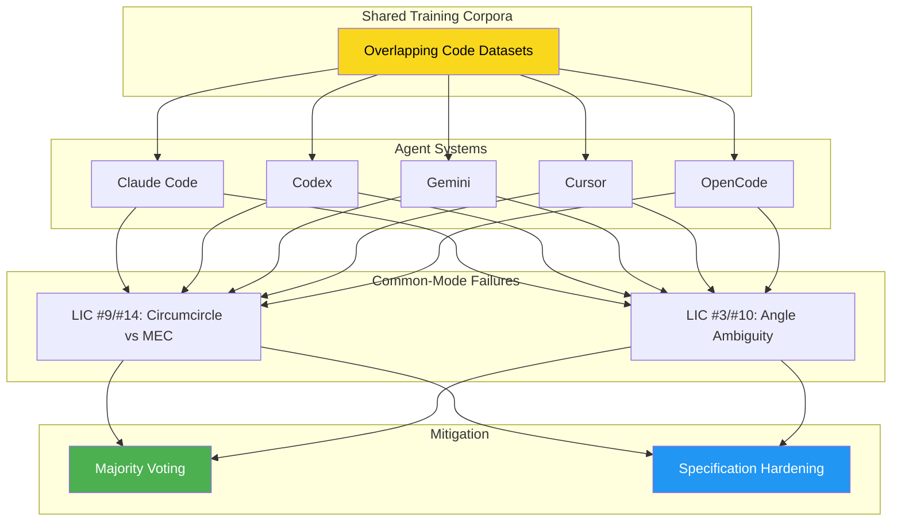
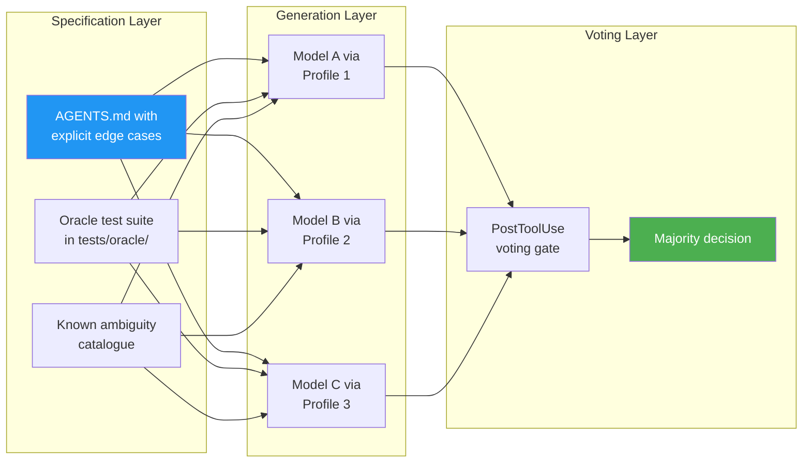

# N-Version Programming with Coding Agents: What the Knight–Leveson Replication Means for Codex CLI Multi-Model Resilience


---

## The Thirty-Year Experiment, Replayed with Agents

In 1986, Knight and Leveson ran a landmark experiment at the University of Virginia and the University of California, Irvine: twenty-seven programmers independently implemented the same Launch Interceptor Program (LIP) specification, and the results challenged the fundamental assumption that independent development yields statistically independent failures [^1]. Forty years later, Ron, Baudry, and Monperrus at KTH Royal Institute of Technology have replayed that experiment — replacing human programmers with contemporary AI coding agents [^2].

The findings are directly relevant to anyone using Codex CLI in production: diversity helps, but shared training corpora create tighter coupling than shared university curricula ever did.

## The Experiment

The researchers took the original Knight–Leveson LIP specification — a four-stage computation comprising fifteen Boolean Launch Interceptor Conditions (LICs), a Preliminary Unlocking Matrix, a Final Unlocking Vector, and a launch decision [^1] — and fed it to five agent systems across twenty-three models and three target languages [^2].

### Agent Systems and Models

| Agent System | Models | Admitted |
|---|---|---|
| Claude Code | Opus 4.6, Opus 4.5, Sonnet 4.6, Sonnet 4.5, Haiku 4.5 | 13/15 (87%) |
| OpenAI Codex | GPT-5.4, 5.4-mini, 5.3-codex, 5.2-codex, 5.2 | 11/15 (73%) |
| Gemini | 3.1-pro-preview, 3-flash-preview, 2.5-pro, 2.5-flash, 2.5-flash-lite | 8/15 (53%) |
| Cursor | composer-2.5, composer-2 | 6/6 (100%) |
| OpenCode | Qwen variants, Gemma variants | 10/18 (56%) |

Target languages were Pascal, Python, and Rust. Of 69 attempted [harness, model, language] triples, 48 passed the 200-case acceptance filter — a 70% admission rate [^2].

### The Test Campaign

Following the original protocol exactly, each admitted implementation was tested against **one million randomised inputs** using a shared oracle [^2]. This is not a toy benchmark — it is the most thorough diversity evaluation ever conducted on AI-generated code.

## Results: Diversity Helps, But Common-Mode Failure Persists

### The Good News

Across all possible three-version majority-voting units (C(48,3) = 17,296 triples), the mean failure count dropped from **387.44 for single versions to 130.99 for triples** — a 66.2% reduction [^2]. More striking: **11,844 triples (68.48%) exhibited zero observed failures** across one million test inputs, compared with 27 single versions (56.25%) achieving zero failures [^2].

The upper-tail compression is dramatic:

| Percentile | Single Version | Triple (Majority Vote) |
|---|---|---|
| P95 | 429 | 419 |
| P99 | 6,004 | 419 |
| Maximum | 10,469 | 419 |

### The Bad News

The Knight–Leveson z-statistic — which tests whether coincident failures exceed what statistical independence would predict — came in at **z = 29.20** with a p-value of approximately 1.765 × 10⁻¹⁸⁷ [^2]. Independence is comprehensively rejected. The common-mode failure factor was **3.7×**: 429 observed coincident failures against 115.36 expected under independence [^2].

Per-language analysis reveals the problem intensifies with less common training data:

| Language | z-statistic | K/μ ratio |
|---|---|---|
| Python | 80.69 | 17.5× |
| Rust | 186.93 | 155.1× |
| Pascal | 253.30 | Highest |

Python, with the richest training corpus, shows the weakest coupling. Pascal, with the thinnest, shows the strongest [^2].

### Where Failures Concentrate

Failures clustered around two specification ambiguities [^2]:

1. **LICs #9 and #14 (Minimum Enclosing Circle):** Most implementations incorrectly computed the circumcircle instead of the minimum enclosing circle for three-point predicates — a subtle geometric distinction that the specification defines but does not emphasise.

2. **LICs #3 and #10 (Angle Predicates):** Ambiguity between interior and complementary angle representation, compounded by relative-tolerance comparison semantics.

The pairwise correlation analysis is sobering: of 146 pairs with defined Pearson φ correlation, **81 showed perfect correlation (φ = 1)** — identical failure patterns across language boundaries [^2]. Language and agent diversity did not eliminate correlated failures rooted in specification ambiguity.

## Why This Matters More for Agents Than for Humans

The original Knight–Leveson experiment challenged N-version programming orthodoxy by showing human programmers fail dependently. But the agent replication reveals an *amplification* of this effect: shared training corpora create even tighter coupling than shared curricula [^2].

This has a precise mechanism. When five agents all train on (or distil from) overlapping code corpora, they inherit the same algorithmic biases. The circumcircle-versus-minimum-enclosing-circle confusion is not random — it reflects a systematic gap in how this geometric concept is represented across GitHub, Stack Overflow, and textbook code.



## Mapping to Codex CLI: Practical N-Version Patterns

The research validates a specific engineering strategy: **generate diverse implementations and vote**. Codex CLI provides the primitives to operationalise this.

### Pattern 1: Multi-Model `codex exec` with Majority Voting

Use named profiles in `config.toml` to define model-specific configurations, then script parallel generation:

```toml
# ~/.config/codex/config.toml

[profiles.diverse-gpt]
model = "gpt-5.4"

[profiles.diverse-sonnet]
model = "sonnet-4.6"
provider = "anthropic"

[profiles.diverse-gemini]
model = "gemini-3.1-pro-preview"
provider = "google"
```

Then generate three implementations in parallel:

```bash
#!/usr/bin/env bash
# n-version-generate.sh — Generate diverse implementations

SPEC="Implement the following specification exactly: $(cat spec.md)"

for profile in diverse-gpt diverse-sonnet diverse-gemini; do
  codex exec --profile "$profile" \
    --output-dir "versions/${profile}" \
    "$SPEC" &
done
wait

echo "Three versions generated. Running oracle tests..."
```

The research shows cross-agent diversity (different harnesses, not just different models) produces slightly less correlated failures than same-agent diversity [^2]. Using Claude Code, Codex, and Gemini through their respective providers maximises decorrelation.

### Pattern 2: Cloud `--attempts` for Best-of-N

For simpler N-version setups within a single model family, `codex cloud exec --attempts N` generates multiple candidates and selects the best [^3]:

```bash
codex cloud exec --env my-env --attempts 3 \
  "Implement the date parser from spec.md with full edge-case coverage"

# Review candidates, apply the best
codex cloud apply TASK_ID --attempt 2
```

This is single-model diversity — less effective than cross-model diversity according to the paper's pairwise correlation data, but still captures the 66% failure reduction from voting [^2].

### Pattern 3: Language Diversity via AGENTS.md

The paper shows Python implementations have the weakest common-mode coupling (z = 80.69) while Pascal shows the strongest (z = 253.30) [^2]. For safety-critical components, specify multiple target languages:

```markdown
<!-- AGENTS.md -->
## N-Version Protocol

For any module in `critical/`:
1. Generate the primary implementation in Python
2. Generate a verification implementation in Rust
3. Both must pass the shared oracle in `tests/oracle/`
4. Discrepancies trigger human review before merge

Do NOT use the same algorithmic approach in both versions.
Explicitly instruct: "Use a different algorithm or library than the Python version."
```

### Pattern 4: PostToolUse Voting Gate

Automate the voting step with a PostToolUse hook that runs all N versions against a shared test oracle and blocks the commit if they disagree:

```bash
#!/usr/bin/env bash
# .codex/hooks/post-tool-use-vote.sh

if [[ "$TOOL_NAME" == "write_file" && "$FILE_PATH" == critical/* ]]; then
  PASS_COUNT=0
  for version_dir in versions/*/; do
    if pytest "tests/oracle/" --impl="${version_dir}/${FILE_PATH}" --quiet; then
      ((PASS_COUNT++))
    fi
  done

  TOTAL=$(ls -d versions/*/ | wc -l)
  MAJORITY=$(( (TOTAL / 2) + 1 ))

  if [[ $PASS_COUNT -lt $MAJORITY ]]; then
    echo "BLOCK: Only ${PASS_COUNT}/${TOTAL} versions pass oracle. Majority required: ${MAJORITY}"
    exit 1
  fi
fi
```

## Specification Hardening: The Real Defence

The paper's most actionable insight is not about voting — it is about **where** failures concentrate. Both the 1986 and 2026 experiments trace the majority of common-mode failures to specification ambiguity, not implementation difficulty [^1][^2].

For Codex CLI workflows, this means:

1. **Encode edge cases explicitly in AGENTS.md.** Do not assume the model will infer that "minimum enclosing circle" differs from "circumscribed circle." Spell out the distinction with examples.

2. **Provide oracle tests alongside specifications.** The paper's 200-case acceptance filter caught 30% of implementations before the main test campaign. Your `AGENTS.md` should reference test files: `"All implementations must pass tests/oracle/ before proceeding."` [^2]

3. **Flag known ambiguity zones.** The paper identifies geometric predicates and tolerance comparisons as systematic failure attractors [^2]. In your domain, catalogue the equivalent traps — date parsing edge cases, timezone handling, Unicode normalisation — and encode them as explicit test cases.



## Limitations and Open Questions

The paper acknowledges several constraints that practitioners should weigh [^2]:

- **Cost scaling.** Three-version generation triples token consumption. The paper consumed 48 full `codex exec`-equivalent runs for a single specification. For routine development, reserve N-version patterns for safety-critical or high-value components. ⚠️
- **Oracle dependency.** Majority voting requires a shared oracle or at minimum a shared test suite. Without one, you are voting on outputs you cannot evaluate. ⚠️
- **Specification coverage.** The 200-case acceptance filter admitted 70% of implementations, but the remaining failures all traced to specification gaps the filter did not cover. Acceptance testing is necessary but not sufficient [^2].
- **Model lineage coupling.** Many "different" models share training data, fine-tuning pipelines, or distillation parents. GPT-5.4-mini and GPT-5.4, for instance, showed tighter failure correlation than GPT-5.4 and Sonnet 4.6 [^2]. True diversity requires cross-provider, cross-architecture generation.

## The Bottom Line

Ron, Baudry, and Monperrus have provided the strongest evidence to date that **N-version programming with coding agents is a useful engineering strategy** — but with caveats that map directly to how you configure Codex CLI [^2]:

1. **Cross-model diversity beats same-model repetition.** Use named profiles pointing to different providers.
2. **66% failure reduction is real.** Three-version majority voting compresses the failure distribution dramatically.
3. **Common-mode failures are systematic, not random.** They trace to specification ambiguity and shared training data, not to stochastic sampling.
4. **Specification hardening is more effective than adding versions.** Fix the spec before scaling the vote.

For Codex CLI users, the practical takeaway is: for any code path where correctness matters more than speed, generate at least three implementations using different models, run them against a shared oracle, and vote. The infrastructure — named profiles, `codex exec`, PostToolUse hooks — already exists. The research now confirms it works.

---

## Citations

[^1]: Knight, J.C. and Leveson, N.G. (1986). "An Experimental Evaluation of the Assumption of Independence in Multiversion Programming." *IEEE Transactions on Software Engineering*, SE-12(1), pp. 96–109. [https://ieeexplore.ieee.org/document/1702140](https://ieeexplore.ieee.org/document/1702140)

[^2]: Ron, J., Baudry, B., and Monperrus, M. (2026). "N-Version Programming with Coding Agents." arXiv:2606.20158. [https://arxiv.org/abs/2606.20158](https://arxiv.org/abs/2606.20158)

[^3]: OpenAI (2026). "Codex CLI Features — Exec Mode." OpenAI Developer Documentation. [https://developers.openai.com/codex/cli/features](https://developers.openai.com/codex/cli/features)

[^4]: OpenAI (2026). "Codex CLI Configuration Reference." OpenAI Developer Documentation. [https://developers.openai.com/codex/cli/reference](https://developers.openai.com/codex/cli/reference)

[^5]: Ron, J., Baudry, B., and Monperrus, M. (2026). "N-Version Programming with Coding Agents — Full Paper." arXiv HTML. [https://arxiv.org/html/2606.20158v1](https://arxiv.org/html/2606.20158v1)
