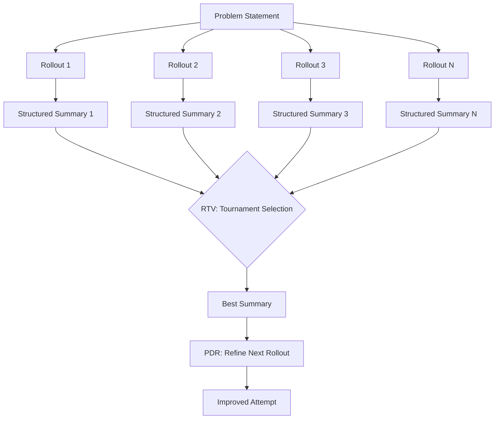

# Scaling Test-Time Compute for Agentic Coding: What the Rollout Summary Research Means for Codex CLI Retry Strategy


---

Every developer who has used a coding agent knows the ritual: the agent fails, you restart it, and sometimes the second attempt succeeds where the first did not. But is "just retry it" a strategy, or merely superstition? A landmark April 2026 paper from Carnegie Mellon, Meta, and the University of Washington provides the first rigorous framework for turning retries into a disciplined engineering practice — and its findings map directly onto Codex CLI's existing infrastructure.

## The Core Problem: Long-Horizon Agents Break Naive Scaling

Test-time compute scaling — spending more inference budget to improve results — works brilliantly for short-output tasks like maths problems or single-function generation. Sample multiple candidates, pick the best, done. But coding agents produce extended trajectories of actions, observations, errors, and partial progress spanning hundreds of tool calls [^1]. You cannot simply diff two 500-step trajectories and declare a winner.

Kim et al.'s "Scaling Test-Time Compute for Agentic Coding" (arXiv:2604.16529) [^1] tackles this head-on. The paper introduces two complementary scaling methods built on a single insight: **convert each rollout into a structured summary** that preserves hypotheses, progress, and failure modes whilst discarding low-signal trace noise.



## Two Methods: RTV and PDR

### Recursive Tournament Voting (RTV) — Parallel Scaling

RTV partitions a population of rollout summaries into small groups (optimally pairs, G=2), uses the LLM itself as judge to compare them, and retains the winner from each group [^1]. This process recurses until a single best candidate remains. Multiple independent votes per comparison (V=8) enhance decision reliability over single comparisons [^1].

The critical finding: **structured summaries substantially outperform entire rollouts** as comparison inputs, particularly in late tournament rounds [^1]. Raw trajectories overwhelm the judge model's context window with irrelevant detail; summaries preserve decision-relevant signal.

### Parallel-Distill-Refine (PDR) — Sequential Scaling

PDR conditions new rollouts on distilled summaries from prior attempts [^1]. Rather than starting from scratch, each fresh attempt receives K summaries selected by RTV, allowing it to avoid previously discovered dead ends and build on partial progress.

The quality of the refinement context matters enormously: the number of passing rollouts among the prior summaries is a strong predictor of iteration-one success rate [^1].

## The Numbers

The results are striking across two benchmarks:

| Benchmark | Model | Baseline | With RTV+PDR | Gain |
|---|---|---|---|---|
| SWE-Bench Verified | Claude 4.5 Opus | 70.9% | 77.6% | +6.7pp |
| SWE-Bench Verified | Gemini 3.1 Pro | 72.0% | 77.0% | +5.0pp |
| Terminal-Bench v2.0 | Claude 4.5 Opus | 46.9% | 59.1% | +12.2pp |
| Terminal-Bench v2.0 | Gemini 3.1 Pro | 53.0% | 65.0% | +12.0pp |

Standalone RTV delivers 5–6pp gains on SWE-Bench and 8–12pp on Terminal-Bench [^1]. The combined pipeline reduces average steps per rollout, indicating more efficient agent search despite increased total compute [^1].

Crucially, these gains outperform naive best-of-N sampling, where you simply run N attempts and pick the one that passes tests. The representation-centric approach — summarise, select, refine — beats brute-force repetition [^1].

## The Ceiling: Context Pollution Limits Sequential Scaling

A companion study from CMU, "Benchmark Test-Time Scaling of General LLM Agents" (arXiv:2602.18998), provides a sobering constraint [^2]. Agent performance peaks between 3 and 7 turns on general tasks; beyond that, accumulated context pollution degrades results [^2]. Parallel scaling hits a different wall: sampling more trajectories raises the theoretical upper bound, but model self-selection cannot close the verification gap [^2].

This convergence is important. Kim et al.'s structured summaries work precisely because they **discard** context pollution rather than accumulating it. The summary acts as a lossy compression that preserves signal and drops noise — a mechanism that echoes Codex CLI's own compaction system.

## Mapping to Codex CLI

### `codex cloud exec --attempts` as Native Best-of-N

Codex CLI already provides a built-in best-of-N mechanism via the `--attempts` flag on cloud execution [^3]:

```bash
codex cloud exec --env ENV_ID --attempts 4 "Refactor the authentication module to use JWT"
```

The `--attempts` parameter accepts values 1–4, instructing Codex Cloud to run multiple independent attempts and select the best result [^3] [^6]. This is essentially naive best-of-N — the baseline that Kim et al. improved upon.

### Building RTV-Style Selection with Shell Scripts

For local execution, you can approximate the RTV pattern using `codex exec` with session forking:

```bash
#!/usr/bin/env bash
# Run N parallel rollouts in isolated worktrees
TASK="Fix the race condition in worker pool shutdown"
SUMMARIES_DIR=$(mktemp -d)

for i in $(seq 1 4); do
  git worktree add "/tmp/rollout-$i" HEAD
  codex exec \
    --json \
    --cwd "/tmp/rollout-$i" \
    "$TASK" \
    2>&1 | jq -r '.message // empty' > "$SUMMARIES_DIR/rollout-$i.log" &
done
wait

# Use Codex itself as the judge (RTV round)
codex exec "Compare these four attempt logs and identify which produced the best solution. Explain your reasoning." \
  --files "$SUMMARIES_DIR/rollout-1.log" \
  --files "$SUMMARIES_DIR/rollout-2.log" \
  --files "$SUMMARIES_DIR/rollout-3.log" \
  --files "$SUMMARIES_DIR/rollout-4.log"
```

### Session Forking as PDR

Codex CLI's session fork mechanism [^4] provides the sequential scaling primitive. When a session reaches a dead end, forking creates a new session that inherits the conversation context — effectively conditioning the next attempt on the previous one:

```bash
# Fork from a stalled session, preserving context
codex fork --from 2026-06-20T10-30-00Z-abc123
```

The research suggests this is more effective when you **compact before forking** — using `model_auto_compact_token_limit` to strip low-signal context before the fork, mirroring the paper's structured summary approach [^1] [^5].

```toml
# config.toml — aggressive compaction before fork points
model_auto_compact_token_limit = 60000
compact_prompt = "Summarise hypotheses tested, progress made, and failure modes discovered. Discard raw tool output."
```

### Named Profiles for Scaling Strategies

Different tasks warrant different scaling approaches. The research shows Terminal-Bench (systems administration tasks) benefits more from test-time scaling than SWE-Bench (code patching) [^1], suggesting task-type routing:

```toml
# ~/.codex/scaling-aggressive.config.toml
# For complex systems tasks — invest in parallel rollouts
model = "o3"
model_auto_compact_token_limit = 50000
compact_prompt = "Preserve: hypotheses, partial progress, failure modes. Discard: raw command output, file listings."

# ~/.codex/scaling-conservative.config.toml
# For well-defined patches — single attempt usually suffices
model = "o4-mini"
model_auto_compact_token_limit = 100000
```

```bash
# Systems task: use aggressive scaling profile
codex --profile scaling-aggressive "Debug why the Kubernetes pod is crash-looping"

# Simple patch: conservative profile
codex --profile scaling-conservative "Add input validation to the signup endpoint"
```

### AGENTS.md as Rollout Guidance

The paper's structured summaries work because they preserve **hypotheses** and **failure modes**. You can encode this discipline directly in AGENTS.md:

```markdown
## Retry and Rollout Discipline

When a task fails or produces incorrect results:
1. Before retrying, document: what hypothesis was tested, what evidence was found, why it failed
2. Do not repeat the same approach — each attempt must try a different strategy
3. If the third attempt fails, stop and report the failure taxonomy rather than continuing

## Progress Tracking

Maintain a running summary in comments:
- Hypotheses tested and their outcomes
- Partial progress that should be preserved
- Dead ends to avoid in subsequent attempts
```

### PostToolUse Hooks for Rollout Quality Gates

The RTV finding that structured summaries outperform raw rollouts suggests that quality-gating intermediate outputs improves downstream selection. A PostToolUse hook can enforce this:

```toml
# Require test passage before accepting a rollout as successful
[hooks.post_tool_use.shell]
command = "python3 scripts/rollout-gate.py"
```

```python
# scripts/rollout-gate.py
import json, sys, subprocess

event = json.load(sys.stdin)
if event.get("tool_name") == "shell" and "git diff" in event.get("tool_input", ""):
    result = subprocess.run(["make", "test"], capture_output=True)
    if result.returncode != 0:
        print(json.dumps({"decision": "report_error",
                          "reason": "Tests failing — rollout should not be selected"}))
        sys.exit(0)

print(json.dumps({"decision": "approve"}))
```

## The Practical Calculus

The research presents a clear cost–benefit framework. Each additional rollout costs roughly one full session of compute. The gains follow a curve of diminishing returns:

- **1 → 2 attempts**: largest marginal gain (3–6pp on SWE-Bench) [^1]
- **2 → 4 attempts**: moderate gain with RTV selection [^1]
- **4 → 8 attempts**: gains plateau unless PDR refinement is applied [^1]
- **Beyond 8**: context ceiling effects dominate [^2]

For Codex CLI users, the `--attempts 4` ceiling on cloud execution aligns well with the research's sweet spot. For local orchestration, the practical limit is similarly constrained by the 3–7 turn context pollution threshold [^2].

## What This Changes

The paper reframes test-time scaling from "throw more compute at it" to "represent, select, and reuse prior experience" [^1]. For Codex CLI practitioners, the actionable insights are:

1. **Use `--attempts` for cloud tasks** — even naive best-of-N delivers measurable gains
2. **Compact before forking** — strip noise, preserve hypotheses, mirror the structured summary approach
3. **Route by task complexity** — systems tasks benefit most from scaling; simple patches do not justify the cost
4. **Encode retry discipline in AGENTS.md** — prevent the agent from repeating failed approaches
5. **Gate rollout quality** — a failing rollout that passes selection corrupts the entire pipeline

The era of "just retry it and hope" is over. The research shows that disciplined retry — with structured summaries, tournament selection, and progressive refinement — converts raw compute into genuine capability gains.

## Citations

[^1]: Kim, J., Yang, W., Niu, K., Zhang, H., Zhu, Y., Helenowski, E., Silva, R., Chen, Z., Iyer, S., Zaheer, M., Fried, D., Hajishirzi, H., Arora, S., Synnaeve, G., Salakhutdinov, R., & Goyal, A. (2026). "Scaling Test-Time Compute for Agentic Coding." arXiv:2604.16529. [https://arxiv.org/abs/2604.16529](https://arxiv.org/abs/2604.16529)

[^2]: "Benchmark Test-Time Scaling of General LLM Agents." arXiv:2602.18998. Carnegie Mellon University, February 2026. [https://arxiv.org/abs/2602.18998](https://arxiv.org/abs/2602.18998)

[^3]: OpenAI. "Command line options — Codex CLI." OpenAI Developers. [https://developers.openai.com/codex/cli/reference](https://developers.openai.com/codex/cli/reference)

[^4]: OpenAI. "Features — Codex CLI." OpenAI Developers. [https://developers.openai.com/codex/cli/features](https://developers.openai.com/codex/cli/features)

[^5]: OpenAI. "Advanced Configuration — Codex." OpenAI Developers. [https://developers.openai.com/codex/config-advanced](https://developers.openai.com/codex/config-advanced)

[^6]: OpenAI. "Changelog — Codex." OpenAI Developers. [https://developers.openai.com/codex/changelog](https://developers.openai.com/codex/changelog)
