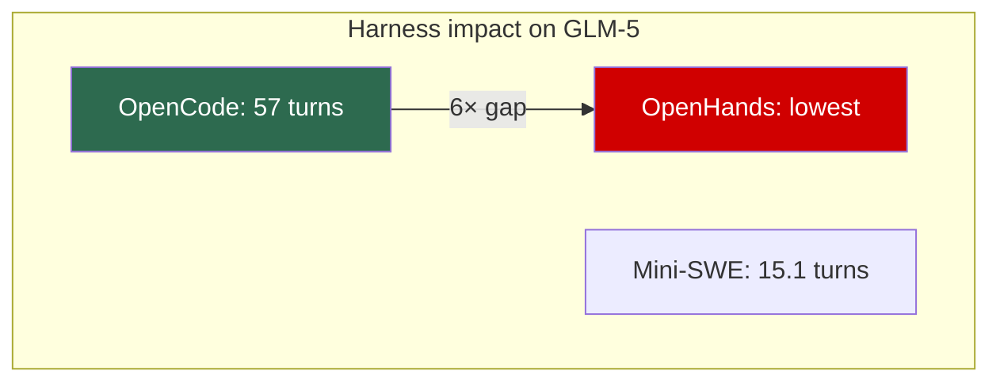
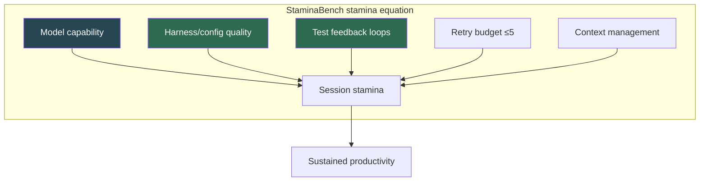

# StaminaBench: What Stress-Testing Coding Agents over 100 Turns Means for Codex CLI Session Strategy


---

Real development sessions are not one-shot tasks. They are long chains of incremental change requests — add a field, refactor the validation, introduce a new endpoint, fix the regression you just introduced. StaminaBench, published on 19 June 2026 by Sobal, Yang, Zhang, Xia, and Soatto, is the first benchmark designed to measure exactly this: how many consecutive modification turns a coding agent can survive before it breaks [^1]. The results are sobering. Without test feedback and retries, every model tested — including frontier-scale open-source LLMs — failed within five to six turns. But the paper also reveals that harness design and retry strategy can extend agent stamina by an order of magnitude, and those findings map directly to Codex CLI configuration.

## What StaminaBench measures

Unlike SWE-bench (which evaluates single-issue resolution) or SlopCodeBench (which measures quality degradation), StaminaBench measures *stamina*: the number of consecutive interaction turns an agent can handle before producing a failing implementation [^1][^2].

The benchmark generates 100 sequential change requests targeting a REST API server. Each turn adds entities, relationships, validation rules, cascade-deletion logic, or aggregate analytics endpoints. By turn 100, the codebase reaches approximately 6,000 lines [^1]. Crucially, the change sequences are generated procedurally without LLM involvement, ensuring reproducibility.


The system runs agents and servers in isolated environments communicating via HTTP, making evaluation language-agnostic and black-box. Six agent harnesses were paired with seven open-source LLMs across 20 scenarios, each running the full 100-turn sequence [^1].

## The headline numbers

### Without feedback: universal collapse at turn five

When models received only a pass/fail signal with no test output (R=0 retries), every model failed within five to six turns. GLM-5 (Zhipu, 744B/40B MoE) — the strongest model tested — managed just 6.2 turns on average [^1].

### With feedback and retries: 12× improvement

Providing detailed test feedback and two retry attempts per turn (R=2) transformed the results:

| Model | Parameters | OpenCode (R=2) | Mini-SWE (R=2) | Without feedback (R=0) |
|-------|-----------|----------------|----------------|----------------------|
| GLM-5 | 744B/40B MoE | **57.0 turns** | 15.1 | 6.2 |
| Qwen3.5-122B | 122B/10B MoE | 39.4 | 33.1 | 2.8 |
| Kimi K2.5 | 1T/32B MoE | 31.8 | — | — |
| Devstral 2 | 123B dense | — | — | — |
| Nemotron Super | 120B/12B | — | — | — |

GLM-5 with OpenCode reached 57 turns — a 12× improvement over its no-feedback baseline [^1]. The lesson: structured test feedback is not a convenience; it is the primary determinant of agent stamina.

### Harness choice: up to 6× variance

The same model showed up to 6× performance variation depending on its harness [^1]. OpenCode consistently produced the best results. OpenHands consistently produced the worst. Provider-specific harnesses (QwenCode, Kimi CLI, Mistral Vibe) frequently underperformed generic alternatives — QwenCode was worse for Qwen models than OpenCode was [^1].



### Retry budget scaling

With up to 10 retries per turn, stronger models (GLM-5, Kimi K2.5, Qwen3.5-122B) improved substantially through the first five attempts, then plateaued. Weaker models showed minimal improvement regardless of retry budget [^1]. This establishes a clear principle: retry budgets have diminishing returns, and the sweet spot sits around five attempts.

## Failure mode taxonomy

StaminaBench identifies two distinct failure categories that shift in dominance as retry budgets increase [^1]:

### Implementation bugs (dominant at low retry counts)

- Incorrect validation logic (overly strict or permissive)
- Field nullability violations
- Hallucinated unrequested features (e.g. enums instead of strings)
- Progressive instruction disregard as context grows

### Infrastructure failures (dominant at high retry counts)

- Invalid tool-call formatting
- Overly broad `pkill` patterns killing the harness process itself
- Context compaction triggering crashes
- Loop-detection false positives
- Self-inflicted terminations (8–13 of 20 scenarios per model-harness pair)

The crossover is significant: once coding bugs are mitigated through retries, *tool-calling mechanics and context management* become the binding constraint [^1].

## Mapping StaminaBench to Codex CLI

StaminaBench's findings translate to five concrete Codex CLI configuration strategies.

### 1. PostToolUse hooks as structured test feedback

The 12× improvement from test feedback maps directly to PostToolUse hooks that run tests after every code change [^3][^4]:

```toml
# config.toml — test-on-every-change hook
[[hooks]]
event = "PostToolUse"
command = "npm test -- --reporter=verbose 2>&1 | tail -50"
timeout_ms = 30000
on_failure = "report"
```

The hook output becomes the "detailed test feedback" that StaminaBench shows is essential. Without it, you are operating in the R=0 regime — five turns and out.

### 2. Session forking as context refresh

StaminaBench's most insidious failure mode is *progressive instruction disregard* — agents ignoring earlier requirements as conversation history accumulates [^1]. Codex CLI's session forking directly addresses this [^5]:

```bash
# Fork at a clean checkpoint, preserving transcript but resetting context
codex resume <session-id>
# Press Esc twice to walk back, then Enter to fork
```

For automated workflows, the equivalent is to start a new `codex exec` invocation that references the previous session's outputs:

```bash
# Periodic context refresh in automation
codex exec --model gpt-5.5 \
  "Continue implementing the API. Previous state: $(cat .session-checkpoint.md)"
```

This mirrors the "context refresh" that StaminaBench implies is necessary — the paper shows agents degrade as history grows, and forking gives you a clean context window [^5][^6].

### 3. model_auto_compact_token_limit tuning

StaminaBench found that context compaction triggered crashes in certain models [^1]. Codex CLI's `model_auto_compact_token_limit` controls when automatic compaction fires [^6][^7]:

```toml
# config.toml — delay compaction to avoid mid-task corruption
model_auto_compact_token_limit = 100000

# Custom compaction prompt to preserve critical context
compact_prompt = "Preserve all entity schemas, validation rules, and endpoint contracts. Summarise implementation details only."
```

Setting the threshold too low forces frequent compaction, which risks the crashes StaminaBench observed. Setting it too high exhausts the context window. The GPT-5.5 400K context window provides more runway than the open-source models tested in StaminaBench, but compaction discipline still matters for sessions exceeding 50 turns [^7].

### 4. Named profiles for retry-budget routing

StaminaBench shows that retry budgets have diminishing returns after five attempts, and that weaker models do not benefit from additional retries [^1]. Codex CLI named profiles let you encode this [^8]:

```toml
# config.toml — stamina-aware profiles

[profile.quick-task]
model = "o4-mini"
# Short tasks: fewer retries, lower compaction threshold
model_auto_compact_token_limit = 40000

[profile.marathon]
model = "gpt-5.5"
# Long sessions: higher compaction threshold, more context runway
model_auto_compact_token_limit = 120000
```

Select the profile at invocation:

```bash
codex --profile marathon "Implement the full CRUD API with validation and analytics"
```

### 5. AGENTS.md as instruction anchor

The paper's finding that agents progressively disregard instructions maps to a known context-engineering problem: early instructions fade as conversation history grows [^1][^9]. AGENTS.md provides a persistent instruction anchor that Codex CLI re-injects at each turn [^10]:

```markdown
<!-- AGENTS.md -->
## Mandatory constraints (do not relax under any circumstances)

1. All entity fields use nullable types unless explicitly marked required
2. Cascade deletion must be tested with dependent records present
3. Every endpoint returns proper HTTP status codes (201 for creation, 404 for missing)
4. Run `npm test` after every file modification — do not proceed if tests fail
5. Never use `pkill` or broad process termination commands
```

Rule 5 directly addresses StaminaBench's finding that agents kill their own harness with overly broad `pkill` patterns [^1].

## The harness is the product

StaminaBench's most provocative finding is that harness quality matters as much as model quality — sometimes more [^1]. OpenCode outperformed provider-specific harnesses even on those providers' own models. Mini-SWE, despite offering only a single bash tool, remained competitive because it provided clean feedback loops [^1].

For Codex CLI users, this means the configuration surrounding the model — hooks, compaction strategy, instruction anchoring, feedback loops — is not optional tuning. It *is* the stamina strategy.



## Cost reality check

A single GLM-5 + OpenCode configuration consumed 4.5 billion input tokens and 7.5 million output tokens across the full benchmark [^1]. At frontier closed-source pricing, equivalent runs would cost approximately \$13.6K (Claude Sonnet 4.6) to \$22.7K (GPT-5.5) per configuration [^1]. This underscores why retry budgets must be bounded — unlimited retries are not just ineffective beyond five attempts, they are ruinously expensive.

## Practical checklist

1. **Enable PostToolUse test hooks** — move from R=0 (5 turns) to R=2 (50+ turns) ⚠️ *Turn counts are from open-source models; Codex CLI with GPT-5.5 may differ*
2. **Fork sessions at natural checkpoints** — every 20–30 turns or when instruction compliance drifts
3. **Set `model_auto_compact_token_limit`** high enough to avoid premature compaction crashes
4. **Use AGENTS.md** to anchor critical invariants against context-drift
5. **Cap retry budgets at five** — returns diminish sharply beyond this threshold
6. **Avoid provider-specific harnesses** when generic alternatives exist — StaminaBench found they underperform

## Citations

[^1]: Sobal, V., Yang, S., Zhang, Y., Xia, W. & Soatto, S. (2026). "StaminaBench: Stress-Testing Coding Agents over 100 Interaction Turns." *arXiv:2606.19613*. [https://arxiv.org/abs/2606.19613](https://arxiv.org/abs/2606.19613)

[^2]: Agarwal, M. et al. (2026). "SlopCodeBench: Benchmarking How Coding Agents Degrade Over Long-Horizon Iterative Tasks." *arXiv:2603.24755*. [https://arxiv.org/abs/2603.24755](https://arxiv.org/abs/2603.24755)

[^3]: OpenAI (2026). "Features — Codex CLI." OpenAI Developers. [https://developers.openai.com/codex/cli/features](https://developers.openai.com/codex/cli/features)

[^4]: OpenAI (2026). "Advanced Configuration — Codex." OpenAI Developers. [https://developers.openai.com/codex/config-advanced](https://developers.openai.com/codex/config-advanced)

[^5]: OpenAI (2026). "Command line options — Codex CLI." OpenAI Developers. [https://developers.openai.com/codex/cli/reference](https://developers.openai.com/codex/cli/reference)

[^6]: Vaughan, D. (2026). "Context Compaction Deep Dive: How Codex CLI, Claude Code, and OpenCode Manage Long Sessions." Codex Knowledge Base. [https://codex.danielvaughan.com/2026/04/14/context-compaction-deep-dive-codex-cli-claude-code-opencode/](https://codex.danielvaughan.com/2026/04/14/context-compaction-deep-dive-codex-cli-claude-code-opencode/)

[^7]: Vaughan, D. (2026). "Codex CLI Context Compaction Under GPT-5.5: Diagnosing Failures, Configuring Fallbacks, and Keeping Long Sessions Alive." Codex Knowledge Base. [https://codex.danielvaughan.com/2026/05/10/codex-cli-context-compaction-gpt55-failures-resilient-long-sessions/](https://codex.danielvaughan.com/2026/05/10/codex-cli-context-compaction-gpt55-failures-resilient-long-sessions/)

[^8]: Vaughan, D. (2026). "Codex CLI Configuration Reference: Precedence, All Keys and Inline Overrides." Codex Knowledge Base. [https://codex.danielvaughan.com/2026/04/08/codex-cli-configuration-reference/](https://codex.danielvaughan.com/2026/04/08/codex-cli-configuration-reference/)

[^9]: Lodha, P. et al. (2026). "Efficient Context Engineering for Agentic Tasks." *arXiv:2606.10209*. [https://arxiv.org/abs/2606.10209](https://arxiv.org/abs/2606.10209)

[^10]: OpenAI (2026). "AGENTS.md — Codex." OpenAI Developers. [https://developers.openai.com/codex/agents-md](https://developers.openai.com/codex/agents-md)
