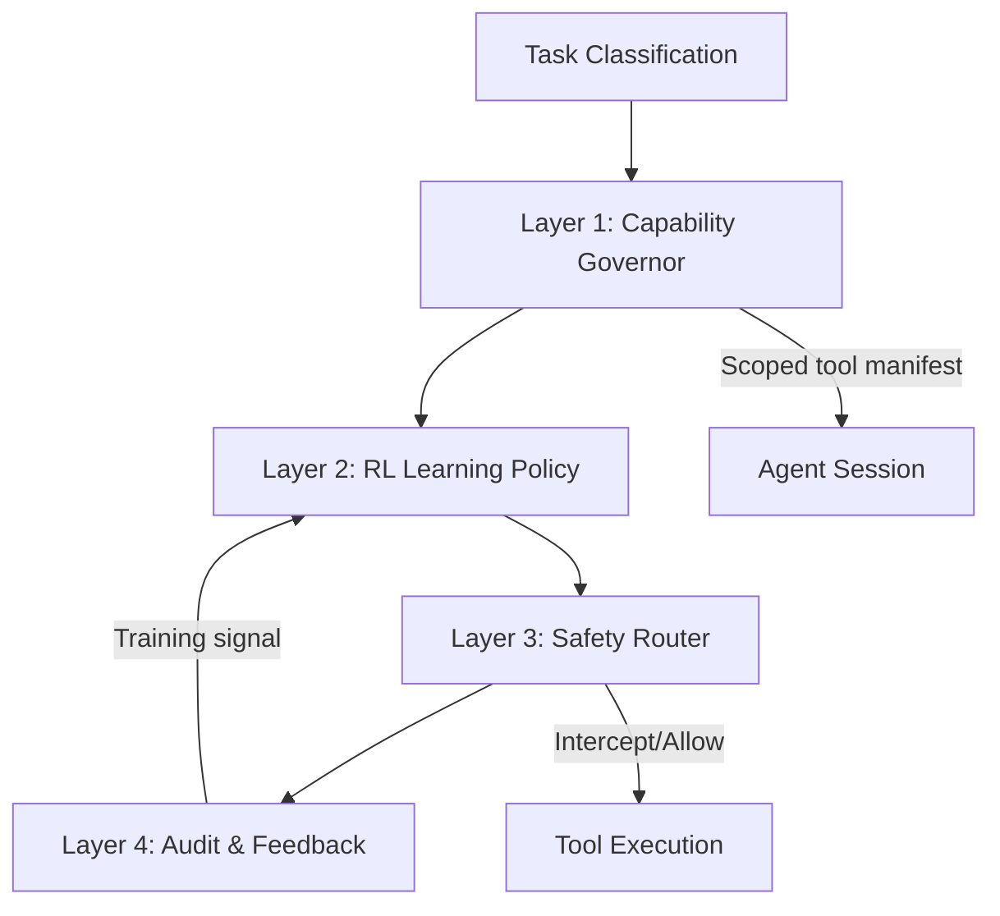
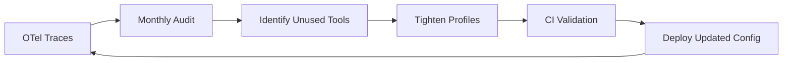

# Beyond Static Sandboxing: What Learned Capability Governance Means for Codex CLI Least-Privilege Tool Scoping


## The Capability Overprovisioning Problem

Every coding agent shipped today suffers from the same structural defect: a summarisation task receives the same shell execution, subagent spawning, and credential-access capabilities as a full code deployment task [^1]. Sidik et al. measure this as a **15× overprovision ratio** across popular open-source agent runtimes including OpenClaw, LangGraph, and CrewAI [^1].

The consequences are not theoretical. The HumanLayer team confirmed empirically that exposing too many MCP tools creates what they call "the dumb zone" — the model spends tokens reasoning about irrelevant capabilities rather than solving the task [^2]. Overprovisioning simultaneously degrades performance *and* expands the attack surface.

This article examines two research responses to the problem — the Aethelgard learned governance framework and NVIDIA's NemoClaw container sandbox — then maps their insights to Codex CLI's permission profile architecture, showing how practitioners can enforce dynamic least privilege today.

## Aethelgard: Four Layers of Adaptive Governance

Sidik et al. (arXiv:2604.11839, April 2026, under review for NeurIPS 2026 Agent Safety Workshop) introduce **Aethelgard**, a four-layer framework that enforces least privilege through a learned policy rather than static allowlists [^1]:



### Layer 1 — Capability Governor

Dynamically scopes which tools the agent is *aware of* in each session. A summarisation task never sees `shell_exec` or `credential_read` in its tool manifest [^1].

### Layer 2 — RL Learning Policy

A PPO policy trained on accumulated audit logs learns the minimum viable capability set for each task type. Over time, the policy converges on tighter boundaries without manual rule authoring [^1].

### Layer 3 — Safety Router

Intercepts every tool call before execution using a hybrid rule-based and fine-tuned LLM classifier. Calls outside the learned boundary are blocked or escalated [^1].

### Layer 4 — Audit and Feedback Loop

Blocked calls and their outcomes feed back into the RL policy, progressively tightening the capability envelope [^1].

### Results

On a live OpenClaw v2026.3.28 deployment with DeepSeek-chat as the agent LLM, Aethelgard achieves:

| Metric | Result |
|--------|--------|
| Tool reduction (summarisation tasks) | 73% |
| Dangerous tool elimination | 100% |
| Tool calls blocked (all task types) | 26.2% |

The 73% tool reduction for summarisation tasks demonstrates that most agents operate with vastly more capabilities than any single task requires [^1].

## NemoClaw: Container-Level Enforcement

Announced at GTC on 16 March 2026, NVIDIA's **NemoClaw** provides kernel-level enforcement for the OpenClaw agent framework [^3]. Where Aethelgard operates at the application layer (tool manifests and call interception), NemoClaw operates at the infrastructure layer:

- **OpenShell Runtime** — Docker + K3s orchestration providing isolated sandboxed execution [^3]
- **Default-deny outbound networking** — every external connection requires operator approval [^3]
- **Kernel-level network allowlisting** — filesystem write restrictions and configuration file protection through an out-of-process policy engine that cannot be overridden by compromised agents [^4]
- **Privacy Router** — intelligent routing between local Nemotron models and cloud providers; sensitive data stays on-device [^3]

The critical architectural decision: the policy engine runs **out-of-process**, meaning a compromised agent cannot modify its own constraints [^4].

## Mapping to Codex CLI Permission Profiles

Codex CLI already implements several patterns that Aethelgard formalises. The gap lies not in mechanism but in *dynamic adaptation* — Codex profiles are static declarations, not learned policies. Here is how practitioners can approximate learned governance today:

### Task-Scoped Named Profiles (Capability Governor)

Define narrow profiles per task type rather than relying on a single permissive default:

```toml
# ~/.config/codex/config.toml

[permissions.summarise]
# Summarisation tasks: read-only filesystem, no network, no shell
sandbox_mode = "read-only"
allowed_network = []
enabled_tools = ["file_read", "search"]

[permissions.deploy]
# Deployment tasks: write access, network to approved hosts
sandbox_mode = "workspace-write"
allowed_network = ["github.com", "registry.npmjs.org"]
enabled_tools = ["file_read", "file_write", "shell_exec", "git"]

[permissions.review]
# Code review: read-only, network for fetching PRs
sandbox_mode = "read-only"
allowed_network = ["api.github.com"]
enabled_tools = ["file_read", "git", "search"]
```

Switch profiles per session with `--profile summarise` or via the `/permissions` TUI command introduced in v0.142 [^5].

### MCP Server Tool Scoping (Safety Router)

Restrict which MCP tools are visible to the agent per server using `enabled_tools` allowlisting [^6]:

```toml
[mcp.servers.filesystem]
command = "npx"
args = ["-y", "@anthropic/filesystem-mcp"]
enabled_tools = ["read_file", "list_directory"]
default_tools_approval_mode = "prompt"

[mcp.servers.github]
command = "npx"
args = ["-y", "@github/mcp-server"]
enabled_tools = ["get_pull_request", "list_reviews"]
default_tools_approval_mode = "auto"
```

This achieves Layer 1 (Capability Governor) scoping at the MCP boundary — tools not in the allowlist never appear in the agent's tool manifest [^6].

### PostToolUse Hooks as Safety Router

Codex CLI hooks can intercept tool calls for audit and conditional blocking, approximating Layer 3:

```bash
#!/usr/bin/env bash
# .codex/hooks/post_tool_use.sh
# Block unexpected shell commands in review profiles

TOOL_NAME="$1"
PROFILE="$CODEX_PERMISSION_PROFILE"

if [[ "$PROFILE" == "review" && "$TOOL_NAME" == "shell_exec" ]]; then
  echo "BLOCKED: shell_exec not permitted in review profile" >&2
  exit 1
fi
```

### AGENTS.md as Policy Declaration

Encode least-privilege intent in the project's `AGENTS.md` so the agent self-constrains even before profile enforcement applies:

```markdown
## Security Policy

- Summarisation tasks: DO NOT use shell_exec, credential_read, or network tools
- Code review tasks: read-only filesystem access; DO NOT modify files
- Deployment tasks: require explicit user approval for any destructive operation
```

### Filesystem Path Narrowing

Codex CLI's most-specific-path-wins rule enables fine-grained filesystem governance [^7]:

```toml
[permissions.deploy.filesystem]
"/repo" = "read-write"
"/repo/.env" = "deny"
"/repo/secrets" = "deny"
"/repo/secrets/public-keys" = "read-only"
```

## The Adaptation Gap

The key insight from Aethelgard is that **static profiles cannot keep pace with evolving agent capabilities**. As new tools are added to MCP servers, as models become more capable, and as projects change shape, manually maintaining permission profiles becomes untenable.

Practitioners can partially bridge this gap today:

1. **Audit logging** — Enable Codex CLI's OpenTelemetry tracing [^8] to capture every tool call per task type
2. **Periodic profile tightening** — Review trace data monthly; remove tools that were never invoked from enabled_tools lists
3. **Profile inheritance** — Use Codex CLI's profile inheritance (v0.133+) to build narrow profiles that extend a restrictive base [^9]
4. **CI validation** — Run `codex doctor` and custom lint rules against config files to flag overly permissive profiles



Until Codex CLI ships a native learned-policy engine (or integrates with external governance layers like NemoClaw), this manual feedback loop is the closest approximation to Aethelgard's Layer 2 RL policy.

## Practical Recommendations

| Principle | Codex CLI Implementation |
|-----------|--------------------------|
| Never expose all tools to all tasks | Named profiles with `enabled_tools` per MCP server |
| Enforce at infrastructure level | Sandbox mode + filesystem deny rules |
| Out-of-process policy | PostToolUse hooks running in parent shell |
| Audit everything | OpenTelemetry spans for tool calls |
| Adapt over time | Monthly trace review → profile tightening |
| Defence in depth | AGENTS.md + profiles + hooks + sandbox |

## Conclusion

The capability overprovisioning problem is not a theoretical concern — it is a measurable 15× gap between what agents receive and what they need [^1]. Aethelgard demonstrates that learned policies can close this gap automatically (73% tool reduction), while NemoClaw proves that kernel-level enforcement prevents compromised agents from escaping their boundaries.

Codex CLI's permission profile system already provides the mechanical foundation for least-privilege tool scoping. What it lacks is the adaptive learning loop. Practitioners who combine narrow named profiles, MCP tool allowlisting, PostToolUse interception hooks, and regular audit-driven tightening can approximate learned governance today — and will be well-positioned when native adaptive policy engines inevitably arrive.

## Citations

[^1]: Sidik, B. & Rokach, L. "Beyond Static Sandboxing: Learned Capability Governance for Autonomous AI Agents." arXiv:2604.11839, April 2026. [https://arxiv.org/abs/2604.11839](https://arxiv.org/abs/2604.11839)

[^2]: HumanLayer. "The Dumb Zone: How Tool Overexposure Degrades Agent Performance." HumanLayer Blog, 2026. Referenced in Codex Knowledge Base coverage of the harness effect.

[^3]: NVIDIA. "NVIDIA Announces NemoClaw for the OpenClaw Community." NVIDIA Newsroom, March 2026. [https://nvidianews.nvidia.com/news/nvidia-announces-nemoclaw](https://nvidianews.nvidia.com/news/nvidia-announces-nemoclaw)

[^4]: "Before the Tool Call: Deterministic Pre-Action Authorization for Autonomous AI Agents." arXiv:2603.20953, March 2026. [https://arxiv.org/pdf/2603.20953](https://arxiv.org/pdf/2603.20953)

[^5]: OpenAI. "Codex CLI Changelog — v0.142.0-alpha." GitHub Releases, June 2026. [https://github.com/openai/codex/releases](https://github.com/openai/codex/releases)

[^6]: OpenAI. "Permissions — Codex CLI." OpenAI Developers, 2026. [https://developers.openai.com/codex/permissions](https://developers.openai.com/codex/permissions)

[^7]: OpenAI. "Codex CLI Split Permissions: Fine-Grained Filesystem and Network Policies." OpenAI Developers, 2026. [https://developers.openai.com/codex/permissions](https://developers.openai.com/codex/permissions)

[^8]: OpenAI. "Codex CLI OpenTelemetry Observability and Tracing." Features documentation, 2026. [https://developers.openai.com/codex/cli/features](https://developers.openai.com/codex/cli/features)

[^9]: OpenAI. "Codex CLI v0.133 Release — Permission Profile Inheritance." GitHub Releases, May 2026. [https://github.com/openai/codex/releases](https://github.com/openai/codex/releases)
