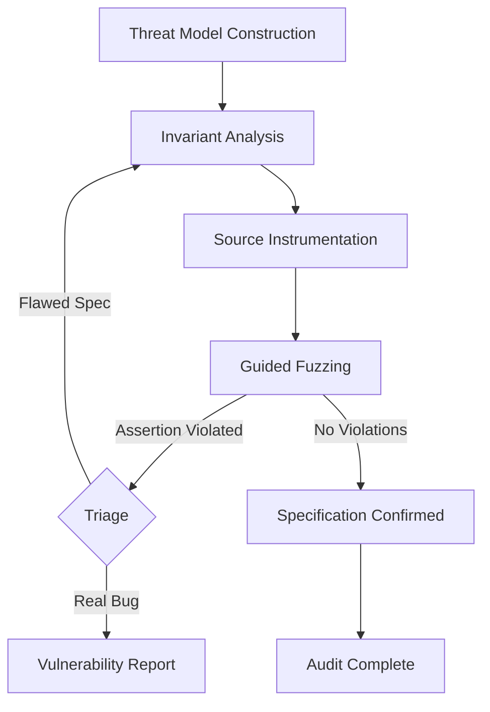

# Code-Augur and Specification-First Vulnerability Detection: What Grounded Agent Security Means for Codex CLI Audit Workflows


---

LLM-based vulnerability detection has a transparency problem. When an agent declares code "vulnerable" or "safe," the reasoning behind that verdict is opaque — buried in the model's latent space, unreproducible, and unverifiable. Code-Augur, published on 17 June 2026 by Luo, Zafar, Wolff, and Roychoudhury at the National University of Singapore, attacks this problem head-on with a specification-first paradigm that externalises the agent's assumptions as in-source assertions and then uses guided fuzzing to falsify them [^1]. The results are striking: 22 previously unknown vulnerabilities across seven open-source projects, two assigned CVEs, and 34–63% more bugs than competing agent systems on the AIxCC benchmark [^1].

For Codex CLI users running security audits, Code-Augur's architecture offers a concrete blueprint for moving beyond "scan and pray" workflows toward grounded, iterative security reasoning that integrates with hooks, the Security Plugin, and sandbox execution.

## The Opacity Problem in Agent-Driven Security

Traditional agent-based vulnerability scanners follow a pattern that will be familiar to anyone who has used `codex security scan`: the model reads code, reasons about it internally, and emits findings. The problem is that this reasoning is a black box. When a scanner reports zero findings, you have no way of knowing whether it genuinely verified safety or simply failed to consider relevant attack surfaces.

Code-Augur's insight is that the agent's *assumptions* are the valuable artefact — not just its conclusions. By forcing the agent to express those assumptions as executable specifications (source-level assertions), the system creates a falsifiable record of what "safe" actually means for each code path [^1].

## How Code-Augur Works

The framework operates through five integrated stages:



1. **Threat model construction** — the agent examines code components and identifies entry points, untrusted inputs, and source-to-sink paths [^1].
2. **Invariant analysis** — for each component, the agent infers security-relevant invariants (e.g., `satellites_visible <= MAXCHANNELS` in gpsd) and expresses them as assertions [^1].
3. **Source instrumentation** — invariants are committed as in-source assertions, creating a persistent, reviewable specification layer [^1].
4. **Guided fuzzing** — a fuzzer (libFuzzer for C/C++, Jazzer for JVM, native drivers for Go/Rust) attempts to violate the assertions, using distance-guided feedback via 16 extra-counter slots for C/C++ targets [^1].
5. **Violation triage** — triggered assertions either expose genuine vulnerabilities or reveal flawed specifications that need refinement, feeding back into invariant analysis [^1].

This loop — infer, instrument, fuzz, refine — grounds the agent's reasoning in observed program behaviour rather than relying solely on static pattern matching.

## Quantitative Results

Code-Augur was evaluated against two baselines: **Atlantis** (the AIxCC competition winner using a fuzzing-centric approach) and **Claude Code** (minimally-structured agentic reasoning with ad-hoc tool invocation) [^1].

### AIxCC Benchmark (39 known vulnerabilities, 9 projects)

| Configuration | Existing Bugs Found | New Bugs Found | Total |
|---|---|---|---|
| Code-Augur + Claude Sonnet 4.6 | 33 | 26 | 59 |
| Code-Augur + DeepSeek V4 Pro | 29 | 22 | 51 |
| Atlantis + Claude | — | — | ~36–44 |
| Claude Code | — | — | ~36–44 |

Code-Augur with Claude found 34–63% more bugs than either baseline [^1].

### OSV Benchmark (24 known vulnerabilities, 13 commits)

| Configuration | Existing Bugs Found | New Bugs Found | Total |
|---|---|---|---|
| Code-Augur + Claude | 8 | 50 | 58 |
| Code-Augur + DeepSeek | 9 | 40 | 49 |

The improvement over Atlantis was 86% (Claude) and 370% (DeepSeek); over Claude Code, 61% and 157% respectively [^1].

### Real-World Impact

Across seven projects (chisel, Ghost, gpsd, lightway, ntpd-rs, rack, zlib), Code-Augur found 22 previously unknown vulnerabilities. Sixteen have been fixed or confirmed by maintainers, two were assigned CVEs (CVE-2026-48113, CVE-2026-34830), and the lightway findings earned \$1,400 in bug bounty rewards [^1].

### Cost Efficiency

Average audit cost per challenge [^1]:

| System | Claude | DeepSeek |
|---|---|---|
| Code-Augur | \$45.41 | \$2.19 |
| Atlantis | \$73.90 | \$3.20 |
| Claude Code | \$16.04 | \$0.30 |

Code-Augur costs more than unstructured Claude Code but substantially less than Atlantis, while finding significantly more bugs. The DeepSeek configuration is particularly attractive: \$2.19 per audit with competitive detection rates.

### Detection Method Attribution

Across both benchmarks, vulnerabilities were surfaced via [^1]:

- **Invariant falsification**: 26–41% of findings
- **Fuzzing alone**: 15–27%
- **Code review**: 41–47%

The specification layer contributed directly to over a quarter of all findings — bugs that pure fuzzing or pure code review alone missed.

## Mapping Code-Augur Patterns to Codex CLI

Code-Augur's architecture maps directly onto several Codex CLI mechanisms that are available today.

### 1. Security Plugin as Threat Model Constructor

The Codex Security Plugin already performs staged threat modelling: identifying entry points, tracing source-to-sink paths, and rating severity [^2]. A Code-Augur-inspired workflow would extend this by requiring the plugin to *output its assumptions* alongside its findings — not just "this input is unsanitised" but "I assume `user_input.length <= MAX_BUFFER`."

```bash
# Run a deep scan that emits specifications alongside findings
codex security deep-scan --format markdown --emit-specifications
```

### 2. PostToolUse Hooks as Invariant Validators

Codex CLI's hook system allows arbitrary validation logic after tool execution [^3]. A `PostToolUse` hook can intercept security scan results and check whether the agent has expressed falsifiable specifications:

```toml
# .codex/hooks/security-spec-check.toml
[hook]
event = "PostToolUse"
tool = "security_scan"
command = "python3 .codex/scripts/check_specifications.py"
```

The script would parse the agent's output, extract any invariant claims, and fail the hook if specifications are missing — enforcing the "no opaque verdicts" discipline that Code-Augur demonstrates [^1].

### 3. Sandbox Execution for Fuzzing Validation

Code-Augur's guided fuzzing stage requires executing instrumented binaries against generated inputs. Codex CLI's sandbox policies provide the isolation needed for this:

```bash
# Run fuzzing validation within Codex's sandbox
codex --sandbox workspace-write \
  "Instrument the assertions from the security scan into the source, \
   then run libFuzzer for 60 seconds against each instrumented target"
```

The `workspace-write` sandbox ensures the fuzzer can create and modify test artefacts without escaping to the broader filesystem [^3].

### 4. Named Profiles for Security Audit Strategies

Codex CLI v0.142 supports named permission profiles via the `/permissions` command [^4]. Security teams can define profiles that enforce specification-first discipline:

```toml
# ~/.codex/profiles/security-audit.toml
[profile]
name = "security-audit"
sandbox = "workspace-write"
approval = "on-request"

[profile.instructions]
system = """
When performing security analysis:
1. Express all safety assumptions as source-level assertions
2. Never declare code 'safe' without a falsifiable specification
3. Run validation against instrumented assertions before finalising
"""
```

### 5. Execution Policy for Command Validation

The `codex execpolicy` command evaluates rule files to determine whether commands are allowed, prompted, or blocked before execution [^3]. This provides a safety net for fuzzing workflows:

```bash
# Pre-validate that fuzzing commands are permitted
codex execpolicy evaluate --rule-file .codex/security-rules.json \
  "libfuzzer -max_total_time=60 ./instrumented_target"
```

## The Specification Durability Pattern

One of Code-Augur's most compelling findings is **specification durability** — the ability of inferred invariants to persist across remediation cycles. The gpsd case study demonstrated this: the invariant `satellites_visible <= MAXCHANNELS` flagged an initial vulnerability, then continued to catch incomplete fixes over a four-month remediation cycle, tying together multiple producer-consumer bugs [^1].

This pattern translates directly to AGENTS.md directives for Codex CLI projects:

```markdown
<!-- AGENTS.md -->
## Security Specifications

Maintain `.codex/security-specs/` with project invariants.
When modifying code that touches a specification:
1. Re-run the specification's associated fuzzer
2. If the specification is violated, investigate before proceeding
3. Never delete a specification without team review
```

Durable specifications become project infrastructure — living documentation of security assumptions that agents and humans can both reason about.

## Practical Implications

Code-Augur's results challenge the assumption that more expensive models necessarily produce better security outcomes. DeepSeek V4 Pro at \$2.19 per audit found 86% of what Claude Sonnet 4.6 found at \$45.41 [^1]. For teams running Codex CLI security scans, this suggests a two-tier strategy:

1. **Broad sweep** — use a cost-effective model (via `--model` flag) for initial specification inference across the entire codebase
2. **Deep dive** — escalate critical paths to a frontier model for intensive invariant analysis and fuzzing

The specification-first approach also addresses a persistent concern with agent-generated security reports: actionability. Rather than receiving a list of potential vulnerabilities ranked by model confidence, teams receive falsifiable assertions that can be integrated into CI pipelines, regression test suites, and code review checklists.

## What This Means for Codex CLI Security Workflows

Code-Augur demonstrates that the gap between "agent says it's secure" and "we have evidence it's secure" can be bridged by externalising agent assumptions and subjecting them to automated falsification. The framework's five-stage loop — threat model, invariant inference, instrumentation, fuzzing, triage — maps cleanly onto Codex CLI's existing infrastructure of security plugins, hooks, sandbox execution, and named profiles.

The 22 real-world vulnerabilities, two CVEs, and \$1,400 in bounties are not just academic results — they demonstrate that specification-grounded agent security finds bugs that unstructured agent reasoning misses. For Codex CLI users, the actionable takeaway is clear: demand specifications from your security scans, instrument them into your source, and let the fuzzer do the falsification work.

## Citations

[^1]: Luo, Z., Zafar, M., Wolff, D., and Roychoudhury, A. (2026). "Code-Augur: Agentic Vulnerability Detection via Specification Inference." arXiv:2606.18619v1, 17 June 2026. [https://arxiv.org/abs/2606.18619](https://arxiv.org/abs/2606.18619)

[^2]: OpenAI. "Codex Security Plugin: Local Vulnerability Scanning, Diff Review, and Automated Remediation." Codex CLI Documentation, 2026. [https://developers.openai.com/codex/cli](https://developers.openai.com/codex/cli)

[^3]: OpenAI. "Codex CLI Command Line Reference." Codex CLI Documentation, 2026. [https://developers.openai.com/codex/cli/reference](https://developers.openai.com/codex/cli/reference)

[^4]: OpenAI. "Codex CLI Changelog — v0.142." Codex Changelog, June 2026. [https://developers.openai.com/codex/changelog](https://developers.openai.com/codex/changelog)
