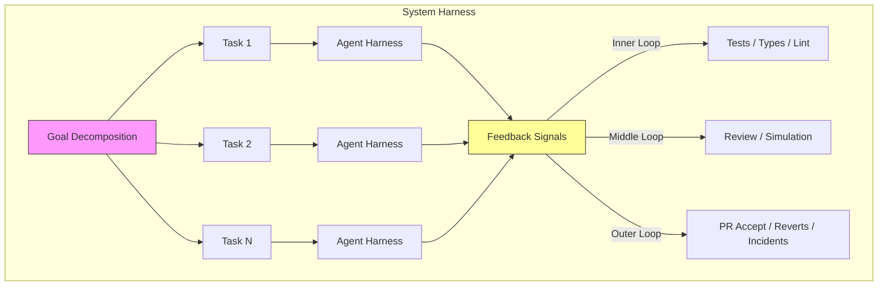
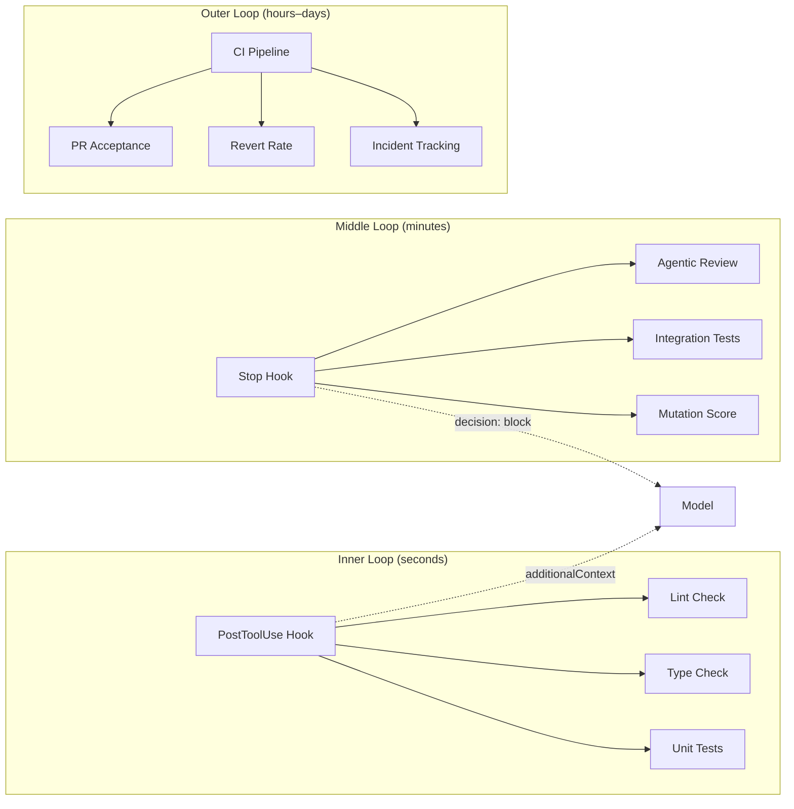

# Coding Benchmarks Are Misaligned: What the Gorinova Position Paper Means for Codex CLI Harness Engineering


---

A position paper published on 16 June 2026 by Gorinova, Baker, Heineike, Shaposhnikov, Willoughby, and Knox argues that the benchmarks the industry uses to rank coding agents were designed before agents existed [^1]. The paper identifies three symptoms of misalignment between what benchmarks measure and what agentic software engineering actually requires — and each symptom maps directly to a harness component that Codex CLI already exposes.

This article unpacks the paper's three claims, examines the evidence behind them, and shows how Codex CLI's hook lifecycle, AGENTS.md directives, and named profiles let you build the component-level feedback loops the paper calls for.

## The Core Claim: Your Agent Is Not Your Model

Gorinova et al. draw a sharp distinction between two levels of orchestration [^1]:

- **Agent harness** — a language model interacting with tools towards a single task, wrapped in a system prompt and context window.
- **System harness** — outer orchestration that decomposes goals into tasks, dispatches them to agent harnesses, manages the environment, and routes outputs through feedback signals.

Current benchmarks — SWE-bench Verified chief among them — evaluate at the agent level but collapse model, harness, and environment into one end-to-end score [^1]. In production, teams operate at the system level. The mismatch is not academic: Claude Opus 4.6 shows success rates varying by 20 percentage points across different harnesses on identical tasks [^1], and practitioners report 4–10 point swings between standardised and custom scaffolds on SWE-bench Verified [^1].



## Symptom 1: Conflated Components

SWE-bench scores conflate the model with the rest of the harness [^1]. When a leaderboard entry reads "72% on Verified," you cannot determine how much of that score comes from the model's reasoning and how much from the scaffold's retry logic, context retrieval, or environment configuration.

The real-world evidence is stark. Across 456,000 agent-authored pull requests in 61,000 repositories, acceptance rates run between 35% and 64% — well below the 70%+ headline benchmark figures [^2]. One study found agent solutions merged at roughly half the rate of human golden solutions [^3]. Even Cognition's Devin reports a 67% merge rate, up from 34% a year prior, but still far from its benchmark scores [^3].

### Codex CLI Mapping: Isolating Model from Harness

Codex CLI's hook lifecycle lets you isolate and measure each component independently. Every hook fires at a specific point in the agent loop and receives a structured JSON payload containing `session_id`, `turn_id`, `model`, and `cwd` [^4]:

```bash
#!/usr/bin/env bash
# PostToolUse hook: log tool outcome for component-level analysis
INPUT=$(cat)
TOOL=$(echo "$INPUT" | jq -r '.tool_name')
EXIT_CODE=$(echo "$INPUT" | jq -r '.exit_code // "n/a"')
SESSION=$(echo "$INPUT" | jq -r '.session_id')

echo "{\"ts\":\"$(date -u +%FT%TZ)\",\"session\":\"$SESSION\",\"tool\":\"$TOOL\",\"exit\":\"$EXIT_CODE\"}" \
  >> /tmp/codex-component-trace.jsonl

# Pass through without modification
echo '{"decision":"approve"}'
```

By logging at the `PostToolUse` level, you get component-level signal the paper demands — which tool calls succeed, which fail, and how the model responds to failure feedback — without waiting for the end-to-end result.

## Symptom 2: Single Reference Solution Bias

SWE-bench grades patches against `FAIL_TO_PASS` and `PASS_TO_PASS` test sets derived from the original pull request [^1]. This penalises equally valid alternative solutions. The paper cites validity research showing 32.67% solution leakage in issue text and 31.08% of instances passing under insufficient tests [^1]. OpenAI's own Frontier Evals team found that 59.4% of the hardest problems had fundamentally flawed or unsolvable test cases [^5].

The paper's remedy: replace single-reference grading with behavioural verifiers — property tests, reference oracles, and specification checks that admit multiple valid solution shapes [^1].

### Codex CLI Mapping: Behavioural Verification via Hooks

Codex CLI's `PostToolUse` hook can inject behavioural verification without coupling to a specific reference solution. The `additionalContext` field surfaces developer-visible context that steers the agent's next move [^4]:

```bash
#!/usr/bin/env bash
# PostToolUse hook: run property tests after any file write
INPUT=$(cat)
TOOL=$(echo "$INPUT" | jq -r '.tool_name')

if [[ "$TOOL" == "write" || "$TOOL" == "apply_diff" ]]; then
  # Run property-based tests instead of reference-patch comparison
  TEST_OUTPUT=$(cd "$(echo "$INPUT" | jq -r '.cwd')" && npm test -- --reporter=json 2>&1 | tail -c 2000)
  PASS_COUNT=$(echo "$TEST_OUTPUT" | jq -r '.numPassedTests // 0')
  FAIL_COUNT=$(echo "$TEST_OUTPUT" | jq -r '.numFailedTests // 0')

  if [[ "$FAIL_COUNT" -gt 0 ]]; then
    echo "{\"decision\":\"block\",\"reason\":\"$FAIL_COUNT tests failed. Fix before continuing.\",\"additionalContext\":\"Test output: $TEST_OUTPUT\"}"
    exit 0
  fi
fi

echo '{"decision":"approve"}'
```

This approach measures whether the agent's patch satisfies the behavioural contract, not whether it matches a golden diff. It is precisely the shift the paper advocates.

## Symptom 3: No Component-Level Signal

End-to-end scores provide no visibility into which system component failed [^1]. A modern system harness includes linters, dependency checks, mutation testing, and agentic reviewers — each affecting results. Without component-level diagnostics, you cannot iterate meaningfully.

The paper proposes evaluating four axes independently [^1]:

1. **Context effectiveness** — did the agent receive the right information?
2. **Policy adherence** — did it follow architectural and style constraints?
3. **Verifier quality** — do the tests actually catch regressions?
4. **Task decomposition** — were goals split into tractable units?

### Codex CLI Mapping: Feedback at Three Speeds

Codex CLI's hook system maps to the paper's three feedback loops:



| Feedback Layer | Codex CLI Mechanism | Latency | Paper Axis |
|---|---|---|---|
| Inner loop | `PostToolUse` hook | Milliseconds | Context effectiveness, Verifier quality |
| Inner loop | `PreToolUse` hook | Milliseconds | Policy adherence |
| Middle loop | `Stop` hook with `decision: block` | Seconds | Task decomposition |
| Outer loop | CI/CD pipeline + `codex exec` | Minutes–hours | All four axes |

The `Stop` hook is particularly relevant. When a turn completes, a Stop hook can run integration tests or mutation analysis before the agent declares the task done [^4]. Setting `decision: "block"` forces the agent to continue working rather than stopping prematurely — a middle-loop feedback signal that no current benchmark measures.

## AGENTS.md as a Policy Specification Layer

The paper's hardest unsolved problem is *operationalisation*: specifying what the system should do in measurable terms without encoding how it should attempt the task [^1]. Codex CLI's `AGENTS.md` file addresses this at the instruction layer [^6]:

```markdown
<!-- AGENTS.md -->
## Verification Policy

- Run `npm test` after every file change. Do not proceed if tests fail.
- Run `npm run lint` before committing. Fix all errors.
- Never modify files outside the `src/` directory without explicit approval.

## Architecture Constraints

- All new API endpoints must include OpenAPI schema annotations.
- Database queries must use parameterised statements — no string interpolation.
- New dependencies require justification in the commit message.
```

These directives encode policy adherence — the paper's second evaluation axis — as first-class instructions rather than prompt engineering. Combined with `PreToolUse` hooks that enforce the same constraints mechanically, you get defence in depth: the instruction layer guides the model, and the hook layer catches violations [^6].

## Named Profiles for Harness Ablation

The paper's first remedy requires ablations across non-model axes [^1]. Codex CLI's named profiles in `config.toml` make this operationally straightforward [^7]:

```toml
[profile.baseline]
model = "o3"
approval_mode = "suggest"

[profile.strict-harness]
model = "o3"
approval_mode = "auto-edit"

[profile.minimal-harness]
model = "o3"
approval_mode = "full-auto"
```

Run the same task across profiles with `codex exec`:

```bash
for profile in baseline strict-harness minimal-harness; do
  codex exec --profile "$profile" \
    "Fix the pagination bug in src/api/list.ts" \
    2>&1 | tee "/tmp/ablation-${profile}.log"
done
```

This isolates the model (constant `o3`) from the harness configuration (varying approval modes, hooks, and AGENTS.md constraints), producing the component-level signal the paper demands.

## Practical Takeaways

The Gorinova paper is not merely academic criticism. It provides a framework for thinking about your Codex CLI setup as a system harness with measurable components:

1. **Log at the component level.** Use `PostToolUse` hooks to capture tool-level success/failure rates. These are your inner-loop metrics.
2. **Verify behaviour, not patches.** Property tests and specification checks in hooks admit multiple valid solutions without anchoring on a single reference.
3. **Encode policy as AGENTS.md directives**, enforced by `PreToolUse` hooks. This separates *what* from *how*.
4. **Ablate across profiles.** Hold the model constant and vary the harness. If your pass rate changes by more than a few points, your harness is a significant variable — treat it as such.
5. **Measure the outer loop.** Track PR acceptance rates, revert frequency, and time-to-merge for agent-authored code. These are the metrics that actually correlate with production value.

The benchmark-to-production gap — 70%+ scores versus 35–64% real-world acceptance [^2] [^3] — is not a model problem. It is a harness problem. Codex CLI gives you the hooks, profiles, and instruction layers to close it.

## Citations

[^1]: Gorinova, M. I., Baker, M., Heineike, A., Shaposhnikov, M., Willoughby, R., & Knox, D. (2026). *Position: Coding Benchmarks Are Misaligned with Agentic Software Engineering*. arXiv:2606.17799. [https://arxiv.org/abs/2606.17799](https://arxiv.org/abs/2606.17799)

[^2]: "Agentic Coding in Production: What SWE-bench Scores Don't Tell You." TianPan.co, April 2026. [https://tianpan.co/blog/2026-04-09-agentic-coding-production-swebench-gap](https://tianpan.co/blog/2026-04-09-agentic-coding-production-swebench-gap)

[^3]: "SWE-Bench Score vs. Real Merge Rate: Why Your Agent's Benchmark Number Doesn't Match Production Reality." MindStudio, 2026. [https://www.mindstudio.ai/blog/swe-bench-score-vs-real-merge-rate-agent-benchmark-gap](https://www.mindstudio.ai/blog/swe-bench-score-vs-real-merge-rate-agent-benchmark-gap)

[^4]: "Hooks – Codex." OpenAI Developers. [https://developers.openai.com/codex/hooks](https://developers.openai.com/codex/hooks)

[^5]: "SWE-bench in 2026: Benchmarks vs Scaffolding Reality." Digital Applied, June 2026. [https://www.digitalapplied.com/blog/swe-bench-verified-june-2026-benchmark-vs-scaffolding-analysis](https://www.digitalapplied.com/blog/swe-bench-verified-june-2026-benchmark-vs-scaffolding-analysis)

[^6]: "Custom instructions with AGENTS.md – Codex." OpenAI Developers. [https://developers.openai.com/codex/guides/agents-md](https://developers.openai.com/codex/guides/agents-md)

[^7]: "Codex CLI Cheatsheet: config, commands, AGENTS.md, + best practices." Shipyard. [https://shipyard.build/blog/codex-cli-cheat-sheet/](https://shipyard.build/blog/codex-cli-cheat-sheet/)
