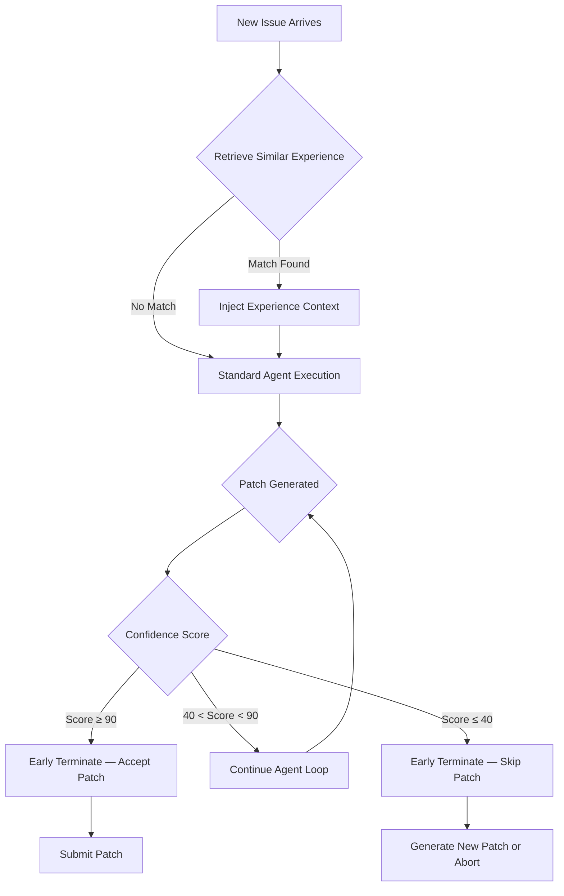

# Early Termination Strategies for Coding Agents: What EET and AgentStop Mean for Codex CLI Cost Efficiency


---

Coding agents waste money. A developer tracking 42 agent runs on a real codebase found that 70 per cent of tokens consumed were waste — the agent reading irrelevant files, exploring dead-end code paths, and repeating completed searches [^1]. An 80-turn session thrashing through test failures typically means the task was scoped too broadly, with the agent re-reading context and retrying until it hits the context window [^1]. Two recent research papers — EET (Experience-Driven Early Termination) and AgentStop — offer principled frameworks for knowing when to pull the plug. Both map directly to Codex CLI's hook system, token budgets, and session configuration.

## The Problem: Sunk-Cost Spirals

Every additional turn in a coding agent session costs tokens. Input tokens compound across turns because the model re-reads the entire conversation history each time. Context compaction — the mechanism Codex CLI uses when history exceeds `model_auto_compact_token_limit` — creates its own hidden waste: when something important gets lost during summarisation, the agent re-reads files or redoes work, paying for the same tokens twice [^1].

The worst sessions are not the ones that fail immediately. They are the ones that almost work — the agent generates plausible but incorrect patches, runs tests, sees failures, adjusts, and loops. Three focused 20-turn sessions on the same work produce better results for less money than one spiralling 80-turn session [^1].

## EET: Learning When to Stop from Experience

Guo et al. introduced EET in January 2026, with a revised version in April [^2]. The core insight is deceptively simple: if an agent has successfully resolved a similar issue before, it can terminate early with higher confidence on the current one.

### How EET Works

EET operates in two phases:

**Experience generation** captures structured records from successful issue resolutions. Each record contains a concise task description, an execution summary filtered to essential steps, the evaluation result, a confidence score (0–100), and a structured rationale [^2]. Only successful resolutions are stored — failures teach the system nothing about when to stop confidently.

**Early termination** applies at two decision points:

1. **During patch generation** — after code modifications or test execution, a confidence score exceeding τ<sup>gen</sup> = 90 triggers early stopping [^2].
2. **During patch selection** — patches are evaluated against retrieved experience; termination occurs if confidence exceeds τ<sup>upper</sup><sub>sel</sub> = 90 or falls below τ<sup>lower</sup><sub>sel</sub> = 40 [^2].

Experience retrieval uses TF-IDF similarity matching against task descriptions with a threshold of 0.15, retrieving only the top-1 match to minimise overhead and avoid context pollution [^2].



### The Numbers

EET was evaluated across three agents on SWE-bench Verified [^2]:

| Agent | Model | Cost Reduction | Resolution Rate Change | API Call Reduction |
|-------|-------|----------------|------------------------|--------------------|
| Agentless | GPT-5-mini | 55.1% | +7.8% | 26.4% |
| Mini-SWE-Agent | GPT-5-mini | 19.4% | +1.0% | 7.9% |
| Trae Agent | GPT-5-mini | 28.2% | 0.0% | 29.9% |
| Agentless | DeepSeek-V3.2 | 31.8% | +7.2% | 25.5% |
| Mini-SWE-Agent | DeepSeek-V3.2 | 19.3% | +0.6% | 8.4% |
| Trae Agent | DeepSeek-V3.2 | 36.7% | −0.2% | 26.5% |

The average across all configurations: **31.8% cost reduction with +2.7% resolution improvement** [^2]. Early termination fires on 8.6–14.0% of issues — selective, not aggressive [^2]. Input tokens drop by an average of 29.9%, output tokens by 25.1% [^2].

The ablation study reveals a critical finding: removing experience injection but keeping early termination saves 58.9% of cost but sacrifices 10.4% of resolution rate [^2]. Experience is not optional decoration — it is the signal that makes termination safe rather than reckless.

Cross-repository transferability holds: on 50 issues from entirely new repositories, EET maintained 24.4% cost reduction with unchanged resolution [^2].

## AgentStop: Energy-Aware Termination for Local Agents

Pham et al. approached the problem from an energy perspective in May 2026 [^3]. AgentStop targets locally deployed agents — a growing category as open-weight models like MiniMax M3 and DeepSeek-V3.2 make local inference practical.

AgentStop uses token-level log probabilities as a low-cost signal to predict whether a trajectory will succeed [^3]. When the predictor determines that continuation is unlikely to yield a correct result, it terminates the session preemptively.

The results: **15–20% energy reduction with less than 5% performance loss** [^3]. The mechanism is complementary to EET — AgentStop works without historical experience, relying instead on runtime confidence signals from the model itself.

## Mapping to Codex CLI Configuration

Codex CLI already ships the primitives needed to implement both approaches. The gap is not tooling — it is configuration discipline.

### Stop Hooks as Early Termination Gates

The `Stop` hook fires when a turn ends [^4]. It receives `last_assistant_message` and `stop_hook_active` status. When the hook returns `continue: false` with a reason, that reason becomes a new continuation prompt [^4]. This is precisely the injection point for EET-style confidence checks:

```toml
[[hooks.Stop]]
[[hooks.Stop.hooks]]
type = "command"
command = "/usr/bin/python3 .codex/hooks/early_termination_gate.py"
timeout = 30
statusMessage = "Evaluating termination confidence"
```

The Python script can implement confidence scoring by comparing the current task against a local experience store, returning `continue: false` when confidence exceeds the threshold:

```python
#!/usr/bin/env python3
"""EET-inspired Stop hook for Codex CLI."""
import json
import sys

def evaluate_confidence(message: str) -> tuple[bool, str]:
    """Score confidence against experience store."""
    # Load experience from .codex/experience.jsonl
    # TF-IDF similarity against task description
    # Return (should_stop, reason)
    ...

data = json.loads(sys.stdin.read())
msg = data.get("last_assistant_message", "")
should_stop, reason = evaluate_confidence(msg)

result = {"continue": not should_stop}
if should_stop:
    result["reason"] = reason

print(json.dumps(result))
```

### PostToolUse Hooks as Patch Quality Gates

The `PostToolUse` hook fires after tool output is generated [^4]. For EET's patch-selection phase, a PostToolUse hook on `apply_patch` can evaluate whether the generated patch matches patterns from successful experience:

```toml
[[hooks.PostToolUse]]
matcher = "^apply_patch$"

[[hooks.PostToolUse.hooks]]
type = "command"
command = "/usr/bin/python3 .codex/hooks/patch_confidence_gate.py"
timeout = 30
statusMessage = "Scoring patch against experience"
```

When the hook returns `decision: "block"` with feedback, Codex replaces the tool result with that feedback [^4] — effectively redirecting the agent away from low-confidence patches without wasting further turns exploring them.

### Token Budgets as Hard Ceilings

EET's turn-control baseline showed that aggressive turn limits achieve 41.4% cost reduction but sacrifice 10.7% of resolution rate [^2]. Codex CLI's `rollout_budget` provides a more nuanced approach:

```toml
[features.rollout_budget]
enabled = true
limit_tokens = 100000
reminder_interval_tokens = 10000
```

This configuration caps total token spend at 100,000 tokens and reminds the agent of its budget every 10,000 tokens [^5]. Unlike a hard turn limit, the budget lets the agent allocate tokens flexibly — spending more on complex patches and less on simple ones, mirroring EET's finding that simple issues benefit most from early termination [^2].

### Context Compaction Thresholds

The `model_auto_compact_token_limit` setting controls when Codex CLI compacts conversation history [^5]. Setting it too low triggers frequent compaction, risking information loss. Setting it too high lets context accumulate, increasing per-turn cost:

```toml
model_auto_compact_token_limit = 16000
tool_output_token_limit = 4096
```

EET's data shows that input tokens are the primary cost driver, reduced by 29.9% on average through early termination [^2]. Combining aggressive `tool_output_token_limit` capping with experience-informed Stop hooks addresses both the per-turn and total-session dimensions of cost.

### Named Profiles for Cost Strategy Routing

Different tasks warrant different termination thresholds. A maintenance profile with tight budgets and aggressive early termination suits routine bug fixes. A feature profile with generous budgets and conservative termination suits complex new work:

```toml
# ~/.codex/maintenance.config.toml
[features.rollout_budget]
enabled = true
limit_tokens = 50000
reminder_interval_tokens = 5000

model_auto_compact_token_limit = 8000
```

```toml
# ~/.codex/feature.config.toml
[features.rollout_budget]
enabled = true
limit_tokens = 200000
reminder_interval_tokens = 20000

model_auto_compact_token_limit = 24000
```

Switch between them with `codex --profile maintenance` or `codex --profile feature` [^5].

### AGENTS.md as Termination Discipline

EET's experience injection works because it gives the agent context about what success looks like. The same principle applies to `AGENTS.md`:

```markdown
## Termination Discipline

- If tests pass on first run after a patch, stop immediately. Do not refactor.
- If the same test fails three consecutive times with identical output, stop and report.
- If the task is a typo fix, formatting change, or documentation update, do not explore
  the broader codebase. Apply the change, verify, and terminate.
- Never exceed 15 turns on a single-file change.
```

This encodes EET's finding that simple issues (≤15 minutes) benefit most from early termination — resolution rates of 61–89% with cost savings of 17–66% [^2].

## The Confidence Calibration Insight

EET validates that raw LLM confidence scores are reliable termination signals. Patches scoring above 90 have a 63.6–92.6% pass rate; those scoring below 40 have an 8.7–13.8% pass rate [^2]. The monotonic relationship means confidence thresholds can be set without sophisticated calibration — a property that makes hook-based implementation practical.

AgentStop's use of token-level log probabilities provides a complementary signal [^3]. Where EET requires accumulated experience, log probabilities are available from turn one. A production system might combine both: log-probability monitoring from the start, switching to experience-informed confidence once sufficient history accumulates.

## What This Means in Practice

The combined message from EET and AgentStop is clear: **not all agent computation is useful computation, and knowing when to stop is as important as knowing what to do**. Codex CLI's hook system, token budgets, and named profiles provide the mechanical layer. What practitioners need to supply is the judgement layer — experience stores, confidence thresholds, and task-appropriate termination policies encoded in Stop hooks and AGENTS.md directives.

The 31.8% average cost reduction from EET [^2] translates directly to budget headroom. At current GPT-5.5 pricing, a team running 100 agent sessions per day at an average of \$2.50 per session would save approximately \$2,385 per month — enough to fund an additional 950 sessions at the same quality level.

---

## Citations

[^1]: Vantage, "The Hidden Cost Driver in Agentic Coding Sessions in 2026," June 2026. [https://www.vantage.sh/blog/agentic-coding-costs](https://www.vantage.sh/blog/agentic-coding-costs)

[^2]: Y. Guo, Y. Xiao, J. M. Zhang, M. Harman, Y. Lou et al., "EET: Experience-Driven Early Termination for Cost-Efficient Software Engineering Agents," arXiv:2601.05777v2, April 2026. [https://arxiv.org/abs/2601.05777](https://arxiv.org/abs/2601.05777)

[^3]: D. Pham, K. Katevas, A. S. Shamsabadi, H. Haddadi, "AgentStop: Terminating Local AI Agents Early to Save Energy in Consumer Devices," arXiv:2605.15206, May 2026. [https://arxiv.org/abs/2605.15206](https://arxiv.org/abs/2605.15206)

[^4]: OpenAI, "Hooks — Codex CLI," OpenAI Developers, June 2026. [https://developers.openai.com/codex/hooks](https://developers.openai.com/codex/hooks)

[^5]: OpenAI, "Configuration Reference — Codex CLI," OpenAI Developers, June 2026. [https://developers.openai.com/codex/config-reference](https://developers.openai.com/codex/config-reference)
