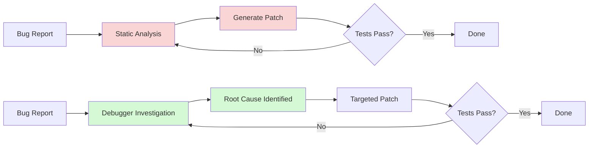
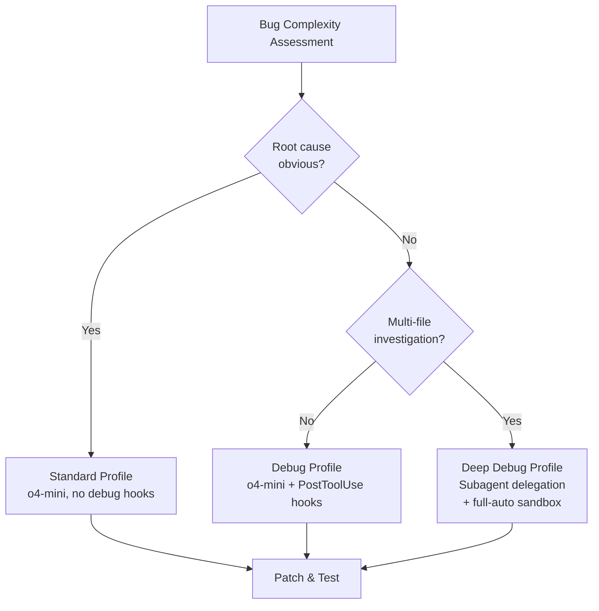

# Interactive Debugging for Coding Agents: What Debug2Fix and ADI Mean for Codex CLI Runtime Investigation


---

Coding agents have a debugging problem. They generate patches from static analysis and stack traces, retry when tests fail, and hope the next iteration lands closer to correct. Human developers do something fundamentally different: they attach a debugger, set a breakpoint, inspect variable state at the failure point, and reason about what the programme actually did rather than what they expected it to do. Two recent papers — Debug2Fix[^1] and ADI[^2] — demonstrate that giving agents access to interactive debugging capabilities produces substantial improvements in bug resolution rates and, critically, allows weaker models to match or exceed stronger ones running without debugger access.

This article examines what these findings mean for Codex CLI workflows, where PostToolUse hooks, subagent delegation, and sandbox configuration create a natural surface for integrating runtime investigation into agent-assisted development.

## The Investigation Gap

Current coding agents operate in a read-analyse-patch loop. They read the failing test output, analyse the error message and surrounding code, generate a patch, and run the tests again. This loop is effective for straightforward bugs where the error message directly indicates the fix, but it degrades rapidly when the root cause is non-obvious — off-by-one errors in loop bounds, incorrect state transitions, race conditions masked by test ordering, or exceptions thrown from deep call stacks where the surface error message bears little resemblance to the underlying defect.

The Debug2Fix authors found that when debugging tools were exposed directly to the main coding agent, **agents used them in only 9% of instances**[^1]. Worse, Claude Sonnet 4.5 showed a **14.8% degradation** when given raw debugger tools[^1]. The tools were available; the agents simply did not reach for them — or reached for them counterproductively.



The left loop — static retry — is what agents do by default. The right loop — investigate first, then patch — is what expert human developers do. The research question is how to get agents to adopt the right-side workflow reliably.

## Debug2Fix: Subagent Architecture for Debugging

Garg and Huang's Debug2Fix framework[^1] solves the tool-underutilisation problem through two architectural decisions.

### The Debug Subagent

Rather than exposing raw debugger primitives (set breakpoint, step over, inspect variable) to the main coding agent, Debug2Fix encapsulates all debugger interaction behind a **dedicated debug subagent**. The main agent sends a natural-language question — "Why does `calculateTax()` return 0.0 when the input rate is 0.15?" — along with the failing test. The subagent orchestrates the debugger session, sets breakpoints, steps through execution, inspects variables, and returns a structured answer with observed values, stack traces, and source locations[^1].

The subagent interface accepts four tools internally:

1. **Debug Start Session** — detects the build system (Maven/Gradle for Java, pytest for Python), compiles the code, launches tests under the debugger (JDB or PDB), and sets initial breakpoints[^1]
2. **Debug Control** — stepping actions: continue, step over, step into, step out[^1]
3. **Debug Inspect** — queries programme state: local variables, expression evaluation, call stacks, object fields[^1]
4. **Debug Breakpoint** — sets and removes line and method breakpoints[^1]

A typical debugging workflow averaged **10–15 steps**: start session, alternating inspect and control calls, with occasional file reads and breakpoint adjustments[^1].

### Enforced Investigation-Before-Patch

The second architectural decision is more radical: **disable file-editing tools until the debug subagent has been called at least once**[^1]. This enforces the investigate-first workflow that expert developers follow naturally but that agents skip when given the choice.

The results are striking:

| Model | Baseline (GitBug-Java) | Debug2Fix | Improvement |
|-------|----------------------|-----------|-------------|
| GPT-5 | 60.2% | 73.1% | +21.8% |
| Claude Haiku 4.5 | 71.0% | 82.3% | +15.9% |
| Claude Sonnet 4.5 | 75.7% | 85.5% | +12.9% |

The most notable finding: **GPT-5 with Debug2Fix (73.1%) nearly matched baseline Claude Sonnet 4.5 (75.7%)** despite a 15-percentage-point baseline gap[^1]. Better tooling closed the model capability gap almost entirely.

On SWE-bench Live (Python), improvements were more modest — GPT-5 improved from 31.2% to 36.2%, Claude Haiku 4.5 from 34.3% to 38.5%[^1] — but the pattern held: weaker models gained proportionally more.

## ADI: Function-Level Debugging at Scale

Xiang et al.'s Agent-centric Debugging Interface (ADI)[^2], presented at FSE 2026, takes a complementary approach. Where Debug2Fix wraps line-level debuggers behind a subagent, ADI redesigns the debugging interface itself around **function-level interaction**.

### Frame Lifetime Traces

Traditional debuggers force agents into expensive line-by-line stepping. Each `step` or `next` command consumes an LLM inference call, yields minimal state information, and creates long sequences of unproductive navigation[^2]. ADI replaces this with **Frame Lifetime Traces (FLTs)** — complete function invocation records capturing:

- Function identifier and invocation index
- Caller frame identifier for stack navigation
- Arguments at entry (parameter name–value mappings)
- Return value or exception information
- Statement execution trace with state modifications per line[^2]

The agent requests an FLT for a function of interest and receives the entire execution history in one response, enabling holistic reasoning about function behaviour rather than incremental stepping.

### Results

ADI's standalone agent (FramePilot) resolved **63.8% of SWE-bench Verified** tasks at an average cost of **\$1.28 per task**[^2]. When integrated as a plug-and-play component into existing agents:

| Agent | Base Model | Improvement |
|-------|-----------|-------------|
| Mini-SWE-agent | Claude Sonnet 3.7 | +10.6% |
| Mini-SWE-agent | GPT-4o | +18.5% |
| AutoCodeRover | Claude Sonnet 3.5 | +7.3% |
| AutoCodeRover | GPT-4o | +6.2% |

Again, the inverse-scaling pattern: **weaker models gained disproportionately** from structured debugging access[^2].

## Mapping to Codex CLI

Codex CLI does not ship with a built-in Debug2Fix-style subagent, but its architecture — hooks, subagent delegation, sandbox access, and AGENTS.md directives — provides every building block needed to implement the patterns these papers validate.

### PostToolUse Hooks as Debug Triggers

The most direct integration point is the PostToolUse hook[^3]. When a test run fails, a PostToolUse hook can detect the failure pattern and inject debugging context before the agent's next reasoning step:

```json
{
  "hooks": [{
    "event": "PostToolUse",
    "match": { "tool_name": "bash" },
    "command": "scripts/debug-trigger.sh",
    "timeout": 30
  }]
}
```

The hook script examines the test output. If it detects a test failure with a stack trace, it can:

1. Launch the failing test under a debugger (PDB for Python, JDB for Java)
2. Set breakpoints at the failure location
3. Capture variable state at the crash point
4. Return the debugging context as `additionalContext` in the hook response

```json
{
  "hookSpecificOutput": {
    "hookEventName": "PostToolUse",
    "additionalContext": "DEBUG INVESTIGATION: Variable 'tax_rate' was 0 at line 47. Expected 0.15 from parameter 'rate'. The parameter was shadowed by local assignment on line 32."
  }
}
```

This injects runtime investigation results directly into the agent's context without requiring the agent to orchestrate the debugger itself[^3].

### Subagent Delegation for Deep Investigation

For complex bugs requiring multi-step debugging sessions, Codex CLI's subagent architecture[^4] maps directly to Debug2Fix's subagent pattern. A main Codex session can delegate debugging investigation to a specialised subagent:

```bash
codex exec -m o4-mini \
  --prompt "Investigate why test_calculate_tax fails. Use PDB to inspect variable state at the assertion failure. Report the root cause with observed vs expected values." \
  --sandbox full-auto
```

The `--sandbox full-auto` approval policy allows the debugging subagent to run debugger commands without human intervention[^4]. The subagent's output feeds back into the main session's context, providing the investigate-first workflow Debug2Fix validates.

### AGENTS.md Investigation Directives

Debug2Fix's enforced investigation-before-patch pattern maps to AGENTS.md policy specification[^5]. Rather than relying on hook-based tool limiting, teams can encode investigation discipline as project-level directives:

```markdown
## Debugging Policy

When a test fails:
1. ALWAYS investigate the failure before modifying source code
2. Run the failing test with verbose output and capture the stack trace
3. If the root cause is not obvious from the error message, use PDB/JDB to inspect variable state at the failure point
4. Document the root cause in your reasoning before generating a patch
5. After patching, verify the fix addresses the specific root cause you identified
```

This leverages the finding from Hilla et al. that AGENTS.md instructions measurably improve agent task completion[^6], applying it specifically to debugging discipline.

### Named Profiles for Debug-Intensive Tasks

Codex CLI's named profiles[^7] enable routing debug-intensive tasks to configurations optimised for investigation:

```toml
[profile.debug]
model = "o4-mini"
approval_policy = "on-failure"
sandbox = "full-auto"

[profile.debug.hooks.post_tool_use]
command = "scripts/debug-trigger.sh"
timeout = 60
```

The `debug` profile activates the PostToolUse debugging hook, uses a cost-effective model (justified by Debug2Fix's finding that weaker models with debugging tools match stronger ones without), and sets an extended hook timeout to accommodate debugger session latency.

```bash
codex --profile debug "Fix the failing test in src/tax/calculator.py"
```

## The Inverse-Scaling Lesson

Both papers converge on a finding that should reshape how teams configure their Codex CLI model selection: **debugging tools compress the capability gap between models**. GPT-5 with Debug2Fix nearly matched Claude Sonnet 4.5 without it[^1]. GPT-4o with ADI gained 18.5% while Claude Sonnet 3.7 gained 10.6%[^2].



This means teams can use **cheaper models for debugging-heavy workloads** when they invest in debugging infrastructure. The cost equation shifts: rather than paying for a more capable model to reason through bugs from static context alone, invest in tooling that gives a cheaper model the runtime information it needs.

## Failure Modes and Limitations

Debug2Fix's failure analysis of 50 failed instances reveals important caveats for Codex CLI integration[^1]:

- **Debugger session failures** (36%): Build system detection, debugger attachment, and breakpoint setting can fail. PostToolUse hooks must handle debugger launch failures gracefully and fall back to static analysis rather than injecting empty debugging context.
- **Correct debugging, wrong fix** (34%): The agent correctly identifies the root cause but generates an incorrect patch. This is a model reasoning limitation that debugging tools cannot address.
- **Bugs requiring extended sessions** (16%): Some bugs need more than three debugging sessions. Codex CLI's context compaction (`model_auto_compact_token_limit`) may discard early debugging findings before the agent reaches the root cause.
- **API and static analysis errors** (14%): Integration failures between the debugging system and the agent framework.

⚠️ Neither paper evaluates debugging integration with Codex CLI specifically. The performance numbers are from custom agent harnesses, and results may differ when implemented through Codex CLI's hook and subagent architecture.

## Practical Implementation Checklist

For teams wanting to add runtime investigation to their Codex CLI workflows:

1. **Start with PostToolUse hooks** — detect test failures and inject stack trace analysis before the agent retries
2. **Add PDB/JDB wrapper scripts** — capture variable state at failure points and return as hook context
3. **Encode investigation-first policy in AGENTS.md** — the cheapest intervention with measurable impact[^6]
4. **Create a `debug` named profile** — route complex bugs to a debug-optimised configuration
5. **Consider subagent delegation** for multi-step investigations that exceed single-hook context budgets
6. **Monitor token costs** — Debug2Fix's subagent added ~400k tokens per session[^1]; verify the cost is justified by resolution rate improvement

## Citations

[^1]: Garg, S. and Huang, Y. (2026) 'Debug2Fix: Supercharging Coding Agents with Interactive Debugging Capabilities', arXiv:2602.18571v2. Available at: [https://arxiv.org/abs/2602.18571](https://arxiv.org/abs/2602.18571)

[^2]: Xiang, J., Xu, X., Chu, X., Tian, H. and Zhang, Y. (2026) 'Empowering Autonomous Debugging Agents with Efficient Dynamic Analysis', Proceedings of the ACM International Conference on the Foundations of Software Engineering (FSE 2026). arXiv:2604.24212. Available at: [https://arxiv.org/abs/2604.24212](https://arxiv.org/abs/2604.24212)

[^3]: OpenAI (2026) 'Hooks — Codex CLI'. Available at: [https://developers.openai.com/codex/hooks](https://developers.openai.com/codex/hooks)

[^4]: OpenAI (2026) 'Subagents — Codex CLI'. Available at: [https://developers.openai.com/codex/subagents](https://developers.openai.com/codex/subagents)

[^5]: OpenAI (2026) 'CLI — Codex'. Available at: [https://developers.openai.com/codex/cli](https://developers.openai.com/codex/cli)

[^6]: Hilla, R. et al. (2026) 'On the Impact of AGENTS.md Files on the Efficiency of AI Coding Agents', arXiv:2601.20404v2. Available at: [https://arxiv.org/abs/2601.20404](https://arxiv.org/abs/2601.20404)

[^7]: OpenAI (2026) 'Command line options — Codex CLI'. Available at: [https://developers.openai.com/codex/cli/reference](https://developers.openai.com/codex/cli/reference)
