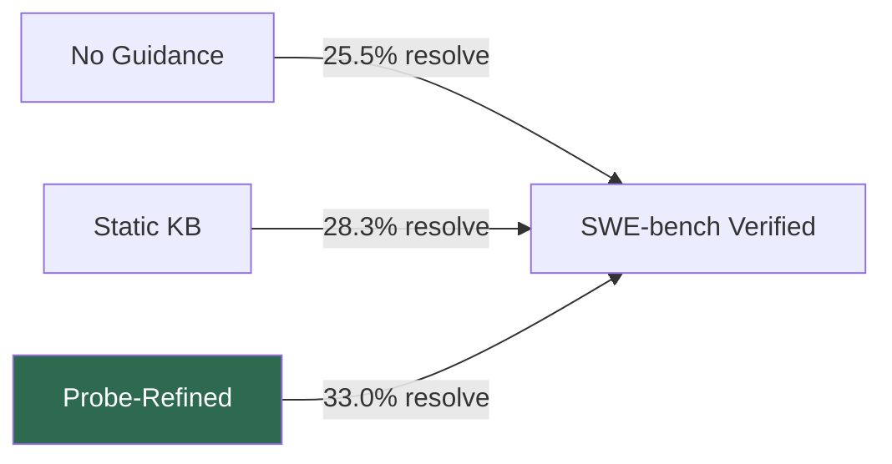
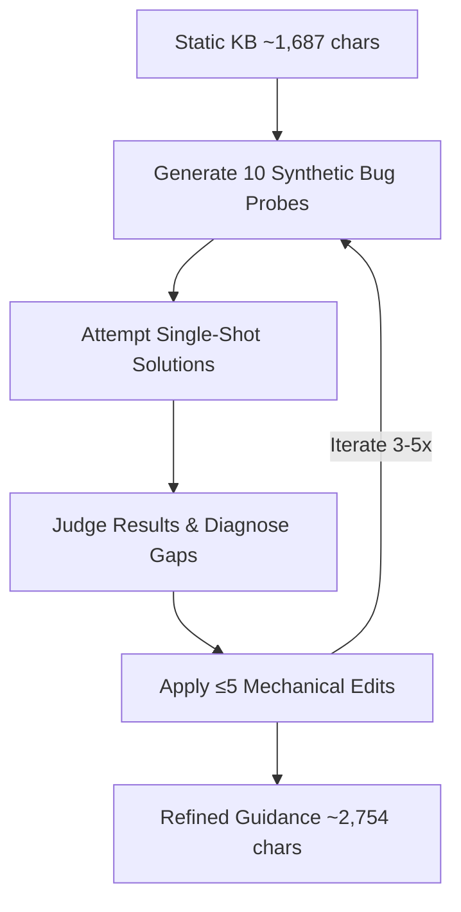

# Probe-and-Refine Tuning: What Iterative AGENTS.md Optimisation Research Means for Codex CLI


---

Most teams treat their AGENTS.md file as a write-once artefact: drop in some build commands, add a few style rules, commit, and move on. New research suggests this approach leaves significant performance on the table. Shepard and Albrecht's *Probe-and-Refine Tuning of Repository Guidance for Coding Agents* (arXiv:2606.20512, 18 June 2026) introduces an iterative procedure that automatically improves repository guidance through synthetic bug-fix experiments — no agent loop, no reinforcement learning, just targeted single-shot LLM calls[^1]. On SWE-bench Verified, probe-refined guidance achieved a 33.0% resolve rate versus 25.5% for the unguided baseline, a statistically significant improvement (p<0.001)[^1].

This article examines what probe-and-refine means for Codex CLI practitioners who rely on AGENTS.md to steer agent behaviour.

## The Guidance Quality Problem

The premise is straightforward: **how** guidance is produced matters more than **whether** it exists. Earlier work from Gloaguen et al. at ETH Zurich found that LLM-generated context files actually *reduced* task success rates by approximately 3% whilst increasing inference costs by over 20%[^2]. Meanwhile, Lulla et al. showed that well-crafted AGENTS.md files decreased agent runtime by 28.64% and cut output token consumption by 16.58%[^3]. The gap between "auto-generated boilerplate" and "carefully tuned guidance" is where probe-and-refine sits.



## How Probe-and-Refine Works

The procedure runs entirely offline — outside the agent loop — and requires no human curation after initialisation[^1].

### Step 1: Build a Static Knowledge Base

Tree-sitter parsing extracts repository structure: major hubs, entry points, and import relationships. An LLM compresses this into a natural-language summary averaging 1,687 characters[^1].

### Step 2: Iterative Probe Cycles (3–5 Iterations)

Each iteration follows four phases:

1. **Generate probes** — 10 synthetic bug-fix tasks at temperature 0.9, targeting different repository areas
2. **Attempt solutions** — single-shot LLM calls (no multi-step agent loop, no tool use)
3. **Judge and diagnose** — evaluate each attempt and propose targeted guidance edits
4. **Apply edits** — mechanical insertions and modifications (maximum 5 per iteration)

After 3–5 iterations, the refined guidance averages 2,754 characters — a 63% expansion over the static baseline[^1].



### Step 3: Deploy

The refined artefact is generated once per repository and reused across all future issues in that codebase[^1].

## Key Findings for Practitioners

### Coverage, Not Precision, Drives the Improvement

The resolve rate gains come entirely from **evaluation coverage** — the agent produces well-formed, evaluable patches for 14.5 percentage points more instances[^1]. Per-patch precision remains statistically constant at approximately 59% (p=0.119)[^1]. In practical terms: refined guidance helps the agent *find the right files*, not write better code once it gets there.

### Idiosyncratic Repositories Benefit Most

Probe-refined guidance clusters its unique solves in repositories with non-obvious internal structure[^1]:

| Repository | Unique Solve Ratio |
|---|---|
| Django (predictable layout) | 0.63× expected |
| scikit-learn (idiosyncratic) | 2.02× expected |
| xarray (idiosyncratic) | 2.20× expected |

If your codebase follows standard conventions, the agent probably navigates it well without guidance. If your project has custom module layouts, unusual test hierarchies, or non-standard build paths, probe-and-refine delivers the largest gains.

### Step Budget Must Match Guidance Complexity

At 25 agent steps, all conditions perform equally (~24%)[^1]. At 50 steps, probe-refined guidance actually *underperforms* the static baseline (23.4% vs 29.8%) because the prescribed workflows cannot complete within the budget[^1]. Only at 100+ steps does probe-refined guidance pull ahead decisively[^1].

This has direct implications for Codex CLI configuration. If you set aggressive token budgets via `rollout_budget` or constrained step counts, elaborate guidance may actively harm performance.

### Guidance Is Model-Specific — Do Not Transfer

The most striking finding: guidance tuned for Qwen3.5-35B collapsed to a 13.2% resolve rate when applied to Nemotron, versus 27.0% for Nemotron's self-tuned guidance[^1]. The mechanism is "compliance by analysis" — the receiving model reads the guidance, analyses it, and produces fewer action-oriented patches. Agent-loop completions dropped from 351 to 174[^1].

The practical rule: **tune guidance with the model that will consume it**. In Codex CLI terms, guidance optimised for `o3` should not be assumed to work with `o4-mini` or a third-party model via custom provider configuration.

## Mapping to Codex CLI

### Content Categories for AGENTS.md

The probe-and-refine procedure generates three categories of guidance additions[^1]:

| Category | Share | Codex CLI Example |
|---|---|---|
| **Procedural** | 47% | "Always run `pytest -x` before proposing a fix" |
| **Structural** | 30% | "Payment logic lives in `services/billing/`, not `models/`" |
| **Quality gates** | 23% | "Every migration must include a rollback script" |

Codex CLI's AGENTS.md supports all three. The file discovery mechanism walks from the repository root to the current working directory, concatenating guidance with later files taking precedence[^4]. Structure your guidance to front-load procedural and structural hints — the categories that drive file localisation improvements.

### Named Profiles for Model-Specific Guidance

Given the cross-model transfer collapse, consider maintaining separate AGENTS.md content per model. Codex CLI's `AGENTS.override.md` mechanism provides a clean path: keep shared guidance in `AGENTS.md` and model-specific instructions in override files activated by named profiles in `config.toml`[^4].

```toml
# config.toml — named profile for o3 with specific guidance path
[profiles.o3-tuned]
model = "o3"
# Use AGENTS.override.md with o3-specific procedural guidance

[profiles.o4-mini-tuned]
model = "o4-mini"
# Separate override with o4-mini-specific structural hints
```

### Step Budget Alignment

The step-budget interaction finding maps directly to Codex CLI's token and budget controls. If your AGENTS.md prescribes multi-step verification workflows (reproduce → fix → test → lint), ensure the session has sufficient budget. Codex CLI's `model_auto_compact_token_limit` and `rollout_budget` settings in `config.toml` should be calibrated against guidance complexity[^5].

### Implementing a Manual Probe-and-Refine Loop

You can approximate the probe-and-refine procedure using Codex CLI today:

```bash
# 1. Generate synthetic probes against your repo
codex exec --model o3 \
  "List 10 plausible single-file bug-fix tasks in this repository, \
   covering different modules. Output as JSON."

# 2. Attempt each probe with current AGENTS.md
for probe in $(cat probes.json | jq -r '.[]'); do
  codex exec --model o3 "$probe" 2>&1 | tee "attempt_$(echo $probe | md5sum | cut -c1-8).log"
done

# 3. Diagnose failures and refine AGENTS.md
codex exec --model o3 \
  "Review these attempt logs. Identify where the agent failed to \
   locate the correct files or follow the right procedure. Suggest \
   specific additions to AGENTS.md that would prevent these failures."
```

Each iteration costs approximately 22 single-shot calls at ~8k input and ~2k output tokens per call[^1] — a modest investment for guidance that persists across all future sessions.

### PostToolUse Hooks as Guidance Validators

Codex CLI's PostToolUse hooks can enforce the quality gates that probe-and-refine adds to guidance. If the refined guidance specifies "always run tests after modifying a migration", a PostToolUse hook can verify compliance:

```bash
# .codex/hooks/post-tool-use-migration-check.sh
if echo "$CODEX_TOOL_OUTPUT" | grep -q "migrations/"; then
  echo "Migration modified — running test suite..."
  pytest tests/migrations/ -x
fi
```

This makes the procedural guidance (47% of probe-refined additions) mechanically enforced rather than merely suggested[^1].

## Practical Recommendations

1. **Audit your AGENTS.md for non-inferable content.** Remove anything the agent can discover from the codebase itself. Focus on procedural workflows, structural hints for non-obvious layouts, and quality gates[^2].

2. **Run synthetic probes.** Use `codex exec` to generate and attempt bug-fix tasks against your repository. Diagnose where the agent fails to localise and refine your guidance accordingly.

3. **Match guidance to model.** If you switch models between profiles, test that your AGENTS.md still improves performance. Cross-model transfer is unreliable[^1].

4. **Ensure budget headroom.** Elaborate guidance needs sufficient step budget to execute the prescribed workflows. A 25-step session cannot benefit from guidance that prescribes a five-step verification sequence[^1].

5. **Measure before and after.** Use `codex exec` in batch mode with a consistent set of tasks to compare resolve rates with different guidance versions. The probe-and-refine improvement (25.5% → 33.0%) is statistically significant only across hundreds of instances[^1].

## Citations

[^1]: Shepard, A. and Albrecht, J. (2026) 'Probe-and-Refine Tuning of Repository Guidance for Coding Agents', *arXiv:2606.20512*. Available at: [https://arxiv.org/abs/2606.20512](https://arxiv.org/abs/2606.20512)

[^2]: Gloaguen, T., Mündler, N., Müller, M., Raychev, V. and Vechev, M. (2026) 'Evaluating AGENTS.md: Are Repository-Level Context Files Helpful for Coding Agents?', *arXiv:2602.11988*. Available at: [https://arxiv.org/abs/2602.11988](https://arxiv.org/abs/2602.11988)

[^3]: Lulla, J.L., Mohsenimofidi, S., Galster, M., Zhang, J.M., Baltes, S. and Treude, C. (2026) 'On the Impact of AGENTS.md Files on the Efficiency of AI Coding Agents', *arXiv:2601.20404*. Available at: [https://arxiv.org/abs/2601.20404](https://arxiv.org/abs/2601.20404)

[^4]: OpenAI (2026) 'Custom instructions with AGENTS.md', *Codex Developer Documentation*. Available at: [https://developers.openai.com/codex/guides/agents-md](https://developers.openai.com/codex/guides/agents-md)

[^5]: OpenAI (2026) 'Codex CLI Reference', *Codex Developer Documentation*. Available at: [https://developers.openai.com/codex/cli/reference](https://developers.openai.com/codex/cli/reference)
