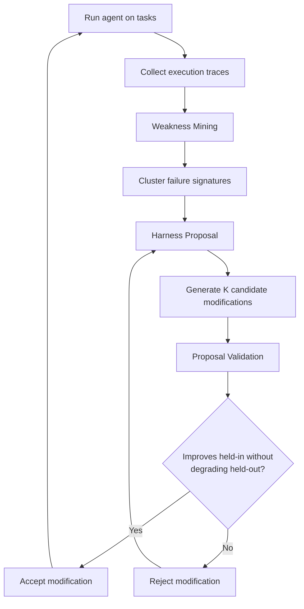
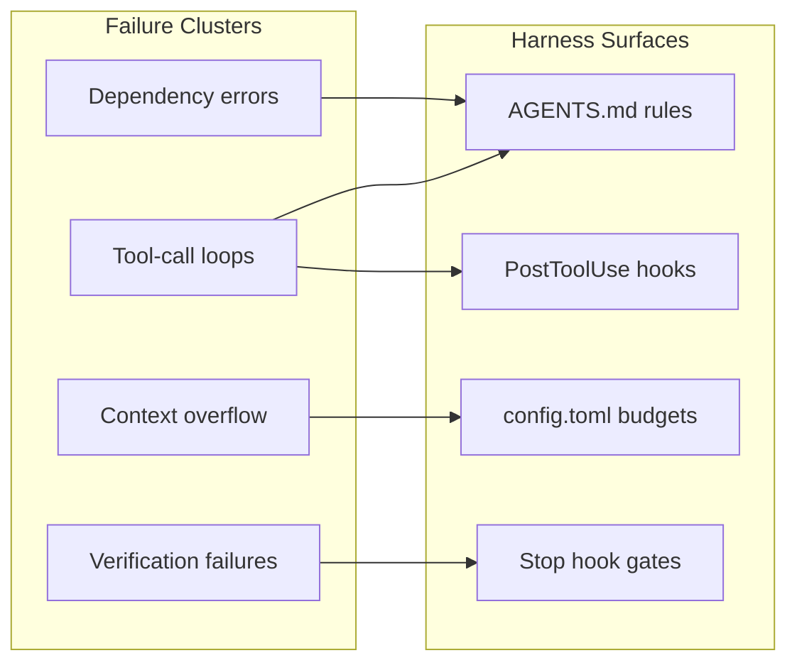

# Self-Harness: What Autonomous Agent Framework Improvement Means for Codex CLI AGENTS.md and Hook Optimisation


---

Every Codex CLI practitioner has done it: noticed a recurring failure, opened `AGENTS.md`, added a rule, tested again, kept or reverted the change. This manual loop — observe failure, hypothesise cause, edit harness, validate — is the dominant workflow for improving agent performance today. Zhang et al.'s "Self-Harness: Harnesses That Improve Themselves" (arXiv:2606.09498, 8 June 2026) formalises that loop and hands it to the agent itself[^1]. The results are striking: MiniMax M2.5 jumped from 40.5% to 61.9% on Terminal-Bench 2.0, a +52.8% relative gain, with no human engineering and no stronger external model[^1].

This article examines Self-Harness's three-stage loop, what its findings reveal about harness optimisation in general, and how Codex CLI practitioners can apply the same principles — today — using AGENTS.md iteration, PostToolUse hooks, and named profiles.

## The Research: Agents That Improve Their Own Operating Framework

### The Harness Problem

The "Agent = Model + Harness" formulation is now well established[^2]. The harness is everything that is not the model: system prompts, tool definitions, runtime mechanisms, verification rules, orchestration logic, and failure-recovery procedures[^1]. Different models exhibit different behavioural weaknesses, which means effective harness design is inherently model-specific[^1]. Yet harnesses are still largely hand-engineered by humans — a process that scales poorly as models diversify and evolve rapidly[^1].

### The Self-Harness Loop

Self-Harness replaces human engineering with a three-stage iterative loop:



**Weakness Mining** analyses execution traces from failed tasks, clustering them by *verifier-grounded failure signatures* — terminal causes and agent mechanisms rather than surface symptoms[^1]. A surface symptom might be "test failed"; a failure signature might be "agent entered infinite tool-call loop after dependency installation error."

**Harness Proposal** generates K diverse yet minimal candidate modifications, each grounded in a primary failure mechanism and mapped to a concrete editable surface: system prompt text, tool wrappers, middleware logic, or runtime configuration[^1].

**Proposal Validation** applies a regression-gated acceptance criterion: a candidate is accepted only if it improves performance on at least one data split without degradation on the other[^1]. This prevents the common trap where fixing one failure class introduces new regressions.

### Quantitative Results

The authors tested Self-Harness across three diverse model families on Terminal-Bench 2.0, a benchmark of 64 containerised terminal tasks spanning ML, systems, security, and biology domains[^1]:

| Model | Baseline | After Self-Harness | Absolute Gain | Relative Gain |
|-------|----------|-------------------|---------------|---------------|
| MiniMax M2.5 | 40.5% | 61.9% | +21.4 pts | +52.8% |
| Qwen3.5-35B-A3B | 23.8% | 38.1% | +14.3 pts | +60.1% |
| GLM-5 | 42.9% | 57.1% | +14.2 pts | +33.1% |

Critically, the modifications were model-specific. MiniMax M2.5 needed early artifact creation, bounded tool-message limits, and redirection after prolonged tool use. Qwen3.5 needed dependency prechecking, retry discipline, and loop-breaking mechanisms. GLM-5 needed persistent environment changes across shell sessions and transitions from exploration to implementation phases[^1]. No single modification worked universally.

### Convergence Behaviour

Performance gains accumulated iteratively, with the system converging after approximately 5–7 proposal rounds per model[^3]. MiniMax reached its final performance through roughly three accepted edits over multiple proposal rounds, suggesting that a small number of well-targeted modifications can deliver outsized gains[^3].

## Why This Matters for Codex CLI

### Your Harness Is Your Performance Lever

Self-Harness provides the strongest empirical evidence yet that harness quality dominates model capability for practical agent performance. A 21.4-point absolute gain from harness modifications alone — with no model change, no fine-tuning, no additional compute — should recalibrate how practitioners allocate their optimisation effort.

For Codex CLI, your harness surfaces are:

- **`AGENTS.md`** — repository-level instructions that shape agent behaviour[^4]
- **`config.toml`** — model selection, token budgets, compaction thresholds, and named profiles[^5]
- **Hooks** — `PostToolUse`, `Stop`, `UserPromptSubmit` callbacks that wrap tool execution with validation logic[^5]
- **Named profiles** — per-task configuration bundles that adjust the harness for specific workflows[^5]

### Model-Specific Harness Design

Self-Harness's most provocative finding is that modifications are model-specific rather than generic instruction additions[^1]. This has direct implications for Codex CLI's named profile system. If you switch between GPT-5.5 and o4-mini (or any third-party model via custom providers), your `AGENTS.md` instructions may need to differ per model.

Codex CLI supports this through `AGENTS.override.md`, which can provide model-specific guidance that supplements the base `AGENTS.md`[^4]. The Self-Harness results suggest practitioners should maintain separate override files tuned to each model's behavioural weaknesses:

```toml
# config.toml — model-specific profiles with different AGENTS.md guidance
[profiles.deep-reasoning]
model = "o4-mini"
# This profile benefits from explicit step-by-step decomposition instructions

[profiles.fast-implementation]
model = "gpt-5.5"
# This profile benefits from artifact-first instructions and bounded tool limits
```

### The Weakness Mining Analogue: Trace Analysis

Self-Harness's Weakness Mining stage clusters failures by mechanism, not symptom. Codex CLI practitioners can approximate this with structured trace analysis:

1. **Collect failure traces** — Use `codex --log-level debug` to capture full execution traces from failed sessions[^5]
2. **Cluster by mechanism** — Group failures by root cause: tool-call loops, dependency errors, context overflow, verification failures, wrong file edits
3. **Map to harness surface** — Identify which harness component each failure cluster maps to



### The Proposal Validation Analogue: Regression-Gated AGENTS.md Changes

The most transferable insight from Self-Harness is its regression-gated acceptance criterion. Too many practitioners add rules to `AGENTS.md` after a single failure without checking whether the new rule breaks existing workflows.

A disciplined approach mirrors Self-Harness's validation stage:

```bash
# 1. Baseline: run your eval suite before the change
codex exec --profile baseline-eval \
  "Run the test suite and report pass/fail counts" \
  > baseline-results.json

# 2. Apply the AGENTS.md modification

# 3. Re-run: check for improvement without regression
codex exec --profile baseline-eval \
  "Run the test suite and report pass/fail counts" \
  > modified-results.json

# 4. Compare: accept only if improved without degradation
diff baseline-results.json modified-results.json
```

For teams with established eval harnesses, tools like `promptfoo` or `adk eval` can automate this comparison with trajectory assertions[^6].

### PostToolUse Hooks as Runtime Harness Modifications

Self-Harness's concrete modifications — bounded tool-message limits, redirection after prolonged tool use, loop-breaking mechanisms — map directly to Codex CLI's hook system.

**Bounded tool limits** (MiniMax M2.5's key modification):

```bash
#!/bin/bash
# hooks/post_tool_use.sh — break tool loops after N consecutive failures
FAILURE_COUNT_FILE="/tmp/codex-tool-failures"

if [ "$TOOL_EXIT_CODE" -ne 0 ]; then
    count=$(cat "$FAILURE_COUNT_FILE" 2>/dev/null || echo 0)
    count=$((count + 1))
    echo "$count" > "$FAILURE_COUNT_FILE"

    if [ "$count" -ge 3 ]; then
        echo "⚠️ Three consecutive tool failures detected. Stop and reassess approach." >&2
        echo 0 > "$FAILURE_COUNT_FILE"
        exit 1
    fi
else
    echo 0 > "$FAILURE_COUNT_FILE"
fi
```

**Dependency prechecking** (Qwen3.5's key modification) can be encoded in `AGENTS.md`:

```markdown
## Dependency Management
Before running any command that depends on external packages:
1. Check whether the dependency is already installed
2. If not, install it and verify the installation succeeded before proceeding
3. Never assume a package is available — always verify
```

### Automating the Self-Harness Loop with `codex exec`

The most ambitious application is approximating the full Self-Harness loop using Codex CLI itself. The `codex exec` command can run tasks in batch mode, collect results, and even propose `AGENTS.md` modifications[^5]:

```bash
#!/bin/bash
# self-harness.sh — one iteration of the Self-Harness loop

# Stage 1: Run tasks and collect traces
for task in tasks/*.md; do
    codex exec --profile eval-profile \
      "$(cat $task)" \
      --output-schema '{"pass": "boolean", "trace": "string"}' \
      > "traces/$(basename $task .md).json" 2>&1
done

# Stage 2: Mine weaknesses and propose modifications
codex exec --profile harness-engineer \
  "Analyse the failure traces in traces/ directory. \
   Cluster them by failure mechanism. \
   Propose a single, minimal AGENTS.md modification \
   that addresses the most common failure cluster. \
   Output the proposed diff." \
  > proposed-modification.diff

# Stage 3: Apply, validate, accept/reject
# (apply diff, re-run eval, compare results)
```

Community tools like `pi-reflect` already automate parts of this workflow, generating self-reviews that evolve `AGENTS.md` rules from actual mistakes[^7].

## Limitations and Caveats

Self-Harness has important limitations that practitioners should weigh:

**Benchmark overfitting risk** — The paper evaluates on Terminal-Bench 2.0 but does not provide direct comparisons with human-engineered harnesses[^1]. The modifications may be overfitted to the benchmark's task distribution rather than reflecting generalisable improvements.

**Computational overhead** — Full benchmark re-evaluation per iteration is expensive[^3]. For Codex CLI practitioners, this means the Self-Harness loop is best suited to teams with established eval suites that can run affordably.

**Fundamental capability gaps** — Self-Harness cannot address cases where the model simply lacks the knowledge or reasoning capacity for a task[^1]. Harness modifications amplify existing capabilities; they do not create new ones.

**Production harness applicability** — ⚠️ The paper does not evaluate whether Self-Harness works on already-optimised production harnesses. Gains may be largest when starting from a naive baseline[^3].

## Practical Takeaways

1. **Treat `AGENTS.md` as code** — version it, diff it, regression-test it. Self-Harness's regression-gated acceptance criterion should be your default for any harness modification.

2. **Model-specific configurations matter** — Use named profiles and `AGENTS.override.md` to maintain model-specific harness tuning rather than one-size-fits-all instructions.

3. **Cluster failures by mechanism, not symptom** — When analysing agent failures, look for the behavioural pattern (tool loops, dependency assumptions, exploration without implementation) rather than the surface error.

4. **Small, targeted modifications beat large rewrites** — Self-Harness achieved +21.4 points through roughly three accepted edits. Prefer minimal, specific `AGENTS.md` additions over comprehensive rewrites.

5. **Automate the feedback loop** — Use `codex exec` batch runs, PostToolUse hooks for runtime data collection, and structured eval comparisons to approximate the Self-Harness loop in your own workflow.

## Citations

[^1]: Zhang, H., Zhang, S., Li, K., Zhang, C., Chen, Y., Zhang, Y., Bai, L. & Hu, S. (2026). "Self-Harness: Harnesses That Improve Themselves." arXiv:2606.09498. [https://arxiv.org/abs/2606.09498](https://arxiv.org/abs/2606.09498)

[^2]: Bui, N. D. Q. (2026). "Building Effective AI Coding Agents for the Terminal: Scaffolding, Harness, Context Engineering, and Lessons Learned." arXiv:2603.05344. [https://arxiv.org/abs/2603.05344](https://arxiv.org/abs/2603.05344)

[^3]: "Self-Harness: AI Agents That Autonomously Improve Their Own Framework." explainx.ai, 10 June 2026. [https://explainx.ai/blog/self-harness-agents-improve-themselves-arxiv-2026](https://explainx.ai/blog/self-harness-agents-improve-themselves-arxiv-2026)

[^4]: OpenAI. "AGENTS.md — Codex CLI." OpenAI Developers. [https://developers.openai.com/codex/cli/agents-md](https://developers.openai.com/codex/cli/agents-md)

[^5]: OpenAI. "CLI — Codex." OpenAI Developers. [https://developers.openai.com/codex/cli](https://developers.openai.com/codex/cli)

[^6]: OpenAI. "Changelog — Codex." OpenAI Developers. [https://developers.openai.com/codex/changelog](https://developers.openai.com/codex/changelog)

[^7]: "pi-reflect: Self-improving behavioral files for coding agents." Community tool for automated AGENTS.md self-reviews. [https://github.com/bradAGI/awesome-cli-coding-agents](https://github.com/bradAGI/awesome-cli-coding-agents)
