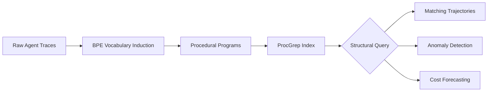
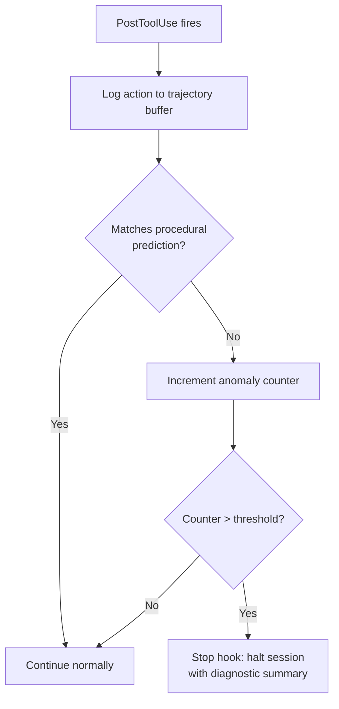

# Agent Trajectories as Programs: What Behavioural Fingerprinting Means for Codex CLI Model Routing and Observability


---

Benchmark scores tell you whether an agent solved a task. They say nothing about *how* it solved it — or whether it stumbled through 60 file reads before submitting a patch. Oderinwale's "Agent trajectories as programs" (arXiv:2606.16988, 15 June 2026) addresses this gap directly: by encoding agent action traces as compressed procedural programs, the work demonstrates that coding agents carry identifiable behavioural fingerprints — and that those fingerprints predict cost, failure modes, and distillation quality far better than resolution rates alone [^1].

This article unpacks the key findings and maps them to Codex CLI's named profiles, PostToolUse hooks, and OpenTelemetry integration for practical model routing and observability.

## The Core Insight: Agents Have Procedural Signatures

The study examines ten agent configurations spanning four scaffolds (SWE-agent, Agentless, DARS, Moatless) and models from the GPT, Claude, DeepSeek, and Qwen families, each evaluated across 278–499 SWE-Bench trajectories [^1].

Using Byte-Pair Encoding (BPE) on raw action sequences, the researchers induce a vocabulary of 192 recurring action subsequences — the procedural "words" that compose each agent's problem-solving language. A probe trained on these procedural signatures attributes an unseen trajectory to the correct agent at **85.7% accuracy**, against an 11.1% random baseline [^1].

The most discriminating action pairs reveal stark differences:

| Agent | Signature Pair | Discrimination Factor |
|-------|---------------|----------------------|
| DARS + DeepSeek-R1 | `search_repo → create_file` | 31.6× |
| Moatless + DeepSeek-V3 | `edit → submit` | 15.7× |
| Agentless + Claude-3.5 | `run_test → run_test` | 12.5× |
| Claude-4 (SWE-agent) | `read_file → read_file` | 5.0× |

Claude-4 spends 60.3% of its action share on consecutive file reads — a cautious, exploration-heavy strategy that contrasts sharply with Moatless's edit-and-submit pattern [^1].

## Stronger Models Use Fewer Procedures

A counter-intuitive finding: extended-thinking models employ *fewer* distinct procedures. Claude-3.7 uses 32 unique action patterns; Claude-4 uses 35. Older RLHF models (Claude-3 Opus, GPT-4o) use 40–49 [^1]. Stronger reasoning concentrates behaviour rather than diversifying it. Entropy drops from 5.58 bits (Claude-3 Opus) to 5.14 bits (Claude-3.7-thinking), suggesting that frontier models converge on tighter procedural loops once they can reason through problems internally.

This has direct implications for context engineering: agents with concentrated procedures are more predictable, enabling tighter AGENTS.md constraints and more reliable PostToolUse hook logic.

## Procedural Distance Reveals Distillation Quality

Jensen-Shannon divergence (JSD) between agent procedure distributions provides a grounded measure of behavioural similarity:

- **Teacher → distilled student** (Claude-3.7 → SWE-agent-LM-32B): JSD = 0.25
- **Within-family across generations**: JSD = 0.518
- **Same model, different harnesses**: JSD = 0.533

The distilled student is procedurally closer to its teacher than sibling models are to each other [^1]. This validates using procedural similarity as a quality signal for model distillation — and suggests that when evaluating new models for Codex CLI deployment, behavioural fingerprinting offers a faster signal than waiting for full benchmark convergence.

## Edit Streaks Signal Failure

One of the most actionable findings: sequences of five or more contiguous edits without intervening test or read operations strongly predict failure. For Moatless + DeepSeek-V3, trajectories containing edit streaks fail at 80%, versus 59% without. Claude-3.5's pass rate drops from 26% to 11% when edit streaks appear [^1].

This translates directly into a Codex CLI PostToolUse hook:

```bash
#!/usr/bin/env bash
# post-tool-use-edit-streak-detector.sh
# Count consecutive apply_patch calls without intervening Bash (test) calls

STREAK_FILE="/tmp/codex-edit-streak-$$"
TOOL_NAME="${CODEX_TOOL_NAME:-}"

if [ "$TOOL_NAME" = "apply_patch" ]; then
  count=$(cat "$STREAK_FILE" 2>/dev/null || echo 0)
  count=$((count + 1))
  echo "$count" > "$STREAK_FILE"
  if [ "$count" -ge 5 ]; then
    echo '{"decision":"block","reason":"Edit streak detected (5+ consecutive edits without test verification). Run tests before continuing."}'
    exit 0
  fi
elif [ "$TOOL_NAME" = "Bash" ]; then
  echo 0 > "$STREAK_FILE"
fi

echo '{"decision":"continue"}'
```

Wire it in `~/.codex/config.toml`:

```toml
[[hooks.PostToolUse]]
matcher = "^(apply_patch|Bash)$"

[[hooks.PostToolUse.hooks]]
type = "command"
command = "/usr/local/bin/post-tool-use-edit-streak-detector.sh"
timeout = 5
statusMessage = "Checking edit streak"
```

## ProcGrep: Deterministic Trajectory Search at Microsecond Latency

The paper introduces ProcGrep, a library for querying agent trajectories using structural patterns rather than natural-language descriptions. Where LLM-based trajectory judges achieve F1 scores of 0.15–0.28 at 0.7–1.7 seconds per query, ProcGrep achieves **F1 = 1.000 at 1.1 microseconds** [^1].



ProcGrep enables queries such as: "All Claude-4 trajectories where `search_repo` was followed by three or more `read_file` calls within the first eight steps, at least one edit was made, and no `run_test` occurred before final submit" [^1]. This kind of deterministic behavioural search is precisely what production observability needs — not another LLM call to classify an LLM's behaviour.

## Mapping to Codex CLI: Named Profiles for Task-Aware Routing

The performance and cost data from the paper make a compelling case for task-aware model routing via Codex CLI named profiles [^2]:

| Model | Resolution Rate | Avg Steps | Cost/Task |
|-------|----------------|-----------|-----------|
| Claude-4 | 59.0% | 64.8 | \$2.02 |
| Claude-3.7-thinking | 50.7% | 33.6 | \$1.53 |
| DeepSeek-R1 (DARS) | 47.0% | 24.0 | \$5.17 |
| Agentless + Claude-3.5 | 40.7% | 13.0 | \$1.23 |
| Moatless + DeepSeek-V3 | 30.7% | 13.1 | \$0.06 |

Claude-4 resolves the most tasks but takes 64.8 steps on average. For bounded, well-localised fixes, Agentless achieves 40.7% resolution in just 13 steps at \$1.23 per task [^1]. Codex CLI's named profiles let you encode this routing logic:

```toml
[profile.deep-fix]
model = "o4-mini"
# Complex, multi-file fixes needing exploration
# Maps to Claude-4-style exploration-heavy behaviour

[profile.quick-patch]
model = "codex-mini"
# Localised single-file fixes
# Maps to Agentless-style minimal-step behaviour

[profile.ci-triage]
model = "gpt-5.4"
# Test failure diagnosis — prioritise test verification
# Maps to DARS-style search-then-create behaviour
```

The fingerprinting research suggests that the right routing dimension is not task difficulty alone, but **procedural compatibility**: matching the agent's natural behavioural pattern to the task structure [^1].

## Next-Action Prediction and Early Termination

Procedural fingerprints enable next-action prediction with significant accuracy improvements over baseline:

- **GPT-4**: 20% → 57% (+37 points)
- **Claude-3.5**: 18% → 50% (+33 points)
- **Agentless + Claude-3.5**: 31% → 82% (+51 points)

When an agent's actual next action diverges from its procedural prediction, this signals anomalous behaviour [^1]. Combined with Codex CLI's Stop hook, this enables early termination of sessions that have gone off-track:



## Chain-of-Thought Follow-Through: Trust but Verify

The paper measures reverse follow-through — whether agents actually execute the plans they describe in their chain-of-thought reasoning. GPT-4 and GPT-4o score a perfect 1.0; the Claude family ranges from 0.75 to 0.875 [^1]. But precision tells a different story: Claude-3 achieves 0.833 precision in its behavioural descriptions, whilst Claude-4 drops to 0.500 — extended thinking models are more verbose but less precise about what they actually intend to do [^1].

For Codex CLI practitioners, this reinforces the value of PostToolUse telemetry over trusting the agent's self-reported reasoning. Wire your observability to action traces, not to the model's explanations.

## OpenTelemetry Integration for Procedural Monitoring

Codex CLI's built-in OpenTelemetry support emits structured events including `codex.tool_decision` and `codex.tool_result` with session, model, and working directory context [^3]. Combined with the o11y-dev OpenTelemetry hooks project, every tool call becomes a queryable span [^4].

To build a ProcGrep-style observability pipeline over Codex CLI sessions:

1. **Capture**: PostToolUse hook logs each tool name, input, and result to a structured JSONL file
2. **Encode**: Periodic BPE pass compresses action sequences into procedural tokens
3. **Index**: ProcGrep-compatible index enables structural queries
4. **Alert**: Anomaly detection fires when JSD from expected procedural distribution exceeds threshold

```toml
[[hooks.PostToolUse]]
matcher = ".*"

[[hooks.PostToolUse.hooks]]
type = "command"
command = "/usr/local/bin/trajectory-logger.sh"
timeout = 5
statusMessage = "Logging trajectory"
```

This transforms Codex CLI from a tool that reports what it did into a system where *how* it works is continuously observable and queryable.

## Practical Takeaways

1. **Route by procedure, not just performance.** Use named profiles to match agent behavioural patterns to task structures — exploration-heavy models for complex multi-file issues, minimal-step models for localised patches.

2. **Detect edit streaks.** Five or more consecutive edits without test verification is a strong failure signal. A PostToolUse hook can catch this in real time.

3. **Build procedural observability.** Codex CLI's OpenTelemetry integration plus PostToolUse logging provides the raw material for ProcGrep-style trajectory analysis.

4. **Evaluate distillation behaviourally.** When testing new models, compare procedural JSD against your known-good model rather than waiting for full benchmark results.

5. **Trust actions over explanations.** Extended-thinking models have lower chain-of-thought precision. Wire monitoring to actual tool calls, not to the model's self-reported plans.

## Citations

[^1]: Oderinwale, H. (2026). "Agent trajectories as programs: fingerprinting and programming coding-agent behavior." arXiv:2606.16988. [https://arxiv.org/abs/2606.16988](https://arxiv.org/abs/2606.16988)

[^2]: OpenAI. (2026). "Configuration Reference — Codex CLI." OpenAI Developers. [https://developers.openai.com/codex/config-reference](https://developers.openai.com/codex/config-reference)

[^3]: OpenAI. (2026). "Hooks — Codex CLI." OpenAI Developers. [https://developers.openai.com/codex/hooks](https://developers.openai.com/codex/hooks)

[^4]: o11y-dev. (2026). "OpenTelemetry integration for AI Agents." GitHub. [https://github.com/o11y-dev/opentelemetry-hooks](https://github.com/o11y-dev/opentelemetry-hooks)
