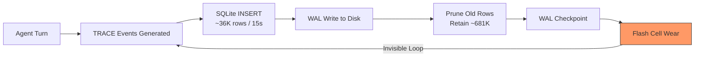
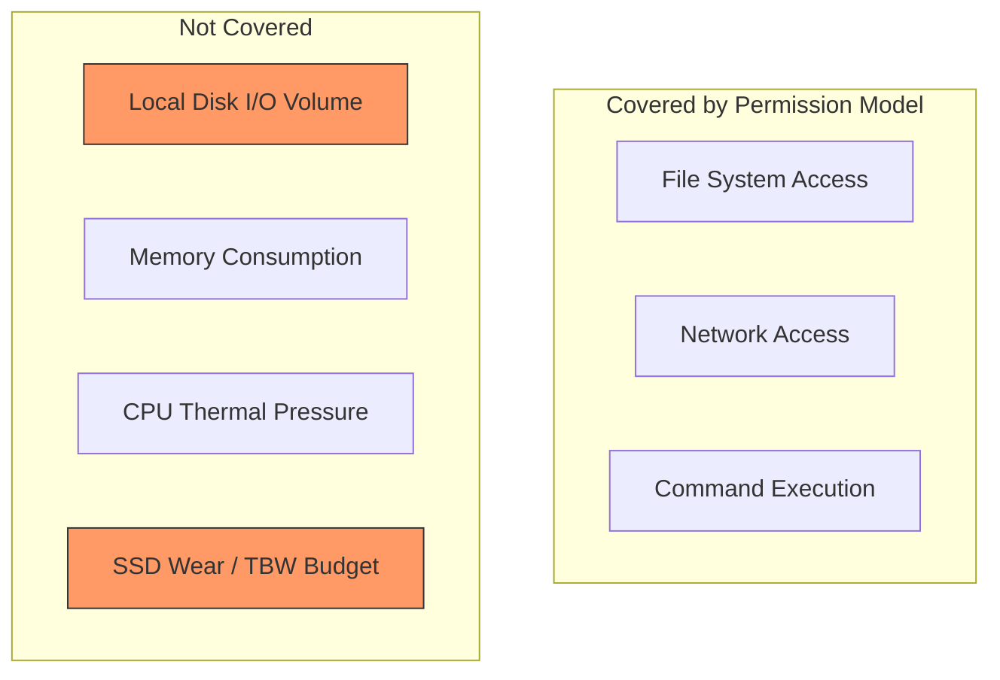

# The 640 TB Bug: How Codex CLI's SQLite Trace Logs Threatened SSD Endurance and What It Teaches About Agent-Local Resource Safety


---

On 14 June 2026, a GitHub issue landed that should unsettle every heavy Codex CLI user: a single Codex instance was writing approximately **640 TB per year** to a local SQLite database — enough to exhaust a typical consumer NVMe drive's entire warranted endurance in under twelve months [^1]. The bug was invisible to standard monitoring because the database file never grew; it churned in place, inserting and pruning tens of thousands of rows per minute whilst the WAL (write-ahead log) hammered the underlying flash cells.

This article dissects the root cause, explains the write-amplification mechanics, walks through diagnosis and mitigation, and draws broader lessons about a failure mode that no coding-agent security model addresses: **silent local resource destruction**.

## The Root Cause: A Global TRACE Default

Codex CLI's Rust codebase ships a persistent SQLite feedback-log sink configured with `Targets::new().with_default(Level::TRACE)` [^1]. TRACE is the most verbose logging tier — it captures every WebSocket frame, every filesystem notification, every OpenTelemetry span, and every dependency-internal diagnostic event.

The resulting data composition, measured across a 1.2 GB retained database, broke down as follows [^1]:

| Log Level | Proportion | Volume  |
|-----------|-----------|---------|
| TRACE     | 70.7%     | 732.5 MB |
| INFO      | 25.7%     | 266.5 MB |
| DEBUG     | 3.5%      | ~36 MB   |
| WARN      | 1.1%      | ~11 MB   |

The three noisiest sources alone accounted for over 800 MB of retained data [^1]:

- `codex_api::endpoint::responses_websocket` TRACE: 527.4 MB — raw WebSocket payloads including full model responses
- OpenTelemetry mirror logs (`codex_otel.log_only` + `codex_otel.trace_safe`): 262.4 MB combined
- Generic `target=log` TRACE: 97.4 MB — dependency noise from hyper, tokio-tungstenite, and inotify internals

Critically, the standard `RUST_LOG` environment variable — the conventional Rust mechanism for controlling log verbosity — **had no effect on this sink** [^2]. The SQLite logger used its own hardcoded filter, bypassing the runtime configuration that developers would reasonably expect to control it.

## Write Amplification: Why the File Never Grew

The database exhibited a striking insert-prune pattern. In a single 15-second observation window, the reporter recorded 36,211 new row insertions against a steady-state retention count of 681,774 rows [^1]. The total allocated row IDs exceeded 5.5 billion — roughly a 10,000× historical churn ratio before accounting for SQLite's own write amplification from WAL journaling, B-tree rebalancing, and index maintenance [^1].

This is the key insight that made the bug invisible: **the file size remained stable at approximately 1.2 GB** whilst the underlying storage device absorbed continuous write traffic. Standard disk-usage monitoring (`du`, `df`, Finder's "Get Info") would report nothing abnormal.



Over 21 days, this pattern produced approximately 37 TB of cumulative writes to the reporter's NVMe drive [^1]. Extrapolated to a full year: **~640 TB** — exceeding the 600 TBW (terabytes written) warranty rating of most 1 TB consumer SSDs [^3].

## The Severity: Not Merely a Performance Bug

The impact was most severe on hardware where the NVMe drive is soldered — MacBook Air/Pro, Dell XPS, ThinkPad X1 Carbon — because the drive cannot be replaced without a logic board swap [^3]. For these machines, the bug threatened permanent hardware damage from normal use of a development tool.

Multiple related issues had surfaced across different contexts before the comprehensive diagnosis [^1]:

- **#17320** (April 2026): Excessive WAL writes during streaming, noting that `RUST_LOG` was ineffective [^2]
- **#24275**: Rapid SQLite growth during normal active use
- **#26374**: Unbounded growth at approximately 0.75 GB per day
- **#27020**: 100% disk utilisation on WSL2
- **#27911**: Sustained 11 MB/s writes on a tiny database
- **#29237**: CLI crashes with SIGTRAP when `logs_2.sqlite` exceeds approximately 200 MB [^4]

The pattern suggests this was a systemic issue affecting users across macOS, Linux, and Windows (WSL2) deployments.

## Diagnosing the Problem on Your Machine

### Step 1: Check Current SSD Wear

On Linux or macOS with `smartmontools` installed:

```bash
# NVMe drives
sudo smartctl -a /dev/nvme0 | grep -E "Data Units Written|Percentage Used"

# SATA SSDs
sudo smartctl -a /dev/sda | grep -E "Total_LBAs_Written|Wear_Leveling_Count"
```

On macOS without smartmontools, use `diskutil`:

```bash
diskutil info disk0 | grep -i "lifetime"
```

The `Data Units Written` field reports in 512,000-byte blocks [^5]. To convert to terabytes:

```bash
# Example: Data Units Written = 51,513,788
echo "scale=2; 51513788 * 512000 / 1000000000000" | bc
# Output: 26.38 (TB)
```

### Step 2: Measure Codex's Contribution

Use `iotop` or `iostat` to isolate write traffic from Codex processes:

```bash
# Linux: watch per-process I/O
sudo iotop -oP | grep -i codex

# macOS: sample disk activity
sudo fs_usage -w -f diskio | grep codex
```

### Step 3: Inspect the Database Directly

```bash
# Check file sizes (misleadingly stable)
ls -lh ~/.codex/logs_2.sqlite*

# Check actual row churn
sqlite3 ~/.codex/logs_2.sqlite "SELECT COUNT(*), MAX(rowid) FROM feedback_logs;"
# If MAX(rowid) >> COUNT(*), churn is high
```

## Mitigation and Workarounds

### The Fix (v0.142+)

OpenAI closed issue #28224 on 22 June 2026 with two merged pull requests [^1]:

- **PR #29432**: "Stop logging every Responses WebSocket event" — eliminates the single largest contributor (527 MB of raw payload TRACE logs)
- **PR #29457**: "Filter noisy targets from persistent logs" — raises the default level for dependency crates and suppresses OpenTelemetry mirror events

User testing reported an approximately **85% reduction** in feedback-log write volume [^1]. The fix ships in v0.142.0 (stable release pending at time of writing).

### Interim Workaround: Redirect to tmpfs

For users on older versions, the recommended workaround redirects writes to RAM-backed temporary storage [^6]:

```bash
# Verify /tmp is tmpfs (RAM-backed)
df -h /tmp | grep tmpfs

# Stop Codex processes
pkill -f codex

# Remove existing database
rm -f ~/.codex/logs_2.sqlite ~/.codex/logs_2.sqlite-wal ~/.codex/logs_2.sqlite-shm

# Symlink to tmpfs
ln -s /tmp/codex_logs_2.sqlite ~/.codex/logs_2.sqlite
```

The database contains no conversation data, session transcripts, or credentials — only diagnostic telemetry — so data loss on reboot is harmless [^6].

### CI/CD Environments

For CI runners and ephemeral containers, point the entire `~/.codex` directory to a tmpfs mount during job setup:

```bash
# In CI job setup
mkdir -p /tmp/codex-home
export HOME_CODEX=/tmp/codex-home
ln -sfn "$HOME_CODEX" "$HOME/.codex"
```

This ensures the sink dies with the container and never reaches persistent storage [^6].

## Broader Lessons: The Agent-Local Resource Blind Spot

This bug illuminates a category of harm that sits outside every existing coding-agent safety framework. SABER [^7] evaluates eight categories of workspace safety violations — code tampering, data destruction, filesystem destruction, information leakage, network outbound, persistence, privilege escalation, and unauthorised access — but none address **resource exhaustion of the host machine's own hardware**.

The Codex CLI permission model (sandbox modes, filesystem deny-read/deny-write rules, network proxying) governs what the agent does to *your code and data*. It has no opinion on what the agent's own infrastructure does to *your hardware*.



### What This Means for Codex CLI Users

Three defensive practices emerge from this incident:

**1. Monitor host-level resource consumption, not just agent output.** Add SSD health checks to your development machine maintenance routine:

```toml
# Example: cron job for weekly SSD health check
# /etc/cron.weekly/ssd-health
#!/bin/bash
smartctl -a /dev/nvme0 | grep "Percentage Used" | awk '{print $3}' | \
  xargs -I{} test {} -gt 80 && echo "SSD wear above 80%" | mail -s "SSD Alert" you@example.com
```

**2. Treat agent telemetry configuration as a first-class concern.** When evaluating any coding agent — Codex CLI, Claude Code, Gemini CLI, or others — audit what it writes locally and where. The `~/.codex/` directory, `~/.claude/` directory, and equivalents deserve the same scrutiny as network egress.

**3. Update promptly when infrastructure fixes land.** The gap between the first related report (#17320, April 2026) and the comprehensive fix (PRs #29432 and #29457, June 2026) was approximately two months [^1][^2]. During that window, every active installation was accumulating unnecessary wear.

### For Codex CLI Hook Authors

Consider adding a `PostToolUse` hook that monitors cumulative write volume during long-running sessions:

```bash
#!/bin/bash
# hooks/post-tool-use.sh — warn on excessive local writes
WRITES_FILE="/tmp/codex-session-writes"
CURRENT=$(cat /proc/$PPID/io 2>/dev/null | grep write_bytes | awk '{print $2}')
if [ -f "$WRITES_FILE" ]; then
    START=$(cat "$WRITES_FILE")
    DELTA=$(( (CURRENT - START) / 1073741824 ))  # Convert to GB
    if [ "$DELTA" -gt 10 ]; then
        echo "⚠️ Session has written ${DELTA} GB to disk — check logs_2.sqlite" >&2
    fi
else
    echo "$CURRENT" > "$WRITES_FILE"
fi
```

## Timeline

| Date | Event |
|------|-------|
| April 2026 | First reports surface (#17320): WAL writes ignore `RUST_LOG` [^2] |
| May–June 2026 | Multiple independent reports across platforms (#24275, #26374, #27020, #27911) [^1] |
| 14 June 2026 | Comprehensive diagnosis filed (#28224) with 640 TB/year measurement [^1] |
| 22 June 2026 | PRs #29432 and #29457 merged; issue closed [^1] |
| Pending | v0.142.0 stable release with fix |

## Conclusion

The 640 TB bug was not a security vulnerability, not a data leak, and not a functional failure. It was something arguably worse: **silent hardware destruction from a tool that otherwise worked perfectly**. The agent produced correct code, respected its sandbox, and obeyed its permission profile — whilst its own telemetry infrastructure wore out the drive beneath it.

As coding agents become persistent background processes — running via `codex exec`, CI automation, and headless app-server deployments — the distinction between "what the agent does" and "what the agent's infrastructure does" becomes operationally critical. Monitor both.

---

## Citations

[^1]: GitHub Issue #28224 — "Codex SQLite feedback logs can write ~640 TB/year and rapidly consume SSD endurance," openai/codex, filed 14 June 2026, closed 22 June 2026. [https://github.com/openai/codex/issues/28224](https://github.com/openai/codex/issues/28224)

[^2]: GitHub Issue #17320 — "Excessive SQLite WAL writes during streaming due to TRACE logs ignoring RUST_LOG," openai/codex, filed April 2026. [https://github.com/openai/codex/issues/17320](https://github.com/openai/codex/issues/17320)

[^3]: Notebookcheck — "OpenAI Codex has a bug that could kill your SSD in under a year," June 2026. [https://www.notebookcheck.net/OpenAI-Codex-has-a-bug-that-could-kill-your-SSD-in-under-a-year.1326191.0.html](https://www.notebookcheck.net/OpenAI-Codex-has-a-bug-that-could-kill-your-SSD-in-under-a-year.1326191.0.html)

[^4]: GitHub Issue #29237 — "Bug: CLI crashes with SIGTRAP (trace trap) when logs_2.sqlite exceeds ~200MB," openai/codex. [https://github.com/openai/codex/issues/29237](https://github.com/openai/codex/issues/29237)

[^5]: Baeldung — "How to Check the Health of SSD in Linux," 2026. [https://www.baeldung.com/linux/ssd-verify-health](https://www.baeldung.com/linux/ssd-verify-health)

[^6]: DEV Community — "Stop OpenAI Codex Writing 640 TB/Year to Your SSD," June 2026. [https://dev.to/indra_gustiprasetya_a80a/stop-openai-codex-writing-640-tbyear-to-your-ssd-2j8d](https://dev.to/indra_gustiprasetya_a80a/stop-openai-codex-writing-640-tbyear-to-your-ssd-2j8d)

[^7]: Hu et al. — "SABER: A 716-Task Benchmark for Operational Safety of Coding Agents," arXiv:2606.01317, May 2026. [https://arxiv.org/abs/2606.01317](https://arxiv.org/abs/2606.01317)
