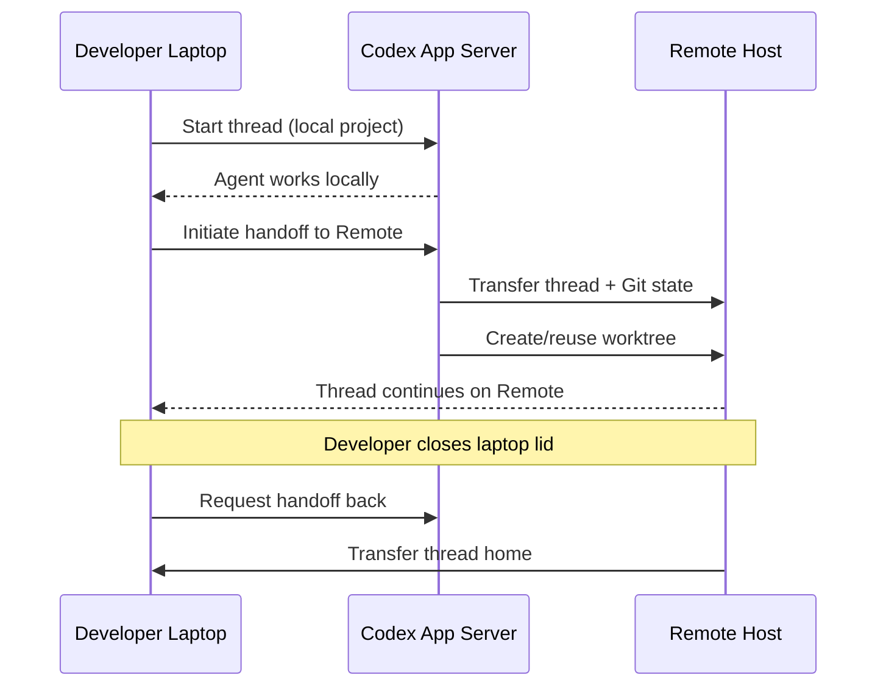
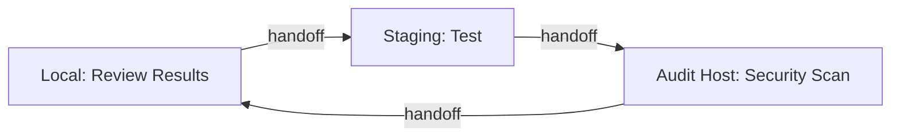

# Codex CLI Thread Handoff: Seamless Session Continuity Between Local and Remote Hosts


---

One of the persistent frustrations of remote development with AI coding agents has been the hard boundary between local and remote sessions. You start a complex refactoring on your laptop, realise you need the GPU box or the beefy CI runner to complete it, and face a choice: abandon context or manually recreate it. Codex CLI v0.141.0, released on 18 June 2026, eliminates that choice with thread handoff — the ability to move a running thread, including its full Git state, between your local machine and any connected remote host [^1] [^2].

This article examines how thread handoff works, the Noise Protocol relay infrastructure securing it, and the practical workflows it enables for senior developers running Codex across distributed environments.

## What Thread Handoff Actually Does

Thread handoff moves an existing Codex thread — its transcript, plan history, approvals, and associated Git branch state — from one host to another [^3]. The source can be your laptop; the destination can be a remote server connected via SSH. Or vice versa: bring a remote thread back to your local machine by selecting "This computer" as the destination [^3].

Critically, this is not session replay or transcript export. Codex transfers the live thread context so the agent retains full awareness of prior conversation, tool calls, and decisions. When the thread resumes on the destination host, the agent can continue exactly where it left off [^3] [^4].



## Prerequisites and Constraints

Thread handoff requires a matching saved project on both hosts. Both the source and destination must have a project configured for the same Git repository — and if the project targets a subdirectory, the same subdirectory must be saved on both ends [^3]. Codex only surfaces destinations with a matching project, preventing accidental transfers to incompatible environments.

Two constraints are worth noting:

1. **No self-referential handoff.** A thread cannot hand off the thread that is making the request [^3]. If you need to orchestrate a handoff programmatically, use a second thread to issue the instruction.
2. **No cloud environment handoff.** Thread handoff targets SSH-connected remote hosts and your local machine. Codex cloud environments are excluded [^3].

If a thread is actively running when you initiate handoff, Codex interrupts the current response before transferring [^3]. No partial execution artefacts leak across the boundary.

## Noise Relay: End-to-End Encrypted Transport

The same v0.141.0 release upgraded remote executor connections to use authenticated, end-to-end encrypted Noise relay channels [^1] [^5]. This is a significant security uplift for teams running Codex against remote machines.

The Noise Protocol Framework, originally designed by Trevor Perrin, underpins the encryption in WireGuard, WhatsApp, and Slack [^6]. Its core properties — forward secrecy, identity hiding, and resistance to key-compromise impersonation — make it well suited to relay channels where both endpoints must mutually authenticate before any application data flows [^6].

For Codex, this means:

- **Mutual authentication.** Both the local client and the remote executor prove their identity during the Noise handshake, before thread data crosses the wire.
- **Forward secrecy.** Compromising a long-term key does not retroactively expose past sessions.
- **No plaintext relay.** Even if the relay infrastructure itself were compromised, the end-to-end encryption ensures thread transcripts and Git state remain confidential.

### Configuration

Remote connections still use SSH as the management channel to start and manage the remote Codex app server [^3]. The Noise relay sits on top of this, encrypting the executor data channel. No additional configuration is needed beyond the standard SSH host setup in **Settings > Connections** [^7].

```toml
# ~/.codex/config.toml — remote connection defaults
[remote]
auth_token_env = "CODEX_REMOTE_TOKEN"   # bearer token for WebSocket auth
relay_encryption = "noise"                # default since v0.141.0
```

For CLI-driven connections, the `--remote` flag accepts WebSocket URIs, and `--remote-auth-token-env` specifies the environment variable holding the bearer token [^4]:

```bash
# Connect to a remote app server
codex --remote wss://build-box.internal:4500 \
      --remote-auth-token-env CODEX_REMOTE_TOKEN

# Resume a specific session on a remote host
codex resume --last --remote wss://build-box.internal:4500
```

## Cross-Platform Working Directory Preservation

A subtlety that matters for heterogeneous teams: v0.141.0 also ensures that cross-platform remote execution preserves executor-native working directories and shells, including filesystem permission paths across app-server and exec-server boundaries [^1]. If you hand off from a macOS laptop to a Linux build server, the remote side resolves paths using its own filesystem conventions rather than attempting to translate macOS paths.

This interacts with the `--cd` and `--add-dir` flags available on `codex resume` and `codex fork`, which let you override or extend the working directory when picking up a session on a different host [^4]:

```bash
# Resume on remote, adjusting the working directory
codex resume --last --cd /home/dev/project \
      --remote wss://build-box.internal:4500
```

## Practical Workflows

### The Laptop-to-Server Handoff

The most immediate use case: you start exploratory work on your laptop — understanding the codebase, drafting a plan, running small tests — then hand off to a remote server with more resources for the heavy execution phase.

1. Open the thread in the Codex App.
2. Select the run location in the thread footer.
3. Choose the destination host.
4. Review the branch and destination, then select **Hand off**.
5. Codex creates or reuses a worktree on the remote host, transfers the thread, and switches execution [^3].

Close your laptop. The agent continues on the remote box. When you return, hand the thread back by selecting "This computer" [^3].

### Delegated Handoff via a Second Thread

For automation scenarios, you can ask Codex in one thread to hand off a different named thread to a connected host [^3]. This opens the door to orchestration patterns:

```
# In a controller thread:
"Hand off the thread 'migrate-database-schema' to build-server-03."
```

This is particularly useful for CI-adjacent workflows where a coordinator thread triages work across multiple remote executors.

### Multi-Host Review Pipeline

Consider a review pipeline where code is authored locally, tested on a staging server, and then security-scanned on an isolated audit host. Thread handoff lets the same agent context flow through each stage without losing the accumulated understanding of what was built and why.



## Security Considerations

Thread handoff inherits all existing security controls. Sandboxing settings, security controls, and action approvals still apply to the connected session [^3] [^7]. A thread handed off to a remote host does not gain elevated permissions simply because the remote environment differs.

However, teams should consider:

- **Permission profile alignment.** If your local machine uses a restrictive named permission profile (available since v0.142) [^8], ensure the remote host has a compatible profile configured. Handoff transfers the thread but not necessarily the local permission configuration.
- **AGENTS.md consistency.** The remote worktree will contain its own `AGENTS.md`. If your local and remote repositories diverge in their agent guidance, the agent may behave differently post-handoff.
- **Network exposure.** The documentation explicitly warns: do not expose app-server transports directly on a shared or public network [^3]. Use a VPN or mesh networking tool for hosts outside your current network.

## Hook Interactions

PostToolUse hooks configured via `AGENTS.md` or `config.toml` travel with the thread context. If a hook script references a local path (e.g., a linting binary), that path must exist on the destination host or the hook will fail silently or error. A defensive pattern:

```toml
# config.toml — portable hook using npx
[hooks.PostToolUse]
command = "npx --yes @company/codex-lint-hook"
```

Using package-manager-resolved tools rather than absolute paths ensures hooks remain functional across handoff boundaries.

## What This Means for the Remote Development Story

Thread handoff completes a progression that started with the app-server WebSocket architecture [^9], continued through SSH remote connections [^7], and now reaches session-level portability. The trajectory is clear: Codex is evolving from a local-first tool that can talk to remote machines into a distributed agent runtime where the distinction between local and remote becomes an implementation detail.

For teams already using remote executors, thread handoff removes the last major friction point. For teams considering remote Codex adoption, the combination of Noise-encrypted relay channels and session continuity addresses both the security and workflow concerns that previously made remote agent execution a harder sell.

The feature ships in Codex App 26.616 and CLI v0.141.0 [^1]. Update, connect a remote host, and try handing off a thread mid-conversation. The experience of closing your laptop lid and having the agent continue working on a remote box — then pulling the results back when you open it — is the kind of workflow shift that, once tried, you do not willingly give up.

---

## Citations

[^1]: OpenAI, "Codex Changelog — June 18, 2026 (Codex App 26.616, CLI v0.141.0)," [https://developers.openai.com/codex/changelog](https://developers.openai.com/codex/changelog)

[^2]: OpenAI, "Release 0.141.0 — openai/codex," GitHub, [https://github.com/openai/codex/releases/tag/rust-v0.141.0](https://github.com/openai/codex/releases/tag/rust-v0.141.0)

[^3]: OpenAI, "Remote connections — Codex," OpenAI Developers, [https://developers.openai.com/codex/remote-connections](https://developers.openai.com/codex/remote-connections)

[^4]: OpenAI, "Command line options — Codex CLI," OpenAI Developers, [https://developers.openai.com/codex/cli/reference](https://developers.openai.com/codex/cli/reference)

[^5]: Releasebot, "Codex Updates by OpenAI — June 2026," [https://releasebot.io/updates/openai/codex](https://releasebot.io/updates/openai/codex)

[^6]: Wikipedia, "Noise Protocol Framework," [https://en.wikipedia.org/wiki/Noise_Protocol_Framework](https://en.wikipedia.org/wiki/Noise_Protocol_Framework)

[^7]: Codex Knowledge Base, "Codex CLI Remote Connections: Running Agents on Remote Hosts with SSH, WebSocket, and Secure Tunnels," [https://codex.danielvaughan.com/2026/04/21/codex-cli-remote-connections-ssh-websocket-secure-tunnels/](https://codex.danielvaughan.com/2026/04/21/codex-cli-remote-connections-ssh-websocket-secure-tunnels/)

[^8]: Codex Knowledge Base, "Beyond Static Sandboxing: Learned Capability Governance and Codex CLI Least-Privilege Tool Scoping," [https://codex.danielvaughan.com/2026/06/21/beyond-static-sandboxing-learned-capability-governance-codex-cli-least-privilege-tool-scoping/](https://codex.danielvaughan.com/2026/06/21/beyond-static-sandboxing-learned-capability-governance-codex-cli-least-privilege-tool-scoping/)

[^9]: Codex Knowledge Base, "Codex CLI App Server: Remote Access, WebSocket Transport, and Headless Deployment," [https://codex.danielvaughan.com/2026/03/31/codex-cli-app-server-remote-websocket/](https://codex.danielvaughan.com/2026/03/31/codex-cli-app-server-remote-websocket/)
