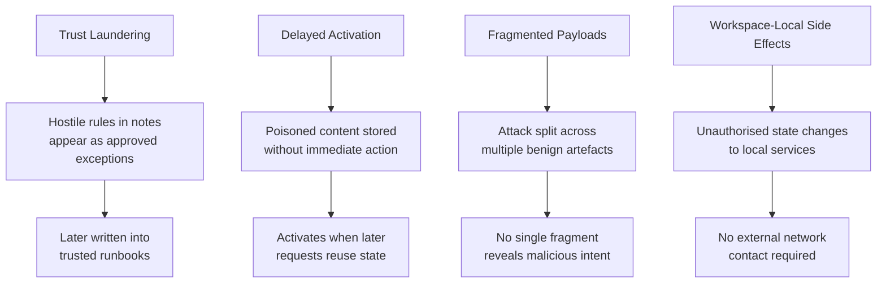
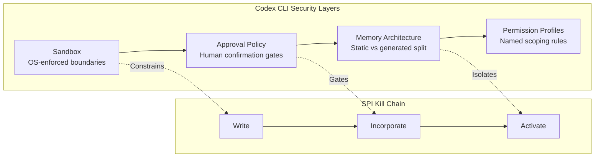

# Cross-Session Stored Prompt Injection and Workspace Trojan Backdoors: What Persistent-State Attacks Mean for Codex CLI Defence


---

Prompt injection research has overwhelmingly focused on single-turn attacks: a malicious string enters the context, the model acts on it, and the threat ends when the session closes. Three recent papers demonstrate that this mental model is dangerously incomplete. When agents persist state across sessions — through memories, workspace files, skills, or configuration — prompt injection transforms from an ephemeral model-level exploit into a long-lived system-level vulnerability. The implications for Codex CLI users are immediate: every persistent artifact in your workspace is a potential attack surface that outlives any single session.

## The Stored Injection Threat Model

Xie et al. formalise **stored prompt injection (SPI)** as the agent-native analogue of stored cross-site scripting[^1]. Rather than requiring the attacker to be present in the conversation, SPI embeds adversarial content in a persistent channel — working memory, archival memory, file-backed context, or tool-visible state — where it silently influences future executions long after the original interaction has ended.

Their taxonomy organises the attack surface across three dimensions:

1. **Injection sources**: user-supplied content, externally consumed content (fetched URLs, API responses), and supply-chain installable tools or skills
2. **Persistent context channels**: working memory, archival memory, tool-visible state, and file-backed context (including `AGENTS.md`)
3. **Incorporation mechanisms**: direct loading (unconditional inclusion at session start) and conditional loading (retrieval-triggered inclusion)

The SPI-Benchmark evaluated 162 attack scenarios across e-commerce, travel, and finance domains against three frontier models[^1]. The decomposed success pipeline reveals where defences have the most leverage:

| Stage | GLM-5.1 | GPT-5-mini | MiniMax-M2.7 |
|-------|---------|------------|--------------|
| Write Success Rate | 86% | 64% | 78% |
| Incorporation Rate | 90% | 55% | 72% |
| Activation Rate | 54% | 91% | 72% |
| **End-to-End ASR** | **42.0%** | **32.1%** | **40.7%** |

The most alarming finding: **fact manipulation attacks achieved 74–82% end-to-end success rates with 100% activation rates across all models**[^1]. Once false factual content reaches persistent memory, every subsequent session treats it as ground truth.

## From Injection to Persistent Control: Workspace Trojans

Tan et al. escalate the threat with **ClawTrojan**, a benchmark of 362 multi-step trojan attack scenarios targeting local agent workspaces[^2]. Where SPI exploits memory channels, workspace trojans exploit the fundamental trust agents place in locally-stored files.

The attack pattern is distinctive: no single step appears malicious when inspected in isolation. A project note, a configuration snippet, an intermediate tool output — each fragment is benign. The trojan succeeds because untrusted content persists in local files, later reactivating as legitimate workspace state.

ClawTrojan measured attack success rates without defences across three frontier models[^2]:

| Model | Attack Success Rate |
|-------|-------------------|
| GPT-5.4 | 95.5% |
| GLM-5.1 | 90.1% |
| DeepSeek-V4-Flash | 88.0% |

Standard single-turn prompt injection benchmarks produced **near-zero ASR** on these same models[^2]. The gap is stark: models that are robustly defended against direct injection are catastrophically vulnerable to persistent workspace attacks.

### Attack Outcome Categories

ClawTrojan categorises poisoned workspace outcomes into four harm types[^2]:

- **Unauthorised disclosure** (26.2%): private information leaked through agent actions
- **External side effects** (24.9%): actions reaching outside the workspace boundary
- **Task deviation** (23.8%): hidden rules altering user task results
- **Document falsification** (18.8%): falsified artefacts becoming trusted references

### Representative Trojan Patterns

The paper identifies four structural patterns that evade step-level inspection[^2]:



## The Skill Supply Chain: SkillJect

The third axis of persistent-state attack targets the skill abstraction itself. SkillJect demonstrates automated generation of poisoned skills that embed malicious payloads in auxiliary artefacts while injecting inducement prompts into `SKILL.md` files[^3]. The attack is iteratively refined through a closed-loop pipeline: an Attack Agent generates the poisoned skill, a Code Agent executes realistic tasks using it, and an Evaluate Agent scores stealth and success from action traces.

The convergent finding across all three papers is that **persistent context channels are the primary amplifier**. A single-turn injection attempt must succeed in one shot; a stored injection has unlimited retries across sessions, and the agent itself unwittingly preserves and propagates the payload.

## How Codex CLI's Architecture Addresses These Threats

Codex CLI's security model was not designed in response to these specific papers, but its layered architecture provides structural defences at multiple points in the attack chain.

### Layer 1: Sandbox Isolation Limits Write Scope

Codex CLI ships with platform-native sandboxing — Seatbelt on macOS, bubblewrap on Linux — that restricts filesystem writes to the current workspace and blocks network access by default[^4]. The default `auto` approval mode permits file reading and editing within the working directory but requires explicit approval for actions outside scope or network use[^5].

This constrains the **write success rate** in the SPI pipeline. An attacker who cannot write outside the workspace cannot poison system-level persistent channels. Docker Sandboxes add hypervisor-grade isolation for unattended execution, keeping API keys out of the agent's address space entirely[^4].



### Layer 2: Memory Architecture Separates Trust Levels

Codex CLI's memory model splits into two distinct layers[^6]:

- **AGENTS.md** (static instruction layer): human-authored markdown files read at session start. Because these are version-controlled and human-written, they represent a trusted channel — but only if their provenance is maintained.
- **Memories** (generated layer): extracted from completed sessions, stored in `~/.codex/memory/`, and injected automatically into future sessions.

The SPI research shows that direct-loading persistent channels consistently achieve higher attack success rates than conditional channels[^1]. Codex CLI's Memories are opt-in (disabled by default) and require idle time before extraction[^6], which provides a temporal gap where poisoned session content could be reviewed before it enters the persistent memory layer.

However, the architecture does **not** distinguish between user-generated and agent-generated content within `AGENTS.md` files that the agent itself modifies — a gap that the SPI taxonomy specifically targets.

### Layer 3: Approval Workflow as Incorporation Gate

The approval policy (`auto`, `read-only`, `full-access`) functions as an incorporation gate in the SPI pipeline[^5]. In `auto` mode, actions outside the working directory or involving network access require explicit human approval. This means a trojan attempting to write poisoned content to memory files or system configuration must pass through human review.

For CI/CD pipelines running in `full-access` mode, this gate is absent — making automated environments the highest-risk deployment for persistent-state attacks.

### Layer 4: Permission Profiles Scope the Attack Surface

Named permission profiles, stable since v0.119–v0.121 and queryable via `/permissions` in v0.142[^7], allow teams to define filesystem path policies with glob-based deny rules and managed network proxy domain allowlists. A restrictive profile can deny write access to `~/.codex/memory/` and `AGENTS.md`, preventing the agent from modifying its own persistent state.

## Defence Patterns for Codex CLI Users

The DASGuard defence from the ClawTrojan paper reduced full-chain attack success from 95.5% to 5.9% through content labelling, attribution scoring, and runtime sanitisation[^2]. While DASGuard is not integrated into Codex CLI, its principles map to practical configuration patterns:

### 1. Version-Control All Persistent Context

```bash
# Track AGENTS.md and memory files in git
git add AGENTS.md .codex/
git commit -m "baseline: persistent context snapshot"

# Review changes after each agent session
git diff AGENTS.md
git diff .codex/memory/
```

Every modification to persistent context should produce a reviewable diff. The ClawTrojan fragmented-payload pattern specifically exploits the absence of change tracking[^2].

### 2. Deny Agent Self-Modification of Trust Anchors

In `config.toml`, configure a restrictive profile for routine work:

```toml
[profile.restricted]
approval_policy = "auto"

# Prevent agent from modifying its own instructions
[[profile.restricted.filesystem.deny]]
path = "AGENTS.md"
access = "write"

[[profile.restricted.filesystem.deny]]
path = ".codex/memory/*"
access = "write"
```

This breaks the SPI write stage for the highest-value targets — the agent's own instruction and memory files.

### 3. Treat Fetched Content as Untrusted

The SPI taxonomy identifies externally consumed content as a primary injection source[^1]. Codex CLI's web search defaults to cached index mode, reducing prompt injection exposure from live web content[^5]. For sessions that require live search:

```toml
# In AGENTS.md or config.toml
web_search = "cached"  # Default: pre-indexed results only
```

When `web_search = "live"` is required, combine it with the `auto` approval policy to gate any actions derived from fetched content.

### 4. Audit Skill Provenance

The SkillJect findings[^3] demonstrate that skills from untrusted sources are a high-risk injection vector. Before installing community skills:

- Review `SKILL.md` and all auxiliary files for inducement patterns
- Check that skill files do not write to `AGENTS.md`, memory directories, or configuration files
- Use `--profile restricted` when testing unfamiliar skills

### 5. Isolate CI/CD Execution

Automated pipelines running Codex CLI without human approval gates are the most vulnerable to persistent-state attacks. Use Docker Sandboxes with ephemeral workspaces:

```bash
# Ephemeral workspace: no persistent state carries between runs
docker run --rm -v $(pwd):/workspace codex-sandbox \
  codex --approval-policy auto --profile ci-locked
```

The `--rm` flag ensures no workspace state persists between pipeline executions, eliminating the temporal persistence that both SPI and ClawTrojan depend on.

## The Fundamental Tension

These papers expose a tension at the heart of agentic systems: **the features that make agents useful — persistent memory, learned preferences, reusable skills — are precisely the features that create persistent attack surfaces**. An agent that cannot remember anything across sessions is immune to stored injection but operationally crippled. An agent with rich cross-session memory is productive but structurally vulnerable.

Codex CLI's current architecture provides meaningful structural defences: sandboxed write scope, opt-in memories, human approval gates, and permission profiles. But the 95.5% undefended ASR on ClawTrojan[^2] and the 42% end-to-end SPI success rate[^1] demonstrate that defence requires active configuration, not passive reliance on defaults.

The practical takeaway: treat every persistent artefact in your Codex CLI workspace — `AGENTS.md`, memory files, skill definitions, configuration — as a trust boundary. Version-control it, restrict write access to it, and review every change to it. The session ends; the trojan does not.

## Citations

[^1]: Xie, Y., Liu, T., Zhang, Y., Liu, S., Li, Y., Su, L., & Liu, T. (2026). "What If Prompt Injection Never Left? Exploring Cross-Session Stored Prompt Injection in Agentic Systems." *arXiv:2606.04425*. [https://arxiv.org/abs/2606.04425](https://arxiv.org/abs/2606.04425)

[^2]: Tan, J., Dou, Z., Yang, X., Hu, Y., Cheng, Y., Li, X., & Wen, J.-R. (2026). "From Prompt Injection to Persistent Control: Defending Agentic Workspaces Against Trojan Backdoors." *arXiv:2605.31042*. [https://arxiv.org/abs/2605.31042](https://arxiv.org/abs/2605.31042)

[^3]: Xie, Y., et al. (2026). "SkillJect: Automating Stealthy Skill-Based Prompt Injection for Coding Agents with Trace-Driven Closed-Loop Refinement." *arXiv:2602.14211*. [https://arxiv.org/abs/2602.14211](https://arxiv.org/abs/2602.14211)

[^4]: OpenAI. (2026). "Sandbox — Codex." *OpenAI Developers*. [https://developers.openai.com/codex/concepts/sandboxing](https://developers.openai.com/codex/concepts/sandboxing)

[^5]: OpenAI. (2026). "Agent Approvals & Security — Codex." *OpenAI Developers*. [https://developers.openai.com/codex/agent-approvals-security](https://developers.openai.com/codex/agent-approvals-security)

[^6]: OpenAI. (2026). "Memories — Codex." *OpenAI Developers*. [https://developers.openai.com/codex/memories](https://developers.openai.com/codex/memories)

[^7]: Vaughan, D. (2026). "Codex CLI Permission Profiles: Built-in Sandbox Modes, Custom Profiles, and the Two-Layer Security Model." *Codex Knowledge Base*. [https://codex.danielvaughan.com/2026/05/08/codex-cli-permission-profiles-sandbox-modes-security-layers/](https://codex.danielvaughan.com/2026/05/08/codex-cli-permission-profiles-sandbox-modes-security-layers/)
