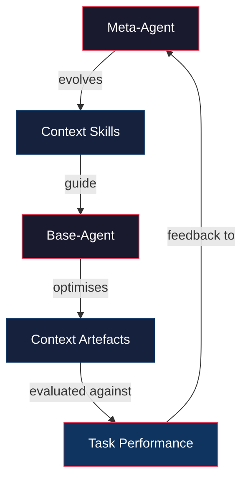
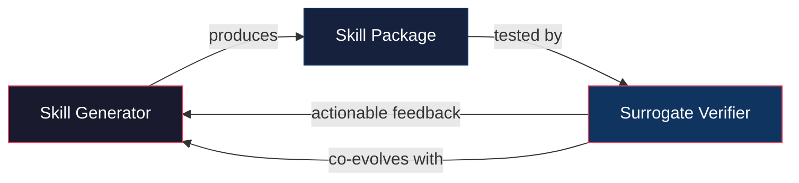
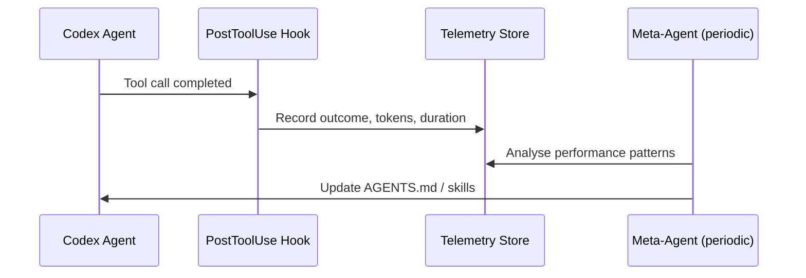

# Meta Context Engineering: What Automated Skill Evolution Means for Codex CLI AGENTS.md and Skills Optimisation


---

## The Problem: Hand-Crafted Context Is a Ceiling

Every senior developer who has spent time writing AGENTS.md files, tuning SKILL.md templates, or adjusting `model_auto_compact_token_limit` thresholds has hit the same wall: manual context engineering does not scale. You write instructions that work for one task shape, then watch them degrade on another. You add detail to cover edge cases, bloating the context window. You prune to save tokens, and the agent forgets critical constraints.

Two recent research papers — *Meta Context Engineering via Agentic Skill Evolution* (MCE) [^1] and *CoEvoSkills: Self-Evolving Agent Skills via Co-Evolutionary Verification* [^2] — converge on the same insight: **the process of designing context and skills for LLM agents can itself be automated through evolutionary optimisation**. Both demonstrate that agents which evolve their own operating instructions substantially outperform hand-engineered baselines.

This article examines what these findings mean for Codex CLI practitioners and how the principles map to the AGENTS.md, skills, hooks, and configuration surfaces available today.

---

## MCE: Bi-Level Context Optimisation

Ye et al. (arXiv:2601.21557, January 2026) introduce a bi-level framework that separates *how to learn context* from *what context to learn* [^1].



### The Meta-Level: Skill Evolution

A **context skill** in MCE is a folder containing methodology descriptions, executable scripts, context templates, validation protocols, and dynamic operators [^1]. The meta-agent synthesises new skills by reasoning across task specifications, historical skill performance, and execution traces — a process the authors term **agentic crossover** [^1]. Unlike fixed recombination rules in traditional evolutionary computation, agentic crossover is a deliberative search that inspects workspace folders, identifies success and failure patterns, and composes improved skills.

### The Base-Level: Artefact Optimisation

The base-agent executes the evolved skills to produce **context artefacts** — represented as files and code rather than predefined schemas [^1]. This flexibility allows programmatic context generation: a skill might emit a condensed codebase summary, a dependency graph, or a set of type signatures, depending on what the meta-agent has learnt works best.

### Results

Tested across five domains (finance, chemistry, medicine, law, AI safety) using DeepSeek V3.1 as the generator model and MiniMax M2.1 as the meta-agent [^1]:

| Metric | MCE | Prior SOTA (ACE) | Improvement |
|--------|-----|-----------------|-------------|
| Average relative improvement (offline) | 89.1% | 70.7% | +18.4pp |
| Average relative improvement (online) | 74.1% | 41.1% | +33.0pp |
| Training speedup | 13.6× | baseline | — |
| Context length range | 1.5K–86K tokens | fixed | adaptive |

The 89.1% average relative improvement over the base model in offline settings is striking, but equally important is the **context adaptability** finding: MCE-evolved skills produce context artefacts ranging from 1,500 to 86,000 tokens depending on task requirements, rather than using a fixed context budget [^1].

---

## CoEvoSkills: Self-Evolving Agent Skills via Co-Evolutionary Verification

Zhang et al. (arXiv:2604.01687, April 2026) address a complementary problem: how agents can **autonomously construct complex, multi-file skill packages** without manual authoring [^2].



The framework couples a **Skill Generator** that iteratively improves skills with a **Surrogate Verifier** that co-evolves to provide informative, actionable feedback without access to ground-truth test content [^2]. CoEvoSkills achieves the highest pass rate among five baselines on both Claude Code and Codex, with strong generalisation to six additional LLMs [^2].

The key innovation is that the verifier evolves alongside the generator — preventing the stale-feedback problem where a fixed evaluator stops providing useful gradient once the generator surpasses its calibration.

---

## Mapping to Codex CLI: Four Practical Patterns

### 1. AGENTS.md as a Context Skill

MCE's context skills are folders of methodology descriptions and templates [^1]. Codex CLI's AGENTS.md is already structurally equivalent: a markdown file that tells the agent how the project works, discovered hierarchically from `~/.codex/AGENTS.md` (global) through the project root down to the current working directory [^3].

The MCE insight suggests treating AGENTS.md not as a static document but as an **evolvable artefact**. A practical implementation:

```bash
#!/bin/bash
# PostToolUse hook: log task outcomes for AGENTS.md evolution
TASK_ID="$CODEX_SESSION_ID"
OUTCOME="$CODEX_TOOL_EXIT_CODE"
TOOL="$CODEX_TOOL_NAME"

echo "{\"task\":\"$TASK_ID\",\"tool\":\"$TOOL\",\"outcome\":\"$OUTCOME\",\"timestamp\":\"$(date -u +%Y-%m-%dT%H:%M:%SZ)\"}" \
  >> .codex/agents-md-telemetry.jsonl
```

Over time, this telemetry feeds a periodic review that identifies which AGENTS.md instructions correlate with successful task completions and which are dead weight.

### 2. Skills as Evolvable Packages

Codex CLI's skill system uses a progressive disclosure model: at session start, only lightweight metadata (name, description, file path) is injected, capped at roughly two per cent of the context window [^4]. Full skill content loads on demand when the task matches.

CoEvoSkills' multi-file skill packages [^2] map directly to this architecture. A Codex skill directory already supports SKILL.md plus optional scripts and references [^4]. The missing piece is the **co-evolutionary verification loop**: a mechanism to test whether a skill actually improves outcomes and to refine it based on structured feedback.

Using `codex exec` for automated skill evaluation:

```bash
# Run a skill against a known test case and capture the result
codex exec \
  --model gpt-5.5 \
  --skill ~/.agents/skills/code-review/ \
  "Review the changes in this diff and list any issues" \
  < test-fixtures/known-bad-diff.patch \
  > /tmp/skill-eval-output.md

# Compare against expected findings
diff <(grep "^- " /tmp/skill-eval-output.md | sort) \
     <(cat test-fixtures/expected-findings.txt | sort)
```

### 3. Named Profiles as Skill-Model Binding

MCE found that optimal context strategies are model-specific — what works for DeepSeek V3.1 does not necessarily transfer to other models [^1]. This echoes the probe-and-refine finding that cross-model guidance transfer collapses performance [^5].

Codex CLI named profiles provide exactly this binding surface. Each profile can specify a different model, different AGENTS.md overrides via `AGENTS.override.md`, and different compaction thresholds [^6]:

```toml
# ~/.codex/config.toml — model-specific context strategies

[profile.deep-analysis]
model = "gpt-5.5"
model_auto_compact_token_limit = 360000  # 90% of 400K window
# Uses detailed AGENTS.md with full architectural context

[profile.rapid-triage]
model = "gpt-5.3-codex-spark"
model_auto_compact_token_limit = 120000
# Uses condensed AGENTS.md focused on task routing
```

The MCE framework's context adaptability finding — skills producing 1.5K to 86K tokens depending on task [^1] — suggests that profile-specific skill loading is not merely convenient but performance-critical.

### 4. PostToolUse Hooks as Evolution Signals

Both MCE and CoEvoSkills rely on evaluation signals to drive evolution [^1][^2]. Codex CLI's hook system provides the necessary instrumentation points.



A PostToolUse hook can capture:
- **Tool exit codes** — which tools succeed and fail
- **Token consumption** — how much context each tool call adds
- **Duration** — wall-clock time per operation
- **Diff size** — lines changed as a proxy for task complexity

This telemetry, accumulated over sessions, provides the evaluation signal that MCE's meta-agent uses to drive skill evolution [^1].

---

## What Is Missing: The Automated Loop

The research demonstrates that automated context optimisation dramatically outperforms manual engineering [^1][^2]. Codex CLI provides all the necessary components — hierarchical instructions, progressive skill loading, named profiles, hooks for telemetry, and `codex exec` for scripted evaluation — but does not yet close the loop automatically.

The gap is a **meta-agent orchestrator** that:

1. Collects task outcome telemetry from PostToolUse hooks
2. Analyses patterns across sessions (which instructions help, which waste tokens)
3. Proposes AGENTS.md and skill modifications
4. Tests modifications against representative tasks via `codex exec`
5. Accepts or rejects changes based on a regression gate

⚠️ No production implementation of this closed-loop pattern for Codex CLI has been publicly documented as of June 2026. The components exist; the orchestration does not ship out of the box.

---

## A Minimal Self-Improvement Skeleton

For practitioners who want to experiment with the pattern today:

```bash
#!/bin/bash
# meta-evolve.sh — Minimal MCE-inspired AGENTS.md evolution loop
# Run periodically (e.g., weekly) against accumulated telemetry

TELEMETRY=".codex/agents-md-telemetry.jsonl"
AGENTS_MD="AGENTS.md"
BACKUP="AGENTS.md.$(date +%Y%m%d)"

# 1. Back up current AGENTS.md
cp "$AGENTS_MD" "$BACKUP"

# 2. Ask Codex to analyse telemetry and propose improvements
codex exec \
  --model gpt-5.5 \
  "Analyse the task telemetry in $TELEMETRY. \
   Identify which AGENTS.md instructions correlate with tool failures \
   or excessive token consumption. \
   Propose a revised AGENTS.md that removes unhelpful instructions \
   and adds missing guidance. Output only the revised markdown." \
  > AGENTS.md.candidate

# 3. Test the candidate against known tasks
PASS=0
TOTAL=0
for fixture in .codex/eval-fixtures/*.sh; do
  TOTAL=$((TOTAL + 1))
  if bash "$fixture" AGENTS.md.candidate; then
    PASS=$((PASS + 1))
  fi
done

# 4. Accept only if no regression
RATE=$((PASS * 100 / TOTAL))
if [ "$RATE" -ge 100 ]; then
  mv AGENTS.md.candidate "$AGENTS_MD"
  echo "AGENTS.md updated — $PASS/$TOTAL fixtures passed"
else
  echo "Candidate rejected — $PASS/$TOTAL ($RATE%) — keeping $BACKUP"
  mv "$BACKUP" "$AGENTS_MD"
fi
```

This is deliberately simple. MCE's full agentic crossover [^1] involves multi-generation reasoning across skill histories — a level of sophistication that requires dedicated infrastructure. But even a basic evaluate-and-gate loop catches the most common AGENTS.md anti-pattern: instructions that accumulate but never get pruned.

---

## Key Takeaways

1. **Context engineering is an optimisation problem, not a writing exercise.** MCE's 89.1% relative improvement over hand-engineered baselines [^1] should give pause to anyone maintaining static AGENTS.md files.

2. **Skills should co-evolve with their evaluators.** CoEvoSkills' surrogate verifier [^2] prevents the stale-feedback problem. Codex CLI skills need paired test fixtures, not just SKILL.md prose.

3. **Context strategies are model-specific.** MCE's finding that optimal skills do not transfer across models [^1] reinforces using Codex CLI named profiles to bind instructions to specific models.

4. **The infrastructure exists; the orchestration is manual.** Codex CLI's AGENTS.md hierarchy, progressive skill loading, PostToolUse hooks, and `codex exec` provide all the building blocks for automated context evolution. Closing the loop is an engineering exercise, not a research gap.

5. **Adaptive context length beats fixed budgets.** MCE-evolved skills produce 1.5K–86K token artefacts depending on task complexity [^1]. This argues against hard-coding `model_auto_compact_token_limit` and in favour of task-aware compaction strategies.

---

## Citations

[^1]: Ye, H., He, X., Arak, V., Dong, H., & Song, G. (2026). *Meta Context Engineering via Agentic Skill Evolution*. arXiv:2601.21557. [https://arxiv.org/abs/2601.21557](https://arxiv.org/abs/2601.21557)

[^2]: Zhang, H., Fan, S., Zou, H. P., Chen, Y., Wang, Z., Zhou, J., Li, C., Huang, W.-C., Yao, Y., Zheng, K., Liu, X., Li, X., & Yu, P. S. (2026). *CoEvoSkills: Self-Evolving Agent Skills via Co-Evolutionary Verification*. arXiv:2604.01687. [https://arxiv.org/abs/2604.01687](https://arxiv.org/abs/2604.01687)

[^3]: OpenAI. (2026). *Custom instructions with AGENTS.md*. Codex Developer Documentation. [https://developers.openai.com/codex/guides/agents-md](https://developers.openai.com/codex/guides/agents-md)

[^4]: OpenAI. (2026). *Agent Skills*. Codex Developer Documentation. [https://developers.openai.com/codex/skills](https://developers.openai.com/codex/skills)

[^5]: Shepard, A. & Albrecht, S. (2026). *Probe-and-Refine Tuning of Repository Guidance*. arXiv:2606.20512. [https://arxiv.org/abs/2606.20512](https://arxiv.org/abs/2606.20512)

[^6]: OpenAI. (2026). *Sample Configuration*. Codex Developer Documentation. [https://developers.openai.com/codex/config-sample](https://developers.openai.com/codex/config-sample)
