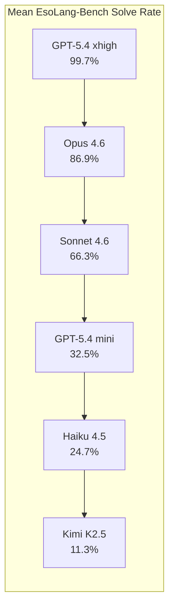
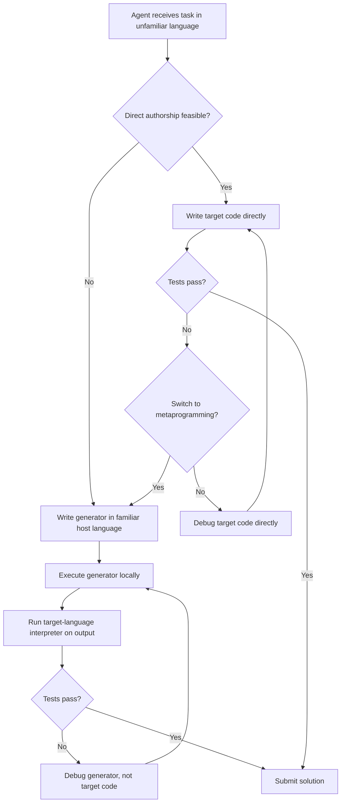

# The Metaprogramming Reflex: What Frontier Coding Agents' Unfamiliar-Language Adaptation Means for Codex CLI Strategy


---

Mainstream coding benchmarks are poor discriminators. On SWE-bench Verified, six contemporary coding agents cluster between 73% and 80% — a standard deviation of just 2.9 percentage points[^1]. Move those same agents to languages they have barely seen in training, and the spread explodes to 36.0 — roughly twelve times wider[^1]. That is the headline finding from Sharma, Thorat, and Chopra's EsoLang-Bench study (arXiv:2606.10933, 9 June 2026), which evaluated six agents across four esoteric programming languages and surfaced a striking behavioural pattern: the strongest agents do not write unfamiliar code directly. They write generators in a familiar language and debug those instead[^1]. This article unpacks the mechanism, its causal validation, and what it implies for Codex CLI configuration — from AGENTS.md scaffolding directives to named profile routing and helper-library provisioning.

## The Evaluation Setup

EsoLang-Bench presents 80 problems per language across four difficulty tiers, evaluated under a sequential protocol: file editing, unlimited local interpreter calls, and up to three hidden-test submissions per problem in an isolated workspace[^1].

The four languages were chosen to span a spectrum of unfamiliarity:

| Language | Character | Why It Separates Agents |
|---|---|---|
| **Whitespace** | Invisible syntax (spaces, tabs, linefeeds) | Parsing is trivial once tokenised, but visual editing is impossible |
| **Shakespeare** | Natural-language theatrical form | Requires mapping iambic structure to stack operations |
| **Befunge-98** | Two-dimensional grid with stack-based control flow | Spatial reasoning plus instruction-pointer direction changes |
| **Brainfuck** | Eight-command pointer machine on a 30,000-cell tape | Minimal syntax, maximal distance from high-level abstractions |

Six agents were tested: Claude Opus 4.6, Sonnet 4.6, Haiku 4.5, GPT-5.4 xhigh, GPT-5.4 mini, and Kimi K2.5[^1].

## Results: The Capability Cliff



GPT-5.4 xhigh solved 99.7% of problems across all four languages. Kimi K2.5 managed 11.3%[^1]. No mainstream benchmark produces anything close to this separation. The gap is driven almost entirely by what happens on Brainfuck and Befunge-98, where direct authorship in the target language becomes fragile.

### Per-Language Breakdown

| Agent | Whitespace | Shakespeare | Befunge-98 | Brainfuck |
|---|---|---|---|---|
| GPT-5.4 xhigh | 100% | 100% | 100% | 98.8% |
| Opus 4.6 | 100% | 87.5% | 80% | 80% |
| Sonnet 4.6 | 100% | 70% | 80% | 15% |
| GPT-5.4 mini | 88.8% | 21.3% | 13.8% | 6.3% |
| Haiku 4.5 | 81.3% | 7.5% | 5% | 5% |
| Kimi K2.5 | 31.3% | 2.5% | 6.3% | 5% |

Whitespace is the leveller — most agents handle its tokenisation trick. Brainfuck is the cliff[^1].

## The Metaprogramming Reflex

The study's core discovery is that strong agents spontaneously adopt a *metaprogramming* strategy when direct authorship fails[^1]. On Brainfuck problem E04, for example, Claude Opus 4.6 first submitted an 1,884-byte direct Brainfuck program that failed hidden tests. It then, without instruction, switched to writing a Python generator that produced 24,500 bytes of Brainfuck — and passed every test[^1].

The pattern is consistent across both Opus and GPT-5.4 xhigh: when the target language is too low-level for reliable direct editing, these agents build intermediate abstractions in a familiar host language, use local execution to verify output, and iterate the generator rather than the target code[^1].



## Causal Validation: Forbidding Metaprogramming

To confirm this is not merely correlation, the researchers ran ablation experiments that forced direct authorship only — no generator scripts allowed[^1].

The performance collapse is dramatic:

| Agent | Brainfuck (unrestricted) | Brainfuck (direct only) | Befunge-98 (unrestricted) | Befunge-98 (direct only) |
|---|---|---|---|---|
| Opus 4.6 | 64/80 | 27/80 | — | — |
| GPT-5.4 xhigh | 80/80 | 29/80 | — | — |

Opus lost 58% of its Brainfuck solutions. GPT-5.4 xhigh lost 64%[^1]. Metaprogramming is not a nice-to-have — it is the dominant mechanism for high performance on low-level target languages.

### Host Language Is Fungible

The benefit transfers across host languages. Opus achieved 63/80 with JavaScript generators and 55/80 with Rust generators, compared to 27/80 under direct authorship[^1]. The key is having *any* familiar general-purpose language available — Python is conventional, not special.

## Strategy Transfer: Code Beats Prose

A second experiment tested whether weaker agents could inherit the metaprogramming strategy[^1]:

- **Text-only guidance** (natural-language descriptions of the generator approach): minimal improvement for mid-tier agents
- **Executable helper libraries** (cell allocators, BCD arithmetic routines, printing primitives): dramatic gains

With a reference library for Brainfuck, Sonnet 4.6 jumped from 12 to 64 solved problems. GPT-5.4 mini jumped from 5 to 53[^1]. Haiku 4.5, however, barely moved — from 4 to 7[^1]. The pattern is clear: code scaffolding amplifies existing capability, but cannot create it from nothing.

## Token Efficiency and the Strategy Discovery Premium

Opus 4.6 solved more Brainfuck and Befunge-98 problems while consuming approximately half the output tokens Sonnet 4.6 required[^1]. This suggests that the performance gap stems from *early strategy discovery* — recognising the metaprogramming opportunity quickly rather than burning tokens on failed direct attempts — not from raw computational expenditure.

## Implications for Codex CLI

### AGENTS.md as a Generator Scaffold Directive

The study's most actionable finding for practitioners is that code scaffolding transfers strategy far more effectively than prose instructions[^1]. This maps directly to AGENTS.md authoring patterns:

```markdown
## Unfamiliar Language Work

When working with low-level, esoteric, or unfamiliar target languages:
1. Prefer writing a generator in Python (or another familiar language) that produces target-language code
2. Use local execution to verify generator output before submitting
3. Build reusable helper libraries (allocators, I/O primitives) rather than writing everything inline
4. Debug the generator, not the target code
```

Crucially, this directive should be accompanied by actual helper code — a `helpers/` directory with language-specific primitives that the agent can import[^2]. Prose alone showed negligible transfer in the study; executable scaffolding drove the gains[^1].

### Named Profiles for Language-Specific Routing

Codex CLI's named profile system allows different model configurations per task type[^3]. The EsoLang-Bench results suggest a routing strategy:

```toml
# ~/.codex/config.toml

[profile.esolang]
model = "gpt-5.4"
model_reasoning_effort = "xhigh"
# Budget for unfamiliar-language generator iteration
rollout_budget = 200000

[profile.mainstream]
model = "gpt-5.4-mini"
model_reasoning_effort = "medium"
rollout_budget = 50000
```

GPT-5.4 mini scored 32.5% mean on EsoLang-Bench versus 99.7% for xhigh — a 3× gap that dwarfs anything visible on mainstream benchmarks[^1]. For genuinely unfamiliar codebases (legacy COBOL migrations, DSL work, embedded assembly), routing to a stronger model with higher reasoning effort pays for itself.

### PostToolUse Hooks as Generator Verification Gates

The metaprogramming loop — generate, execute, verify, iterate — maps naturally to Codex CLI's hook system[^4]. A PostToolUse hook can verify that generator output conforms to target-language constraints before the agent proceeds:

```bash
#!/bin/bash
# .codex/hooks/post-tool-use-generator-check.sh
# Verify generated target code is syntactically valid

if [[ "$CODEX_TOOL_NAME" == "write" && "$CODEX_FILE_PATH" == *.bf ]]; then
  # Check that generated Brainfuck contains only valid characters
  if grep -qP '[^><+\-\.\,\[\]\n]' "$CODEX_FILE_PATH"; then
    echo "REJECT: Generated Brainfuck contains invalid characters"
    exit 1
  fi
fi
```

This provides a mechanical safety net that catches malformed generator output before hidden-test submissions are consumed[^4].

### The Capability Threshold Warning

The study's most sobering finding is the floor effect: Haiku 4.5 gained almost nothing from helper libraries (4 → 7 on Brainfuck), while Sonnet 4.6 gained 5× (12 → 64)[^1]. Additional resources — whether compute, code scaffolding, or strategic guidance — amplify existing capability but cannot substitute for it. For Codex CLI practitioners, this means AGENTS.md scaffolding and helper libraries are high-leverage investments only when paired with a sufficiently capable model. Routing a weak model to a hard task with excellent scaffolding still produces poor results.

## Broader Significance: Benchmarks That Actually Separate

EsoLang-Bench's 12× wider spread compared to SWE-bench Verified has implications beyond esoteric languages[^1]. It demonstrates that the most revealing evaluation axis for coding agents is not "can it fix a bug in a Python repository?" but "how does it behave when its training distribution provides minimal coverage?". Every production codebase contains pockets of unfamiliarity — legacy modules, auto-generated code, domain-specific languages, configuration formats with non-obvious semantics.

The metaprogramming reflex is not a party trick for Brainfuck. It is a proxy for a general capability: the ability to reorganise an unfamiliar problem into familiar shapes, build intermediate abstractions, and iterate through execution feedback[^5]. Agents that do this well will handle your legacy FORTRAN migration, your Terraform module generation, and your protobuf schema evolution. Agents that cannot will fail silently, burning tokens on direct authorship that never converges.

## Citations

[^1]: Sharma, A., Thorat, S., and Chopra, P. (2026). "Frontier Coding Agents Use Metaprogramming to Adapt to Unfamiliar Programming Languages." *arXiv preprint arXiv:2606.10933*. [https://arxiv.org/abs/2606.10933](https://arxiv.org/abs/2606.10933)

[^2]: OpenAI. (2026). "Custom instructions with AGENTS.md — Codex." *OpenAI Developers*. [https://developers.openai.com/codex/guides/agents-md](https://developers.openai.com/codex/guides/agents-md)

[^3]: OpenAI. (2026). "Configuration Reference — Codex." *OpenAI Developers*. [https://developers.openai.com/codex/config-reference](https://developers.openai.com/codex/config-reference)

[^4]: OpenAI. (2026). "Features — Codex CLI." *OpenAI Developers*. [https://developers.openai.com/codex/cli/features](https://developers.openai.com/codex/cli/features)

[^5]: "The Metaprogramming Reflex: How the Best Coding Agents Survive Languages They've Never Seen." *LossFunk Letters*. [https://letters.lossfunk.com/p/the-metaprogramming-reflex-how-the](https://letters.lossfunk.com/p/the-metaprogramming-reflex-how-the)
