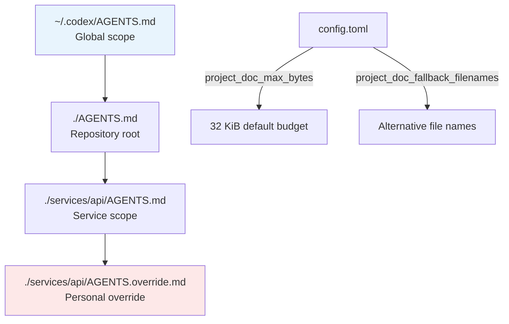
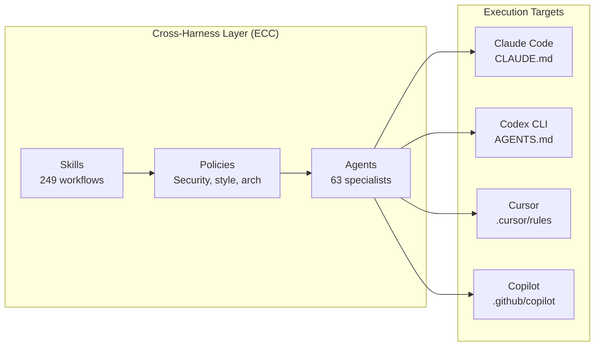

# Natural-Language Agent Harnesses: What NLAH Research, OpenAI's Harness Engineering, and Cross-Agent Portability Mean for Codex CLI AGENTS.md


---

Every coding agent ships with an orchestration layer — the harness — that controls how the model loops, which tools it can call, when it hands off to subagents, and how it validates its own output. Until recently, this logic lived in tightly coupled controller code: Python scripts, TypeScript orchestrators, or framework-specific DSLs. Changing harness behaviour meant changing code, redeploying, and hoping the new version did not break the implicit contracts the old one enforced.

A March 2026 paper from Tsinghua University formalised what Codex CLI's AGENTS.md had already been doing informally: encoding harness logic as natural-language documents that a runtime interprets at execution time [^1]. The implications for how senior developers structure their agent configurations are significant — and the ecosystem is already responding.

## The NLAH Paper: Harness Logic as a Document

Pan et al. introduced **Natural-Language Agent Harnesses (NLAHs)** — editable documents that describe run-level harness policy — and the **Intelligent Harness Runtime (IHR)**, a shared runtime that interprets these documents into agent calls, handoffs, state updates, validation gates, and artifact contracts [^1].

The core insight is that the reusable design pattern of an agent harness can be represented as an executable natural-language object. Rather than encoding orchestration logic in code, you write a structured document describing what the agent should do, and a runtime interprets it.

### Quantitative Results

The results across three benchmark domains validated the approach:

- **SWE-bench Verified** (125 samples): IHR-executed NLAHs achieved **74.4%** resolve rate, comparable to code-based harnesses [^1]
- **OS-Symphony** (36 samples): NLAH harnesses scored **47.2%** versus the native code harness at **30.4%** — a **55% relative improvement** whilst reducing runtime from 361.5 minutes to 140.8 minutes [^1]
- **Module ablation** showed self-evolution as the strongest contributor (+4.8pp on SWE-bench Verified), whilst multi-candidate search actually degraded performance (-2.4pp) [^1]

The runtime distribution is telling: parent orchestration consumed only **8.5% of prompt tokens** and **9.8% of tool calls**, with delegated children handling the rest [^1]. The harness document acts as a lightweight control plane, not a bottleneck.

## OpenAI's Own Validation: Harness Engineering in Practice

OpenAI's harness engineering blog post, published alongside the Codex agent loop documentation, arrived at strikingly similar conclusions from the practitioner side [^2].

The key lesson: the "one big AGENTS.md" approach fails because context is a scarce resource. A giant instruction file crowds out the task, the code, and the relevant documentation — so the agent either misses key constraints or starts optimising for the wrong ones [^2].

OpenAI's internal experiment ran for five months with three engineers. Every line of code — application logic, tests, CI configuration, documentation, observability — was written by Codex. They estimate they built it in roughly one-tenth the time it would have taken manually [^2]. The harness that made this possible followed three principles:

1. **Map, not manual** — AGENTS.md stays under ~100 lines and serves as a table of contents pointing to deeper sources of truth [^2]
2. **Enforce quality with mechanisms, not prompts** — custom linters and structural tests enforce architectural constraints mechanically rather than hoping the model follows instructions [^2]
3. **Progressive disclosure** — the agent starts with a small, stable entry point and is taught where to look next [^2]

## AGENTS.md as a Natural-Language Harness

Codex CLI's AGENTS.md system is, in NLAH terminology, a hierarchical natural-language harness with directory-scoped override semantics. The runtime mechanics map directly:



The discovery order matters: at each directory level, Codex checks for `AGENTS.override.md` first, then `AGENTS.md`, then any fallback names configured in `project_doc_fallback_filenames` [^3]. Files closer to the working directory appear later in the combined prompt, giving them effective override priority [^3]. An `AGENTS.override.md` at any level replaces — not supplements — the `AGENTS.md` at that scope [^3].

### Configuration Knobs

```toml
# ~/.codex/config.toml
project_doc_max_bytes = 65536          # Raise from 32 KiB default
project_doc_fallback_filenames = [
  "TEAM_GUIDE.md",
  ".agents.md"
]
```

The `project_doc_max_bytes` limit is the budget constraint that makes progressive disclosure necessary. At the default 32 KiB, a repository with global, root, and two nested AGENTS.md files has roughly 8 KiB per file before truncation silently drops content [^4]. Raising to 64 KiB helps, but the OpenAI lesson holds: keep individual files lean and point to external documentation rather than inlining it [^2].

## The Cross-Harness Problem

Natural-language harnesses solve a problem that code-based harnesses cannot: **portability across agents**. A team using Codex CLI, Claude Code, Cursor, and GitHub Copilot simultaneously — increasingly common in 2026 — faces four different configuration formats, four different override semantics, and four sets of implicit assumptions about tool availability.

### ECC: The Cross-Harness Framework

The **Everything Claude Code (ECC)** project, which grew from a February 2026 hackathon to over 200,000 GitHub stars, addresses this directly [^5]. ECC provides a cross-harness operational layer that unifies agent configurations into a single modular framework with support for Claude Code, Cursor, Codex, OpenCode, GitHub Copilot, Zed, and Gemini CLI [^5].

ECC packages 63 specialised agents with scoped responsibilities (planner, architect, security-reviewer, build-resolver), 249 workflow skills across 12+ ecosystems, and an AgentShield security auditing system with 1,282 tests [^5]. The key architectural choice is that ECC is not a replacement for any individual agent — it is an operational layer that sits above them, ensuring agents, skills, rules, and security policies behave consistently regardless of which tool executes them [^5].



This is the NLAH paper's thesis made practical: if harness logic is natural language rather than code, it can be interpreted by any runtime that understands the document format.

## From NLAH Theory to AGENTS.md Practice

The NLAH module ablation results translate into concrete AGENTS.md authoring advice:

### Self-Evolution: The Strongest Module

The ablation showed self-evolution contributing +4.8pp on SWE-bench Verified [^1]. In Codex CLI terms, this means enabling the agent to refine its own approach within a session. Practically, this maps to:

- **PostToolUse hooks** that log tool-call outcomes and feed them back as context for subsequent decisions [^6]
- **Goal Mode** sessions where the agent can adjust its strategy based on intermediate results without losing the overarching objective [^7]
- **`codex exec`** loops that capture session transcripts and feed them into AGENTS.md refinement cycles [^6]

### File-Backed State: The Reliability Lever

File-backed state added +1.6pp on SWE-bench and +5.5pp on OSWorld [^1]. For Codex CLI, this validates the pattern of using workspace files as persistent state rather than relying solely on conversation context:

```markdown
<!-- In AGENTS.md -->
## Working State

- Track progress in `docs/agent-state.md`
- Record architectural decisions in `docs/adr/`
- Log failed approaches in `docs/dead-ends.md`
```

### Multi-Candidate Search: The Surprising Negative

Multi-candidate search — generating multiple solution candidates and selecting the best — actually degraded performance by -2.4pp on SWE-bench and -5.6pp on OSWorld [^1]. This suggests that for repository-level coding tasks, a single focused attempt with good harness guidance outperforms parallel exploration. The practical implication: resist the temptation to configure subagents for speculative parallel approaches when a well-guided single pass is more effective.

## The Verifier Paradox

The NLAH ablation revealed something counterintuitive: adding a verifier module reduced performance on OSWorld by -8.4pp [^1]. This mirrors a pattern Codex CLI users encounter — overly aggressive verification steps in hooks can slow the agent loop and introduce false negatives that derail productive work.

The lesson is not that verification is bad, but that verification placement matters. The OpenAI harness engineering approach addresses this by making verification mechanical (linters, type checkers, test suites) rather than LLM-driven [^2]. In Codex CLI, this translates to:

```toml
# Mechanical verification in hooks, not LLM-driven verification
[hooks.PostToolUse]
command = "npm run lint -- --quiet"
on_fail = "warn"  # Don't block, just inform
```

## Implications for Team Configuration

The convergence of NLAH theory, OpenAI's harness engineering practice, and cross-harness frameworks like ECC points toward a maturing discipline. For teams using Codex CLI in mid-2026, the actionable takeaways are:

1. **Treat AGENTS.md as a harness document, not a prompt** — it is orchestration logic expressed in natural language, not a wish list of behaviours
2. **Keep harness policies short** — IHR's parent orchestration consumed only 8.5% of total prompt tokens [^1]; your AGENTS.md should be similarly lightweight
3. **Enforce constraints mechanically** — hooks, linters, and structural tests are more reliable than natural-language instructions for hard constraints [^2]
4. **Use file-backed state** — the +5.5pp improvement on OSWorld validates persisting agent progress to workspace files [^1]
5. **Be cautious with verification loops** — mechanical verification (tests, linting) outperforms LLM-driven verification in harness configurations [^1]
6. **Plan for cross-agent portability** — if your team uses multiple agents, natural-language harness documents are inherently more portable than agent-specific configuration formats [^5]

The research validates what the Codex CLI community has been discovering empirically: the quality of the harness document matters more than the sophistication of the harness runtime. A well-structured 100-line AGENTS.md interpreted by a competent runtime outperforms a complex code-based orchestrator with poor documentation — and it transfers across agents, which code-based harnesses never will.

## Citations

[^1]: Pan, L., Zou, L., Guo, S., Ni, J. & Zheng, H.-T. (2026). "Natural-Language Agent Harnesses." *arXiv:2603.25723v2*. [https://arxiv.org/abs/2603.25723](https://arxiv.org/abs/2603.25723)

[^2]: OpenAI. (2026). "Harness engineering: leveraging Codex in an agent-first world." [https://openai.com/index/harness-engineering/](https://openai.com/index/harness-engineering/)

[^3]: OpenAI Developers. (2026). "Custom instructions with AGENTS.md." [https://developers.openai.com/codex/guides/agents-md](https://developers.openai.com/codex/guides/agents-md)

[^4]: openai/codex Issue #7138. "AGENTS.md is silently truncated without any warning within the TUI." [https://github.com/openai/codex/issues/7138](https://github.com/openai/codex/issues/7138)

[^5]: affaan-m/ECC. (2026). "The agent harness performance optimization system." GitHub. [https://github.com/affaan-m/ECC](https://github.com/affaan-m/ECC)

[^6]: OpenAI Developers. (2026). "Changelog – Codex." [https://developers.openai.com/codex/changelog](https://developers.openai.com/codex/changelog)

[^7]: OpenAI Developers. (2026). "Features – Codex CLI." [https://developers.openai.com/codex/cli/features](https://developers.openai.com/codex/cli/features)
