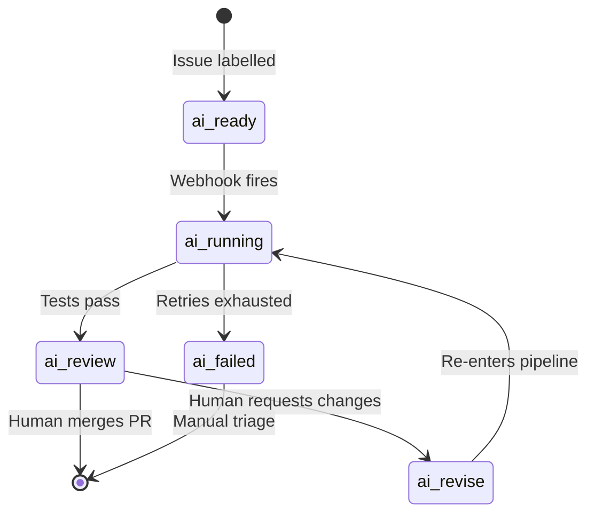
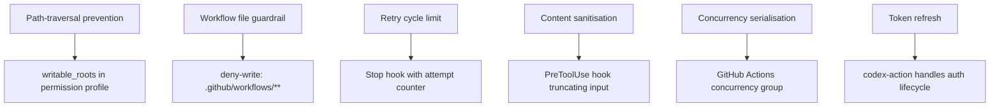

# Phoenix and Safe Issue Resolution: What Multi-Agent Safety Controls Mean for Codex CLI Automation Pipelines


---

Most teams deploying Codex CLI as a GitHub issue-resolution agent eventually discover the same uncomfortable truth: getting the agent to *produce a fix* is the easy part. Getting it to produce a fix that does not silently break something that was already working — and to do so unattended, at webhook speed, across repositories with flaky CI — is an entirely different engineering problem.

Phoenix, a multi-agent system introduced by Koech et al. in June 2026 [^1], tackles this head-on with a six-agent pipeline, seven layered safety controls, and a baseline-aware test evaluation strategy that achieved zero pass-to-pass regressions across both a SWE-bench Lite slice and a 42-issue real-world pilot. This article examines what Phoenix's architecture reveals about safe automated issue resolution, and maps its key design decisions to Codex CLI's own primitives — subagents, hooks, Triggers, and permission profiles.

## The Phoenix Architecture

Phoenix decomposes GitHub issue resolution into six specialised agents coordinated by a label-based webhook state machine [^1]:

| Agent | Responsibility |
|-------|---------------|
| **Planner** | Analyses the issue body, identifies affected files, produces a structured JSON implementation plan |
| **Reproducer** | Generates a failing test demonstrating the bug; non-blocking if unsuccessful |
| **Coder** | Implements changes based on the plan, producing complete file contents with self-verification |
| **Tester** | Executes the test suite, compares results against a baseline run |
| **Failure Analyst** | Analyses test failures, provides targeted feedback for retry attempts (max two rounds) |
| **PR Agent** | Composes and opens a pull request referencing the original issue |

The state machine uses GitHub labels as persistent state: `ai:ready` → `ai:running` → `ai:review` (success) or `ai:failed` (terminal), with an `ai:revise` loop-back state enabling human-in-the-loop refinement [^1].



## The Baseline-Aware Testing Strategy

Phoenix's most important contribution is its approach to test regression detection. Rather than simply running the test suite and checking for green, it implements a five-step baseline comparison [^1]:

1. Stash Phoenix's changes
2. Run the test suite on the unmodified base branch (collect baseline failures)
3. Restore changes and re-run tests (collect post-change failures)
4. Compute the set difference: new failures = post-change failures − baseline failures
5. Correctness preserved if no previously passing tests now fail

This matters because real-world repositories frequently have broken CI pipelines, flaky tests, and pre-existing failures [^2]. A naive "all tests must pass" gate would reject every valid fix in those repositories. Phoenix's baseline strategy achieved 100% correctness preservation across its 42-issue pilot whilst tolerating pre-existing failures [^1].

## Seven Safety Controls — and What They Defend Against

Phoenix identifies seven production hazards and implements a corresponding control for each [^1]:

| Control | Hazard | Mechanism |
|---------|--------|-----------|
| Path-traversal prevention | Malicious issue bodies directing writes outside the repo | Validates all file write paths stay within repository bounds |
| Label-state exclusivity | Stale label accumulation causing duplicate runs | Atomic label replacement on every state transition |
| Workflow file guardrail | Agent modifying CI/CD configuration | Blocks all writes to `.github/workflows/` |
| Content sanitisation | WAF rejection of large/malformed payloads | Truncates issue bodies to 1,500 chars, strips code fences and tracebacks |
| Retry cycle limit | Infinite fix-test-fail loops | Maximum two failure analyst rounds with progress detection |
| Concurrency serialisation | Race conditions on shared clone | Per-installation lock preventing parallel execution |
| Token refresh | GitHub App token expiry mid-pipeline | Proactive refresh before token lifetime expires |

These are not theoretical concerns. The authors report encountering every one of these failure modes during deployment [^1].

## Mapping Phoenix to Codex CLI Primitives

Phoenix was built as a standalone system, but its architecture maps remarkably cleanly onto Codex CLI's existing feature surface. Here is how a team could replicate — and in some cases improve upon — Phoenix's design using Codex CLI v0.141+ [^3].

### Agent Decomposition → Codex Subagents

Phoenix's six-agent pipeline mirrors Codex CLI's subagent architecture [^4]. Each Phoenix agent maps to a subagent definition in TOML:

```toml
# ~/.codex/agents/issue-reproducer.toml
name = "reproducer"
model = "o4-mini"
instructions = """
Given the issue description, write a minimal failing test
that demonstrates the bug. Output the test file path and content.
Do not attempt to fix the bug.
"""
sandbox_mode = "read-only"
```

Codex CLI supports up to six concurrent subagents [^4], matching Phoenix's agent count exactly. The key advantage is isolation: each subagent gets its own context window and sandbox, preventing the planner's reasoning from polluting the coder's implementation context.

### Baseline Testing → PostToolUse Hook

Phoenix's baseline-aware test strategy can be implemented as a PostToolUse hook that captures pre-change test state before the agent begins work:

```bash
#!/bin/bash
# hooks/post-tool-use-baseline-test.sh
# Runs after any apply_patch tool call

if [[ "$CODEX_TOOL_NAME" == "apply_patch" ]]; then
  # Stash agent changes
  git stash push -q -m "phoenix-baseline-check"

  # Run baseline tests, capture failures
  pytest --tb=no -q 2>/dev/null | grep "FAILED" | sort > /tmp/baseline-failures.txt

  # Restore agent changes
  git stash pop -q

  # Run post-change tests
  pytest --tb=no -q 2>/dev/null | grep "FAILED" | sort > /tmp/post-change-failures.txt

  # Compute new failures (set difference)
  NEW_FAILURES=$(comm -13 /tmp/baseline-failures.txt /tmp/post-change-failures.txt)

  if [[ -n "$NEW_FAILURES" ]]; then
    echo "REGRESSION DETECTED: $NEW_FAILURES" >&2
    exit 1  # Reject the tool call
  fi
fi
```

This is more granular than Phoenix's approach: rather than testing once at the end of the pipeline, the hook runs after every patch application, catching regressions incrementally [^5].

### Webhook State Machine → Codex Triggers

Phoenix's label-based state machine maps directly to Codex Triggers — the event-driven GitHub automation feature shipped in March 2026 [^6]. A Trigger fires on a GitHub webhook event and runs `codex exec` with the issue context:


```yaml
# .github/workflows/phoenix-resolve.yml
name: Issue Resolution
on:
  issues:
    types: [labeled]

jobs:
  resolve:
    if: github.event.label.name == 'ai:ready'
    runs-on: ubuntu-latest
    steps:
      - uses: actions/checkout@v4
      - uses: openai/codex-action@v1
        with:
          codex-args: >
            exec --full-auto
            --profile issue-resolver
            "Resolve issue #${{ github.event.issue.number }}:
             ${{ github.event.issue.title }}"
        env:
          OPENAI_API_KEY: ${{ secrets.OPENAI_API_KEY }}
```


The label transitions (`ai:ready` → `ai:running` → `ai:review`) can be managed by the `codex exec` wrapper script or a lightweight GitHub Action step that adds and removes labels atomically [^6].

### Safety Controls → Permission Profiles and Hooks

Phoenix's seven safety controls map to Codex CLI's layered defence model:



The permission profile encodes the filesystem constraints:

```toml
# profiles/issue-resolver.config.toml
[permissions]
writable_roots = ["src/", "tests/", "docs/"]

[[permissions.deny]]
path = ".github/workflows/**"
reason = "Agent must not modify CI configuration"

[[permissions.deny]]
path = ".codex/**"
reason = "Agent must not modify its own configuration"
```

The retry cycle limit maps to a Stop hook that tracks attempt counts and enforces a ceiling [^5]:

```bash
#!/bin/bash
# hooks/stop-retry-limit.sh
ATTEMPT_FILE="/tmp/phoenix-attempts"
MAX_ATTEMPTS=3

CURRENT=$(cat "$ATTEMPT_FILE" 2>/dev/null || echo 0)
CURRENT=$((CURRENT + 1))
echo "$CURRENT" > "$ATTEMPT_FILE"

if [[ $CURRENT -ge $MAX_ATTEMPTS ]]; then
  echo "Maximum retry attempts reached. Stopping." >&2
  exit 1
fi
```

## Where Codex CLI Goes Further

Phoenix's architecture has instructive limitations that Codex CLI's primitives can address.

### File Localisation

Phoenix's planner uses lexical keyword matching against filenames, which the authors identify as their primary weakness — approximately 50% of pilot pull requests placed code at invented paths [^1]. Codex CLI's code-mode tools have direct access to the repository via `find`, `grep`, and AST-aware search, giving the planner agent richer localisation signals [^3]. Additionally, MCP servers like Context7 [^7] provide semantic search over the repository structure.

### Parallel Execution

Phoenix serialises all work through a per-installation lock. Codex CLI's subagent model with git worktree isolation enables parallel execution across multiple issues without conflict [^4], dramatically improving throughput for teams with high issue volumes.

### Progressive Safety

Phoenix applies all seven safety controls uniformly. Codex CLI's named permission profiles [^8] enable progressive safety tiers — a `low-risk` profile for documentation fixes with broader write access, and a `high-risk` profile for core code changes with tighter constraints and mandatory human approval gates.

## Performance Context

Phoenix reports 75% oracle resolution on a 24-instance SWE-bench Lite slice with 170-second mean resolution time, and 100% correctness preservation across 42 real-world issues with 122-second mean resolution on hard-tier problems [^1]. These numbers are promising but come with caveats the authors acknowledge: the SWE-bench slice is curated and not directly comparable to leaderboard results, and no single-agent baseline comparison is provided [^1].

For Codex CLI teams, the more actionable metric is correctness preservation. The baseline-aware testing strategy is what enables zero regressions, and that strategy is reproducible with PostToolUse hooks regardless of the underlying agent architecture.

## AGENTS.md Directives for Safe Issue Resolution

Teams implementing Phoenix-style pipelines with Codex CLI should encode the safety invariants in AGENTS.md:

```markdown
## Issue Resolution Safety Rules

1. NEVER modify files under `.github/workflows/`
2. ALWAYS run the existing test suite before and after changes
3. NEVER modify existing test assertions unless the issue explicitly requires it
4. If tests fail after your changes that were passing before, revert and try a different approach
5. Maximum 3 implementation attempts per issue — if all fail, report the failure clearly
6. NEVER write files outside the repository root
7. Include the issue number in all commit messages
```

These directives provide the specification anchor that Codex CLI's hooks enforce mechanically [^9].

## Conclusion

Phoenix demonstrates that safe automated issue resolution is an engineering problem, not a capability problem. The six-agent decomposition, baseline-aware testing, and seven safety controls represent a mature design pattern that Codex CLI teams can adopt today using subagents, PostToolUse hooks, Triggers, and permission profiles. The key insight is that correctness preservation — not resolution rate — is the metric that determines whether an automated issue-resolution pipeline earns trust in production.

---

## Citations

[^1]: Koech, K., Adam, M., Jean Jacques, B.B., & Barros, J. (2026). "Phoenix: Safe GitHub Issue Resolution via Multi-Agent LLMs." arXiv:2606.20243. [https://arxiv.org/abs/2606.20243](https://arxiv.org/abs/2606.20243)

[^2]: Gorinova, M. et al. (2026). "Coding Benchmarks and the Three Feedback Loops of Agentic Software Engineering." arXiv:2606.17799. [https://arxiv.org/abs/2606.17799](https://arxiv.org/abs/2606.17799)

[^3]: OpenAI. (2026). "Codex CLI Documentation." [https://developers.openai.com/codex/cli](https://developers.openai.com/codex/cli)

[^4]: OpenAI. (2026). "Codex CLI Features — Subagents." [https://developers.openai.com/codex/cli/features](https://developers.openai.com/codex/cli/features)

[^5]: OpenAI. (2026). "Codex Hooks Documentation." [https://developers.openai.com/codex/hooks](https://developers.openai.com/codex/hooks)

[^6]: OpenAI. (2026). "Codex GitHub Action." [https://developers.openai.com/codex/github-action](https://developers.openai.com/codex/github-action)

[^7]: Vaughan, D. (2026). "Documentation MCP Servers for Codex CLI: Context7, Repomix, and Live Library Lookups." [https://codex.danielvaughan.com/2026/04/30/codex-cli-documentation-mcp-servers-context7-live-library-lookups/](https://codex.danielvaughan.com/2026/04/30/codex-cli-documentation-mcp-servers-context7-live-library-lookups/)

[^8]: OpenAI. (2026). "Agent Approvals & Security." [https://developers.openai.com/codex/agent-approvals-security](https://developers.openai.com/codex/agent-approvals-security)

[^9]: OpenAI. (2026). "Custom Instructions with AGENTS.md." [https://developers.openai.com/codex/guides/agents-md](https://developers.openai.com/codex/guides/agents-md)
