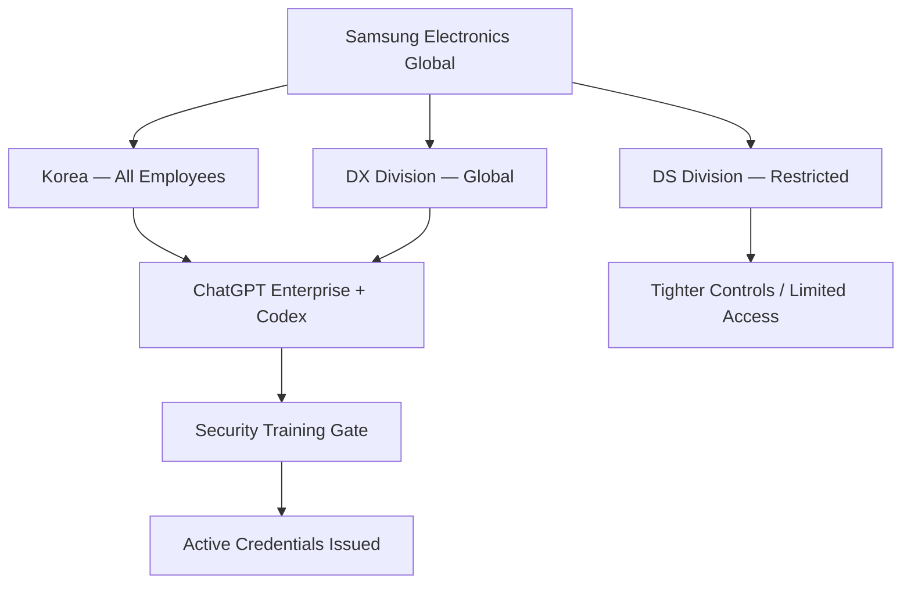
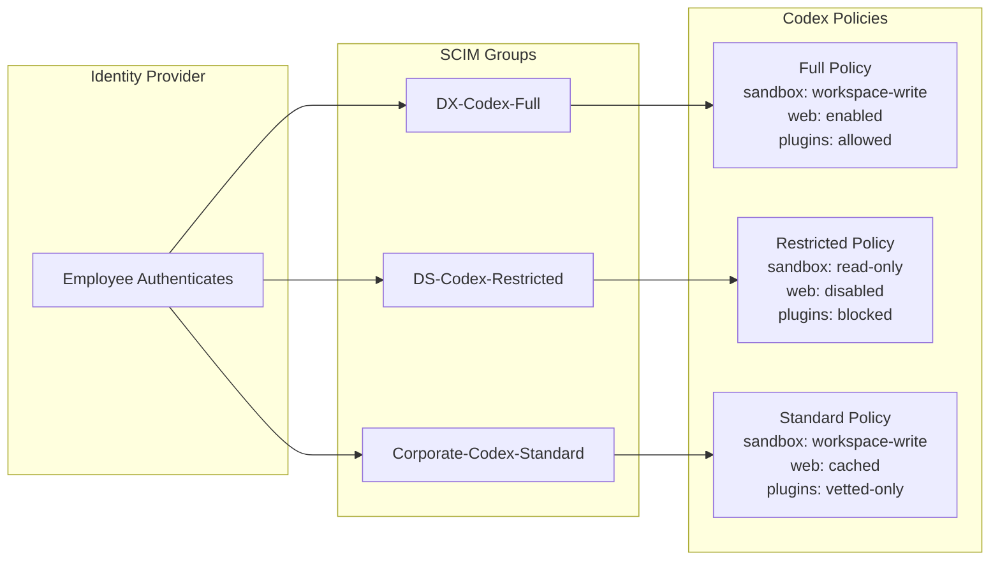

# From Ban to Platform: What Samsung's Codex Enterprise Deployment Teaches About Large-Scale Agent Governance


---

On 21 June 2026, Samsung Electronics announced the global rollout of ChatGPT Enterprise and Codex to all employees in South Korea and all staff worldwide in its Device eXperience (DX) division[^1]. OpenAI described it as "one of OpenAI's largest enterprise AI deployments to date"[^2]. The announcement is remarkable not for its scale alone, but for the arc it completes: three years earlier, Samsung banned generative AI tools entirely after engineers accidentally leaked proprietary source code through ChatGPT[^3].

The reversal offers a case study in enterprise agent governance — one that maps directly onto the configuration surface Codex CLI practitioners manage daily. This article traces the Samsung deployment's governance architecture and extracts the configuration patterns that any team rolling Codex out at scale should consider.

## The 2023 Ban and What It Revealed

In March 2023, Samsung engineers pasted semiconductor source code, internal meeting notes, and test sequences into ChatGPT[^3]. The data reached OpenAI's training pipeline. Samsung's response was a blanket ban covering ChatGPT, Bing Chat, Google Bard, and "any service that uses the technology" on company devices and internal networks[^4].

The ban was blunt but instructive. It revealed two failure modes that enterprise governance must address:

1. **Data exfiltration through prompts** — the user-side risk
2. **Training data incorporation** — the vendor-side risk

ChatGPT Enterprise, launched later in 2023, addressed the second risk contractually: enterprise data is excluded from model training[^5]. But the first risk requires tooling, not contracts. Samsung's 2026 deployment shows how.

## Anatomy of the Samsung Deployment

### Phased Rollout with Competitive Evaluation

Between April and May 2026, Samsung's DX division ran a two-month proof-of-concept with 2,500 employees testing ChatGPT, Gemini, and Claude side by side[^1]. This competitive evaluation preceded vendor selection — a pattern increasingly common in enterprises that refuse to commit to a single provider without empirical evidence.

The POC built a bespoke control system that gates tool access on completion of internal security training[^1]. Only employees who pass the compliance course receive active login credentials.

### Scope and Exclusions

The deployment covers all Korean employees and the global DX division. Notably, Samsung's semiconductor Device Solutions (DS) division remains under tighter restrictions[^2] — a risk-proportionate decision reflecting the sensitivity of chip design IP versus consumer electronics workflows.



### Samsung SDS as Reseller

Samsung SDS, the group's IT services arm, became the first Korean entity authorised to resell and manage ChatGPT Enterprise deployments for other businesses[^6]. This creates an institutional distribution channel — Samsung is not merely consuming Codex but operating as an enterprise deployment partner.

## The Governance Stack Samsung Built

Samsung's deployment addresses four governance layers. Each maps to configuration primitives that Codex CLI exposes through its enterprise admin surface.

### Layer 1: Access Control — Training-Gated Credentials

Samsung requires security compliance training before granting tool access[^1]. In Codex CLI terms, this maps to **RBAC group assignment** gated on identity provider attributes.

The Codex enterprise admin guide recommends creating dedicated groups — a "Codex Users" group and a "Codex Admin" group — backed by SCIM for centralised identity management[^7]. The Samsung pattern extends this: group membership should be conditional on training completion, enforced through the identity provider rather than the Codex admin panel.

```toml
# Codex CLI managed requirements.toml — restrictive baseline
# Deployed via ChatGPT Enterprise admin to the "Standard Users" group

allowed_approval_policies = ["on-request"]
allowed_sandbox_modes = ["workspace-write"]
allowed_web_search_modes = ["disabled", "cached"]

[features]
browser_use = false
computer_use = false
```

### Layer 2: Data Loss Prevention — Prompt Inspection

Samsung built DLP controls that inspect prompts and block sensitive material before it reaches an external model[^2]. This is the mitigation for the 2023 failure mode — catching source code, credentials, and classified data at the prompt boundary.

For Codex CLI, the equivalent defence uses **PreToolUse hooks** to inspect file content before it enters the context window, combined with `.codexignore` rules to exclude sensitive paths entirely:

```bash
#!/usr/bin/env bash
# hooks/pre-tool-use.sh — Block sensitive file patterns
# Triggered before any file read or shell command

TOOL_INPUT="$1"

# Block reads of semiconductor design files
if echo "$TOOL_INPUT" | grep -qE '\.(gds|lef|def|spice|v|sv)$'; then
  echo '{"decision": "block", "reason": "Semiconductor IP file detected"}'
  exit 0
fi

# Block reads of credential stores
if echo "$TOOL_INPUT" | grep -qE '(\.env|credentials|secret|\.pem|\.key)'; then
  echo '{"decision": "block", "reason": "Credential file detected"}'
  exit 0
fi

echo '{"decision": "allow"}'
```

The `.codexignore` file provides the static boundary:

```text
# .codexignore — Samsung-style IP protection
**/semiconductor/**
**/chip-design/**
**/*.gds
**/*.spice
*.env
*.key
*.pem
credentials.json
```

### Layer 3: Policy Segmentation — Division-Level Configuration

Samsung's most instructive decision is the division-level policy split: DX division gets full access while DS division remains restricted[^2]. This maps directly to Codex CLI's **managed policy assignment per group**.

Enterprise admins deploy different `requirements.toml` policies to different RBAC groups. The Codex admin panel provides policy lookup tools to verify which policy applies to a given user or group[^7].



### Layer 4: Observability — Usage Analytics and Compliance Audit

Samsung's deployment at this scale requires continuous monitoring. The Codex enterprise platform provides two complementary APIs[^7]:

- **Analytics API** (`/workspaces/{workspace_id}/usage`) — adoption metrics, token consumption, code review counts
- **Compliance API** (`/compliance/workspaces/{workspace_id}/logs`) — auditable records of every Codex task and environment interaction

For Codex CLI users working locally, the `/usage` command (introduced in v0.140.0[^8]) surfaces daily, weekly, and cumulative token activity within the TUI. Teams can pipe `codex exec` output through logging infrastructure for centralised audit trails.

## What This Means for Codex CLI Practitioners

Samsung's deployment is not merely a procurement story. It encodes governance patterns that apply to any team scaling Codex beyond a handful of early adopters.

### Pattern 1: Competitive POC Before Commitment

Samsung tested three providers (ChatGPT/Codex, Gemini, Claude) with 2,500 staff before selecting[^1]. For Codex CLI teams, this translates to running parallel evaluations with `codex exec --model` against different providers before standardising. The multi-provider configuration in `config.toml` makes this straightforward:

```toml
[providers.openai]
model = "o4-mini"

[providers.bedrock]
model = "anthropic.claude-sonnet-4-20250514"

[providers.azure]
model = "gpt-5.5"
```

### Pattern 2: Training as a Gate, Not a Suggestion

Samsung's mandatory security training before tool access is the organisational equivalent of Codex CLI's `allowed_approval_policies = ["on-request"]` — it forces a deliberate opt-in rather than a default-open posture. Teams should consider requiring AGENTS.md familiarity and sandbox-mode comprehension before granting `suggest` or `auto-edit` approval policies.

### Pattern 3: Risk-Proportionate Division Policies

Not every team handles equally sensitive material. The Samsung DS/DX split demonstrates that policy should follow data sensitivity, not organisational hierarchy. Map your Codex CLI permission profiles to data classification tiers:

| Data Tier | Permission Profile | Approval Policy | Web Search |
|---|---|---|---|
| Public code | `workspace-write` | `auto-edit` | `enabled` |
| Internal tools | `workspace-write` | `on-request` | `cached` |
| Regulated / IP | `read-only` | `on-request` | `disabled` |

### Pattern 4: DLP at the Prompt Boundary

The Samsung DLP inspection layer — blocking sensitive content before it reaches the model — is the enterprise version of PreToolUse hooks. Every team with sensitive assets should implement prompt-boundary filtering, whether through enterprise DLP products or local hook scripts.

## The Broader Signal

Samsung's journey from ban to platform in three years mirrors the enterprise AI adoption curve playing out across industries. The 800% growth in Korean Codex weekly active users since February 2026[^1] suggests that once governance infrastructure is in place, adoption accelerates rapidly.

Roh Tae-moon, Samsung Electronics' vice chairman, framed the deployment as "fundamentally transforming the way we work" rather than merely introducing tools[^1]. Harrison Kim, OpenAI's Korea general manager, called it "historic," emphasising that Samsung treats AI "as a core platform" rather than limiting it to specific functions[^1].

For Codex CLI practitioners, the lesson is clear: the constraint is rarely the technology. It is the governance architecture around the technology. Samsung spent three years building that architecture. The patterns are now visible. The configuration surface is available. The question for every enterprise team is whether they will build their governance stack deliberately — or discover its absence the hard way, as Samsung did in 2023.

## Citations

[^1]: OpenAI, "Samsung Electronics brings ChatGPT and Codex to employees," openai.com, 21 June 2026. [https://openai.com/index/samsung-electronics-chatgpt-codex-deployment/](https://openai.com/index/samsung-electronics-chatgpt-codex-deployment/)

[^2]: AI Weekly, "Samsung Electronics Brings ChatGPT and Codex to Global Staff," aiweekly.co, 21 June 2026. [https://aiweekly.co/alerts/samsung-electronics-brings-chatgpt-and-codex-to-global-staff](https://aiweekly.co/alerts/samsung-electronics-brings-chatgpt-and-codex-to-global-staff)

[^3]: TechCrunch, "Samsung bans use of generative AI tools like ChatGPT after April internal data leak," techcrunch.com, 2 May 2023. [https://techcrunch.com/2023/05/02/samsung-bans-use-of-generative-ai-tools-like-chatgpt-after-april-internal-data-leak/](https://techcrunch.com/2023/05/02/samsung-bans-use-of-generative-ai-tools-like-chatgpt-after-april-internal-data-leak/)

[^4]: CNBC, "Samsung bans use of AI like ChatGPT for staff after misuse of chatbot," cnbc.com, 2 May 2023. [https://www.cnbc.com/2023/05/02/samsung-bans-use-of-ai-like-chatgpt-for-staff-after-misuse-of-chatbot.html](https://www.cnbc.com/2023/05/02/samsung-bans-use-of-ai-like-chatgpt-for-staff-after-misuse-of-chatbot.html)

[^5]: OpenAI, "Introducing ChatGPT Enterprise," openai.com, 28 August 2023. [https://openai.com/index/introducing-chatgpt-enterprise/](https://openai.com/index/introducing-chatgpt-enterprise/)

[^6]: CryptoBriefing, "Samsung Electronics deploys ChatGPT Enterprise and Codex globally," cryptobriefing.com, 12 June 2026. [https://cryptobriefing.com/samsung-chatgpt-enterprise-codex-deployment/](https://cryptobriefing.com/samsung-chatgpt-enterprise-codex-deployment/)

[^7]: OpenAI, "Admin Setup — Codex Enterprise," developers.openai.com, 2026. [https://developers.openai.com/codex/enterprise/admin-setup](https://developers.openai.com/codex/enterprise/admin-setup)

[^8]: Releasebot, "Codex Updates by OpenAI — June 2026," releasebot.io, June 2026. [https://releasebot.io/updates/openai/codex](https://releasebot.io/updates/openai/codex)
