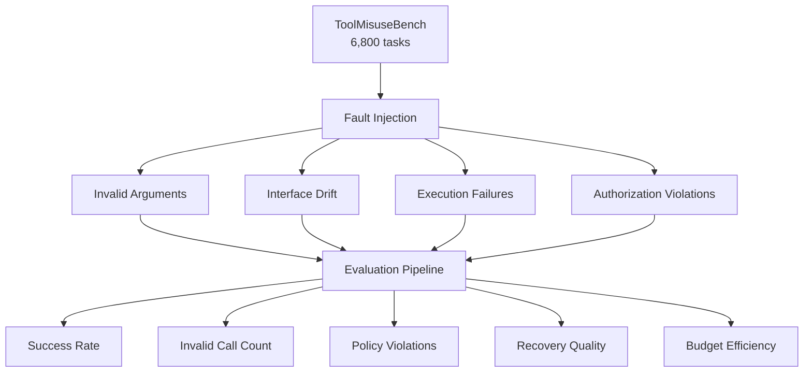
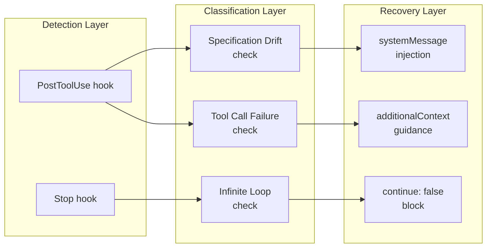
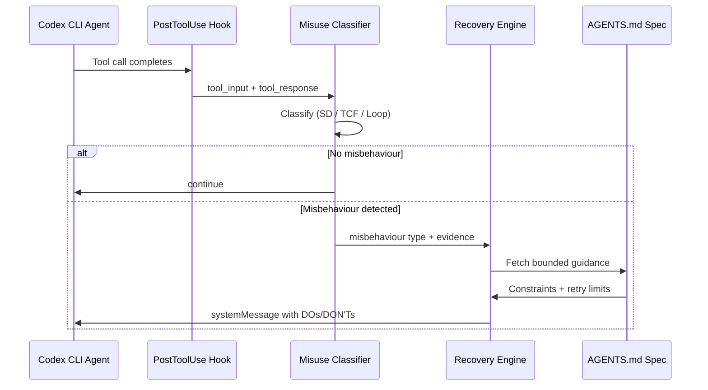

# Tool Misuse and Recovery in Coding Agents: What Wink, ToolMisuseBench, and PROBE Mean for Codex CLI Self-Intervention


---

Coding agents fail. Not because they cannot reason about code — they can — but because they misuse the tools they reason through. Invalid arguments, loops that never terminate, edits drifting from the user's specification: these operational failures account for roughly 30% of all agent trajectories in production environments [^1]. Three recent research contributions — Wink, ToolMisuseBench, and PROBE — offer complementary frameworks for detecting, benchmarking, and recovering from these failures. Each maps directly onto Codex CLI's hook architecture, giving practitioners a structured path from research insight to production resilience.

## The Scale of the Problem

Nanda et al. at Microsoft analysed over 10,000 real-world coding agent trajectories and found that 29% exhibited at least one misbehaviour [^1]. Their taxonomy splits failures into three categories:

| Category | Subcategory | Prevalence |
|---|---|---|
| **Specification Drift** | Did Not Follow Instructions (DNF) | 15.95% |
| | Unrequested Changes (UC) | 6.62% |
| **Reasoning Problems** | Infinite Loops | 5.21% |
| **Tool Call Failures** | Malformed/invalid parameters | 14.02% |

The numbers are striking: agents that can generate sophisticated patches still pass malformed arguments to their own tools 14% of the time [^1]. Specification drift — where the agent silently abandons what the user asked for — is even more prevalent, affecting nearly 16% of trajectories [^1].

## Wink: Asynchronous Self-Intervention at Scale

Wink is a lightweight, asynchronous monitoring system that observes agent trajectories and injects course-correction guidance when misbehaviour is detected [^1]. The design makes three architectural choices worth studying:

### 1. Asynchronous Detection

Wink runs LLM-based binary classifiers at fixed intervals (every *k* = 5 steps) rather than gating every tool call [^1]. This keeps the critical path fast — the agent never blocks waiting for a safety check.

### 2. Typed Guidance Injection

When a misbehaviour is detected, Wink generates plain-text guidance — structured as DOs and DON'Ts — and injects it via system-reminder XML tags invisible to the end user [^1]. The agent receives course-correction without the conversation history being polluted.

### 3. Production-Validated Results

A 15-day A/B test with 50/50 traffic split demonstrated [^1]:

- **90.93%** recovery rate for single-intervention misbehaviours
- **5.3%** reduction in tokens per session (*p* = 0.003)
- **4.2%** reduction in engineer interventions per session (*p* = 0.014)
- Shadow-mode misbehaviour rate fell from 18.61% to 15.14% (*p* < 0.00001)

The token reduction is the quiet headline: self-intervention does not just fix errors, it shortens sessions by preventing the cascading waste that follows an undetected misbehaviour.

## ToolMisuseBench: Deterministic Fault Injection

Where Wink provides the intervention system, ToolMisuseBench from Sigdel and Baral provides the evaluation framework [^2]. The benchmark covers 6,800 tasks across four environment types — CRUD operations, retrieval systems, file handling, and scheduling — with deterministic, replayable fault injection [^2].



Three design decisions make ToolMisuseBench particularly useful for Codex CLI practitioners:

1. **Explicit budgets**: every task carries step, call, and retry limits [^2]. This mirrors real-world constraints where unbounded retries are unacceptable — and maps directly to Codex CLI's `timeout` configuration on hooks [^3].

2. **Interface drift scenarios**: tools change their API between invocations [^2]. This simulates the reality of MCP servers being updated independently of the agent, a common failure mode in Codex CLI workflows where MCP servers are managed externally [^4].

3. **Deterministic seeds**: all tasks are synthetic and reproducible [^2], making it possible to regression-test hook configurations against a known fault corpus.

## PROBE: From Telemetry to Bounded Recovery

The third piece of the puzzle comes from Zhao et al., whose PROBE framework (published May 2026, revised June 2026) addresses a gap that neither Wink nor ToolMisuseBench fully covers: translating runtime telemetry into actionable recovery guidance [^5].

PROBE operates through three layers:

1. **Telemetry Layer**: preserves fine-grained runtime signals from the agent's execution environment [^5]
2. **Diagnosis Layer**: fuses cross-signal evidence into grounded diagnoses [^5]
3. **Guidance Gate**: produces diagnosis-derived guidance only when it is evidence-grounded, actionable, and within the scope of agent-side behaviour [^5]

On 257 unresolved cases, PROBE achieved 65.37% top-1 diagnosis accuracy and a 21.79% recovery rate, surpassing baselines by significant margins [^5]. The critical insight: accurate diagnosis alone is insufficient — guidance must be *bounded* so the agent can execute and verify it [^5].

## Mapping to Codex CLI Hooks

Codex CLI's hook architecture provides the primitives needed to implement each of these research patterns. Here is how they align:



### PostToolUse for Tool Call Failure Detection

The `PostToolUse` hook fires after every Bash command, `apply_patch` edit, and MCP tool call [^3]. Its input payload includes both `tool_input` and `tool_response`, giving a detection script everything it needs to classify the call:

```toml
# .codex/config.toml
[[hooks.PostToolUse]]
type = "command"
command = ".codex/scripts/detect-tool-misuse.sh"
timeout = 10
matcher = { tool_name = "Bash" }
statusMessage = "Checking for tool misuse..."
```

The detection script receives JSON on stdin containing the tool's input and response. A lightweight classifier can check for non-zero exit codes, repeated identical commands, or malformed output patterns — the same signals Wink uses at *k* = 5 step intervals [^1].

### Stop Hook for Specification Drift

The `Stop` hook fires when the agent completes a turn [^3]. Its `last_assistant_message` field provides the summary of what the agent believes it accomplished. A specification-drift detector compares this against the original user prompt:

```toml
[[hooks.Stop]]
type = "command"
command = ".codex/scripts/detect-spec-drift.sh"
timeout = 15
statusMessage = "Verifying specification alignment..."
```

Returning `decision: "block"` from the Stop hook creates an automatic continuation prompt [^3] — the Codex CLI equivalent of Wink's guidance injection. The agent receives a course-correction and continues without human intervention.

### AGENTS.md as the Specification Anchor

PROBE's Guidance Gate requires that recovery instructions be bounded and verifiable [^5]. In Codex CLI, the `AGENTS.md` file serves this role: it defines the specification against which drift is measured and the constraints within which recovery must operate [^6].

```markdown
<!-- AGENTS.md -->
## Tool Use Constraints

- NEVER modify files outside the `src/` directory without explicit approval
- ALWAYS run `npm test` after any file edit — if tests fail, revert before proceeding
- MAXIMUM 3 retry attempts for any single tool call before escalating to the user
- If the same command has been run 3 times with identical arguments, STOP and report
```

These directives function as the bounded guidance that PROBE's research shows is necessary for effective recovery [^5]. Without them, a recovery hook can detect a problem but has no specification against which to verify its fix.

### Subagent Hooks for Isolated Investigation

Codex CLI's `SubagentStart` and `SubagentStop` hooks [^3] enable a pattern analogous to PROBE's diagnosis layer. When a PostToolUse hook detects a potential failure, a subagent can be spawned to investigate in isolation:

```toml
[[hooks.SubagentStop]]
type = "command"
command = ".codex/scripts/evaluate-subagent-diagnosis.sh"
matcher = { agent_type = "investigation" }
timeout = 30
```

The `SubagentStop` hook's `continue: false` output asks for another subagent pass [^3], enabling iterative diagnosis without polluting the main agent's context window.

## A Practical Recovery Pipeline

Combining the three research contributions with Codex CLI's hook system yields a four-stage pipeline:



1. **Detect** via PostToolUse and Stop hooks, using the ToolMisuseBench failure taxonomy as a classification schema [^2]
2. **Classify** into Specification Drift, Tool Call Failure, or Reasoning Problem, following Wink's three-category model [^1]
3. **Diagnose** using PROBE's evidence-grounding principle — recovery guidance must cite specific telemetry, not generic advice [^5]
4. **Intervene** through Codex CLI's `systemMessage` injection or `decision: "block"` mechanism [^3]

## Budget-Aware Recovery

ToolMisuseBench's explicit budget constraints [^2] deserve special attention. Codex CLI supports timeout configuration on every hook [^3], but retry budgets must be managed by the hook scripts themselves. A practical pattern:

```bash
#!/usr/bin/env bash
# .codex/scripts/detect-tool-misuse.sh
INPUT=$(cat)
TOOL_NAME=$(echo "$INPUT" | jq -r '.tool_name')
EXIT_CODE=$(echo "$INPUT" | jq -r '.tool_response.exit_code // 0')

# Track retry count via session-scoped state file
STATE_FILE="/tmp/codex-retry-${TOOL_NAME}.count"
COUNT=$(cat "$STATE_FILE" 2>/dev/null || echo 0)

if [ "$EXIT_CODE" != "0" ]; then
  COUNT=$((COUNT + 1))
  echo "$COUNT" > "$STATE_FILE"

  if [ "$COUNT" -ge 3 ]; then
    echo '{"systemMessage": "BUDGET EXCEEDED: This tool has failed 3 times. Stop retrying and report the failure to the user with the error details."}'
  else
    echo "{\"systemMessage\": \"Tool call failed (attempt $COUNT/3). Check the error output and adjust parameters before retrying.\"}"
  fi
else
  echo "0" > "$STATE_FILE"
fi
```

This mirrors ToolMisuseBench's budgeted evaluation [^2] and prevents the infinite retry loops that Wink identifies as 5.21% of all misbehaviours [^1].

## What This Means for Production Codex CLI Deployments

The convergence of these three research contributions points to a clear direction: production coding agents need *structured self-intervention*, not just better prompting. The key takeaways for Codex CLI practitioners:

1. **Hook-based detection is sufficient**: Wink's 90.93% single-intervention recovery rate [^1] was achieved with lightweight classifiers, not heavyweight safety systems. Codex CLI's PostToolUse and Stop hooks provide equivalent intervention points.

2. **Budgets prevent cascading failures**: ToolMisuseBench's explicit step/call/retry limits [^2] should be replicated in every production hook configuration. Unbounded retries are the primary amplifier of token waste.

3. **Specification anchoring is non-negotiable**: PROBE's finding that diagnosis without bounded guidance fails [^5] validates the importance of well-structured AGENTS.md files. Recovery hooks need a specification to recover *towards*.

4. **Asynchronous monitoring beats synchronous gating**: Wink's *k* = 5 interval design [^1] avoids the latency penalty of checking every single tool call. For Codex CLI, this means PostToolUse hooks should be fast (sub-second) and defer heavy classification to periodic Stop hook checks.

The 29% misbehaviour rate is not a bug in the technology — it is a characteristic of autonomous systems operating in complex environments. The question is not whether your agents will misuse tools, but whether your hooks are ready to catch them when they do.

---

## Citations

[^1]: Nanda, R., Maddila, C., Jha, S., Khan, E.M., Paltenghi, M., Chandra, S. (2026). "Wink: Recovering from Misbehaviors in Coding Agents." arXiv:2602.17037. [https://arxiv.org/abs/2602.17037](https://arxiv.org/abs/2602.17037)

[^2]: Sigdel, A., Baral, R. (2026). "ToolMisuseBench: An Offline Deterministic Benchmark for Tool Misuse and Recovery in Agentic Systems." arXiv:2604.01508. [https://arxiv.org/abs/2604.01508](https://arxiv.org/abs/2604.01508)

[^3]: OpenAI. (2026). "Hooks — Codex CLI." OpenAI Developers Documentation. [https://developers.openai.com/codex/hooks](https://developers.openai.com/codex/hooks)

[^4]: OpenAI. (2026). "Model Context Protocol — Codex." OpenAI Developers Documentation. [https://developers.openai.com/codex/mcp](https://developers.openai.com/codex/mcp)

[^5]: Zhao, C., Zhang, S., Lin, Y., Gu, W., Chen, Z., Sun, Y., Pei, D., Bansal, C., Rajmohan, S., Ma, M. (2026). "Debugging the Debuggers: Failure-Anchored Structured Recovery for Software Engineering Agents." arXiv:2605.08717. [https://arxiv.org/abs/2605.08717](https://arxiv.org/abs/2605.08717)

[^6]: OpenAI. (2026). "Configuration Reference — Codex CLI." OpenAI Developers Documentation. [https://developers.openai.com/codex/config-reference](https://developers.openai.com/codex/config-reference)
