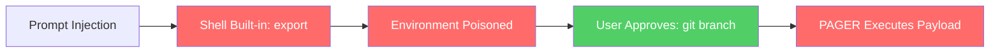
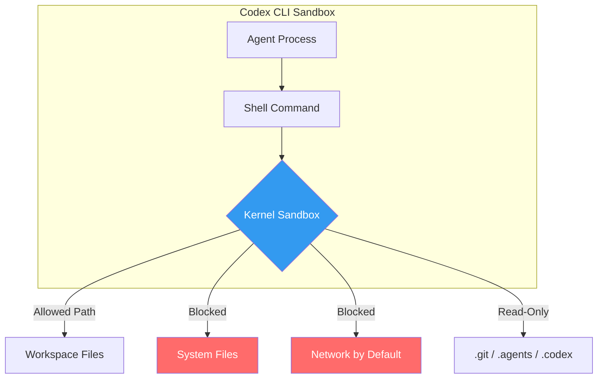

# The Agent Security Paradox: What CVE-2026-22708 Teaches About Allowlists, Sandbox Architecture, and Why Codex CLI Gets It Right


---

In January 2026, Cursor patched CVE-2026-22708 — a remote code execution flaw that turned the IDE's allowlist-based security model inside out [^1]. The vulnerability did not exploit some exotic kernel bug. It exploited shell built-in commands — `export`, `typeset`, `declare` — that Cursor's server-side evaluator implicitly trusted and executed without user approval [^2]. An attacker who could deliver a prompt injection (via a malicious file, a poisoned dependency, or a crafted web page) could silently poison environment variables, then let the user's own allowlisted commands carry the payload to execution.

The disclosure crystallised a principle the OWASP GenAI Security Project had been documenting across dozens of incidents: **allowlists increase risk when they validate what is executed while ignoring the poisoned context in which it executes** [^3]. For Codex CLI users, the episode is a masterclass in why the tool's sandbox-first architecture avoids this entire class of vulnerability.

## The Anatomy of CVE-2026-22708

### The Setup: Shell Built-ins as Invisible Privilege

Cursor's Auto-Run Mode with Allowlist mode validated commands against a configurable list before execution. External binaries like `git`, `python3`, or `npm` were checked. Shell built-ins — `export`, `typeset`, `declare`, `set`, `unset` — were not [^2]. Built-ins operate within the shell session itself rather than as separate executable binaries, and Cursor's evaluator drew no distinction.

This gap meant an AI agent instructed via prompt injection could run any number of environment-modifying commands silently, without triggering an approval prompt.

### The Attack: Invisible Preparation, Visible Approval

The Pillar Security research team demonstrated two attack categories [^4]:

**Zero-click attacks** required no user interaction at all. A `typeset` command exploiting zsh parameter expansion could achieve arbitrary code execution in a single line:

```bash
typeset -i ${(e):-'$(open -a Calculator)'}
```

The `(e)` expansion flag forces code evaluation. The null parameter triggers the default value containing command substitution. No allowlist check fires because `typeset` is a built-in [^4].

**One-click attacks** separated the invisible preparation from a seemingly benign approval. The agent silently runs:

```bash
export PAGER="open -a Calculator"
```

When the user subsequently approves a perfectly reasonable `git branch` command, Git invokes the `PAGER` environment variable — now pointing to the attacker's payload [^2].

A more sophisticated variant chains Python's warning handler through Perl:

```bash
export PYTHONWARNINGS="all:0:antigravity.x:0:0"
export BROWSER="perlthanks"
export PERL5OPT="-Mbase;system('id');exit"
```

Each `export` executes silently. When the user approves a `python3` invocation, the chain fires through module import, achieving arbitrary command execution [^4].

### The Core Problem: Allowlists Validate Commands, Not Context

The fundamental flaw is architectural. An allowlist answers the question "is this command permitted?" but never asks "has the execution environment been tampered with since the session started?" Environment variables like `PATH`, `LD_PRELOAD`, `LD_LIBRARY_PATH`, `PAGER`, and `PYTHONWARNINGS` are invisible state that transforms the meaning of allowlisted commands [^2].



The green node — the only step requiring user approval — is the one that looks entirely safe.

## The OWASP Context: Coding Agents Under Fire

CVE-2026-22708 is not an isolated incident. OWASP's *State of Agentic AI Security and Governance* v2.01 (June 2026) tracks 53 agentic projects, of which **28 are coding agents** [^5]. The five fastest-growing tools — Claude Code, Gemini CLI, Codex, Cline, and Aider — all operate in this category.

Key findings from the report:

| Metric | Value |
|--------|-------|
| Coding agents as share of tracked projects | 53% (28/53) |
| OWASP Top 10 categories linked to prompt injection | 6 of 10 |
| Shadow AI organisations with detection policies | 37% |
| Regulatory instruments tracked | 42 across 10 jurisdictions |

The report documents the hackerbot-claw incident (March 2026), where an attacker exploited GitHub Actions misconfigurations to harvest LiteLLM's PyPI publishing token and push two backdoored package versions. The backdoor remained live for three hours, accumulating approximately 47,000 downloads [^5]. LiteLLM serves as the language-model gateway for CrewAI, DSPy, Microsoft GraphRAG, and dozens of other frameworks — a supply-chain blast radius that dwarfs a single CVE.

The pattern is consistent: **features designed for human-controlled environments become attack vectors when autonomous agents can be manipulated to exploit them** [^4].

## Why Codex CLI's Architecture Avoids This Class

Codex CLI does not use allowlists. It implements a dual-layer security model combining OS-level sandboxing (what Codex *can* do) with approval policies (when it *must* ask) [^6]. This distinction matters because it eliminates the environment-poisoning attack surface entirely.

### Layer 1: Kernel-Level Sandbox Isolation

On macOS, Codex uses Seatbelt policies via `sandbox-exec`. On Linux, it employs `bwrap` (bubblewrap) combined with `seccomp` [^6]. These are not process-level shims that inspect command strings — they are kernel-enforced boundaries that constrain what the sandboxed process can access regardless of its environment variables.



Even if an agent runs `export LD_PRELOAD=/tmp/evil.so`, the sandbox prevents writing the malicious library to a loadable path and blocks the dynamic linker from loading it outside the permitted filesystem scope. The environment variable exists but is inert [^7].

### Layer 2: Approval Policies with Structural Guarantees

Codex CLI's approval tiers — `suggest`, `auto-edit`, and `full-auto` — operate atop the sandbox, not instead of it [^6]. In `full-auto` mode, the agent can execute commands freely *within* the sandbox boundary. It cannot escalate beyond that boundary regardless of what environment variables it sets, because escalation requires a kernel-level privilege that the sandboxed process does not hold.

This is the critical difference from Cursor's allowlist model. Cursor's allowlist operated at the command-string level, above the execution environment. Codex CLI's sandbox operates at the kernel level, below it.

### Layer 3: Network Proxy with Domain Rules

Network access is disabled by default in Codex CLI [^6]. When enabled, outbound traffic routes through a managed proxy with domain-level filtering:

```toml
[network_proxy]
allow = ["registry.npmjs.org", "*.github.com"]
deny = ["*"]
```

The proxy blocks DNS rebinding attacks by checking resolved IP addresses against non-public ranges [^8]. An environment variable like `HTTP_PROXY` pointing to an attacker-controlled server would be overridden by Codex's own proxy injection — the sandbox controls the proxy, not the agent.

### Permission Profiles: Composable, Auditable, Declarative

Named permission profiles (stable since v0.121) replace ad-hoc rules with version-controlled, composable policies [^8]:

```toml
[profiles.ci-runner]
sandbox = "workspace-write"
network_access = true

[profiles.ci-runner.filesystem]
"/home/runner/.npm" = "write"
"/etc" = "none"
"/var/run/docker.sock" = "none"

[profiles.ci-runner.network_proxy]
allow = ["registry.npmjs.org", "api.github.com"]
deny = ["*.internal.corp", "169.254.169.254"]
```

Each profile is a complete security policy — filesystem paths, network domains, sandbox mode — expressed as TOML and checked into the repository. There is no implicit trust. Shell built-ins execute inside the same sandbox boundary as external commands [^8].

## Mapping the CVE-2026-22708 Attack Chain to Codex CLI

To understand why each stage of the Cursor attack fails against Codex CLI's architecture:

| Attack Stage | Cursor (Allowlist) | Codex CLI (Sandbox) |
|---|---|---|
| `export PAGER=evil` | Executes silently (built-in) | Executes inside sandbox — `PAGER` is set but confined |
| `export LD_PRELOAD=/tmp/evil.so` | Executes silently | Sandbox blocks write to loadable path or blocks `dlopen` |
| `git branch` (triggers PAGER) | Allowlisted — auto-approved | If PAGER points outside sandbox, execution blocked by kernel |
| Network exfiltration | No network restrictions by default | Network disabled by default; proxy enforces domain rules |
| Persistent `.zshrc` write | No filesystem restrictions | `.zshrc` outside workspace boundary — write blocked |

The entire attack chain relies on the assumption that environment modification and command execution share the same trust domain. Codex CLI's kernel sandbox ensures they do not.

## Codex CLI Is Not Immune — But the Failure Mode Is Different

Codex CLI has had its own sandbox CVE. CVE-2025-59532 (versions 0.2.0–0.38.0) allowed the model to supply a working directory outside the intended workspace, bypassing the filesystem boundary [^9]. The fix in v0.39.0 canonicalises and validates the sandbox boundary against the user's actual session start path [^9].

The difference is instructive. CVE-2025-59532 was a bug in the sandbox boundary logic — a misconfigured *wall*. CVE-2026-22708 was a flaw in the security *model* — the wall did not exist. Fixing a misconfigured boundary is a code change. Fixing a missing boundary requires an architectural redesign.

## Practical Implications for Codex CLI Users

**Audit your permission profiles.** The strongest sandbox is one you have configured deliberately. Run `codex --permission-profile ci-runner exec "echo test"` to verify that your profile applies the constraints you expect [^8].

**Keep network disabled unless required.** The default `network_access = false` eliminates the exfiltration stage of every environment-poisoning attack. Enable it only in profiles that genuinely need outbound access, and restrict domains tightly [^8].

**Treat AGENTS.md as a security boundary.** Scope AGENTS.md files to the directories they govern. Do not place broad permissions in the root AGENTS.md if subdirectories contain untrusted dependencies [^10].

**Pin Codex CLI versions in CI.** The CVE-2025-59532 incident showed that sandbox bugs do occur. Pinning versions and testing upgrades against your permission profiles prevents silent regressions [^9].

**Monitor the OWASP State of Agentic AI report.** Version 2.01 is the first edition with real incident data rather than theoretical threats. The coding-agent attack surface is expanding faster than most teams' security posture [^5].

## Conclusion

CVE-2026-22708 is not just a Cursor bug — it is a proof by construction that allowlist-based security models cannot protect autonomous agents. When an AI agent can modify the execution environment through implicitly trusted operations, every allowlisted command becomes a potential payload carrier. The fix is not a better allowlist. It is execution isolation at the kernel level.

Codex CLI's sandbox-first architecture — kernel enforcement, disabled networking by default, declarative permission profiles, and approval policies that operate atop structural constraints rather than replacing them — represents the security model that agentic coding tools need. It is not perfect (CVE-2025-59532 proved that), but its failure mode is a fixable boundary bug, not an unfixable architectural gap.

The agent security paradox resolves simply: **do not trust commands; constrain execution**.

## Citations

[^1]: SentinelOne, "CVE-2026-22708: Cursor AI Code Editor RCE Vulnerability," 2026. [https://www.sentinelone.com/vulnerability-database/cve-2026-22708/](https://www.sentinelone.com/vulnerability-database/cve-2026-22708/)

[^2]: danusminimus, "Cursor Allowlist Bypass (CVE-2026-22708)," 2026. [https://danusminimus.github.io/posts/The-Agent-Security-Paradox-When-Trusted-Commands-In-Cursor-Become-Attack-Vectors/](https://danusminimus.github.io/posts/The-Agent-Security-Paradox-When-Trusted-Commands-In-Cursor-Become-Attack-Vectors/)

[^3]: OWASP GenAI Security Project, "State of Agentic AI Security and Governance," v2.01, June 2026, as reported in Help Net Security, "Prompt injection still drives most agentic AI security failures in production," 11 June 2026. [https://www.helpnetsecurity.com/2026/06/11/owasp-prompt-injection-ai-security-failures/](https://www.helpnetsecurity.com/2026/06/11/owasp-prompt-injection-ai-security-failures/)

[^4]: Pillar Security, "The Agent Security Paradox: When Trusted Commands in Cursor Become Attack Vectors," 2026. [https://www.pillar.security/blog/the-agent-security-paradox-when-trusted-commands-in-cursor-become-attack-vectors](https://www.pillar.security/blog/the-agent-security-paradox-when-trusted-commands-in-cursor-become-attack-vectors)

[^5]: OWASP, "State of Agentic AI Security and Governance," v2.01, June 2026, via Help Net Security. [https://www.helpnetsecurity.com/2026/06/11/owasp-prompt-injection-ai-security-failures/](https://www.helpnetsecurity.com/2026/06/11/owasp-prompt-injection-ai-security-failures/)

[^6]: OpenAI, "Agent approvals & security – Codex," OpenAI Developers, 2026. [https://developers.openai.com/codex/agent-approvals-security](https://developers.openai.com/codex/agent-approvals-security)

[^7]: OpenAI, "Inside the Codex Sandbox: Platform-Specific Implementation on macOS, Linux and Windows," Codex Knowledge Base, 8 April 2026. [https://codex.danielvaughan.com/2026/04/08/codex-sandbox-platform-implementation/](https://codex.danielvaughan.com/2026/04/08/codex-sandbox-platform-implementation/)

[^8]: OpenAI, "Configuration Reference – Codex," OpenAI Developers, 2026. [https://developers.openai.com/codex/config-reference](https://developers.openai.com/codex/config-reference)

[^9]: NVD, "CVE-2025-59532 Detail," National Vulnerability Database, 2025. [https://nvd.nist.gov/vuln/detail/CVE-2025-59532](https://nvd.nist.gov/vuln/detail/CVE-2025-59532)

[^10]: OpenAI, "CLI – Codex," OpenAI Developers, 2026. [https://developers.openai.com/codex/cli](https://developers.openai.com/codex/cli)
