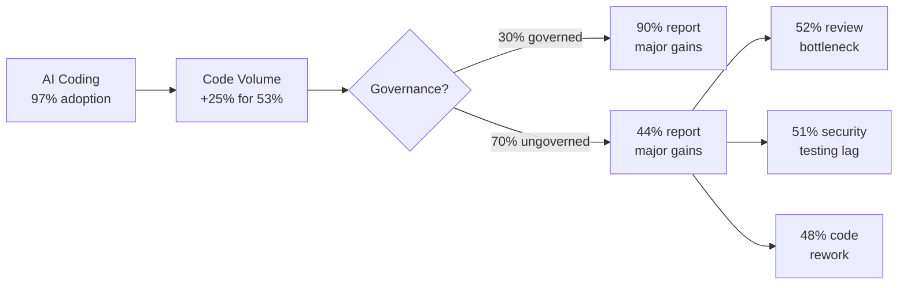
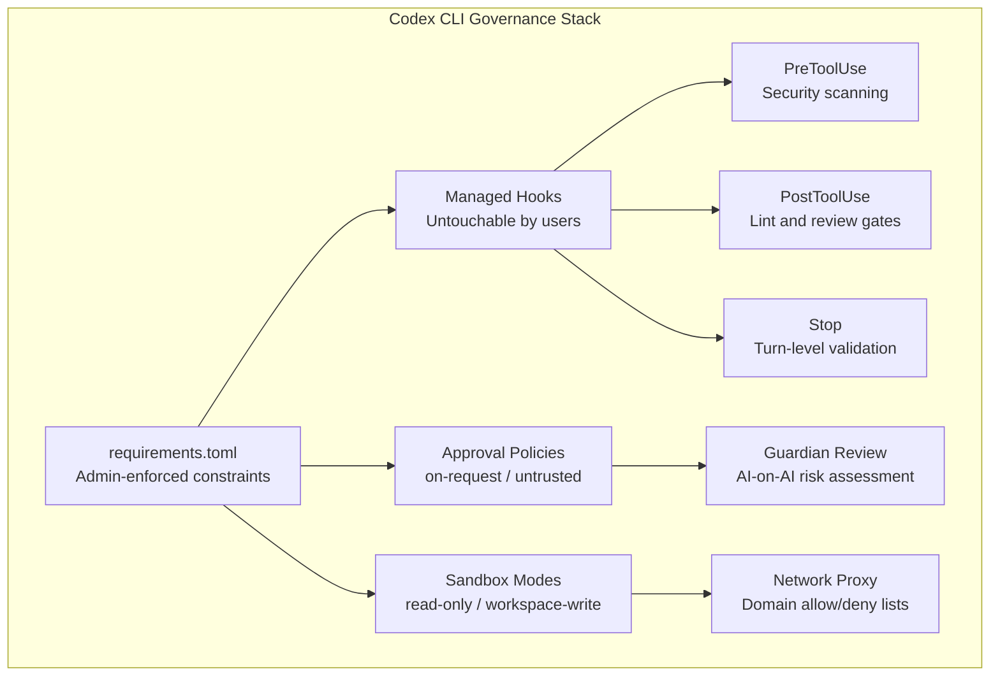

# The 97 Per Cent Problem: Black Duck's AI Coding Governance Gap and How Codex CLI Closes It


---

Nearly every developer now uses an AI coding assistant. Barely a third of their organisations govern the output. Black Duck's June 2026 study quantifies this chasm — and Codex CLI's layered governance stack is one of the few tools that can bridge it without sacrificing the productivity gains that justified adoption in the first place.

## The Study: 831 Engineers, One Stark Finding

Black Duck partnered with UserEvidence to survey 831 enterprise software engineers and DevOps professionals at organisations with 500+ employees in March 2026 [^1]. The headline numbers are striking:

- **97 per cent** of development teams actively use AI coding assistants [^1]
- **92 per cent** report improved productivity and release velocity [^1]
- Developers reclaim roughly **eight hours per week** on average [^1]
- **53 per cent** increased code volume by more than 25 per cent [^1]

But the productivity story has a second act:

- **Only 30 per cent** have a fully governed oversight process [^2]
- **25 per cent** have no defined AI coding policy at all [^2]
- **90 per cent** of teams encounter problems with AI-generated code [^2]

The friction manifests downstream: 52 per cent cite manual code review as a bottleneck, 51 per cent struggle with security testing, 48 per cent must rework generated code, and 41 per cent iterate on prompts repeatedly [^2].

## The Governance Multiplier

The study's most consequential finding is that governance is not overhead — it is a performance multiplier. Teams with full governance report **90 per cent** efficiency gains, compared with **44 per cent** for ungoverned teams [^2]. Jason Schmitt, Black Duck's CEO, summarised the dynamic: "Speed without governance is a liability, not an advantage" [^1].

The data also reveals a security paradox: 64 per cent of respondents are moderately to extremely concerned about security defects in AI-generated code, yet among teams whose code volume surged by more than 50 per cent, 57 per cent identify security testing as their worst bottleneck [^2]. They are simultaneously worried about quality and overwhelmed by the volume they must review.



## Mapping the Gap to Codex CLI Controls

Codex CLI's governance stack directly addresses the four friction categories Black Duck identified. The tooling exists today — the challenge is configuring it.

### 1. Automated Code Review: PostToolUse Hooks

The 52 per cent of teams bottlenecked on manual review can offload first-pass quality checks to `PostToolUse` hooks that run after every file edit or command execution [^3]. A lint-on-save hook catches the most common AI code smells before they ever reach a human reviewer:

```toml
[[hooks.PostToolUse]]
matcher = "^(WriteFile|ApplyPatch)$"

[[hooks.PostToolUse.hooks]]
type = "command"
command = "ruff check --fix --select E,W,F,I,UP,B,SIM,C4 ."
timeout = 30
statusMessage = "Running lint gate on AI-generated changes"
```

For teams needing heavier analysis, a `Stop` hook can invoke a dedicated review agent that inspects the full diff before the turn completes [^3].

### 2. Security Testing: PreToolUse and Guardian Review

The 51 per cent struggling with security testing can intercept dangerous operations before they execute. `PreToolUse` hooks fire before Bash commands, file edits, and MCP tool calls, and can deny execution outright [^3]:

```toml
[[hooks.PreToolUse]]
matcher = "^Bash$"

[[hooks.PreToolUse.hooks]]
type = "command"
command = '/usr/bin/python3 .codex/scripts/security-scan.py'
timeout = 60
statusMessage = "Scanning command for security risks"
```

For organisations that want AI-on-AI review, Codex CLI's Guardian Review (`approvals_reviewer = "auto_review"`) routes approval requests through an automatic reviewer that evaluates risk levels and denies critical-risk actions outright [^4]. This aligns with the 86 per cent of Black Duck respondents who want AI agents vetting AI-written code [^2].

### 3. Code Rework: AGENTS.md Directives and Named Profiles

The 48 per cent dealing with code rework are often fighting a context problem. Project-level `AGENTS.md` files inject coding standards, architectural constraints, and style requirements into every agent turn [^5]. When the agent knows the rules before it writes, rework drops:

```markdown
# AGENTS.md

## Code Standards
- All new functions require type hints (Python) or JSDoc (TypeScript)
- Maximum cyclomatic complexity: 10
- No duplicated blocks exceeding 6 lines — extract to shared utilities
- All public API changes require corresponding test updates
```

Named profiles let teams enforce different governance levels per task type. A `security-review` profile might mandate read-only sandbox mode and full approval policies, whilst a `prototype` profile allows broader access with lighter review [^6]:

```toml
[profiles.security-review]
sandbox = "read-only"
approval_policy = "on-request"
approvals_reviewer = "auto_review"

[profiles.prototype]
sandbox = "workspace-write"
approval_policy = "on-request"
```

### 4. Policy Enforcement: requirements.toml

The 25 per cent of teams with no AI coding policy can deploy organisation-wide constraints through `requirements.toml`, which administrators distribute via MDM, system files, or ChatGPT Business cloud management [^7]. Users cannot override these settings:

```toml
# /etc/codex/requirements.toml — enterprise-managed

[allowed_approval_policies]
"on-request" = true
"untrusted" = true
# "never" is implicitly denied

[allowed_sandbox_modes]
"workspace-write" = true
"read-only" = true
# "danger-full-access" is implicitly denied

[features]
hooks = true        # Enforce hook execution
browser_use = false # Disable browser automation

[hooks]
allow_managed_hooks_only = true
```

Requirements stack in priority order: cloud-managed (highest), MDM, then system file. The first matching value wins, and tables combine entry-by-entry [^7].



## The Tool Adoption Asymmetry

Black Duck found GitHub Copilot leading at 83 per cent adoption, with Claude Code at 63 per cent [^2]. The study surveyed "AI coding assistants" broadly, not Codex CLI specifically. But the governance patterns Codex CLI exposes — lifecycle hooks, managed configuration, and tiered approval policies — represent a governance depth that few competing tools match at the CLI layer.

The critical distinction: Copilot and Claude Code operate primarily within IDE extensions where governance relies on the editor's plugin system. Codex CLI's governance operates at the process level, intercepting every tool call regardless of how it was triggered — interactive session, `codex exec` pipeline, or remote executor [^3] [^7].

## Building a Governance-First Adoption Strategy

The Black Duck data suggests a clear implementation sequence for teams moving from the ungoverned 70 per cent to the governed 30 per cent:

**Week 1 — Observe.** Deploy `PostToolUse` hooks in logging-only mode to measure AI-generated code quality without blocking workflow. Capture lint violations, security findings, and rework patterns.

**Week 2 — Gate.** Promote logging hooks to enforcement. Add `PreToolUse` security scanning. Enable Guardian Review for automated approval triage.

**Week 3 — Enforce.** Deploy `requirements.toml` via MDM or cloud management. Lock sandbox modes, mandate hook execution, and restrict MCP servers to approved lists.

**Week 4 — Measure.** Use Codex CLI's OpenTelemetry integration to export approval rates, hook pass/fail ratios, and token consumption to your observability stack [^8]. Compare against pre-governance baselines.

The 86 per cent of developers who want AI agents vetting AI-written code [^2] already have the tooling. The remaining step is configuration.

## What the Study Does Not Cover

Black Duck's methodology focuses on self-reported adoption and perception across a broad tool landscape. It does not measure:

- ⚠️ Whether governance correlates with code quality metrics (defect density, vulnerability counts) or only with perceived efficiency
- ⚠️ How governance requirements vary by regulatory domain (healthcare, finance, defence)
- ⚠️ The overhead cost of governance tooling itself — hook execution adds latency to every turn

These gaps matter. A team reporting "major efficiency gains" under governance may simply be measuring confidence rather than outcomes. The study is directionally useful but should not replace instrumented measurement of your own pipeline.

## Conclusion

Black Duck's 97 per cent adoption figure confirms what most engineering leaders already know: AI coding assistants are no longer optional. The 30 per cent governance figure reveals what fewer have confronted: most organisations are flying blind with the code their agents produce.

Codex CLI's layered governance stack — from `AGENTS.md` project directives through lifecycle hooks to admin-enforced `requirements.toml` — provides the control surface. The Black Duck data provides the business case. Teams that implement governance do not sacrifice productivity; they amplify it.

---

## Citations

[^1]: Black Duck / UserEvidence, "AI Coding Hits 97% Enterprise Adoption; New Black Duck Study Shows Governance Is the ROI Multiplier," PR Newswire, 9 June 2026. [https://www.prnewswire.com/news-releases/ai-coding-hits-97-enterprise-adoption-new-black-duck-study-shows-governance-is-the-roi-multiplier-302794103.html](https://www.prnewswire.com/news-releases/ai-coding-hits-97-enterprise-adoption-new-black-duck-study-shows-governance-is-the-roi-multiplier-302794103.html)

[^2]: Infosecurity Magazine, "AI Coding Adoption Hits 97% but Governance Lags Behind," 10 June 2026. [https://www.infosecurity-magazine.com/news/ai-coding-adoption-governance-lags/](https://www.infosecurity-magazine.com/news/ai-coding-adoption-governance-lags/)

[^3]: OpenAI, "Hooks — Codex CLI," OpenAI Developers, accessed 23 June 2026. [https://developers.openai.com/codex/hooks](https://developers.openai.com/codex/hooks)

[^4]: OpenAI, "Agent Approvals & Security — Codex," OpenAI Developers, accessed 23 June 2026. [https://developers.openai.com/codex/agent-approvals-security](https://developers.openai.com/codex/agent-approvals-security)

[^5]: OpenAI, "CLI — Codex," OpenAI Developers, accessed 23 June 2026. [https://developers.openai.com/codex/cli](https://developers.openai.com/codex/cli)

[^6]: OpenAI, "Configuration Reference — Codex," OpenAI Developers, accessed 23 June 2026. [https://developers.openai.com/codex/config-reference](https://developers.openai.com/codex/config-reference)

[^7]: OpenAI, "Managed Configuration — Codex," OpenAI Developers, accessed 23 June 2026. [https://developers.openai.com/codex/enterprise/managed-configuration](https://developers.openai.com/codex/enterprise/managed-configuration)

[^8]: SD Times, "AI coding adoption rate hits 97%, Black Duck study reveals," 10 June 2026. [https://sdtimes.com/ai/ai-coding-adoption-rate-hits-97-black-duck-study-reveals/](https://sdtimes.com/ai/ai-coding-adoption-rate-hits-97-black-duck-study-reveals/)
